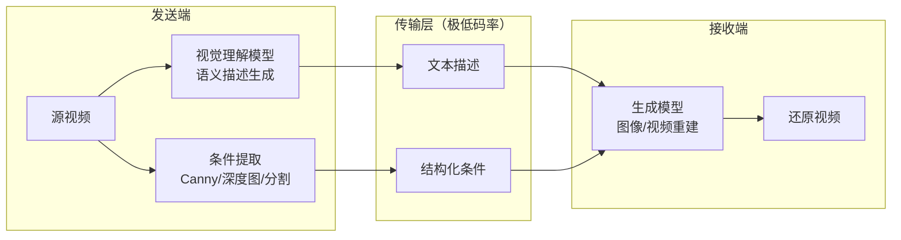

# 语义传输（Semantic Transmission）

基于 AI 生成模型的视频语义级压缩传输预研项目。核心思路是用语义描述替代像素级编码，在极低码率（<0.01 bpp）下实现视频传输。

## 系统架构



- **发送端**：通过多模态大模型（如 Qwen-VL）将视频帧压缩为文本描述，并提取结构化条件信息（边缘图、深度图等）
- **传输层**：仅传输文本和轻量条件信息，实现极低码率
- **接收端**：通过扩散生成模型（如 Z-Image-Turbo、Wan2.x）从语义信息还原视觉内容

## 快速开始

### 1. 安装项目依赖

需要 Python >= 3.10、[uv](https://docs.astral.sh/uv/) 和 [Git LFS](https://git-lfs.com/)：

```bash
git lfs install   # 首次使用需执行
uv sync
```

### 2. 部署 ComfyUI

推荐使用 [秋叶 ComfyUI 整合包](https://space.bilibili.com/12566101)（ComfyUI-aki v3），下载后启动启动器即可使用。

详细部署说明见 [docs/comfyui-setup.md](docs/comfyui-setup.md)。

### 3. 下载模型

项目需要 4 个模型文件（总计约 24GB）：

```bash
# 下载模型（使用国内镜像，默认）
uv run python scripts/download_models.py

# 预览下载内容（不实际下载）
uv run python scripts/download_models.py --dry-run
```

### 4. 验证环境

启动 ComfyUI 后，运行连通性测试和工作流验证：

```bash
# 连通性测试（6 项检查）
uv run python scripts/test_comfyui_connection.py

# 端到端工作流验证（发送端 + 接收端）
uv run python scripts/verify_workflows.py
```

## 文档导航

### 面向开发者

| 文档 | 说明 |
|------|------|
| [ComfyUI 部署指南](docs/comfyui-setup.md) | 本机 ComfyUI 部署与配置 |
| [协作规范](docs/collaboration/) | Git 分支、PR、Issue 流程与编码规范 |
| [CLAUDE.md](CLAUDE.md) | AI 辅助开发配置与常用命令速查 |

### 面向用户

| 文档 | 说明 |
|------|------|
| [ComfyUI 部署指南](docs/comfyui-setup.md) | 环境部署的完整步骤 |
| [端到端测试报告](docs/test-reports/) | Demo 运行的实际效果与指标数据 |

### 面向项目负责人

| 文档 | 说明 |
|------|------|
| [项目路线图](docs/ROADMAP.md) | 各阶段目标、状态与技术路线 |
| [调研报告](docs/research/selection-report.md) | 模型与方案选型结论 |
| [调研成果](docs/research/) | 论文综述、开源项目评估、模型对比 |

> 完整文档索引见 [docs/README.md](docs/README.md)。

## 项目阶段

| 阶段 | 目标 | 状态 |
|------|------|------|
| 阶段一：调研与选型 | 论文综述、开源项目评估、技术路线确定 | ✅ 已完成 |
| 阶段二：ComfyUI API 原型 | 基于 ComfyUI API 打通端到端流程 | 🔄 进行中 |
| 阶段三：方案迭代优化 | 模型升级、条件优化、视频级扩展 | 待启动 |
| 阶段四：工程化 | 脱离 ComfyUI，构建独立可部署系统 | 待启动 |

详见 [项目路线图](docs/ROADMAP.md)。

## 技术栈

- **开发语言**：Python（uv 管理依赖）
- **工作流引擎**：ComfyUI（API 模式远程调用）
- **视觉理解**：Qwen-VL 等多模态大模型
- **图像生成**：Z-Image-Turbo + ControlNet Union（当前基线）
- **视频生成**：Wan2.x（规划中）

## 参与开发

本项目采用 GitHub Flow 协作模式，禁止直接 push main。基本流程：

1. 从 main 创建功能分支（`feature/xxx`、`fix/xxx`、`docs/xxx`）
2. 在分支上开发，提交前运行 `uv run ruff check .` 和 `uv run pytest`
3. 推送分支并创建 Pull Request
4. 等待 CI 通过 + Code Review 后 Squash Merge 合入 main

详细规范见 [docs/collaboration/](docs/collaboration/)。
