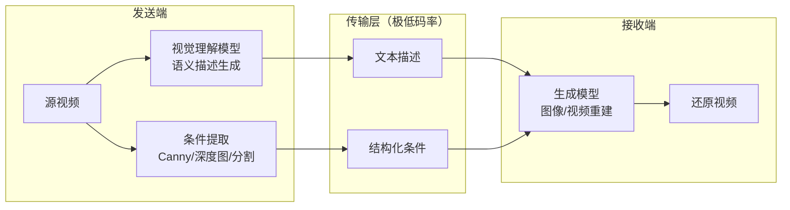

# 语义传输（Semantic Transmission）

基于 AI 生成模型的视频语义级压缩传输预研项目。核心思路是用语义描述替代像素级编码，在极低码率（<0.01 bpp）下实现视频传输。

## 系统架构



- **发送端**：通过多模态大模型（如 Qwen-VL）将视频帧压缩为文本描述，并提取结构化条件信息（边缘图、深度图等）
- **传输层**：仅传输文本和轻量条件信息，实现极低码率
- **接收端**：通过扩散生成模型（如 Z-Image-Turbo、Wan2.x）从语义信息还原视觉内容

## 项目阶段

| 阶段 | 目标 | 状态 |
|------|------|------|
| 阶段一：调研与选型 | 论文综述、开源项目评估、技术路线确定 | ✅ 已完成 |
| 阶段二：ComfyUI API 原型 | 基于 ComfyUI API 打通端到端流程 | 🔄 进行中（10/16） |
| 阶段三：方案迭代优化 | 模型升级、条件优化、视频级扩展 | 待启动 |
| 阶段四：工程化 | 脱离 ComfyUI，构建独立可部署系统 | 待启动 |

详见 [项目路线图](docs/ROADMAP.md)。

## 项目结构

```
├── src/semantic_transmission/
│   ├── common/                     # 公共模块：ComfyUI 客户端、配置、类型定义
│   ├── pipeline/                   # 端到端管道编排
│   ├── sender/                     # 发送端：图像/视频 → 语义描述 + 条件信息
│   └── receiver/                   # 接收端：语义描述 → 图像/视频还原
├── tests/                          # 单元测试
├── docs/
│   ├── ROADMAP.md                  # 项目路线图
│   ├── comfyui-setup.md            # ComfyUI 本机部署指南
│   ├── research/                   # 调研产出
│   │   ├── papers/                 # 论文综述
│   │   ├── projects/               # 开源项目评估
│   │   ├── models/                 # 模型对比（待完成）
│   │   └── comfyui-workflow-analysis.md  # ComfyUI 工作流分析
│   ├── collaboration/              # 协作规范（Git/GitHub/PR/Issue）
│   └── workflow/                   # 结构化工作流（Claude Code agent coding 工具）
├── scripts/                        # 工具脚本（模型下载、连通性测试、工作流验证）
├── resources/
│   └── comfyui/                    # ComfyUI 工作流文件及截图
├── output/                          # 脚本输出（运行 demo 后本地生成，不纳入版本管理）
├── .github/                        # GitHub 模板与 CI 工作流
└── CLAUDE.md                       # AI 辅助开发配置
```

## 快速开始

### 1. 安装项目依赖

需要 Python >= 3.10、[uv](https://docs.astral.sh/uv/) 和 [Git LFS](https://git-lfs.com/)：

```bash
# 安装 Git LFS（首次使用需执行）
git lfs install
```

```bash
uv sync
```

### 2. 部署 ComfyUI

推荐使用 [秋叶 ComfyUI 整合包](https://space.bilibili.com/12566101)（ComfyUI-aki v3），下载后启动启动器即可使用，无需额外配置。

参考资源：
- [B 站视频教程](https://www.bilibili.com/video/BV1Ew411776J)
- [B 站图文教程](https://www.bilibili.com/opus/1159516886456598528)
- [飞书安装文档](https://my.feishu.cn/wiki/P7Qzwfnx4inVFLkVIPbclmY0nvb)

详细部署说明见 [docs/comfyui-setup.md](docs/comfyui-setup.md)。

### 3. 下载模型

项目需要 4 个模型文件（总计约 24GB）：

| 模型 | 大小 | 用途 |
|------|------|------|
| `qwen_3_4b.safetensors` | ~8 GB | 文本编码器 |
| `z_image_turbo_bf16.safetensors` | ~12.3 GB | 扩散模型 |
| `ae.safetensors` | ~335 MB | VAE 解码器 |
| `Z-Image-Turbo-Fun-Controlnet-Union.safetensors` | ~3.1 GB | ControlNet Union |

先安装下载工具，再运行下载脚本：

```bash
# 安装下载工具
uv tool install modelscope
uv tool install "huggingface_hub[cli]"

# 下载模型（使用国内镜像）
uv run python scripts/download_models.py --hf-mirror

# 或使用代理下载
uv run python scripts/download_models.py --proxy http://127.0.0.1:7890

# 预览下载内容（不实际下载）
uv run python scripts/download_models.py --dry-run
```

### 4. 验证环境

启动 ComfyUI 后，运行连通性测试和工作流验证：

```bash
# 连通性测试（6 项检查）
uv run python scripts/test_comfyui_connection.py

# 端到端工作流验证（发送端 + 接收端）
uv run python scripts/verify_workflows.py
```

验证通过后，输出结果保存在 `output/verify/` 目录。

## 技术栈

- **开发语言**：Python（uv 管理依赖）
- **工作流引擎**：ComfyUI（API 模式远程调用）
- **视觉理解**：Qwen-VL 等多模态大模型
- **图像生成**：Z-Image-Turbo + ControlNet Union（当前基线）
- **视频生成**：Wan2.x（规划中）

## 参与开发

**主仓库**：[Gitee](https://gitee.com/chy5301/semantic-transmission)（私有）| GitHub 仓库为镜像

本项目采用 GitHub Flow 协作模式，禁止直接 push main。基本流程：

1. 从 main 创建功能分支（`feature/xxx`、`fix/xxx`、`docs/xxx`）
2. 在分支上开发，提交前运行 `uv run ruff check .` 和 `uv run pytest`
3. 推送分支并创建 Pull Request
4. 等待 CI 通过 + Code Review 后 Squash Merge 合入 main

Commit 遵循 Angular Convention，示例：`feat(模块): 功能描述`、`fix(模块): 问题修复`

详细规范见 [docs/collaboration/](docs/collaboration/)。

## 调研成果

阶段一调研已完成，主要结论：

- 在 <0.01 bpp 超低码率下，生成式语义传输全面优于 H.264/H.265（多篇论文交叉验证）
- 确定以 ComfyUI API 为基础设施，自行组装发送端（VLM）和接收端（生成模型）的技术路线
- 详细调研报告见 [docs/research/](docs/research/)
