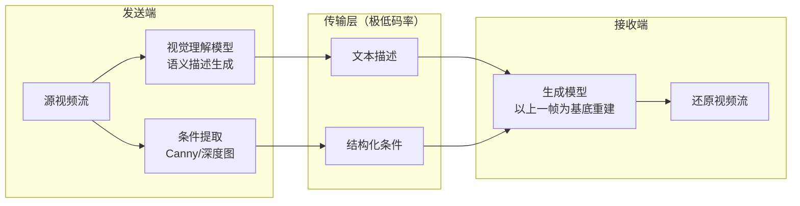

# 语义传输（Semantic Transmission）

基于 AI 生成模型的视频流语义级压缩传输预研项目。核心思路是用语义描述 + 轻量结构条件替代像素级编码，在极低码率下传输视频。当前目标是实现**输入视频流、输出生成视频流**的程序，逐步逼近替代无人车远程遥操作画面所需的延迟、清晰度与帧间一致性。

## 系统架构



- **发送端**：通过多模态大模型（Qwen-VL）将视频帧压缩为文本描述，并提取结构化条件信息（Canny 边缘图、深度图等）
- **传输层**：仅传输文本和轻量条件信息，实现极低码率
- **接收端**：通过扩散生成模型，以"上一帧生成图像为基底 + 语义/条件引导"逐帧重建视觉内容

> 项目已脱离 ComfyUI，接收端改用 **Diffusers 本地推理**（Z-Image-Turbo GGUF + ControlNet Union）。帧生成主线正在调研 FLUX.2-klein-9B，详细方向与规划见 [项目路线图](docs/ROADMAP.md)。

## 快速开始

### 1. 安装项目依赖

需要 Python >= 3.10、[uv](https://docs.astral.sh/uv/) 和 [Git LFS](https://git-lfs.com/)：

```bash
git lfs install   # 首次使用需执行
uv sync
```

### 2. 下载模型

接收端 Diffusers 需要 Z-Image-Turbo GGUF + ControlNet Union，发送端 VLM 自动描述可选 Qwen2.5-VL：

```bash
uv run semantic-tx download            # 按 config.toml 下载模型
uv run semantic-tx download --dry-run  # 预览下载计划（不实际下载）
```

### 3. 验证环境

```bash
uv run semantic-tx check diffusers                            # 接收端 Diffusers 模型就绪
uv run semantic-tx check vlm                                  # 发送端 VLM 模型就绪
uv run semantic-tx check relay --host 127.0.0.1 --port 9000   # 双机部署 TCP 可达
```

### 4. 启动 GUI

```bash
uv run semantic-tx gui
```

浏览器打开 http://127.0.0.1:7860 即可使用可视化界面，支持模型配置、发送端/接收端独立操作和一键端到端演示。

> **启动报错 `ValueError: Unknown scheme for proxy URL 'socks://...'`？**
> 这是本机代理变量导致的，与项目无关：Gradio 依赖的 httpx 会读取 `all_proxy`/`ALL_PROXY`，但不认识裸的 `socks://` 协议。GUI 是本机服务，无需走代理，临时清空代理变量再启动即可：
>
> ```bash
> all_proxy= ALL_PROXY= uv run semantic-tx gui
> ```
>
> 若要彻底解决，把代理开关脚本里的 `socks://` 改成 `socks5h://`（并 `uv add socksio`），或在启动前 `export no_proxy=localhost,127.0.0.1,::1`。

> 命令行用法见 [CLI 参考](docs/cli-reference.md)；单机/双机演示步骤见 [演示手册](docs/demo-handbook.md)。

## 文档导航

### 面向开发者

| 文档 | 说明 |
|------|------|
| [开发指南](docs/development-guide.md) | 环境搭建、项目结构、测试方法、CI、编码规范 |
| [系统架构](docs/architecture.md) | 模块关系图、数据流、接口设计、扩展点 |
| [协作规范](docs/collaboration/) | Git 分支、PR、Issue 流程与编码规范 |

### 面向用户

| 文档 | 说明 |
|------|------|
| [使用指南](docs/user-guide.md) | 系统要求、完整安装步骤、基本使用 |
| [CLI 参考](docs/cli-reference.md) | `semantic-tx` 命令行工具完整参数说明 |
| [演示手册](docs/demo-handbook.md) | 单机/双机演示操作步骤与参数说明 |
| [端到端测试报告](docs/test-reports/) | Demo 运行的实际效果与指标数据 |

### 面向项目负责人

| 文档 | 说明 |
|------|------|
| [项目总览](docs/project-overview.md) | 目标、进展、关键成果、后续计划（2 分钟速览） |
| [项目路线图](docs/ROADMAP.md) | 各阶段目标、状态与技术路线 |
| [视频流技术方案](docs/research/2026-06-21-video-stream-tech-scout.md) | 帧生成/连续帧/插帧超分选型与 6 天开发方案 |

> 完整文档索引见 [docs/README.md](docs/README.md)。

## 项目阶段

| 阶段 | 目标 | 状态 |
|------|------|------|
| 阶段一：调研与选型 | 论文综述、开源项目评估、技术路线确定 | ✅ 已完成 |
| 阶段二：原型搭建 | 打通端到端流程，接收端脱离 ComfyUI 改用 Diffusers 本地推理 | ✅ 已完成 |
| 阶段三：视频流语义传输 | 输入视频流、输出生成视频流，逼近遥控可用的延迟/清晰度/一致性 | 🔄 进行中 |
| 阶段四：准实时遥控替代 | 达到尽量替代远程遥控视频的画面输出 | 待启动 |

详见 [项目路线图](docs/ROADMAP.md)。

## 技术栈

- **开发语言**：Python（uv 管理依赖）
- **接收端推理**：Diffusers + Z-Image-Turbo（GGUF Q8_0）+ ControlNet Union（帧生成主线调研中：FLUX.2-klein-9B）
- **视觉理解**：Qwen2.5-VL 多模态大模型（规划升级 Qwen3-VL）
- **条件提取**：OpenCV Canny（规划增加深度图）
- **中继传输**：SocketRelay（TCP 长度前缀协议，双机部署）
- **CLI / GUI**：click 子命令体系（`semantic-tx`）/ Gradio 可视化界面

## 参与开发

本项目采用 GitHub Flow 协作模式，禁止直接 push main。基本流程：

1. 从 main 创建功能分支（`feature/xxx`、`fix/xxx`、`docs/xxx`）
2. 在分支上开发，提交前运行 `uv run ruff check .` 和 `uv run pytest`
3. 推送分支并创建 Pull Request
4. 等待 CI 通过 + Code Review 后 Squash Merge 合入 main

详细规范见 [docs/collaboration/](docs/collaboration/)。
