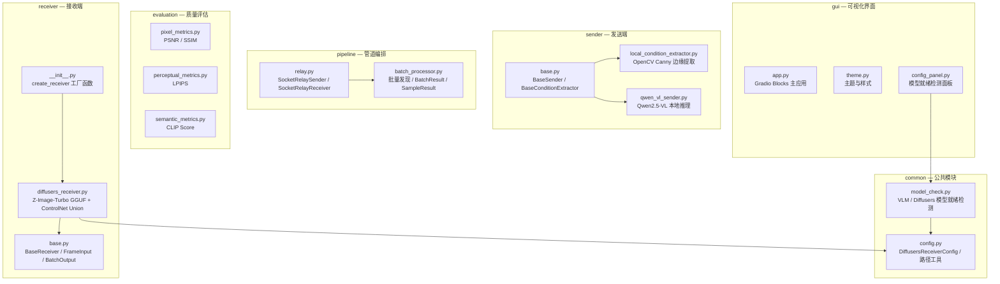
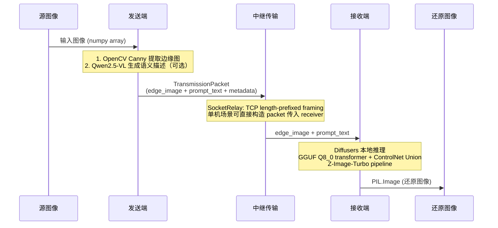
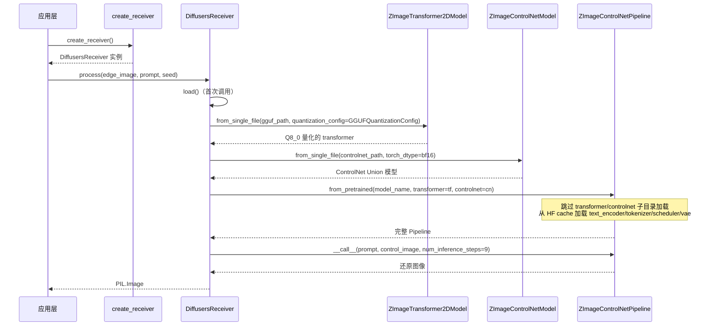

# 系统架构

## 模块关系



## 核心数据流



## 抽象接口设计

项目采用适配器模式，便于后续替换具体实现：

| 抽象基类 | 当前实现 | 说明 |
|----------|----------|------|
| `BaseSender` | `QwenVLSender` | 使用 Qwen2.5-VL 多模态模型生成语义描述 |
| `BaseConditionExtractor` | `LocalCannyExtractor` | 使用 OpenCV Canny 提取边缘图 |
| `BaseReceiver` | `DiffusersReceiver` | 使用 Diffusers 0.37 + Z-Image-Turbo GGUF + ControlNet Union 本地推理 |
| 中继传输 | `SocketRelaySender` / `SocketRelayReceiver` | TCP length-prefixed 协议，双机部署时使用 |

## Diffusers 接收端加载流程



## 传输协议

TCP 中继使用 length-prefixed framing 协议，每个字段由 4 字节大端 uint32 长度头 + 原始数据组成：

```
[edge_image_length:4B][edge_image:NB][text_length:4B][text:NB][metadata_length:4B][metadata:NB]
```

## 扩展点

- **发送端模型替换**：实现 `BaseSender` 接口即可接入新的视觉理解模型
- **条件类型扩展**：实现 `BaseConditionExtractor` 支持深度图、分割图等条件
- **接收端模型替换**：实现 `BaseReceiver` 可接入其他生成模型（Wan2.x 等）
- **量化策略扩展**：`DiffusersReceiver.load()` 目前写死 GGUF Q8_0 分组件加载，未来可抽象为 `ModelLoader` 策略模式
- **传输协议扩展**：`pipeline.relay` 可扩展 WebSocket / gRPC 等传输方式
