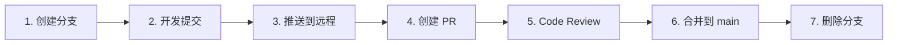

# GitHub Flow 协作流程

## 什么是 GitHub Flow

GitHub Flow 是 GitHub 官方推荐的轻量级协作流程。核心原则：**`main` 分支始终保持可用，所有修改通过分支 + PR 合并**。

## 整体流程



## 与单人开发的关键区别

| | 单人开发 | 多人协作（GitHub Flow） |
|---|---|---|
| 在哪里提交 | 直接在 `main` 上 commit | 在功能分支上 commit |
| 代码怎么进 main | 直接 push | 通过 PR 合并 |
| 有没有审查 | 没有 | 有 Code Review |
| 别人知道你在做什么 | 不知道 | PR 描述 + Issue 追踪 |

## 详细步骤

### 步骤 1：从 main 创建分支

```bash
git switch main
git pull                              # 拉取最新代码
git switch -c feature/add-vlm         # 创建功能分支
```

> 命名规范：`feature/xxx`、`fix/xxx`、`docs/xxx`。详见 [05-项目协作约定](./05-project-conventions.md)。

### 步骤 2：在分支上开发并提交

正常开发，随时提交：

```bash
git add src/vlm/processor.py
git commit -m "feat(P2-13): 实现 VLM 图像描述生成"

# 可以有多次提交
git add src/vlm/prompt_template.py
git commit -m "feat(P2-13): 添加提示词模板"
```

### 步骤 3：推送分支到远程

```bash
git push -u origin feature/add-vlm
```

### 步骤 4：在 GitHub 上创建 Pull Request

**方式一：GitHub 网页端**
1. Push 后 GitHub 页面顶部会出现黄色提示条，点击 "Compare & pull request"
2. 填写 PR 标题和描述（详见 [03-PR 指南](./03-pull-request-guide.md)）
3. 点击 "Create pull request"

**方式二：命令行（gh CLI）**
```bash
gh pr create --title "feat(P2-13): 集成 VLM 自动描述生成" --body "## 改动说明
- 实现 VLM 图像描述生成模块
- 添加提示词模板

## 关联 Issue
Closes #5"
```

### 步骤 5：等待 Code Review

- 团队成员会查看你的代码变更，提出建议或问题
- 根据反馈修改代码，继续在同一分支上提交和推送即可，PR 会自动更新：
  ```bash
  # 根据 review 意见修改
  git add src/vlm/processor.py
  git commit -m "fix: 根据 review 优化错误处理"
  git push
  ```
- 审查通过后，Reviewer 会点击 "Approve"

### 步骤 6：合并 PR

Review 通过后，在 GitHub 页面点击 "Merge pull request" 合并到 `main`。

### 步骤 7：清理分支

合并完成后，删除已合并的功能分支：

```bash
# GitHub 页面上会提示 "Delete branch"，点击即可

# 本地也清理一下
git switch main
git pull
git branch -d feature/add-vlm
```

## 常见问题

### 分支落后于 main 怎么办？

开发过程中其他人合并了 PR，`main` 有了新提交：

```bash
git switch main
git pull
git switch feature/add-vlm
git merge main
# 如果有冲突，解决后提交
git push
```

### PR 还没准备好，但想先让别人看看？

创建 **Draft PR**（草稿）：
- 网页端：创建 PR 时点击 "Create draft pull request"
- CLI：`gh pr create --draft`

Draft PR 表示"还在开发中，先不要合并"，可以提前讨论方向。

### 多久创建一次 PR？

建议一个功能或一个任务（对应一个 Issue）创建一个 PR。避免一个 PR 包含太多改动，否则很难 Review。
