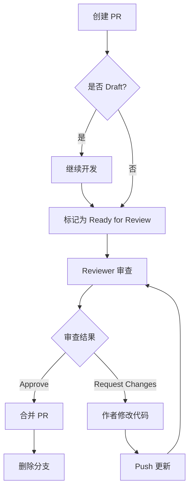

# Pull Request 与 Code Review 指南

## 一、创建 Pull Request

### 网页端创建

1. 推送分支后，打开 GitHub 仓库页面
2. 点击页面顶部的黄色提示条 "Compare & pull request"（或手动进入 Pull requests → New pull request）
3. 确认 base 分支为 `main`，compare 分支为你的功能分支
4. 填写标题和描述（见下方模板）
5. 在右侧面板中：
   - **Reviewers**：指定审查人
   - **Assignees**：指定负责人（通常是自己）
   - **Labels**：添加标签（如 `enhancement`、`bug`）
6. 点击 "Create pull request"

### 命令行创建（gh CLI）

```bash
# 基本用法
gh pr create --title "标题" --body "描述内容"

# 指定审查人
gh pr create --title "标题" --body "描述" --reviewer teammate-username

# 创建草稿 PR
gh pr create --draft --title "WIP: 标题" --body "描述"
```

### PR 标题规范

遵循 Angular Commit Convention，与 commit message 格式一致：

```
feat(P2-13): 集成 VLM 自动描述生成
fix(P2-09): 修复接收端工作流参数传递错误
docs: 添加团队协作文档
refactor: 重构 ComfyUI API 客户端
```

### PR 描述模板

> 项目已配置 PR 模板（`.github/pull_request_template.md`），创建 PR 时描述栏会自动填充。模板包含：改动说明、关联 Issue、测试 checklist。

## 二、Code Review（代码审查）

### 作为 Reviewer：如何审查

1. 打开 PR 页面，点击 "Files changed" 查看代码变更
2. 逐文件查看 diff（绿色为新增，红色为删除）
3. 在具体代码行上悬停，点击 "+" 号可以添加行内评论
4. 审查完毕后，点击右上角 "Review changes"，选择：

| 选项 | 含义 | 何时使用 |
|------|------|----------|
| **Comment** | 仅评论 | 有建议但不阻塞合并 |
| **Approve** | 批准 | 代码没问题，可以合并 |
| **Request changes** | 要求修改 | 发现必须修改的问题 |

### 作为 Reviewer：关注什么

- **正确性**：逻辑是否正确，边界条件是否处理
- **可读性**：命名是否清晰，结构是否合理
- **一致性**：是否符合项目现有的代码风格
- **安全性**：是否有明显的安全隐患（硬编码密钥、SQL 注入等）

不需要关注：
- 代码格式（交给 ruff 等工具自动检查）
- 个人偏好（"我会用另一种写法"不是有效的 review 意见）

### 作为 PR 作者：如何回应

- 根据反馈修改代码，在同一分支提交并 push，PR 会自动更新
- 对每个评论进行回复或标记为已解决（Resolve conversation）
- 修改完成后，可以 re-request review

### Review 礼仪

- **提问而非指责**："这里为什么选择 X 而不是 Y？" 优于 "这样写不对"
- **给出具体建议**：如果觉得有更好的写法，直接给出代码示例
- **区分必须修改和建议**：用 `nit:` 前缀表示非关键建议（如 `nit: 这个变量名可以更清晰`）
- **及时 Review**：收到 review 请求后尽快处理，不要让 PR 长时间挂着

## 三、PR 的生命周期



## 四、常用 gh CLI 命令

```bash
# 查看当前仓库的 PR 列表
gh pr list

# 查看某个 PR 的详情
gh pr view 5

# 在浏览器中打开 PR
gh pr view 5 --web

# 检出别人的 PR 到本地测试
gh pr checkout 5

# 合并 PR
gh pr merge 5

# 关闭 PR（不合并）
gh pr close 5
```
