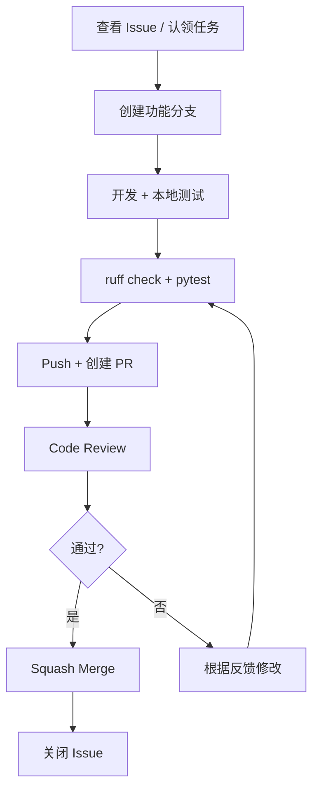

# 本项目协作约定

## 一、分支命名规范

| 前缀 | 用途 | 示例 |
|------|------|------|
| `feature/` | 新功能开发 | `feature/vlm-integration` |
| `fix/` | Bug 修复 | `fix/receiver-timeout` |
| `docs/` | 文档更新 | `docs/add-collaboration-guide` |
| `refactor/` | 代码重构 | `refactor/api-client` |
| `test/` | 测试相关 | `test/add-sender-tests` |

命名要求：
- 使用英文小写 + 短横线连接
- 简短但能说明目的
- 如关联任务编号，可加上：`feature/P2-13-vlm-integration`

## 二、Commit Message 规范

本项目采用 **Angular Commit Message Convention**，Subject 和 Body 使用中文。

### 格式

```
<type>(<scope>): <subject>

<body>（可选）
```

### type 类型

| type | 含义 | 示例 |
|------|------|------|
| `feat` | 新功能 | `feat(P2-13): 实现 VLM 图像描述生成` |
| `fix` | Bug 修复 | `fix(P2-09): 修复接收端参数传递错误` |
| `docs` | 文档更新 | `docs: 添加团队协作文档` |
| `refactor` | 重构（不改变功能） | `refactor: 重构 ComfyUI API 客户端` |
| `test` | 测试相关 | `test: 添加发送端工作流单元测试` |
| `chore` | 构建/工具变更 | `chore: 更新 pyproject.toml 依赖` |
| `style` | 代码格式调整 | `style: 统一缩进格式` |

### scope（可选）

- 使用任务编号：`P2-13`、`P2-09`
- 或使用模块名：`api`、`vlm`、`config`

### 示例

```bash
# 简单提交
git commit -m "feat(P2-13): 实现 VLM 图像描述生成"

# 带详细说明
git commit -m "fix(P2-09): 修复接收端工作流超时问题

将 WebSocket 超时时间从 30s 调整为 120s，
适配大尺寸图像的生成耗时"
```

## 三、PR 合并策略

建议使用 **Squash and merge**：

- 将功能分支的多个 commit 合并为一个提交进入 `main`
- 保持 `main` 分支历史简洁，每个合并对应一个完整的功能/修复
- 合并时可以编辑最终的 commit message

在仓库 Settings → General → Pull Requests 中，可以设置默认合并方式。

## 四、分支保护规则建议

对 `main` 分支设置保护，在 Settings → Branches → Add branch protection rule 中配置：

| 规则 | 建议设置 | 说明 |
|------|----------|------|
| **Require a pull request before merging** | 开启 | 禁止直接 push 到 main |
| **Require approvals** | 1 人 | 至少 1 人 approve 才能合并 |
| **Require status checks to pass** | 按需 | 如果配置了 CI，合并前需测试通过 |
| **Include administrators** | 建议开启 | 管理员也遵守规则 |

> 团队 2-3 人时，1 人 approve 即可，不需要太复杂的流程。

## 五、代码规范

### 工具链

| 工具 | 用途 | 命令 |
|------|------|------|
| **uv** | 包管理 | `uv add <pkg>`、`uv sync` |
| **ruff** | 代码检查和格式化 | `ruff check .`、`ruff format .` |
| **pytest** | 测试 | `uv run pytest tests/` |

### 提交前自检

```bash
# 代码格式化
uv run ruff format .

# 代码检查
uv run ruff check .

# 运行测试
uv run pytest tests/
```

## 六、协作流程总览



## 七、与 workflow 系统的关系

本项目 `docs/workflow/` 下的结构化工作流（structured-workflow）是开发者与 Claude Code 配合使用的 agent coding 工具，用于在 feature branch 上进行任务分解和进度跟踪。它不是团队协作的任务分配系统。

**对不使用 structured-workflow 的协作者而言**：
- `docs/workflow/` 下的活跃文件（TASK_STATUS.md、TASK_PLAN.md 等）由 structured-workflow 插件生成和管理，直接阅读可能缺少上下文；`docs/workflow/archive/` 下的归档内容可正常查阅
- structured-workflow 是 [cc-plugins](https://github.com/chy5301/cc-plugins) 中的一个插件，需要使用 Claude Code 或兼容其插件生态的工具并安装该插件后才能正常使用
- 团队任务分配通过 GitHub Issues 按需进行
- 按本文档第六节的协作流程开发即可

**使用 structured-workflow 开发时的流程**：
1. 从 main 创建 feature branch
2. 在分支上运行 task-init，分解子任务
3. 通过 task-exec / task-auto 完成开发
4. task-review 验证完成度
5. task-archive 归档 workflow 产物，清理活跃文件
6. 提交 PR，合并回 main
