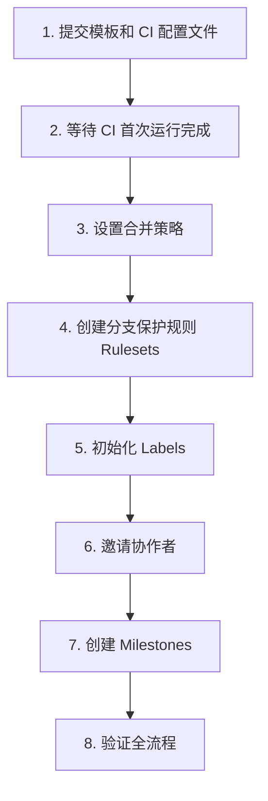

# 多人协作配置清单

本文档是管理员将仓库从单人开发切换到多人协作的完整操作清单。

## 配置顺序

## 操作清单

### 第一步：提交配置文件到仓库
> 项目已创建以下配置文件，提交并推送即可生效

- [x] `.github/pull_request_template.md` — PR 描述模板
- [x] `.github/ISSUE_TEMPLATE/bug_report.md` — Bug 报告模板
- [x] `.github/ISSUE_TEMPLATE/feature_request.md` — 功能需求模板
- [x] `.github/workflows/ci.yml` — CI 工作流

### 第二步：等待 CI 首次运行
> 详见 [05-CI 配置](./05-ci-setup.md)

- [x] 推送后进入 Actions 页面确认 CI 运行成功

### 第三步：设置合并策略
> 详见 [03-仓库设置](./03-repo-settings.md#二合并策略设置)

- [x] Settings → General → Pull Requests：默认 Squash merge
- [x] 开启 "Automatically delete head branches"
- [x] 开启 "Always suggest updating pull request branches"

### 第四步：创建分支保护规则（Rulesets）
> 详见 [03-仓库设置](./03-repo-settings.md#一分支保护规则rulesets)
>
> **注意**：私有仓库需要 GitHub Pro 才能启用。如暂未升级，先跳过此步，依靠团队约定和 CI 检查保障流程。

- [ ] Settings → Rules → Rulesets → New branch ruleset
- [ ] 添加 Bypass：Repository admin（Always）
- [ ] 开启 "Require a pull request before merging"（1 approval）
- [ ] 开启 "Require status checks to pass"（选择 `lint-and-test`）

### 第五步：初始化 Labels
> 详见 [04-模板与标签](./04-templates-and-labels.md)

- [ ] 运行 Labels 初始化脚本

### 第六步：邀请协作者
> 详见 [02-成员管理](./02-collaborator-management.md)

- [ ] 在 Settings → Collaborators 中邀请团队成员
- [ ] 为成员分配合适的权限（开发者建议 Write）
- [ ] 确认成员已接受邀请并能访问仓库

### 第七步：创建 Milestones
> 详见 [04-模板与标签](./04-templates-and-labels.md#三milestones-创建)

- [ ] 按项目阶段创建里程碑

### 第八步：验证全流程

- [ ] 让一位成员创建分支 → 修改代码 → 推送 → 创建 PR
- [ ] 确认 PR 模板自动填充
- [ ] 确认 CI 自动运行
- [ ] 确认无法直接 push 到 main（需第四步已完成）
- [ ] 完成 Code Review → 合并 PR
- [ ] 确认分支自动删除
