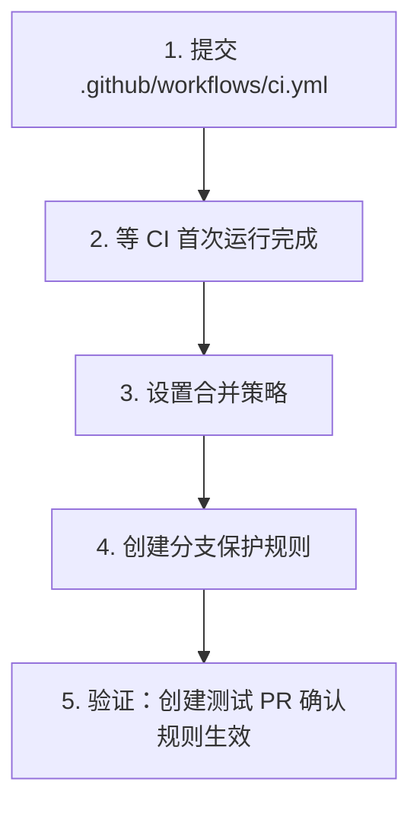

# 仓库设置

## 一、分支保护规则

### 为什么需要

防止直接向 `main` 推送未经审查的代码，确保所有变更通过 PR + Code Review 进入主分支。

### 配置步骤

1. 打开仓库 → **Settings** → 左侧 **Branches**
2. 在 "Branch protection rules" 下点击 **Add branch protection rule**
3. "Branch name pattern" 填写：`main`
4. 勾选以下选项：

| 选项 | 建议 | 说明 |
|------|------|------|
| **Require a pull request before merging** | 开启 | 禁止直接 push 到 main |
| → Require approvals | **1** | 至少 1 人 approve |
| → Dismiss stale pull request approvals when new commits are pushed | 开启 | 新提交后需要重新 approve |
| **Require status checks to pass before merging** | 开启 | CI 通过才能合并 |
| → Require branches to be up to date before merging | 开启 | 分支必须是最新的 |
| → Status checks: **lint-and-test** | 选择 | 关联 CI 工作流（CI 首次运行后才会出现在列表中） |
| **Do not allow bypassing the above settings** | 开启 | 管理员也必须遵守规则 |

5. 点击 **Create** 保存

> 注意："Require status checks" 中的 `lint-and-test` 需要 CI 工作流至少运行过一次后才会出现在可选列表中。建议先提交 `.github/workflows/ci.yml` 并触发一次 CI，再来配置此项。

### 使用 gh CLI 配置

```bash
gh api repos/chy5301/semantic-transmission/branches/main/protection \
  --method PUT \
  -H "Accept: application/vnd.github+json" \
  --input - << 'EOF'
{
  "required_status_checks": {
    "strict": true,
    "contexts": ["lint-and-test"]
  },
  "enforce_admins": true,
  "required_pull_request_reviews": {
    "dismiss_stale_reviews": true,
    "required_approving_review_count": 1
  },
  "restrictions": null
}
EOF
```

## 二、合并策略设置

### 配置步骤

1. 打开仓库 → **Settings** → **General** → 下拉到 "Pull Requests" 部分
2. 建议配置：

| 选项 | 建议 | 说明 |
|------|------|------|
| **Allow squash merging** | 开启（设为默认） | 多个 commit 压缩为一个，保持 main 历史简洁 |
| **Allow merge commits** | 开启 | 保留完整提交历史（偶尔需要） |
| **Allow rebase merging** | 关闭 | 避免新手误用导致历史混乱 |
| **Default to squash merge** | 设置 | 默认选项设为 Squash |

### 其他推荐设置

| 选项 | 建议 | 说明 |
|------|------|------|
| **Automatically delete head branches** | 开启 | PR 合并后自动删除功能分支，保持仓库整洁 |
| **Always suggest updating pull request branches** | 开启 | PR 落后于 main 时提示更新 |

## 三、配置顺序建议



> 分支保护中的 "Require status checks" 依赖 CI 至少运行过一次，所以 CI 配置必须先于分支保护。
