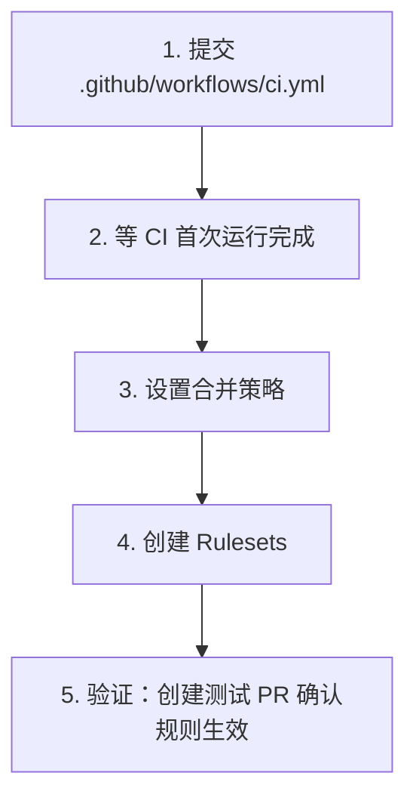

# 仓库设置

## 一、分支保护规则（Rulesets）

### 为什么需要

防止直接向 `main` 推送未经审查的代码，确保所有变更通过 PR + Code Review 进入主分支。

### 前置条件

> **注意**：Rulesets 在私有仓库上需要 GitHub Pro（$4/月）；公共仓库免费可用。本仓库已转为公开，Rulesets 已配置生效。

### 方案选择

本项目推荐使用 **Repository Rulesets**（2023 年推出），而非传统 Branch Protection Rules：

| | Branch Protection（传统） | Rulesets（推荐） |
|---|---|---|
| 绕过机制 | 仅"管理员全部绕过"开关 | 可精确指定哪些角色可绕过 |
| 作用范围 | 单个分支 | 可通配符匹配多个分支/tag |
| 多层规则 | 一个分支一套 | 可叠加多个 ruleset |

### 配置步骤（网页端）

1. 打开仓库 → **Settings** → 左侧 **Rules** → **Rulesets**
2. 点击 **New ruleset** → **New branch ruleset**
3. 配置如下：

**基本设置**：
- Name：`main-branch-protection`
- Enforcement status：**Active**
- Target branches：Add target → Include by pattern → `main`

**Bypass list**（绕过列表）：
- 添加 **Repository admin** 角色，模式选 **Always**
- 效果：管理员可自行合并 PR（不需要别人 approve），协作者必须遵守规则

**Rules**（规则）：

| 规则 | 配置 | 说明 |
|------|------|------|
| **Require a pull request before merging** | 开启 | 禁止直接 push 到 main |
| → Required approvals | **1** | 协作者至少需 1 人 approve |
| → Dismiss stale pull request approvals when new commits are pushed | 开启 | 新提交后需重新 approve |
| → Allowed merge methods | squash, merge | 不允许 rebase |
| **Require status checks to pass** | 开启 | CI 通过才能合并 |
| → Status checks: **lint-and-test** | 添加 | 关联 CI 工作流 |

4. 点击 **Create** 保存

> 注意：Status checks 中的 `lint-and-test` 需要 CI 至少运行过一次后才会出现在搜索列表中。

### 使用 gh CLI 配置

```bash
gh api repos/chy5301/semantic-transmission/rulesets \
  --method POST \
  -H "Accept: application/vnd.github+json" \
  --input - << 'EOF'
{
  "name": "main-branch-protection",
  "target": "branch",
  "enforcement": "active",
  "conditions": {
    "ref_name": {
      "include": ["refs/heads/main"],
      "exclude": []
    }
  },
  "bypass_actors": [
    {
      "actor_id": 5,
      "actor_type": "RepositoryRole",
      "bypass_mode": "always"
    }
  ],
  "rules": [
    {
      "type": "pull_request",
      "parameters": {
        "required_approving_review_count": 1,
        "dismiss_stale_reviews_on_push": true,
        "require_code_owner_review": false,
        "require_last_push_approval": false,
        "required_review_thread_resolution": false,
        "allowed_merge_methods": ["squash", "merge"]
      }
    },
    {
      "type": "required_status_checks",
      "parameters": {
        "required_status_checks": [
          {
            "context": "lint-and-test"
          }
        ],
        "strict_required_status_checks_policy": false
      }
    }
  ]
}
EOF
```

> `bypass_actors` 中 `actor_id: 5` 对应 Repository Admin 角色。协作者（Write 权限，actor_id: 4）不在绕过列表中，必须遵守所有规则。

## 二、合并策略设置

### 配置步骤

1. 打开仓库 → **Settings** → **General** → 下拉到 "Pull Requests" 部分
2. 建议配置：

| 选项 | 建议 | 说明 |
|------|------|------|
| **Allow squash merging** | 开启（设为默认） | 多个 commit 压缩为一个，保持 main 历史简洁 |
| **Allow merge commits** | 开启 | 保留完整提交历史（偶尔需要） |
| **Allow rebase merging** | 关闭 | 避免新手误用导致历史混乱 |
| **Default to squash merge** | 设置 | 默认选项设为 Squash |

### 其他推荐设置

| 选项 | 建议 | 说明 |
|------|------|------|
| **Automatically delete head branches** | 开启 | PR 合并后自动删除功能分支，保持仓库整洁 |
| **Always suggest updating pull request branches** | 开启 | PR 落后于 main 时提示更新 |

## 三、配置顺序建议



> Rulesets 中的 "Require status checks" 依赖 CI 至少运行过一次，所以 CI 配置必须先于 Rulesets。
