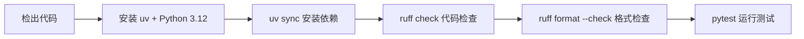

# GitHub Actions CI 配置

## 一、CI 工作流说明

文件位置：`.github/workflows/ci.yml`

### 触发条件

| 事件 | 说明 |
|------|------|
| Push 到 `main` | 确保主分支代码始终通过检查 |
| PR 到 `main` | 合并前自动验证代码质量 |

### CI 执行步骤



每个步骤依次执行，任一步骤失败则整个 CI 标记为失败。

## 二、查看 CI 运行结果

### 在 PR 页面

PR 底部会显示 CI 状态：
- 绿色对勾：所有检查通过
- 红色叉号：有检查失败，点击 "Details" 查看具体原因
- 黄色圆点：正在运行中

### 在 Actions 页面

1. 打开仓库 → **Actions** 标签
2. 查看所有工作流运行记录
3. 点击某次运行 → 查看每个步骤的日志输出

### 使用 gh CLI

```bash
# 查看最近的工作流运行
gh run list

# 查看某次运行的详情
gh run view <run-id>

# 查看失败的日志
gh run view <run-id> --log-failed
```

## 三、常见 CI 失败原因

### ruff check 失败

**原因**：代码中有 lint 问题（未使用的 import、变量命名等）

**解决**：
```bash
# 查看具体问题
uv run ruff check .

# 自动修复可以自动修复的问题
uv run ruff check --fix .

# 提交修复后 push
git add .
git commit -m "style: 修复 ruff 检查问题"
git push
```

### ruff format 失败

**原因**：代码格式不符合规范

**解决**：
```bash
# 自动格式化
uv run ruff format .

# 提交修复后 push
git add .
git commit -m "style: 格式化代码"
git push
```

### pytest 失败

**原因**：测试用例未通过

**解决**：
```bash
# 本地运行测试查看详情
uv run pytest tests/ -v

# 修复后提交 push
```

### 依赖安装失败

**原因**：`pyproject.toml` 或 `uv.lock` 有问题

**解决**：
```bash
# 本地验证依赖是否正常
uv sync --dev

# 如果修改了依赖，确保 uv.lock 已更新并提交
git add pyproject.toml uv.lock
git commit -m "chore: 更新依赖"
git push
```

## 四、本地预检（避免 CI 失败）

详见 [项目协作约定 - 提交前自检](../05-project-conventions.md#提交前自检)。
