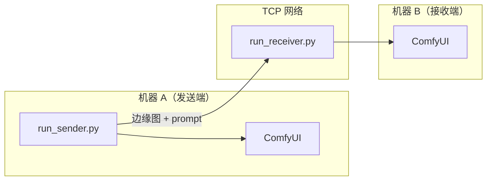

# 演示手册

覆盖单机端到端演示和双机网络演示的完整操作步骤。

## 前置条件

- 已完成 [使用指南](user-guide.md) 中的安装步骤
- ComfyUI 已启动且连通性测试通过
- 模型文件已下载

## 单机端到端演示

### 脚本：`scripts/demo_e2e.py`

在同一台机器上完成：输入图像 → 发送端（边缘提取 + 语义描述）→ 接收端（图像还原）。

### 参数说明

| 参数 | 必填 | 默认值 | 说明 |
|------|------|--------|------|
| `--image` | 是 | — | 输入图像路径 |
| `--prompt` | 二选一 | — | 手动指定描述文本 |
| `--auto-prompt` | 二选一 | — | 使用 VLM 自动生成描述 |
| `--sender-host` | 否 | `127.0.0.1` | 发送端 ComfyUI 地址 |
| `--sender-port` | 否 | `8188` | 发送端 ComfyUI 端口 |
| `--receiver-host` | 否 | `127.0.0.1` | 接收端 ComfyUI 地址 |
| `--receiver-port` | 否 | `8188` | 接收端 ComfyUI 端口 |
| `--output-dir` | 否 | `output/demo` | 输出目录 |
| `--seed` | 否 | 随机 | KSampler 随机种子（便于复现） |
| `--vlm-model` | 否 | `Qwen/Qwen2.5-VL-7B-Instruct` | VLM 模型名称 |
| `--vlm-model-path` | 否 | `$MODEL_CACHE_DIR/Qwen/...` | VLM 模型本地路径 |

> `--prompt` 和 `--auto-prompt` 互斥，必须指定其一。

### 操作步骤

1. **启动 ComfyUI**：打开 ComfyUI 启动器，确认服务运行在 `127.0.0.1:8188`

2. **准备测试图像**：项目自带测试图片在 `resources/test_images/` 目录

3. **运行演示**：

```bash
# 手动 prompt（快速验证，不需要 VLM 模型）
uv run python scripts/demo_e2e.py \
    --image resources/test_images/cat.jpg \
    --prompt "A cat sitting on a wooden floor, indoor scene with warm lighting"

# 自动 prompt（完整流程，需要 VLM 模型）
uv run python scripts/demo_e2e.py \
    --image resources/test_images/cat.jpg \
    --auto-prompt

# 指定种子以便复现结果
uv run python scripts/demo_e2e.py \
    --image resources/test_images/cat.jpg \
    --auto-prompt \
    --seed 42
```

4. **查看结果**：输出保存在 `output/demo/` 下，包含：
   - 原图副本
   - Canny 边缘图
   - 还原图像
   - `prompt.txt`（使用的描述文本）

### 质量评估

```bash
uv run python scripts/evaluate.py \
    --input-dir output/demo \
    --original-dir resources/test_images
```

评估输出包含 PSNR、SSIM、LPIPS、CLIP Score 四类指标的逐样本和汇总统计。

#### 评估脚本参数

| 参数 | 必填 | 默认值 | 说明 |
|------|------|--------|------|
| `--input-dir` | 是 | — | 演示输出目录 |
| `--original-dir` | 是 | — | 原图目录 |
| `--output` | 否 | — | JSON 报告输出路径 |
| `--device` | 否 | 自动检测 | 计算设备（`cuda` / `cpu`） |
| `--no-lpips` | 否 | — | 跳过 LPIPS 计算 |
| `--no-clip` | 否 | — | 跳过 CLIP Score 计算 |

---

## 双机网络演示

两台机器分别运行发送端和接收端，通过 TCP 网络传输语义数据。

### 网络拓扑



### 前置条件

- 两台机器各自部署 ComfyUI 并安装模型
- 两台机器在同一局域网内，接收端端口（默认 9000）可被发送端访问
- 如有防火墙，需开放接收端的 TCP 端口

### 接收端脚本：`scripts/run_receiver.py`

| 参数 | 必填 | 默认值 | 说明 |
|------|------|--------|------|
| `--relay-host` | 否 | `0.0.0.0` | 监听地址 |
| `--relay-port` | 否 | `9000` | 监听端口 |
| `--comfyui-host` | 否 | `127.0.0.1` | 本机 ComfyUI 地址 |
| `--comfyui-port` | 否 | `8188` | 本机 ComfyUI 端口 |
| `--output-dir` | 否 | `output/received` | 输出目录 |
| `--continuous` | 否 | — | 连续模式：持续监听多次传输 |

### 发送端脚本：`scripts/run_sender.py`

| 参数 | 必填 | 默认值 | 说明 |
|------|------|--------|------|
| `--image` | 是 | — | 输入图像路径 |
| `--prompt` | 二选一 | — | 手动指定描述文本 |
| `--auto-prompt` | 二选一 | — | 使用 VLM 自动生成描述 |
| `--relay-host` | 是 | — | 接收端机器 IP 地址 |
| `--relay-port` | 否 | `9000` | 接收端监听端口 |
| `--comfyui-host` | 否 | `127.0.0.1` | 本机 ComfyUI 地址 |
| `--comfyui-port` | 否 | `8188` | 本机 ComfyUI 端口 |
| `--seed` | 否 | 随机 | KSampler 随机种子 |
| `--vlm-model` | 否 | — | VLM 模型名称 |
| `--vlm-model-path` | 否 | `$MODEL_CACHE_DIR/Qwen/...` | VLM 模型本地路径 |

### 操作步骤

1. **确认网络连通**：从发送端 ping 接收端 IP，确认可达

2. **在接收端（机器 B）启动监听**：

```bash
# 单次接收
uv run python scripts/run_receiver.py

# 连续模式（持续监听）
uv run python scripts/run_receiver.py --continuous

# 自定义端口
uv run python scripts/run_receiver.py --relay-port 9000
```

3. **在发送端（机器 A）发送图像**：

```bash
# 手动 prompt
uv run python scripts/run_sender.py \
    --image photo.jpg \
    --prompt "A red car parked in front of a building" \
    --relay-host 192.168.1.20

# 自动 prompt
uv run python scripts/run_sender.py \
    --image photo.jpg \
    --auto-prompt \
    --relay-host 192.168.1.20
```

4. **查看结果**：接收端还原图像保存在 `output/received/` 目录

### 防火墙注意事项

**Windows**：

```powershell
# 开放 TCP 9000 端口（需管理员权限）
netsh advfirewall firewall add rule name="SemanticTX" dir=in action=allow protocol=TCP localport=9000
```

**Linux**：

```bash
# ufw
sudo ufw allow 9000/tcp

# firewalld
sudo firewall-cmd --add-port=9000/tcp --permanent && sudo firewall-cmd --reload
```

## 常见错误与排查

| 错误 | 原因 | 解决 |
|------|------|------|
| `ConnectionRefusedError` | ComfyUI 未启动或端口不对 | 确认 ComfyUI 运行中，检查 host/port 参数 |
| `TimeoutError` | 工作流执行超时 | 检查 GPU 状态，确认模型已加载 |
| `FileNotFoundError: workflow` | 工作流文件缺失 | 确认 `resources/comfyui/` 下有工作流 JSON 文件 |
| 连接接收端失败 | 网络不通或防火墙拦截 | 检查 ping 连通性，开放防火墙端口 |
| VLM 模型加载失败 | 模型未下载或路径错误 | 运行 `download_models.py` 下载，或指定 `--vlm-model-path` |
| CUDA out of memory | GPU 显存不足 | 关闭其他 GPU 程序，或使用手动 prompt 模式跳过 VLM |
