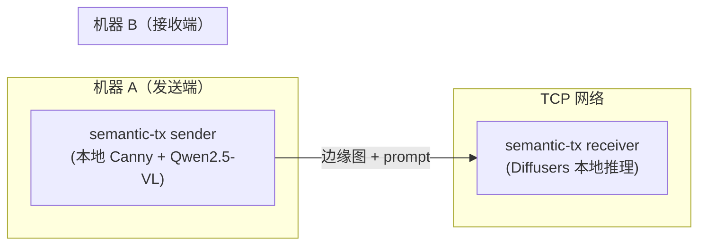

# 演示手册

覆盖单机端到端演示和双机网络演示的完整操作步骤。接收端使用 **Diffusers 本地推理**
（Z-Image-Turbo + ControlNet Union，GGUF Q8_0 量化），无需外部 ComfyUI 服务。

## 前置条件

- 已完成 [使用指南](user-guide.md) 中的安装步骤
- 接收端模型文件已下载到 `$MODEL_CACHE_DIR/Z-Image-Turbo/`（可通过 `semantic-tx check diffusers` 检测）
- （可选）发送端 VLM 模型已下载到 `$MODEL_CACHE_DIR/Qwen/Qwen2.5-VL-7B-Instruct`（可通过 `semantic-tx check vlm` 检测）
- 环境变量 `MODEL_CACHE_DIR` 和 `HF_HOME` 已正确设置

## GUI 演示（推荐）

最简单的演示方式，通过浏览器操作：

### 启动

```bash
uv run semantic-tx gui
```

浏览器打开 http://127.0.0.1:7860。

### 操作步骤

1. **配置 Tab**：点击"检查 VLM 模型"和"检查 Diffusers 模型"按钮确认模型就绪
2. **切换到"端到端演示" Tab**
3. **上传图像**：拖拽或点击上传区域选择图片（可使用 `resources/test_images/` 中的测试图）
4. **选择描述模式**：
   - "VLM 自动生成"（默认）：使用 Qwen2.5-VL 模型自动生成描述
   - "手动输入"：在 Prompt 框中填写图像描述
5. **点击"运行端到端演示"**
6. **观察进度**：进度区显示 4 个步骤（✓ 已完成 / ◉ 进行中 / ○ 待执行）
7. **查看结果**：原图、边缘图、还原图三列对比展示
8. **（可选）质量评估**：展开底部"质量评估"面板，点击运行获取 PSNR/SSIM/LPIPS 指标

### 批量端到端演示

"批量端到端" Tab 支持一次处理目录下所有图片：

1. 填入输入目录和输出目录
2. 选择 Prompt 模式（VLM 自动 / 手动统一）
3. 可选勾选"运行质量评估（会额外耗时）"
4. 点击"开始批量处理"
5. 逐组结果展开 Accordion 折叠块查看原图/边缘图/还原图/prompt/metrics
6. 底部"总体评估"表显示平均 PSNR/SSIM/LPIPS

### 双机演示（GUI 模式）

"批量发送" Tab 用于双机部署的发送端：

1. 在本 Tab 内的"接收端对端"区填入对端 IP 和端口
2. 点击"测试对端连接"验证可达
3. 填入本地图像目录，选择 Prompt 模式
4. 点击"开始批量发送"

> 如需远程演示，启动时加 `--share` 参数生成公网链接：`semantic-tx gui --share`

---

## 单机端到端演示（命令行）

### 命令：`semantic-tx demo`

在同一台机器上完成：输入图像 → 本地 Canny 边缘提取 → VLM 语义描述 → Diffusers 还原。

详细参数见 [CLI 参考文档](cli-reference.md#semantic-tx-demo)。

### 操作步骤

1. **（可选）检查模型就绪**：

```bash
semantic-tx check vlm
semantic-tx check diffusers
```

2. **准备测试图像**：项目自带测试图片在 `resources/test_images/` 目录

3. **运行演示**：

```bash
# 手动 prompt（快速验证，不需要 VLM 模型）
uv run semantic-tx demo \
    --image resources/test_images/cat.jpg \
    --prompt "A cat sitting on a wooden floor, indoor scene with warm lighting"

# 自动 prompt（完整流程，需要 VLM 模型）
uv run semantic-tx demo \
    --image resources/test_images/cat.jpg \
    --auto-prompt

# 指定种子以便复现结果
uv run semantic-tx demo \
    --image resources/test_images/cat.jpg \
    --auto-prompt \
    --seed 42
```

4. **查看结果**：输出保存在 `output/demo/` 下，包含：
   - `edge.png`（Canny 边缘图）
   - `restored.png`（还原图像）
   - `comparison.png`（对比图：原图 | 边缘图 | 还原图）
   - `prompt.txt`（使用的描述文本）

### 批量演示

```bash
uv run semantic-tx batch-demo \
    --input-dir resources/test_images \
    --auto-prompt \
    --skip-errors
```

详见 [CLI 参考文档](cli-reference.md#semantic-tx-batch-demo)。

### 质量评估

```bash
uv run python scripts/evaluate.py \
    --input-dir output/demo \
    --original-dir resources/test_images
```

评估输出包含 PSNR、SSIM、LPIPS、CLIP Score 四类指标的逐样本和汇总统计。

#### 评估脚本参数

| 参数 | 必填 | 默认值 | 说明 |
|------|------|--------|------|
| `--input-dir` | 是 | — | 演示输出目录 |
| `--original-dir` | 是 | — | 原图目录 |
| `--output` | 否 | — | JSON 报告输出路径 |
| `--device` | 否 | 自动检测 | 计算设备（`cuda` / `cpu`） |
| `--no-lpips` | 否 | — | 跳过 LPIPS 计算 |
| `--no-clip` | 否 | — | 跳过 CLIP Score 计算 |

---

## 双机网络演示

两台机器分别运行发送端和接收端，通过 TCP 网络传输语义数据。

### 网络拓扑



### 前置条件

- 两台机器各自安装项目依赖并下载对应模型：
  - 机器 A（发送端）：Qwen2.5-VL（如用 auto-prompt）
  - 机器 B（接收端）：Z-Image-Turbo GGUF + ControlNet Union
- 两台机器在同一局域网内，接收端端口（默认 9000）可被发送端访问
- 如有防火墙，需开放接收端的 TCP 端口

### 操作步骤

1. **确认网络连通**：从发送端运行 `semantic-tx check relay --host <机器B IP> --port 9000`

2. **在接收端（机器 B）启动监听**：

```bash
# 单次接收
uv run semantic-tx receiver

# 连续模式（持续监听）
uv run semantic-tx receiver --continuous

# 自定义端口
uv run semantic-tx receiver --relay-port 9000
```

3. **在发送端（机器 A）发送图像**：

```bash
# 手动 prompt
uv run semantic-tx sender \
    --image photo.jpg \
    --prompt "A red car parked in front of a building" \
    --relay-host 192.168.1.20

# 自动 prompt
uv run semantic-tx sender \
    --image photo.jpg \
    --auto-prompt \
    --relay-host 192.168.1.20
```

4. **查看结果**：接收端还原图像保存在 `output/received/` 目录

### 防火墙注意事项

**Windows**：

```powershell
# 开放 TCP 9000 端口（需管理员权限）
netsh advfirewall firewall add rule name="SemanticTX" dir=in action=allow protocol=TCP localport=9000
```

**Linux**：

```bash
# ufw
sudo ufw allow 9000/tcp

# firewalld
sudo firewall-cmd --add-port=9000/tcp --permanent && sudo firewall-cmd --reload
```

## 常见错误与排查

| 错误 | 原因 | 解决 |
|------|------|------|
| `ConnectionRefusedError`（发送端） | 接收端未启动或端口未开放 | 确认 `semantic-tx receiver` 运行中，用 `semantic-tx check relay` 验证 |
| `FileNotFoundError: z-image-turbo-Q8_0.gguf` | 接收端 GGUF 模型未下载 | 运行 `semantic-tx download --dry-run` 查看下载计划，确认 `MODEL_CACHE_DIR` 正确 |
| `FileNotFoundError: ControlNet` | ControlNet 权重缺失 | 检查 `$MODEL_CACHE_DIR/Z-Image-Turbo/Z-Image-Turbo-Fun-Controlnet-Union.safetensors` |
| HF cache 缺失 | pipeline base 组件未缓存 | 运行 `semantic-tx check diffusers` 查看缺失项，确认 `HF_HOME` 正确或联网加载 |
| VLM 模型加载失败 | Qwen2.5-VL 未下载或路径错误 | 运行 `semantic-tx check vlm`，按提示下载或指定 `--vlm-model-path` |
| CUDA out of memory | GPU 显存不足 | 关闭其他 GPU 程序；接收端已使用 GGUF Q8_0 量化 + 分组件加载，24 GB 显存应充足 |
| 每步推理极慢（分钟级） | 模型未量化或 float32 被加载 | 确认使用 GGUF Q8_0 transformer，正常每步约 3 秒 |
