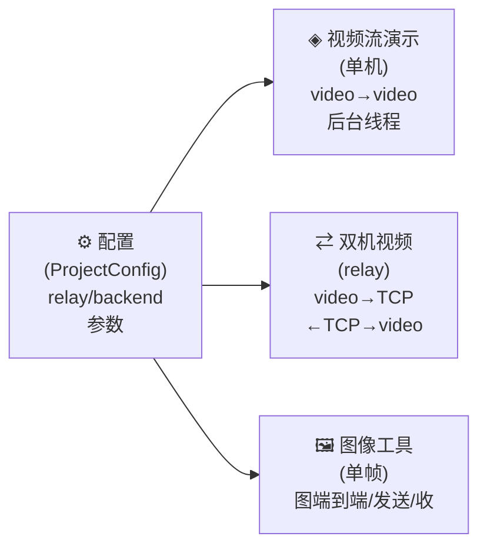
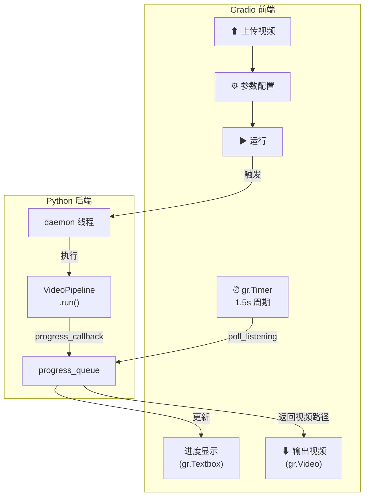
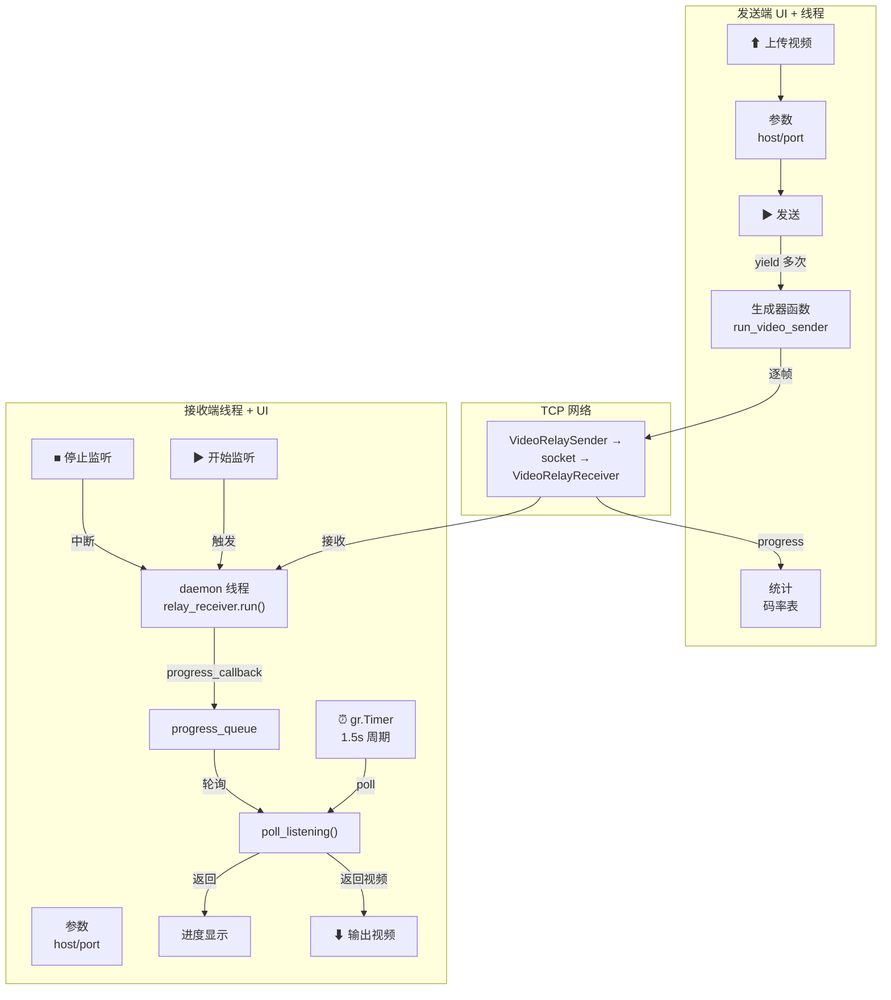
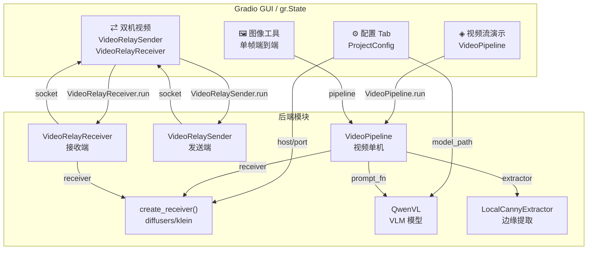
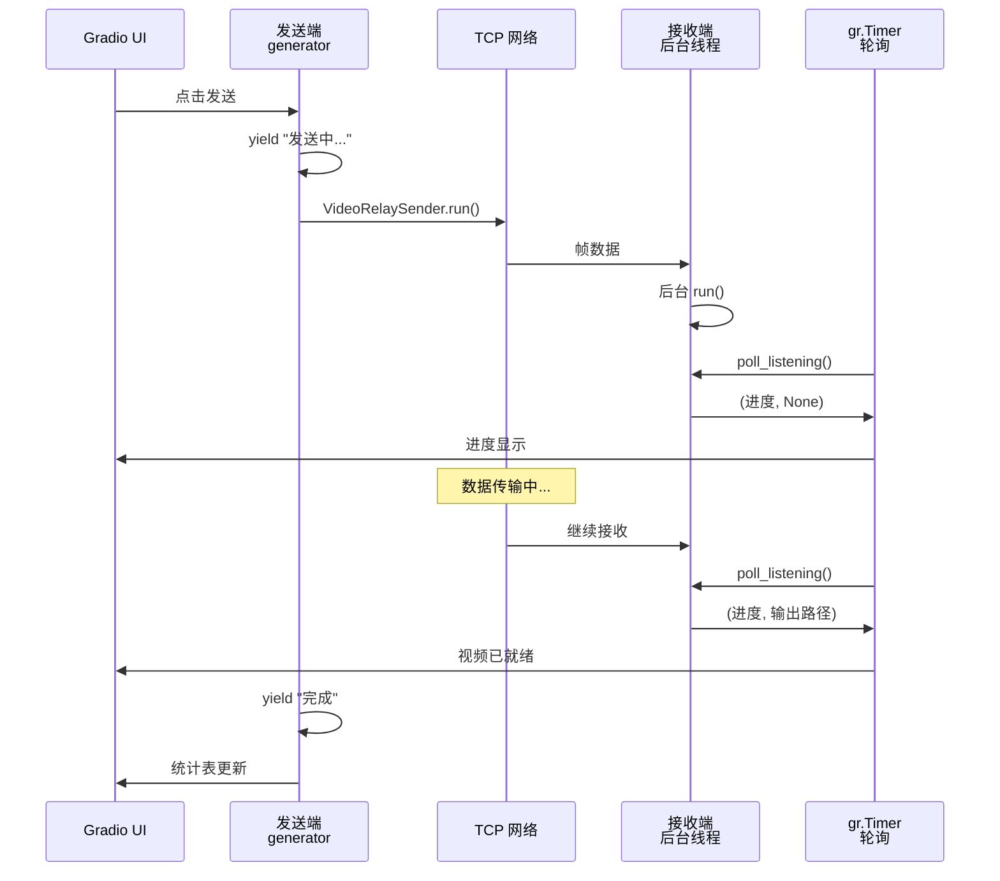

# GUI 设计方案：语义传输可视化界面

> 版本: 2.0
> 日期: 2026-07-11
> 对应任务: Phase B (B1-B5)
>
> ⚠️ 更新：本文于 2026-07-11 更新至 v2.0，确认 4 Tab 结构已全量实现（issue #29 已关闭）。
> 当前实现为 Diffusers + klein 本地推理，支持单机与双机（relay）视频流式传输。
> 具体以代码与 [cli-reference.md](cli-reference.md) / [demo-handbook.md](demo-handbook.md) 为准。

## 1. 设计定位

### 1.1 目标受众

| 受众 | 核心诉求 | 使用频率 |
|------|----------|----------|
| 项目负责人 | 快速看到端到端效果，理解压缩比和质量指标 | 演示场景，低频 |
| 开发者（本团队） | 调参、调试、对比不同配置的还原质量 | 日常开发，高频 |
| 协作者/评审人 | 理解系统能力边界，评估技术路线可行性 | 评审场景，中频 |

### 1.2 设计原则

1. **信息密度优先** — 研究工具不是消费级产品，每一屏都要传递有效信息
2. **操作路径最短** — 最常用的"选图 → 运行 → 看结果"路径不超过 3 次点击
3. **状态永远可见** — 长时间运算（VLM 推理 10-20s、视频生成 30-60s）必须有明确的进度反馈
4. **对比即结论** — 原图、边缘图、还原图始终并排展示，减少心智负担

### 1.3 美学方向

**技术仪表盘风格（Data-Dense Dashboard）** — 深色导航 + 浅色工作区，强调数据可读性。

不追求花哨的动效和装饰性元素。用 **清晰的层级、充足的留白、一致的对齐** 来体现专业感。

---

## 2. 配色方案

基于 ui-ux-pro-max 推荐的 B2B Professional 色板，适配 Gradio 主题系统：

### 2.1 主色板

| 角色 | 色值 | 用途 |
|------|------|------|
| Primary | `#0F172A` (Slate 900) | 页面标题、Tab 选中态文字 |
| Accent | `#0369A1` (Sky 700) | 主操作按钮、链接、活跃指示 |
| Accent Light | `#0EA5E9` (Sky 500) | 进度条、次要高亮 |
| Success | `#16A34A` (Green 600) | 连接成功、任务完成 |
| Warning | `#CA8A04` (Yellow 600) | 警告提示、耗时较长 |
| Error | `#DC2626` (Red 600) | 连接失败、运行错误 |
| Background | `#F8FAFC` (Slate 50) | 页面底色 |
| Surface | `#FFFFFF` | 卡片、输入区域底色 |
| Border | `#E2E8F0` (Slate 200) | 分割线、输入框边框 |
| Text Primary | `#0F172A` (Slate 900) | 正文 |
| Text Secondary | `#475569` (Slate 600) | 辅助说明、标签 |
| Text Muted | `#94A3B8` (Slate 400) | 占位符、禁用态 |

### 2.2 Gradio 主题映射

```
Gradio Theme Variable      → 设计色值
─────────────────────────────────────────
primary_hue                → Sky（#0369A1 系列）
neutral_hue                → Slate（#0F172A 系列）
body_background_fill       → #F8FAFC
block_background_fill      → #FFFFFF
block_border_color         → #E2E8F0
button_primary_background  → #0369A1
button_primary_text_color  → #FFFFFF
input_background_fill      → #FFFFFF
input_border_color         → #E2E8F0
```

---

## 3. 字体方案

| 用途 | 字体 | 回退 |
|------|------|------|
| 标题/标签 | System UI | -apple-system, "Segoe UI", sans-serif |
| 正文/描述 | System UI | 同上 |
| 代码/数据 | "Cascadia Code", "JetBrains Mono" | "Fira Code", monospace |

> 选择系统字体而非 Web 字体，理由：Gradio 运行在 localhost，无需加载外部资源；系统字体在中英文混排场景下渲染效果最佳。代码/数据字体使用等宽字体以对齐数值。

---

## 4. 整体布局

### 4.1 Tab 导航结构（4 Tabs）



#### 全局规格

| 属性 | 规格 |
|------|------|
| Tab 数量 | 4 个 |
| Tab 标签 | 中文 + 图标字符前缀 |
| 默认激活 Tab | 视频流演示（最常用入口） |
| 最大内容宽度 | 不限（Gradio 默认撑满） |
| 内边距 | 16px（Gradio 默认） |

---

## 5. 各 Tab 详细设计

### 5.1 Tab 1: 配置（⚙ 配置）

**定位**：集中管理所有连接参数和模型配置，启动前一次性配好。

略（见原设计文档，无实质变更）

---

### 5.2 Tab 2: 视频流演示（◈ 视频流演示）

**定位**：单机本地视频管道，逐帧语义还原为 video→video 闭环。

**核心交互**：后台线程 + gr.Timer 轮询（1.5 秒轮询频率）

#### 架构概览



#### 工作流程

1. **启动阶段**（`start_video()`）
   - 检查视频路径
   - 创建 `TemporalPolicyConfig`（如启用时序策略）
   - 启动 daemon 线程，线程内执行 `VideoPipeline.run(progress_callback=写队列)`
   - 返回 `new_state` 和提示文本

2. **轮询阶段**（`poll_video()`，由 `gr.Timer` 每 1.5 秒调用）
   - 从 `progress_q` 中持续取出最后一帧进度信息
   - 判断状态：生成中 → 显示进度；完成 → 显示输出路径；失败 → 显示错误
   - 无阻塞，即时返回

3. **卸载阶段**（可选，`unload_video_receiver()`）
   - 显式释放 receiver 模型，腾出 VRAM

#### 组件清单

| 组件 | Gradio 类型 | 说明 |
|------|------------|------|
| 输入视频 | `gr.Video` | type 默认，支持拖拽上传 |
| 后端选择 | `gr.Radio` | klein / diffusers，默认 klein |
| 描述模式 | `gr.Radio` | VLM 自动 / 手动，默认手动 |
| 描述文本 | `gr.Textbox` | 整段共用的 prompt |
| 参考帧模式 | `gr.Dropdown` | none/prev/keyframe/prev_keyframe（klein 专用） |
| 关键帧间隔 | `gr.Number` | 仅 klein + 时序模式 |
| 关键帧透传 | `gr.Checkbox` | 仅 klein + 时序模式 |
| 随机种子 | `gr.Number` | 可选 |
| 输出帧率 | `gr.Number` | 空则沿用源视频 |
| 运行按钮 | `gr.Button` | 触发 start_video() |
| 卸载按钮 | `gr.Button` | 触发 unload_video_receiver() |
| 进度文本 | `gr.Textbox` | 只读，gr.Timer 轮询更新 |
| 输出视频 | `gr.Video` | 只读，路径来自 poll_video() |
| 统计表格 | `gr.Dataframe` | 只读，包含总帧数/成功帧/耗时等 |
| 定时器 | `gr.Timer` | 1.5 秒周期，主动 poll_video() |

---

### 5.3 Tab 3: 双机视频（⇄ 双机视频）

**定位**：双机网络传输，发送端上传视频 → TCP 压缩传输 → 接收端还原视频。

**核心交互**：发送端生成器函数 + 接收端后台线程 + gr.Timer 轮询（1.5 秒轮询频率）

#### 架构概览



#### 工作流程

##### 发送端

1. **初始化**（`run_video_sender()`）
   - 检查视频路径、连接参数
   - 创建 `LocalCannyExtractor`、VLM（如需）
   - 构造 `TemporalPolicyConfig`（如启用时序）

2. **发送阶段**（生成器函数）
   - `yield` 发送中的进度 → UI 更新进度框
   - 调 `VideoRelaySender.run()`，逐帧编码 → TCP 发送
   - 完成后 `yield` 最终统计（总帧数/关键帧数/码率倍数等）

3. **错误处理**
   - 任何异常捕获后 `yield` "失败" 状态 + 错误日志
   - 最终必执行 VLM unload（try/finally）

##### 接收端

1. **启动监听**（`start_listening()`）
   - 检查是否已有运行中的监听线程
   - 创建 `progress_queue`
   - 启动 daemon 线程，线程内执行 `VideoRelayReceiver.run(progress_callback=写队列)`

2. **轮询阶段**（`poll_listening()`，由 `gr.Timer` 每 1.5 秒调用）
   - 从队列中取出最新进度信息
   - 判断状态：监听中 → 显示等待文本；接收中 → 显示帧数进度；完成 → 显示输出路径；失败 → 显示错误

3. **停止监听**（`stop_listening()`）
   - 调用 `relay_receiver.stop()` 关闭 socket
   - 返回友好提示

#### 组件清单

| 组件 | Gradio 类型 | 说明 |
|------|------------|------|
| **发送端** | | |
| 输入视频 | `gr.Video` | 支持拖拽上传 |
| 接收机地址 | `gr.Textbox` | 默认 127.0.0.1（配置项） |
| 接收机端口 | `gr.Number` | 默认 9000（配置项） |
| 描述模式 | `gr.Radio` | VLM 自动 / 手动 |
| 描述文本 | `gr.Textbox` | 整段共用的 prompt |
| 关键帧间隔 | `gr.Number` | 时序策略参数 |
| 随机种子 | `gr.Number` | 可选 |
| 输出帧率 | `gr.Number` | 可选 |
| 发送按钮 | `gr.Button` | 触发 run_video_sender() |
| 发送进度 | `gr.Textbox` | 只读，显示"发送中…"等 |
| 统计表格 | `gr.Dataframe` | 只读，码率倍数等 |
| 发送日志 | `gr.Textbox` | 只读，错误日志 |
| **接收端** | | |
| 监听地址 | `gr.Textbox` | 默认 0.0.0.0（配置项） |
| 监听端口 | `gr.Number` | 默认 9000（配置项） |
| 后端选择 | `gr.Radio` | klein / diffusers，默认 klein |
| 参考帧模式 | `gr.Dropdown` | 仅 klein 专用 |
| 输出路径 | `gr.Textbox` | 默认 `output/video_relay/gui_out.mp4` |
| 监听超时 | `gr.Number` | socket timeout 秒数，可选 |
| 开始监听按钮 | `gr.Button` | 触发 start_listening() |
| 停止监听按钮 | `gr.Button` | 触发 stop_listening() |
| 接收进度 | `gr.Textbox` | 只读，gr.Timer 轮询更新 |
| 输出视频 | `gr.Video` | 只读，路径来自 poll_listening() |
| 定时器 | `gr.Timer` | 1.5 秒周期，主动 poll_listening() |

---

### 5.4 Tab 4: 图像工具（🖼 图像工具（单帧））

**定位**：单帧图像的端到端演示、发送与接收，供调试/对照。

**包含三个 Accordion**：
- 端到端演示：快速完整流程
- 单张发送：图像 → 边缘 + 描述
- 接收端队列：描述 + 边缘 → 还原图

（详见原设计文档 Tab 2-4，此处不再重复）

---

## 6. 后台线程 + gr.Timer 轮询模式

### 6.1 设计动机

Gradio 的 `generator` 函数天然支持 `yield` 流式更新，但对于**长时间阻塞**的操作（如接收端监听 socket），generator 内部无法在等待期间持续推送进度（受阻于 socket read 调用）。因此采用：

- **后台线程**：无阻塞执行 receive/process 逻辑，通过队列向前端传递进度
- **gr.Timer**：主线程定期轮询队列，获取最新进度状态并刷新 UI

### 6.2 优点 vs 局限

| 方案 | 优点 | 局限 |
|------|------|------|
| 后台线程 + Timer 轮询 | 无阻塞，UI 响应灵敏；支持中断（stop_listening）；异常隔离（try/except in _worker） | Timer 频率固定（1.5s），如 UI 需要 <1s 响应应调整 |
| Gradio generator | 原生流式，代码直观 | 长阻塞操作（socket read）会卡住生成器，无法实时推送进度 |

### 6.3 实现模式

#### 单机（video_panel.py - `build_video_tab()`）

```python
def start_video(...):
    # 返回新 state，包含 progress_q 和线程引用
    new_state["thread"] = t  # daemon 线程
    return new_state, "已开始生成"

def poll_video(state):
    # 轮询队列，返回 (进度文本, 视频路径, 统计表, 日志)
    q = state.get("progress_q")
    last = None
    while not q.empty():
        last = q.get()  # (frame_idx, total_frames, info_dict)
    # 根据 state 状态返回相应文本和输出
    return "生成中 5/16", None, [], ""

# Gradio 连接
timer.tick(poll_video, inputs=[run_state], outputs=[progress_box, video_output, stats_table, log_output])
```

#### 双机（video_relay_panel.py - `build_video_relay_tab()`）

**发送端**：生成器函数（天然支持 yield 流式）

```python
def _sender_bound(...):
    gen = run_video_sender(...)  # 生成器
    for progress, stats_rows, log in gen:
        yield state, progress, stats_rows, log
```

**接收端**：后台线程 + Timer 轮询（同单机模式）

```python
def start_listening(...):
    # 启动 daemon 线程，内部执行 relay_receiver.run(progress_callback=写队列)
    return new_state, "开始监听"

def poll_listening(state):
    # 轮询队列
    q = state.get("progress_q")
    while not q.empty():
        last = q.get()
    return "接收中 5/16", None

timer.tick(poll_listening, inputs=[receiver_state], outputs=[receiver_progress, video_output])
```

### 6.4 代码规范

1. **状态管理**：使用 `gr.State` 存储 `{ "thread": Thread, "progress_q": Queue, "result": ..., "error": ..., "done": bool }`
2. **异常隔离**：_worker 内 try/except，异常写入 `state["error"]`，不裸抛到前端
3. **资源清理**：daemon 线程中的 try/finally 确保模型 unload、socket close
4. **Timer 活跃度**：`gr.Timer(value=1.5, active=True)` 即刻启动，无需手动触发

---

## 7. 数据流架构



---

## 8. 特殊交互细节

### 8.1 双机 relay 的发送端生成器与接收端线程协调



### 8.2 后端门控（H2，仅单机 Tab）

该门控逻辑仅存在于 **Tab 2 单机视频流演示**（`video_panel.py` - `build_video_tab()`）。
Klein 专用参数（参考帧模式、关键帧间隔、关键帧透传）在 diffusers 后端应禁用：

```python
def _toggle(b):
    on = b == "klein"
    return (
        gr.update(interactive=on, value=("prev" if on else "none")),
        gr.update(interactive=on),
        gr.update(interactive=on),
    )

backend_radio.change(
    _toggle, inputs=backend_radio, outputs=[ref_mode, kf_interval, kf_passthrough]
)
```

> **Tab 3 双机视频（`video_relay_panel.py` - `build_video_relay_tab()`）无此门控**：
> 接收端 `backend_radio` 未绑定 `.change()` 处理器，且接收端不含 `kf_passthrough` 组件，
> `ref_mode`（参考帧模式）在 diffusers 后端下始终保持可交互，仅在语义上"仅 klein 生效"，
> 不做 UI 层禁用。若后续需要与单机 Tab 对齐的门控行为，需单独实现。

---

## 9. 错误处理

### 9.1 错误类型与展示

| 错误场景 | 展示位置 | 展示方式 |
|----------|----------|----------|
| 视频格式不支持 | 进度框 | "错误：请先上传视频" |
| VLM 模型加载失败 | 进度框 / 日志框 | "发送失败：模型不存在" |
| 网络连接失败 | 进度框 | "已停止/出错：Connection refused" |
| Receiver 处理失败 | 进度框 | "已停止/出错：<具体错误>" |

### 9.2 错误恢复

- 所有错误均自动恢复 UI 可交互状态（按钮重新可点击）
- 错误信息在进度框中持久显示，不自动清除
- 可直接修正配置后重新运行

---

## 10. 实现进度

| 任务 | 状态 | 负责 | 备注 |
|------|------|------|------|
| Phase A: GUI 框架 + 配置 Tab | ✅ 完成 | - | app.py 骨架、ProjectConfig 注入 |
| Phase B1: 视频流演示 Tab | ✅ 完成 | - | VideoPipeline + 后台线程 + Timer |
| Phase B2: 双机发送端逻辑 | ✅ 完成 | - | VideoRelaySender + run_video_sender() |
| Phase B3: 双机接收端逻辑 | ✅ 完成 | - | VideoRelayReceiver + listener 三件套 |
| Phase B4: 双机 GUI 接入 + Timer | ✅ 完成 | - | build_video_relay_tab() + 轮询 |
| Phase B5: 文档更新 + 测试 | ✅ 完成 | - | gui-design.md v2.0，issue #29 关闭 |
| 图像工具 Tab（单帧） | ✅ 完成 | - | 已有 Accordion 集成 |

---

## 11. 文件组织

```
src/semantic_transmission/
├── gui/
│   ├── __init__.py
│   ├── app.py                    # Gradio app 入口、4 Tab 组装
│   ├── config_panel.py           # Tab 1: 配置
│   ├── video_panel.py            # Tab 2: 视频流演示（后台线程 + Timer）
│   ├── video_relay_panel.py      # Tab 3: 双机视频（发送器 + 后台线程 + Timer）
│   ├── pipeline_panel.py         # Tab 4: 图像工具子项目（端到端演示）
│   ├── sender_panel.py           # Tab 4 子项目（单张发送）
│   ├── receiver_panel.py         # Tab 4 子项目（接收端队列）
│   └── theme.py                  # Gradio 主题定义 + 自定义 CSS
├── cli/
│   └── main.py                   # semantic-tx gui 子命令
```

---

## 12. 设计决策记录

| 决策 | 理由 | 版本 |
|------|------|------|
| 使用 Gradio 而非 Streamlit | 项目已在 workflow 中规划使用 Gradio；Gradio 对图像类任务的组件支持更好 | v1.0 |
| 4 Tab 结构而非 6 Tab | 减少认知负荷，按视频/图像和单机/双机逻辑分组；图像工具内聚为 Accordion | v2.0 |
| 后台线程 + Timer 轮询 | 长阻塞操作（socket read）无法在 generator 中流式推送，采用队列 + 定时轮询解决 | v2.0 |
| 1.5 秒 Timer 频率 | 平衡 UI 响应性和 CPU 负载；对于视频帧来说（通常 20-30fps）足够实时 | v2.0 |
| 接收端监听不自动启动 | 用户显式操作更符合心智模型，避免隐式行为引发困惑 | v2.0 |
| Klein 后端为主，Diffusers 备选 | Klein 实现了时序策略（参考帧选择）和自适应码率；Diffusers 无状态路径作为对照 | v2.0 |

---

## 13. 关联 Issues

- [#29](https://github.com/chy5301/semantic-transmission/issues/29) - GUI 视频流输入 + 双机 relay 组件 — **CLOSED（Phase B 完成）**
