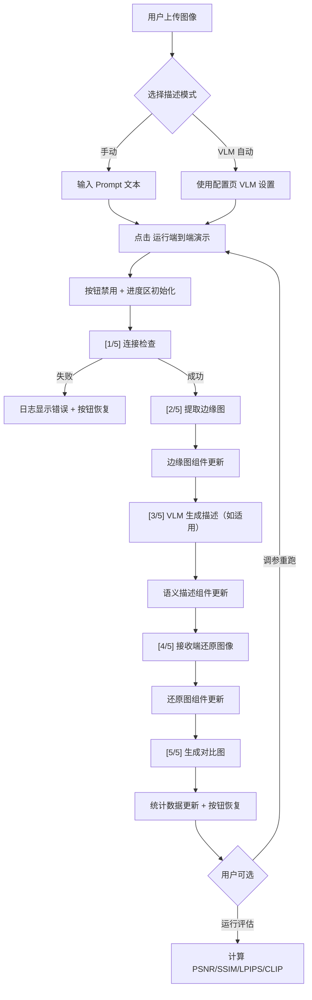
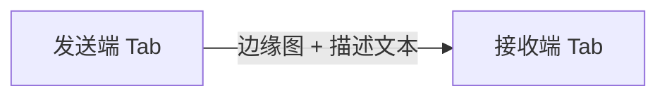

# GUI 设计方案：语义传输可视化界面

> 版本: 1.0
> 日期: 2026-03-29
> 对应任务: P2-25 / P2-26 / P2-27

## 1. 设计定位

### 1.1 目标受众

| 受众 | 核心诉求 | 使用频率 |
|------|----------|----------|
| 项目负责人 | 快速看到端到端效果，理解压缩比和质量指标 | 演示场景，低频 |
| 开发者（本团队） | 调参、调试、对比不同配置的还原质量 | 日常开发，高频 |
| 协作者/评审人 | 理解系统能力边界，评估技术路线可行性 | 评审场景，中频 |

### 1.2 设计原则

1. **信息密度优先** — 研究工具不是消费级产品，每一屏都要传递有效信息
2. **操作路径最短** — 最常用的"选图 → 运行 → 看结果"路径不超过 3 次点击
3. **状态永远可见** — 长时间运算（VLM 推理 10-20s、ComfyUI 生成 30-60s）必须有明确的进度反馈
4. **对比即结论** — 原图、边缘图、还原图始终并排展示，减少心智负担

### 1.3 美学方向

**技术仪表盘风格（Data-Dense Dashboard）** — 深色导航 + 浅色工作区，强调数据可读性。

不追求花哨的动效和装饰性元素。用 **清晰的层级、充足的留白、一致的对齐** 来体现专业感。

---

## 2. 配色方案

基于 ui-ux-pro-max 推荐的 B2B Professional 色板，适配 Gradio 主题系统：

### 2.1 主色板

| 角色 | 色值 | 用途 |
|------|------|------|
| Primary | `#0F172A` (Slate 900) | 页面标题、Tab 选中态文字 |
| Accent | `#0369A1` (Sky 700) | 主操作按钮、链接、活跃指示 |
| Accent Light | `#0EA5E9` (Sky 500) | 进度条、次要高亮 |
| Success | `#16A34A` (Green 600) | 连接成功、任务完成 |
| Warning | `#CA8A04` (Yellow 600) | 警告提示、耗时较长 |
| Error | `#DC2626` (Red 600) | 连接失败、运行错误 |
| Background | `#F8FAFC` (Slate 50) | 页面底色 |
| Surface | `#FFFFFF` | 卡片、输入区域底色 |
| Border | `#E2E8F0` (Slate 200) | 分割线、输入框边框 |
| Text Primary | `#0F172A` (Slate 900) | 正文 |
| Text Secondary | `#475569` (Slate 600) | 辅助说明、标签 |
| Text Muted | `#94A3B8` (Slate 400) | 占位符、禁用态 |

### 2.2 Gradio 主题映射

```
Gradio Theme Variable      → 设计色值
─────────────────────────────────────────
primary_hue                → Sky（#0369A1 系列）
neutral_hue                → Slate（#0F172A 系列）
body_background_fill       → #F8FAFC
block_background_fill      → #FFFFFF
block_border_color         → #E2E8F0
button_primary_background  → #0369A1
button_primary_text_color  → #FFFFFF
input_background_fill      → #FFFFFF
input_border_color         → #E2E8F0
```

---

## 3. 字体方案

| 用途 | 字体 | 回退 |
|------|------|------|
| 标题/标签 | System UI | -apple-system, "Segoe UI", sans-serif |
| 正文/描述 | System UI | 同上 |
| 代码/数据 | "Cascadia Code", "JetBrains Mono" | "Fira Code", monospace |

> 选择系统字体而非 Web 字体，理由：Gradio 运行在 localhost，无需加载外部资源；系统字体在中英文混排场景下渲染效果最佳。代码/数据字体使用等宽字体以对齐数值。

---

## 4. 整体布局

```
┌─────────────────────────────────────────────────────────┐
│  ◉ 语义传输系统  Semantic Transmission          v0.1.0  │  ← 顶部标题栏
├────────────┬────────────┬────────────┬──────────────────┤
│  ⚙ 配置   │  ▲ 发送端  │  ▼ 接收端  │  ◆ 端到端演示    │  ← Tab 导航
├────────────┴────────────┴────────────┴──────────────────┤
│                                                         │
│                    Tab 内容区域                           │
│                   （各 Tab 详见下文）                      │
│                                                         │
└─────────────────────────────────────────────────────────┘
```

### 4.1 全局规格

| 属性 | 规格 |
|------|------|
| 最大内容宽度 | 不限（Gradio 默认撑满） |
| 内边距 | 16px（Gradio 默认） |
| Tab 标签 | 中文 + 图标字符前缀（⚙ ▲ ▼ ◆） |
| 默认激活 Tab | 端到端演示（最常用入口） |

---

## 5. 各 Tab 详细设计

### 5.1 Tab 1: 配置（⚙ 配置）

**定位**：集中管理所有连接参数，启动前一次性配好。

```
┌─ ComfyUI 连接 ──────────────────────────────────────────┐
│                                                          │
│  ┌─ 发送端 ─────────────────┐ ┌─ 接收端 ─────────────────┐
│  │ 主机地址  [ 127.0.0.1  ] │ │ 主机地址  [ 127.0.0.1  ] │
│  │ 端口      [ 8188       ] │ │ 端口      [ 8188       ] │
│  │ [🔍 测试连接]            │ │ [🔍 测试连接]            │
│  │ 状态: ● 未检测           │ │ 状态: ● 未检测           │
│  └──────────────────────────┘ └──────────────────────────┘
│                                                          │
├─ VLM 模型 ──────────────────────────────────────────────┤
│                                                          │
│  模型名称  [ Qwen/Qwen2.5-VL-7B-Instruct            ]  │
│  本地路径  [ $MODEL_CACHE_DIR/Qwen/Qwen2.5-VL-7B... ]  │
│  状态: ● 未检测  [🔍 检查模型]                           │
│                                                          │
├─ 中继传输 ──────────────────────────────────────────────┤
│                                                          │
│  监听地址  [ 0.0.0.0 ]    监听端口  [ 9000 ]            │
│                                                          │
└──────────────────────────────────────────────────────────┘
```

#### 组件清单

| 组件 | Gradio 类型 | 说明 |
|------|------------|------|
| 发送端主机 | `gr.Textbox` | 默认 127.0.0.1 |
| 发送端端口 | `gr.Number` | 默认 8188，步长 1 |
| 接收端主机 | `gr.Textbox` | 默认 127.0.0.1 |
| 接收端端口 | `gr.Number` | 默认 8188 |
| 测试连接按钮 (x2) | `gr.Button` | variant="secondary"，触发连通性检查 |
| 连接状态 (x2) | `gr.Textbox` | 只读，显示 "● 已连接" / "● 连接失败: ..." |
| VLM 模型名称 | `gr.Textbox` | 默认 Qwen/Qwen2.5-VL-7B-Instruct |
| VLM 本地路径 | `gr.Textbox` | 默认读取 $MODEL_CACHE_DIR |
| 检查模型按钮 | `gr.Button` | variant="secondary"，检查模型文件是否存在 |
| 模型状态 | `gr.Textbox` | 只读 |
| 中继监听地址 | `gr.Textbox` | 默认 0.0.0.0 |
| 中继监听端口 | `gr.Number` | 默认 9000 |

#### 交互逻辑

- "测试连接"点击后按钮禁用并显示 loading，结果写入状态文本
- 连接成功：状态文字绿色 `● 已连接 (延迟: 23ms)`
- 连接失败：状态文字红色 `● 连接失败: Connection refused`
- 配置值通过 `gr.State` 在各 Tab 间共享，无需重复输入

---

### 5.2 Tab 2: 发送端（▲ 发送端）

**定位**：输入图像，提取边缘图 + 生成语义描述。

```
┌─ 输入 ──────────────────────── ─ 输出 ─────────────────┐
│                                                         │
│  ┌──────────────┐               ┌──────────────┐       │
│  │              │               │              │       │
│  │   原始图像    │               │   边缘图      │       │
│  │  (拖拽上传)   │               │  (Canny)     │       │
│  │              │               │              │       │
│  └──────────────┘               └──────────────┘       │
│                                                         │
│  描述模式:  ○ 手动输入  ● VLM 自动生成                    │
│                                                         │
│  ┌─ 手动模式 ──────────────────────────────────────────┐ │
│  │ Prompt [ A photo of a city skyline at sunset...   ] │ │
│  └─────────────────────────────────────────────────────┘ │
│                                                         │
│  ┌─ VLM 自动模式 ──────────────────────────────────────┐ │
│  │ (使用配置页的 VLM 模型设置)                          │ │
│  └─────────────────────────────────────────────────────┘ │
│                                                         │
│  [ ▶ 运行发送端 ]                                       │
│                                                         │
├─ 运行日志 ──────────────────────────────────────────────┤
│  [1/3] 检查 ComfyUI 连接... OK                          │
│  [2/3] 提取 Canny 边缘图... (12.3s)                     │
│  [3/3] VLM 生成语义描述... (18.7s)                       │
│  ──────────────────────────────                         │
│  完成！耗时 31.0s                                        │
├─ 语义描述结果 ──────────────────────────────────────────┤
│  A bustling cityscape at golden hour, with modern       │
│  skyscrapers reflecting warm orange sunlight...         │
│  ─────────────────────────                              │
│  描述长度: 247 字符 / 389 字节                           │
└─────────────────────────────────────────────────────────┘
```

#### 组件清单

| 组件 | Gradio 类型 | 说明 |
|------|------------|------|
| 原始图像 | `gr.Image` | type="filepath"，支持拖拽/点击上传 |
| 边缘图输出 | `gr.Image` | 只读，显示 Canny 提取结果 |
| 描述模式 | `gr.Radio` | choices=["手动输入", "VLM 自动生成"]，默认"手动输入" |
| Prompt 输入 | `gr.Textbox` | lines=3，手动模式下可见 |
| 运行按钮 | `gr.Button` | variant="primary"，文字 "▶ 运行发送端" |
| 运行日志 | `gr.Textbox` | 只读，lines=8，等宽字体，流式追加 |
| 语义描述结果 | `gr.Textbox` | 只读，lines=4，VLM 输出或手动 prompt 回显 |

#### 交互逻辑

- 描述模式切换时，手动 Prompt 输入框的 `visible` 状态联动
- 运行过程中按钮禁用，日志区流式更新（`yield` 逐行输出）
- VLM 自动模式下，先显示 "正在加载 VLM 模型..."，完成后显示生成的描述
- 运行完成后边缘图自动刷新显示

---

### 5.3 Tab 3: 接收端（▼ 接收端）

**定位**：从边缘图 + 语义描述还原图像。

```
┌─ 输入 ──────────────────────────────────────────────────┐
│                                                         │
│  ┌──────────────┐    语义描述:                           │
│  │              │    ┌───────────────────────────────┐  │
│  │   边缘图      │    │ A photo of a city skyline... │  │
│  │  (上传/来自    │    │                              │  │
│  │   发送端)     │    └───────────────────────────────┘  │
│  │              │                                       │
│  └──────────────┘    生成参数:                           │
│                       随机种子  [ 42          ] 🎲      │
│                                                         │
│  [ ▶ 运行接收端 ]                                       │
│                                                         │
├─ 输出 ──────────────────────────────────────────────────┤
│                                                         │
│  ┌──────────────────────────────────────────────────┐   │
│  │                                                  │   │
│  │                   还原图像                         │   │
│  │                  (生成结果)                        │   │
│  │                                                  │   │
│  └──────────────────────────────────────────────────┘   │
│                                                         │
├─ 运行日志 ──────────────────────────────────────────────┤
│  [1/2] 检查 ComfyUI 连接... OK                          │
│  [2/2] 接收端还原图像... (45.2s)                         │
│  ──────────────────────────────                         │
│  完成！还原图 1024x1024，耗时 45.2s                      │
└─────────────────────────────────────────────────────────┘
```

#### 组件清单

| 组件 | Gradio 类型 | 说明 |
|------|------------|------|
| 边缘图输入 | `gr.Image` | type="filepath"，支持上传或从发送端 Tab 传递 |
| 语义描述 | `gr.Textbox` | lines=4，可编辑，支持从发送端 Tab 传递 |
| 随机种子 | `gr.Number` | 默认空（随机），旁有 "🎲" 按钮随机生成 |
| 运行按钮 | `gr.Button` | variant="primary" |
| 还原图输出 | `gr.Image` | 只读，全宽展示 ComfyUI 生成结果 |
| 运行日志 | `gr.Textbox` | 只读，lines=6，流式更新 |

#### 交互逻辑

- 边缘图支持两种来源：直接上传，或从发送端 Tab 运行结果自动填充
- "🎲" 按钮生成随机种子（`random.randint(0, 2**32-1)`）
- 运行完成后，输出区全宽展示还原图像（边缘图已在上方输入区可见，无需重复）

---

### 5.4 Tab 4: 端到端演示（◆ 端到端演示）

**定位**：一键跑通完整流程，面向演示场景，信息最全面。

```
┌─ 输入配置 ────────────────────────────────────────────────────┐
│                                                               │
│  图像:  ┌──────────────┐   描述模式: ○ 手动  ● VLM 自动      │
│         │              │                                      │
│         │   原始图像    │   Prompt: [ (VLM 模式下自动生成)   ] │
│         │  (拖拽上传)   │                                      │
│         │              │   随机种子: [ 42         ] 🎲        │
│         └──────────────┘                                      │
│                                                               │
│  [ ▶ 运行端到端演示 ]                                         │
│                                                               │
├─ 流程进度 ────────────────────────────────────────────────────┤
│                                                               │
│  ■■■■■■■■■■■■■■■■□□□□□□□□□□□□□□  步骤 3/5: VLM 生成描述...   │
│                                                               │
│  ✓ [1/5] 连接检查        0.2s                                 │
│  ✓ [2/5] 提取边缘图     12.3s                                 │
│  ◉ [3/5] VLM 生成描述   进行中...                              │
│  ○ [4/5] 还原图像                                             │
│  ○ [5/5] 生成对比图                                           │
│                                                               │
├─ 结果展示 ────────────────────────────────────────────────────┤
│                                                               │
│  ┌──────────────┐ ┌──────────────┐ ┌──────────────┐          │
│  │              │ │              │ │              │          │
│  │   原始图像    │ │   边缘图      │ │   还原图      │          │
│  │              │ │  (Canny)     │ │ (生成结果)    │          │
│  │              │ │              │ │              │          │
│  └──────────────┘ └──────────────┘ └──────────────┘          │
│                                                               │
├─ 语义描述 ────────────────────────────────────────────────────┤
│  A bustling cityscape at golden hour, with modern             │
│  skyscrapers reflecting warm orange sunlight...               │
│                                                               │
├─ 传输统计 ────────────────────────────────────────────────────┤
│                                                               │
│  ┌─────────────────┬─────────────────┬───────────────────┐   │
│  │  原始图像大小     │  传输数据量       │  压缩比            │   │
│  │  2,340,567 B    │  89,234 B       │  26.23x           │   │
│  └─────────────────┴─────────────────┴───────────────────┘   │
│                                                               │
│  ┌─────────────┬──────────┬──────────┬──────────┐            │
│  │  边缘图大小   │ Prompt   │ 发送端    │ 接收端    │            │
│  │  85,120 B   │ 4,114 B  │ 12.3s   │ 45.2s   │            │
│  └─────────────┴──────────┴──────────┴──────────┘            │
│                                                               │
├─ 质量评估（可选展开）────────────────────────────────────────┤
│                                                               │
│  [📊 运行质量评估]                                            │
│                                                               │
│  ┌────────────┬────────────┬────────────┬────────────┐       │
│  │  PSNR      │  SSIM      │  LPIPS     │ CLIP Score │       │
│  │  18.42 dB  │  0.6231    │  0.3847    │  72.15     │       │
│  └────────────┴────────────┴────────────┴────────────┘       │
│                                                               │
├─ 运行日志 ────────────────────────────────────────────────────┤
│  [1/5] 检查 ComfyUI 连接...                                   │
│    发送端 (http://127.0.0.1:8188): OK                         │
│    接收端 (http://127.0.0.1:8188): OK                         │
│  [2/5] 发送端：提取 Canny 边缘图... (12.3s)                    │
│  [3/5] VLM 生成语义描述... (18.7s)                             │
│  [4/5] 接收端：还原图像... (45.2s)                             │
│  [5/5] 生成对比图... (0.1s)                                   │
│  ──────────────────────────────                               │
│  总耗时: 76.3s                                                │
└───────────────────────────────────────────────────────────────┘
```

#### 组件清单

| 组件 | Gradio 类型 | 说明 |
|------|------------|------|
| 原始图像 | `gr.Image` | type="filepath" |
| 描述模式 | `gr.Radio` | choices=["手动输入", "VLM 自动生成"] |
| Prompt 输入 | `gr.Textbox` | lines=3，手动模式下可见 |
| 随机种子 | `gr.Number` | 可选 |
| 运行按钮 | `gr.Button` | variant="primary"，最醒目的主操作 |
| 进度文本 | `gr.Textbox` | 只读，显示步骤列表（✓/◉/○ 前缀） |
| 原图展示 | `gr.Image` | 只读，回显输入 |
| 边缘图展示 | `gr.Image` | 只读 |
| 还原图展示 | `gr.Image` | 只读 |
| 语义描述 | `gr.Textbox` | 只读，lines=3 |
| 传输统计 | `gr.Dataframe` | 只读，展示压缩比等指标 |
| 质量评估按钮 | `gr.Button` | variant="secondary"，可选操作 |
| 质量指标 | `gr.Dataframe` | 只读，PSNR/SSIM/LPIPS/CLIP Score |
| 运行日志 | `gr.Textbox` | 只读，lines=10，等宽字体，`gr.Accordion` 包裹默认折叠 |

---

## 6. 交互流程

### 6.1 端到端演示流程（主路径）



### 6.2 发送端 → 接收端数据传递

用户可以在发送端 Tab 运行后，将结果传递到接收端 Tab 继续操作：



实现方式：通过 `gr.State` 存储发送端输出，接收端 Tab 的输入组件监听 State 变化并自动填充。或在发送端运行完成后，提供"发送到接收端"按钮，点击后切换 Tab 并填充数据。

**推荐方案**：使用显式的"发送到接收端"按钮，避免隐式数据流导致用户困惑。

---

## 7. 进度反馈设计

### 7.1 反馈层级

| 操作耗时 | 反馈方式 |
|----------|----------|
| < 1s | 无特殊反馈，直接显示结果 |
| 1-5s | 按钮显示 loading 状态（禁用 + 文字变化） |
| 5-30s | 日志区流式输出 + 步骤状态文本更新 |
| 30s+ | 上述 + 进度步骤列表（✓/◉/○ 标记各步骤状态） |

### 7.2 步骤状态符号

| 符号 | 含义 | 示例 |
|------|------|------|
| ○ | 等待中 | ○ [4/5] 还原图像 |
| ◉ | 进行中 | ◉ [3/5] VLM 生成描述... |
| ✓ | 已完成 | ✓ [2/5] 提取边缘图 12.3s |
| ✗ | 失败 | ✗ [1/5] 连接检查 — 发送端连接失败 |

### 7.3 流式输出实现

Gradio 的 generator 函数天然支持流式更新：

```
def run_e2e(image, mode, prompt, seed):
    log = ""

    log += "✓ [1/5] 连接检查 OK\n"
    yield {log_output: log, ...}       # 每步 yield 更新 UI

    edge = sender.process(image)
    log += f"✓ [2/5] 提取边缘图 {elapsed:.1f}s\n"
    yield {log_output: log, edge_output: edge, ...}

    ...
```

每完成一个步骤，通过 `yield` 推送中间结果到前端，实现：
- 日志逐行追加
- 图片逐步显示
- 统计数据逐步填充

---

## 8. 特殊交互细节

### 8.1 图像对比

端到端 Tab 的三张图（原图、边缘图、还原图）使用 `gr.Row` 等宽排列：

```python
with gr.Row():
    original_display = gr.Image(label="原始图像", scale=1)
    edge_display = gr.Image(label="边缘图 (Canny)", scale=1)
    restored_display = gr.Image(label="还原图像", scale=1)
```

三张图等高等宽，用户可直观对比。

### 8.2 连接状态指示

配置 Tab 的连接状态使用带颜色的文字前缀：

| 状态 | 显示 |
|------|------|
| 未检测 | `● 未检测` (灰色) |
| 检测中 | `● 检测中...` (蓝色) |
| 已连接 | `● 已连接` (绿色) |
| 连接失败 | `● 连接失败: <错误信息>` (红色) |

> 注：Gradio Textbox 不原生支持彩色文字。替代方案：使用 `gr.HTML` 或 `gr.Markdown` 组件渲染带颜色的状态文本。

### 8.3 按钮状态管理

长时间运行期间：

```
运行前:  [ ▶ 运行端到端演示 ]     (primary, 可点击)
运行中:  [ ⏳ 运行中...       ]     (disabled, 灰色)
完成后:  [ ▶ 运行端到端演示 ]     (primary, 恢复可点击)
出错后:  [ ▶ 运行端到端演示 ]     (primary, 恢复 + 日志显示错误)
```

使用 `gr.Button(interactive=False)` 在 generator 首个 yield 中禁用按钮，最后一个 yield 中恢复。

### 8.4 质量评估（延迟加载）

端到端 Tab 的质量评估为**可选操作**，不随主流程自动执行：

- 理由：LPIPS 和 CLIP Score 需要加载额外模型（~2GB VRAM），加重 GPU 负担
- 交互：主流程完成后显示"运行质量评估"按钮，点击后才加载模型并计算

---

## 9. 数据流架构

```mermaid
flowchart TB
    subgraph GUI["Gradio GUI"]
        Config["配置 Tab<br/>gr.State 存储配置"]
        Sender["发送端 Tab"]
        Receiver["接收端 Tab"]
        E2E["端到端 Tab"]
    end

    subgraph Backend["后端调用"]
        CC["ComfyUIClient"]
        CS["ComfyUISender"]
        CR["ComfyUIReceiver"]
        VLM["QwenVLSender"]
        Eval["evaluation 模块"]
    end

    Config -->|host/port| CC
    Config -->|model_path| VLM

    Sender -->|process()| CS
    Sender -->|describe()| VLM
    Receiver -->|process()| CR

    E2E -->|process()| CS
    E2E -->|describe()| VLM
    E2E -->|process()| CR
    E2E -->|compute_*()| Eval

    CS --> CC
    CR --> CC
```

### 9.1 共享状态

通过 `gr.State` 管理的全局状态：

| State 变量 | 类型 | 用途 |
|-----------|------|------|
| sender_config | `ComfyUIConfig` | 发送端连接配置 |
| receiver_config | `ComfyUIConfig` | 接收端连接配置 |
| vlm_model_name | `str` | VLM 模型名称 |
| vlm_model_path | `str` | VLM 本地路径 |
| last_edge_image | `str \| None` | 最近一次发送端产出的边缘图路径 |
| last_prompt | `str \| None` | 最近一次生成/输入的语义描述 |

---

## 10. Gradio 自定义 CSS

用于微调 Gradio 默认样式，保持专业感：

```css
/* 日志区使用等宽字体 */
.log-output textarea {
    font-family: "Cascadia Code", "JetBrains Mono", "Fira Code", monospace !important;
    font-size: 13px !important;
    line-height: 1.6 !important;
}

/* 统计数据表格紧凑化 */
.stats-table table {
    font-variant-numeric: tabular-nums;
}

/* 状态指示器 */
.status-connected { color: #16A34A; }
.status-error { color: #DC2626; }
.status-pending { color: #94A3B8; }
```

> 注：Gradio 的 `elem_classes` 参数可为组件添加自定义 CSS 类。

---

## 11. 错误处理

### 11.1 错误类型与展示

| 错误场景 | 展示位置 | 展示方式 |
|----------|----------|----------|
| ComfyUI 连接失败 | 日志区 + `gr.Warning` | 日志中标记 ✗，弹出 Warning toast |
| VLM 模型未找到 | 日志区 + `gr.Error` | 阻断流程，提示运行 download 命令 |
| ComfyUI 工作流执行失败 | 日志区 | 显示错误详情，建议检查 ComfyUI 控制台 |
| 图像格式不支持 | `gr.Warning` | 即时反馈，不进入运行流程 |

### 11.2 错误恢复

- 所有错误均恢复按钮可点击状态
- 错误信息在日志中持久展示，不自动清除
- 修正配置后可直接重新运行，无需刷新页面

---

## 12. 文件组织

```
src/semantic_transmission/
├── gui/
│   ├── __init__.py
│   ├── app.py            # Gradio app 入口、主题配置、Tab 组装
│   ├── tabs/
│   │   ├── __init__.py
│   │   ├── config.py     # 配置 Tab
│   │   ├── sender.py     # 发送端 Tab
│   │   ├── receiver.py   # 接收端 Tab
│   │   └── e2e.py        # 端到端 Tab
│   ├── theme.py          # Gradio 主题定义 + 自定义 CSS
│   └── state.py          # gr.State 管理、配置共享
├── cli/
│   ├── main.py           # 新增 gui 子命令
│   └── ...
```

CLI 入口扩展：

```
semantic-tx gui              # 启动 GUI（默认 127.0.0.1:7860）
semantic-tx gui --port 8080  # 指定端口
semantic-tx gui --share      # 生成公网分享链接
```

---

## 13. 实现优先级

按 Phase 5 的 3 个任务拆分：

### P2-25: 基础框架

- Gradio 依赖安装与版本锁定
- 主题定义（配色、字体）
- App 骨架（4 个 Tab 占位）
- 配置 Tab 完整实现（连接测试可用）
- `semantic-tx gui` 子命令注册

### P2-26: 发送端与接收端

- 发送端 Tab：图像上传 → 边缘提取 → VLM 描述
- 接收端 Tab：边缘图 + 描述 → 还原图像
- 流式日志输出
- Tab 间数据传递

### P2-27: 端到端与日志

- 端到端 Tab 完整流程
- 步骤进度展示（✓/◉/○）
- 传输统计面板
- 质量评估集成（可选）
- 错误处理与恢复

---

## 14. 设计决策记录

| 决策 | 理由 |
|------|------|
| 使用 Gradio 而非 Streamlit | 项目已在 workflow 中规划使用 Gradio；Gradio 对图像类任务的组件支持更好（Image、Gallery）；generator 函数天然支持流式输出 |
| 默认激活端到端 Tab | 最常用场景，"上传图片 → 看结果"路径最短 |
| 质量评估不自动运行 | LPIPS/CLIP 加载模型占 GPU 显存，避免与 ComfyUI 争抢资源 |
| 配置集中在独立 Tab | 避免每个 Tab 都重复配置 host/port，减少输入冗余 |
| 使用系统字体 | localhost 应用无需加载 Web 字体；中英文混排渲染一致性最好 |
| 日志区用等宽字体 | 数值对齐、耗时对齐，提升可读性 |
| 显式"发送到接收端"按钮 | 比隐式 State 联动更符合用户心智模型，操作可预期 |
| 不实现深色模式 | 预研项目，一种主题足够；浅色背景在投影演示时可读性更好 |
