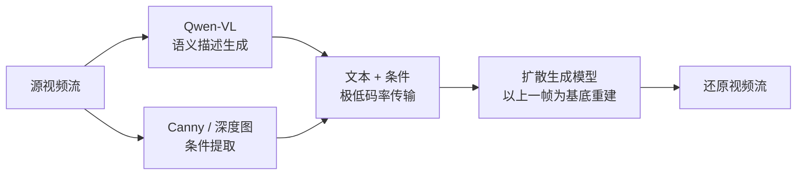

# 项目总览

> 面向项目负责人的快速概览，可在 2 分钟内读完。

## 项目目标

用 AI 生成模型实现视频的**语义级压缩传输**：发送端将视频帧压缩为文本描述和轻量条件信息（边缘图、深度图），接收端从这些语义信息还原出视觉内容。

当前目标已升级为**输入视频流、输出生成视频流**的程序，逐步逼近替代无人车远程遥操作画面所需的延迟、清晰度与帧间一致性。极低码率（<0.01 bpp）传输是核心约束。

## 技术路线

**核心思路**：用语义描述替代像素级编码，传输的是"场景含义"而非"像素数据"；接收端以上一帧生成图像为基底，结合语义与条件逐帧重建，维持帧间一致性。

## 阶段进展

| 阶段 | 目标 | 状态 | 关键成果 |
|------|------|------|----------|
| 阶段一：调研与选型 | 论文综述、技术路线确定 | ✅ 已完成 | 6 篇论文综述、6 个开源项目评估、模型选型报告 |
| 阶段二：原型搭建 | 打通端到端流程，脱离 ComfyUI | ✅ 已完成 | 单机/双机 Demo、VLM 集成、Diffusers 本地推理、质量评估、CLI/GUI、配置体系统一 |
| 阶段三：视频流语义传输 | 视频流→视频流，逼近遥控可用 | 🔄 进行中 | 技术方案与 6 天冲刺规划已定，PoC 进行中 |
| 阶段四：准实时遥控替代 | 尽量替代远程遥控视频画面 | 待启动 | — |

## 当前进展（阶段三）

阶段二已全部完成并合入 main（接收端脱离 ComfyUI 改用 Diffusers 本地推理、配置体系与模型加载器统一）。阶段三视频流主线已完成技术调研与规划，进入 6 天开发冲刺：

- **保底版（合同硬目标）**：离线 视频→逐帧生成→视频 闭环，复用现有 Z-Image-Turbo 管道，加视频编解码即可
- **目标版**：帧生成主线调研 FLUX.2-klein-9B（Qwen-Image-Edit-2511 对照）；实时帧率靠 DLSS 式分层（关键帧大模型生成 + RIFE 插帧 + 超分）
- 详见 [视频流技术方案](research/2026-06-21-video-stream-tech-scout.md) 与 [6 天冲刺规划](superpowers/specs/2026-06-21-video-stream-6day-plan-design.md)

## 关键成果（已交付）

1. **端到端 Demo 可运行**：输入图像，自动生成语义描述 + 边缘图，还原出风格一致的图像
2. **接收端脱离 ComfyUI**：改用 Diffusers 本地推理（Z-Image-Turbo GGUF Q8_0 + ControlNet Union 分组件加载）
3. **VLM 集成完成**：Qwen2.5-VL-7B 本地推理，自动生成结构化场景描述
4. **双机演示就绪**：通过 TCP 网络（SocketRelay）传输，两台机器分别运行发送端和接收端
5. **质量评估体系**：支持 PSNR/SSIM/LPIPS/CLIP Score 四类指标的批量计算和报告生成
6. **配置与加载统一**：ProjectConfig + config.toml（4 层优先级）+ ModelLoader 抽象，换模型/调参改配置即可
7. **CLI 统一入口**：`semantic-tx` 命令涵盖发送、接收、演示、检查、下载、GUI 启动
8. **Gradio 可视化界面**：`semantic-tx gui` 提供配置、发送端/接收端操作、一键端到端演示和质量评估

## 后续计划

- **短期（6 天冲刺）**：保底版 视频→视频 闭环（合同达标）+ klein/Qwen 主线裁决 + 目标版分层 PoC
- **中期（7 月）**：目标版工程化——流式 I/O、深度图条件、Qwen3-VL 升级、压短关键帧周期、双机实时演示
- **远期（≥8 月）**：准实时遥控替代——关键帧周期压到目标 KPI、相机实时流端到端、生产化部署

## 风险与挑战

| 风险 | 影响 | 缓解措施 |
|------|------|----------|
| klein-9B 无 ControlNet，结构条件遵循度未验证 | 边缘/深度引导可能失效 | 第一周 H1 PoC（IoU 判据），不达标回退 Qwen-Image-Edit-2511 |
| 9B 模型逐帧生成约 1-2s/帧，远不及遥控帧率 | 实时性不足 | DLSS 式分层：关键帧大模型生成 + 轻量插帧/超分补帧率 |
| klein-9B + Qwen3 文本编码器显存（24GB 偏紧） | 单卡可能跑不动 | fp8 量化；保底版用现有 Z-Image 不依赖 klein；工作站到位后扩容 |
| 视频帧间一致性 | 还原视频闪烁/漂移 | 以上一帧为基底 + 周期性关键帧重置 |
