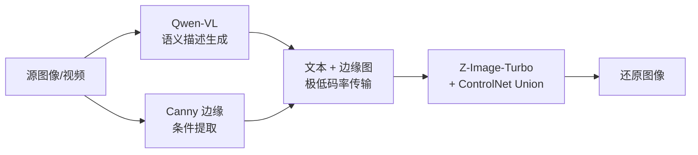

# 项目总览

> 面向项目负责人的快速概览，可在 2 分钟内读完。

## 项目目标

用 AI 生成模型实现视频的**语义级压缩传输**：发送端将视频帧压缩为文本描述和轻量条件信息，接收端从这些语义信息还原出视觉内容。目标是在极低码率（<0.01 bpp）下实现可接受质量的视频传输。

## 技术路线

**核心思路**：用语义描述替代像素级编码，传输的是"场景含义"而非"像素数据"。

## 阶段进展

| 阶段 | 目标 | 状态 | 关键成果 |
|------|------|------|----------|
| 阶段一：调研与选型 | 论文综述、技术路线确定 | ✅ 已完成 | 6 篇论文综述、6 个开源项目评估、模型选型报告 |
| 阶段二：ComfyUI API 原型 | 打通端到端流程 | 🔄 进行中 | 单机 Demo、双机演示、VLM 集成、质量评估模块、完整文档体系 |
| 阶段三：方案迭代优化 | 模型升级、视频级扩展 | 待启动 | — |
| 阶段四：工程化 | 脱离 ComfyUI，独立部署 | 待启动 | — |

## 阶段二详细进展

阶段二通过 structured-workflow 管理，共 27 个任务，当前完成 19 个（70%）：

| 子阶段 | 内容 | 状态 |
|--------|------|------|
| Phase 0：项目骨架 | Python 项目结构、抽象接口、ComfyUI 连通性 | ✅ 4/4 |
| Phase 1：工作流拆分与语义压缩 | 工作流转换、发送/接收端实现、VLM 集成 | ✅ 8/8 |
| Phase 2：中继传输与双机演示 | TCP 传输协议、双机脚本 | ✅ 2/2 |
| Phase 3：质量评估与文档重构 | 评估模块、文档体系 | 🔄 5/6 |
| Phase 4：CLI 正规化 | click 框架、统一入口 | ⬜ 0/4 |
| Phase 5：GUI 开发 | Gradio 界面 | ⬜ 0/3 |

## 关键成果

1. **端到端 Demo 可运行**：输入任意图像，自动生成语义描述 + 边缘图，还原出风格一致的图像
2. **VLM 集成完成**：Qwen2.5-VL-7B 本地推理，自动生成结构化场景描述
3. **双机演示就绪**：通过 TCP 网络传输，两台机器分别运行发送端和接收端
4. **质量评估体系**：支持 PSNR/SSIM/LPIPS/CLIP Score 四类指标的批量计算和报告生成
5. **完整文档体系**：开发指南、架构文档、使用指南、演示手册、协作规范

## 后续计划

- **近期**（阶段二收尾）：CLI 正规化（统一命令入口）、Gradio GUI 开发
- **中期**（阶段三）：深度图条件融合、Wan2.x 视频生成集成、多组对比实验
- **远期**（阶段四）：脱离 ComfyUI 独立部署、模型量化加速、演示系统构建

## 风险与挑战

| 风险 | 影响 | 缓解措施 |
|------|------|----------|
| 还原质量受限于单条件（仅 Canny 边缘） | 细节丢失、颜色偏差 | 阶段三增加 Depth 条件融合 |
| VLM 描述不够精准 | 还原图与原图语义偏离 | 优化 prompt 模板，评估更大参数模型 |
| 视频帧间一致性 | 还原视频闪烁/不连贯 | 阶段三集成 Wan2.x 视频生成 |
| GPU 资源需求高 | 部署成本 | 模型量化、INT4 推理 |
