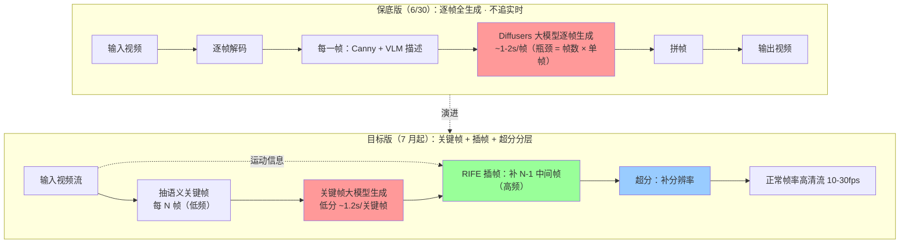
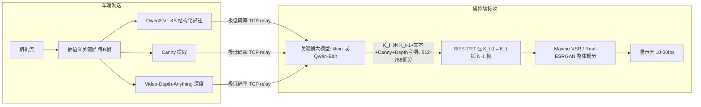

# 视频流语义传输·9 天开发技术方案

> 工作分支 feature/video-stream-pipeline | 编制 2026-06-21 | 调研附录见 2026-06-21-video-stream-tech-scout-appendix.md
> 上游决策：见 docs/research/2026-06-reevaluation.md（2026-06 综合评估）
> 已与负责人确认：保底优先+架构预留实时 / 内部预研(klein-9B 许可可用) / klein-9B 主线+Qwen-Edit 对照

# 语义传输项目 9 天开发技术方案（综合四线调研裁决）

> 编制日期 2026-06-21 | 交付截止 6/30（M1 保底版）/ 7 月起迭代（目标版）
> 核实口径：标「✅官方」= HuggingFace/GitHub/NVIDIA 官方文档直接佐证；「⚠️二手」= 社区/博客，数量级可信、绝对值须我方在 RTX 5090 实测；「❓需 PoC」= 无现成证据，必须第一周实验证伪。

---

## 0. 结论先行（负责人 5 分钟版）

1. **6/30 保底版能按期交付，且不应升级任何模型** —— 用现有 `DiffusersReceiver`(Z-Image+ControlNet) + `relay` + `batch_processor`，加一层 video↔frames 编解码即可闭环，klein/Qwen3-VL 升级全部推迟到 7 月。**升级与保底闭环解耦，是按期交付的关键决策。**

2. **klein-9B 主线存在一条已确认的硬伤，不是速度而是结构条件通道** —— 已**官方确认**（[Fun-ControlNet discussion #3](https://huggingface.co/alibaba-pai/FLUX.2-dev-Fun-Controlnet-Union/discussions/3)）："This only works with Flux.2 Dev. There is no ControlNet support for Klein at this time." 即合同要求的"Canny+depth 引导"在 klein 上**没有现成 ControlNet 通道**，只能赌"把 Canny/depth 当参考图塞进 `image=[...]`"，此路**无任何证据支撑（❓需 PoC）**。**第一周第一优先级必须验证它，并同时在 Qwen-Image-Edit-2511+InstantX ControlNet（结构条件是其原生强项）上跑对照，用数据而非赌注定主线。**

3. **实时性矛盾用分层化解，但要厘清一个物理约束**：插帧几乎免费（RIFE-TRT 毫秒级），可把输出做到 10–30fps 平滑流；但**真实场景信息更新速率 = 关键帧周期（现状目标 ~1–1.5s），插帧消除不了**。遥操作语境下这意味着"画面流畅但对突发障碍有约 1s 反应滞后"——**目标版真正的 KPI 是压短关键帧周期，不是堆 fps**。

4. **DLSS 本体接不进相机流**（绑渲染管线 + 强依赖 motion vector，连 2026 的 DLSS 5 也一样），但其"低分辨率生成 + AI 超分 + AI 插帧"分层思路 100% 可借鉴；NVIDIA 已把面向视频流的部分做成官方 SDK：**Optical Flow SDK(NvOFFRUC) 插帧 + Maxine VSR 超分**，CUDA 可用，作目标版加速候选。

---

## 1. 技术事实更新（相对上一轮 2026-06 评估的增量）

### 1.1 klein-9B 实操接入要点（✅官方）
- Pipeline `Flux2KleinPipeline`（多参考加速变体 `Flux2KleinKVPipeline`，KV-cache 缓存参考图 KV）；**4 步蒸馏、`guidance_scale=1.0`**；文本编码器 8B Qwen3（自身占显存）。多参考 = 一个 list 传 `image=[init1, init2, ...]`，**无 per-image 权重、无 base/reference 角色区分**，角色只能靠 prompt 工程（"the first image..."）。来源：[klein-9B 模型卡](https://huggingface.co/black-forest-labs/FLUX.2-klein-9B)、[multi-image discussion #6](https://huggingface.co/black-forest-labs/FLUX.2-klein-9B/discussions/6)。
- 量化：**官方 `klein-9b-fp8`**（5090 24GB 起步首选，无须 GGUF 牺牲质量）+ `unsloth/...GGUF`（小卡用）。
- **速度有矛盾，须实测**：官方模型卡宣称端到端 **"as low as under a second"**（✅官方，5090 上很可能成立）；二手博客给 5090 ~1.2–2.0s（⚠️二手）。**规划基线保守取 ~1.5s/关键帧，但 PoC 若验到 <1s 则关键帧周期账全面改善——这是全盘最关键变量。**

### 1.2 多参考遵循度证据状态（❓需 PoC，主线成败点）
- klein 模型卡/官方 flux2 README **无任何 Canny/depth/ControlNet 字样**；其 `image=` 通道是为"参考图编辑/多图融合"训练的，**非为"线稿/深度→图"结构条件训练**。
- 唯一的 FLUX.2 ControlNet（`alibaba-pai/FLUX.2-dev-Fun-Controlnet-Union`，支持 Canny/HED/Depth/Pose/MLSD/Scribble，自动判类型，`controlnet_conditioning_scale` 0.65–0.80）**官方明确"只对 Dev，Klein 无 ControlNet 支持"**（✅官方确认，[discussion #3](https://huggingface.co/alibaba-pai/FLUX.2-dev-Fun-Controlnet-Union/discussions/3)）。Dev 是 50 步非蒸馏，慢一个量级，不能当 klein 实时主线。
- **裁决见第 2 节。**

### 1.3 Qwen VL 版本核准（✅官方）
- **负责人记的"Qwen3.6"版本号记串了**。Qwen3.6 真实存在（2026-04，27B/35B-A3B，统一早融合多模态，Apache-2.0），但它是**统一线 LLM 而非专用 VL**，视觉 grounding/视频对齐工具链反不如专用线成熟。
- **图生文应选专用线 Qwen3-VL**（✅官方）：4B-Instruct 与 8B-Instruct 同于 2025-10-15 发布，**Apache-2.0**（比 FLUX.2 非商用线干净），4.44B dense、原生 256K（可扩 1M）、Interleaved-MRoPE/DeepStack/文本时间戳对齐，官方"Advanced Spatial Perception + 2D/3D grounding"正对遥操作空间描述需求。**需 transformers ≥ 4.57.0**（唯一硬依赖变更）。量化：**AWQ/GGUF-Q4 已有现成社区权重**（注意 "int4" 非 vLLM 合法值，用 AWQ/GPTQ/FP8；4B-Q4≈2.5GB）。来源：[Qwen3-VL GitHub](https://github.com/QwenLM/Qwen3-VL)、[Qwen3-VL-4B-Instruct 卡](https://huggingface.co/Qwen/Qwen3-VL-4B-Instruct)、[transformers v4.57.3 doc](https://huggingface.co/docs/transformers/v4.57.3/model_doc/qwen3_vl)。

### 1.4 DLSS 边界 + 开源插帧/超分选型（✅官方/✅第三方）
- DLSS FG/MFG 绑渲染管线、强依赖引擎 motion vector+depth，**不能喂摄像头/视频**；DLSS 5 仍要 motion vector，同样不行。
- 官方视频流替代：**NvOFFRUC（Optical Flow SDK 4.0+）取任意视频两连续帧输出插帧、位置可任意指定、NVOFA 硬件引擎、明确"any video content"**（✅官方，[NVOFA FRUC doc](https://docs.nvidia.com/video-technologies/optical-flow-sdk/nvfruc-programming-guide/index.html)）；超分 **Maxine VSR**（含时间一致性）。
- 开源落地主选：**插帧 RIFE 4.6 + TensorRT FP16**（1080p 远超实时，4090 已可流畅 frame-doubling，⚠️第三方）；大运动兜底 FILM（离线，~2.5fps）。**超分**：低分辨率生成→小倍率整体超分，Real-ESRGAN（小输入实时但逐帧会闪）/ Maxine VSR / BasicVSR++（时间一致性更好但慢）。

### 1.5 深度估计选型（✅官方，补线4缺口）
- **Video Depth Anything（CVPR 2025 Highlight，2025-01）**：基于 Depth-Anything-V2 + 时空头 + 时间一致性损失，**最小模型实时 30fps、专为视频时间一致性设计、关键帧策略支持超长视频**。来源：[arXiv:2501.12375](https://arxiv.org/abs/2501.12375)、[GitHub](https://github.com/DepthAnything/Video-Depth-Anything)。
- **裁决**：车端深度图提取**用 Video-Depth-Anything 小模型（时间一致，避免逐帧深度抖动→生成抖动）**；保底版可先用单帧 Depth-Anything-V2 跑通，目标版换视频版。深度图与 Canny 同走 `metadata`/条件通道传输（深度图压缩码率见第 6 节 PoC）。

---

## 2. klein-9B 主线可行性裁决

### 2.1 赌注的证据状态（明确）
合同的"一致性核心 = 上一帧 + Canny + depth 引导 klein 生成当前帧"依赖一个**目前零证据**的假设：把 Canny/depth 图当普通参考图塞进 `image=[...]`，能产生 ControlNet 级结构遵循。

- 反方硬证据：①klein 无 ControlNet（✅官方否认）；②klein `image=` 通道非为结构条件训练；③无任何官方/社区评测显示"线稿/深度参考→结构遵循"。
- **判定：这是主线第一红线。** 不在第一周证伪/证实，后面全盘架构都悬空。

### 2.2 第一周 PoC 验证清单（klein 主线）
| # | 假设 | 做法 | 指标 | 通过线 / 回退 |
|---|---|---|---|---|
| **H1**（最高） | klein 把 Canny/depth 当参考图能实现结构约束 | 固定一帧，`LocalCannyExtractor` 出 Canny + Video-Depth-Anything 出 depth 塞 `image=[...]`，prompt 描述场景 | 生成图 vs 输入 Canny 的**边缘 IoU**；目视几何吻合 | 通过：IoU>0.4 且目视跟随 → 保 klein 主线。**不通过（高概率）→ 切 Qwen-Image-Edit-2511 + InstantX ControlNet-Union** |
| **H2** | 5090 单帧 ≤1.5s（含验官方"<1s"） | `klein-9b-fp8`，4 步，512²/768²/1024² 三档，排除冷加载计时 | 稳态 ms/帧 | 通过 ≤1.5s；若验到 <1s 则关键帧周期账全面上修 |
| **H3** | "上一帧 latent-init(img2img,strength 0.3–0.6)+当前帧 Canny/depth" 帧间一致 | 连续 8–16 真实帧逐帧生成 | 相邻帧 **LPIPS/SSIM**（复用 evaluation/）+ 目视 flicker | 通过：平滑无抖 → 保；不通过：叠 Consistency LoRA 重测，仍不行→Qwen-Edit-2511（官方主打 anti-drift） |

> 注：klein 9B 支持 img2img(strength)，但 4B 实测有"strength 不生效"坑（[krita #2392](https://github.com/Acly/krita-ai-diffusion/issues/2392)），9B 须实测确认 strength 真起作用。"上一帧 latent-init + 额外参考图"组合非开箱即用，需在 diffusers 自拼。

### 2.3 回退线（写死，避免临场纠结）
- **H1 不通过 = 切 Qwen-Image-Edit-2511**：`QwenImageEditPlusPipeline`（多图 list）+ **`InstantX/Qwen-Image-ControlNet-Union`**（原生 canny/soft-edge/depth/pose 四合一，`scale` 0.8–1.0）。代价：40 步非蒸馏、慢 klein 一个量级；红利：①结构条件原生可控 ②官方 anti-drift/几何推理一致性 ③Apache-2.0 更宽松 ④双通道（VL 语义 + VAE 外观）控制粒度更细。**遗留 PoC**：InstantX ControlNet 官方只声明 Qwen-Image 基座，"ControlNet + Edit-2511 联用"diffusers 内须实测（❓需 PoC）。来源：[Qwen-Image-Edit-2511 卡](https://huggingface.co/Qwen/Qwen-Image-Edit-2511)、[InstantX Qwen-Image-ControlNet-Union](https://huggingface.co/InstantX/Qwen-Image-ControlNet-Union)。
- **强烈建议第一周 klein 与 Qwen+InstantX 在 H1 上各跑半天并行**，这是性价比最高的风险对冲，不要单赌 klein。

---

## 3. 保底版架构（6/30 必达）

定位：**离线 video-in → 逐帧语义传输 → video-out 的最小闭环**，验证"压缩-传输-还原"链路，**不追实时**。**冻结现有模型（Z-Image-Turbo+ControlNet 接收 / Qwen2.5-VL-7B-int4 发送），零升级。**

### 3.0 架构演进总览（保底逐帧 → 目标分层）

保底版与目标版**共用同一条语义传输骨架**，差异只在「生成节奏」：保底版每帧都过大模型（简单、达标合同，但慢）；目标版让大模型只产**低频关键帧**，中间帧与分辨率交给**高频轻量补偿**（插帧 + 超分），即「DLSS 式分层」。

**演进要点：**

- **不变的骨架**：video↔frames 编解码、Canny、VLM 描述、Diffusers 生成、relay 传输、质量评估全部复用。保底版预留的空 `frame_postprocess` 钩子（见 §3.1）就是目标版插帧/超分的插入点，演进无需重构。
- **被替换/新增**：每帧大模型生成 → 大模型只产**关键帧** + **RIFE 插帧**补中间帧（解决**帧率**轴）+ **超分**补分辨率（解决**清晰度**轴，因为关键帧故意低分生成省算力）。插帧与超分是两条不同的轴，不可互相替代。
- **瓶颈转移**：保底版瓶颈 = 每帧都过大模型（总帧数 × 1-2s，逐帧实时不可行，差 10-20 倍）；目标版瓶颈收敛为**单一的关键帧周期**（详见 §4.2），输出 fps 靠插帧随意拉高。
- **物理边界（安全硬约束）**：插帧/超分能拉高输出帧率与清晰度，但**消除不了语义反应滞后 ≈ 关键帧周期**——突发障碍物在两关键帧之间出现时插帧无法"无中生有"（详见 §4.3）。唯一解是**压短关键帧周期**，这也是目标版的核心 KPI，而非提高插帧倍率。

### 3.1 模块清单与现成可复用代码
| 模块 | 现成可复用 | 6/30 需新增（小） |
|---|---|---|
| **视频解码→帧** | — | `cv2.VideoCapture` 抽帧，写 `video_io.py`（~30 行） |
| **每帧条件提取** | ✅ `LocalCannyExtractor`（`sender/local_condition_extractor.py`） | 可选叠 Depth-Anything-V2 单帧深度 |
| **每帧图生文** | ✅ `qwen_vl_sender.py`（Qwen2.5-VL，已就绪） | 无 |
| **传输** | ✅ `relay.py`（`SocketRelaySender/Receiver` + `TransmissionPacket` 长度前缀，含 edge_image+text+metadata） | 保底版可直接函数内调用，跳过 socket；双机演示再启 relay |
| **逐帧还原** | ✅ `DiffusersReceiver.process()/process_batch()`（模型常驻、不反复加载，`receiver/base.py` 的批处理循环含逐帧计时/失败兜底） | 无 |
| **帧序列→视频** | — | `cv2.VideoWriter` 拼帧，写进 `video_io.py`（~20 行） |
| **后处理钩子** | — | **预留可插拔 `frame_postprocess(keyframes)→stream`，保底版默认实现 = 直接拼接**（目标版替换为 RIFE+超分，避免重构） |
| **批量编排/统计** | ✅ `batch_processor.py`（`BatchResult`/`SampleResult`/发现/计时/JSON） | 复用即可 |
| **质量评估** | ✅ `evaluation/`（PSNR/SSIM/LPIPS/CLIP）+ `scripts/evaluate.py` | 复用，逐帧+整段统计 |

**核心判断：保底版 ≈ 现有 batch 图像管道 + 两段 video↔frames 编解码 + 一个空后处理钩子。新增代码 <100 行，无新模型、无新依赖。**

### 3.2 明确推迟的实时特性
流式 I/O、关键帧+插帧分层、超分、深度时间一致性、klein/Qwen3-VL 升级、relay 流式背压——**全部推迟到目标版**。保底版输出"逐帧生成视频"，帧率不达标可接受（合同只要闭环跑通）。

### 3.3 M1 验收口径
输入一段真实行车视频（如 8–16s）→ 输出同长度生成视频；evaluation 出逐帧+整段 PSNR/SSIM/LPIPS/CLIP；单机与双机(relay)各演示一次；记录端到端耗时（允许慢）。**通过 = 闭环跑通 + 有量化指标 + 可演示。**

---

## 4. 目标版架构（7 月起）

### 4.1 分层流水线

### 4.2 延迟预算（RTX 5090，关键帧 ~1.2s，N=8）
| 环节 | 单位成本 | 说明 |
|---|---|---|
| 关键帧大模型生成 | **~1.2s/关键帧**（PoC 后定，可能 <1s） | **唯一真瓶颈**，512–768 低分生成是最有效杠杆 |
| RIFE-TRT 插帧 | <5ms/帧（≈0） | 远超实时，非瓶颈 |
| 超分（小输入） | ~15ms/帧 | 低分→2–3x，避免直接 1080p→4K（仅 6–10fps） |
| **有效平滑帧率** | **~6–8fps（N=8）/ ~13–16fps（N=16）** | = N / 关键帧周期 |

**最大瓶颈明确：大模型关键帧周期。** 输出 fps 靠插帧随便拉，但**语义/反应延迟 = 关键帧周期 ≈ 1.2s，插帧无法消除**。目标版核心 KPI = 压短关键帧周期（更激进蒸馏 + 更低分辨率 + TensorRT，未来多卡）。N=8 为甜区，运动剧烈动态降 N、静止升 N。

### 4.3 一致性与失效模式
- 插帧相对逐帧扩散是**净一致性收益**（中间帧由两端点光流形变，强相关，远稳于独立采样的"呼吸/闪烁"）——这是 KeyVID/DiffuseSlide 两段式范式被广泛采用的原因。
- 失效：大运动/遮挡 ghosting（动态降 N、FILM 离线兜底）；**新物体突现插帧无法"无中生有"——遥操作安全硬约束，必须靠压短关键帧周期，不能用大 N 掩盖**；Real-ESRGAN 逐帧闪烁（换 Maxine/BasicVSR++ 时间一致 VSR）。

---

## 5. 9 天开发计划草案

> M1 = 6/30 保底版可演示。原则：**保底闭环优先占满前段，PoC 并行不阻塞闭环；模型升级全部排在 M1 之后。**

| 天 | 里程碑/任务 | 依赖 | 风险 | 可并行 |
|---|---|---|---|---|
| **D1 (6/21)** | 起 feature branch；写 `video_io.py`(解码/编码) + 空 `frame_postprocess` 钩子；跑通"视频→帧→现有 batch 管道→帧→视频"骨架（小分辨率短片） | 现有 DiffusersReceiver/batch | 低 | ‖ **PoC-H1 klein vs Qwen+InstantX 各跑半天**（独立环境，不碰主线代码） |
| **D2** | 保底闭环接 `relay` 双机路径；evaluation 逐帧+整段接好 | D1、relay | relay 流式（保底用逐包即可） | ‖ PoC-H2 klein 速度三档计时；下 Video-Depth-Anything 权重 |
| **D3** | **保底版功能完成**：单机+双机均能 video→video 出指标；修边界(尺寸 16/16 倍数、失败帧兜底已在 base) | D1–D2 | 中：长视频显存/IO | ‖ PoC-H3 帧间一致性(8–16 帧 LPIPS) |
| **D4** | 保底版联调+真实行车视频测试+演示脚本+测试报告(`docs/test-reports/`) | D3 | 中 | ‖ 汇总 PoC 数据，**D4 末做主线裁决会**（klein vs Qwen） |
| **D5 (≈6/25)** | **缓冲/打磨日**：修 D4 暴露问题、补 CLI 子命令(video demo)、ruff 通过、PR | D4 | — | — |
| **— M1 关 (目标 6/26–6/27 提前达成保底版可演示，留 6/28–6/30 余量) —** | | | | |
| **D6** | 目标版起步：按裁决落地关键帧主线(klein 或 Qwen-Edit)，512–768 低分常驻推理；定义"关键帧序列+时间戳"输出契约替换空钩子 | M1、PoC 裁决 | 高：主线若 Qwen 则慢 | ‖ RIFE-TRT 环境(引擎编译 5–10min/分辨率) |
| **D7** | 接 RIFE-TRT 插帧进 `frame_postprocess`；端到端 keyframe+插帧出平滑流；量插帧一致性 | D6、RIFE | 中：TRT 工程 | ‖ Maxine VSR / Real-ESRGAN 超分选型实测 |
| **D8** | 接超分；流式 I/O 雏形；端到端延迟/帧率/一致性测量；N 参数扫(4/8/16) | D6–D7 | 中 | ‖ Qwen3-VL-4B 升级 spike(transformers 4.57，独立分支) |
| **D9 (6/30)** | 目标版 PoC 演示(非生产)；写 7 月迭代计划+本轮综合报告；M1 兜底已稳交 | 全部 | — | — |

**关键并行项**：所有 PoC（H1/H2/H3）、模型权重下载、TensorRT 引擎编译、Qwen3-VL 升级 spike 都与保底闭环**物理解耦**，可在独立分支/环境并行，不占用 M1 关键路径。

**M1 验收口径（写死）**：见 §3.3。**只要 6/30 前保底版 video→video 闭环可演示且有指标，M1 即达成**，目标版进度（D6–D9）属增量、不达标不影响合同保底。

---

## 6. 风险与第一周 PoC 清单（按优先级 + 通过/回退判据）

| 优先级 | 风险/假设 | 验证做法 | 通过判据 | 回退 |
|---|---|---|---|---|
| **P0** | **klein 结构遵循度**（Canny/depth 当参考图）—— 已确认无 ControlNet，赌注无证据 | H1：边缘 IoU + 目视（klein 与 Qwen+InstantX 并行） | IoU>0.4 且几何跟随 | **切 Qwen-Image-Edit-2511 + InstantX ControlNet-Union**（结构条件原生强项 + 官方 anti-drift） |
| **P0** | **保底闭环按期**（最高交付风险） | D1–D3 跑通 video→video | 6/27 前出可演示闭环 | 砍双机/砍深度，只保单机 Canny 闭环 |
| **P1** | **klein 速度**（官方"<1s" vs 二手"1.5–2s"） | H2：fp8 4 步三分辨率计时，排冷加载 | ≤1.5s/帧（512–768） | 降分辨率+TRT；速度不达则更靠插帧大 N |
| **P1** | **帧间一致性**（逐帧扩散闪烁） | H3：8–16 帧 LPIPS/SSIM | 相邻帧平滑无明显抖 | Consistency LoRA → 仍不行切 Qwen-Edit-2511 |
| **P1** | **插帧实时性**（目标版帧率） | RIFE-TRT 在目标分辨率实测 fps（TRT 引擎需 5–10min 编译/分辨率） | 1080p ≥30fps（远超关键帧需求即可） | NvOFFRUC 硬件插帧；大运动段 FILM 离线 |
| **P2** | **深度图压缩码率**（合同"极低码率"） | 量化深度图为低位 PNG/有损编码后传输，测 KB/帧 + 还原质量 | 深度图增量码率 << 原始帧、不破坏"极低码率" | 降深度图分辨率/位深；或仅关键帧传深度、插帧不传 |
| **P2** | **Qwen3-VL 升级依赖** | transformers 4.57 升级 spike(独立分支)，4B-AWQ 出结构化描述 | 不破现有 CI、描述质量≥2.5-VL | 维持 Qwen2.5-VL-7B（保底已用），升级延后 |
| **P3** | **车端实时预处理**（VLM 输入分辨率） | 输入帧 cap 512²–768² | 预处理 <100ms | 强制 cap，VLM 只跑低频关键帧 |

---

## 需负责人拍板的三点
1. **klein 结构硬伤（§1.2/§2）**：建议 PoC 前就同步，避免第一周末才暴露；并预批"H1 不过即切 Qwen-Edit-2511"的回退授权。
2. **Qwen 版本（§1.3）**："Qwen3.6"实为统一线 LLM；图生文确定用专用线 **Qwen3-VL-4B-Instruct（Apache-2.0）**，且**仅排进 7 月目标版**、不进 6/30 保底版。
3. **目标版 KPI 口径（§0.3/§4.2）**：明确以"关键帧周期"而非"输出 fps"为核心 KPI，并接受"画面流畅但语义有 ~1s 反应滞后"这一插帧无法消除的物理约束。

---

### 关键来源（核实级别见正文）
- klein：[klein-9B 卡](https://huggingface.co/black-forest-labs/FLUX.2-klein-9B) · [multi-image #6](https://huggingface.co/black-forest-labs/FLUX.2-klein-9B/discussions/6) · [fp8](https://huggingface.co/black-forest-labs/FLUX.2-klein-9b-fp8) · [Fun-ControlNet 卡](https://huggingface.co/alibaba-pai/FLUX.2-dev-Fun-Controlnet-Union) · [**Klein 无 ControlNet 官方确认 #3**](https://huggingface.co/alibaba-pai/FLUX.2-dev-Fun-Controlnet-Union/discussions/3) · [krita strength #2392](https://github.com/Acly/krita-ai-diffusion/issues/2392)
- Qwen：[Qwen3-VL GitHub](https://github.com/QwenLM/Qwen3-VL) · [Qwen3-VL-4B-Instruct 卡](https://huggingface.co/Qwen/Qwen3-VL-4B-Instruct) · [transformers v4.57.3 doc](https://huggingface.co/docs/transformers/v4.57.3/model_doc/qwen3_vl) · [Qwen-Image-Edit-2511](https://huggingface.co/Qwen/Qwen-Image-Edit-2511) · [InstantX Qwen-Image-ControlNet-Union](https://huggingface.co/InstantX/Qwen-Image-ControlNet-Union)
- DLSS/插帧/超分：[DLSS4 MFG](https://www.nvidia.com/en-us/geforce/news/dlss4-multi-frame-generation-ai-innovations/) · [Streamline DLSS_G 编程指南](https://github.com/NVIDIA-RTX/Streamline/blob/main/docs/ProgrammingGuideDLSS_G.md) · [**NVOFA FRUC 文档(任意视频)**](https://docs.nvidia.com/video-technologies/optical-flow-sdk/nvfruc-programming-guide/index.html) · [Maxine VSR](https://docs.nvidia.com/maxine/vfx/latest/Filters/VideoSuperResolution.html) · [RIFE GitHub](https://github.com/hzwer/ECCV2022-RIFE) · [ComfyUI-Rife-TensorRT](https://github.com/yuvraj108c/ComfyUI-Rife-Tensorrt)
- 深度/两段式：[**Video Depth Anything CVPR2025**](https://arxiv.org/abs/2501.12375) · [Video-Depth-Anything GitHub](https://github.com/DepthAnything/Video-Depth-Anything) · [KeyVID](https://arxiv.org/html/2504.09656) · [DiffuseSlide](https://arxiv.org/html/2506.01454v1)

**待我方 RTX 5090 实测的全盘最关键变量**：klein 4 步在 512–768 + fp8 + 常驻下的真实 s/帧（决定关键帧周期，验官方"<1s"是否成立）；RIFE-TRT 目标分辨率 fps；Maxine VSR 吞吐/质量；深度图极低码率压缩后的还原影响。