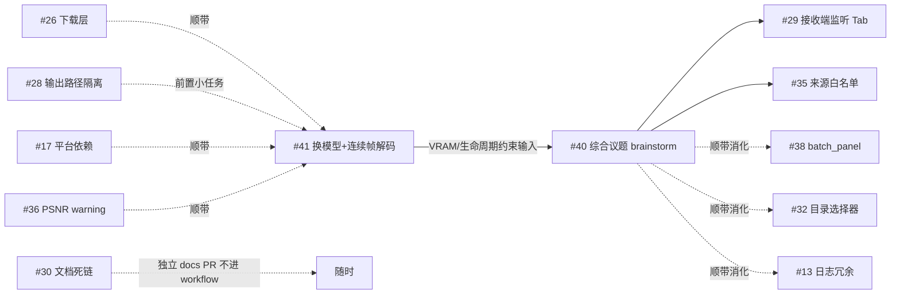

# 2026-06 综合评估·六线调研原始结果（附录）

> 本文件是 docs/research/2026-06-reevaluation.md 的溯源附录，
> 内容为评估 workflow 六条调研线 agent 的原始输出，未经综合裁决，结论以主报告为准。

---

# 线 1：接收端文生图模型生态

# 接收端文生图模型再选型调研报告

调研日期：2026-06-10。所有"已核实"条目均经当日 WebSearch/WebFetch 确认；标注"推测/待验证"的条目请以实测为准。

---

## 一、FLUX.2-klein-9B 深查

### 1.1 基本事实（已核实）

| 项目 | 结论 |
|------|------|
| 是否存在 | **存在**。Black Forest Labs 于 **2026-01-15/16** 发布 FLUX.2 [klein] 家族（4B + 9B），官方博客与 HF 均可查（[BFL 官方博客](https://bfl.ai/blog/flux2-klein-towards-interactive-visual-intelligence)、[MarkTechPost 2026-01-16](https://www.marktechpost.com/2026/01/16/black-forest-labs-releases-flux-2-klein-compact-flow-models-for-interactive-visual-intelligence/)、[HF 模型页](https://huggingface.co/black-forest-labs/FLUX.2-klein-9B)） |
| 架构/参数 | 9B rectified flow transformer + **8B Qwen3 文本编码器**（注意：文本编码器几乎与主干一样大） |
| 许可证 | **9B 系列为 FLUX.2-dev Non-Commercial License（非商用）**；只有 4B 系列是 Apache 2.0（[HF README](https://huggingface.co/black-forest-labs/FLUX.2-klein-9B)） |
| 编辑/参考能力 | **原生统一生成+编辑+多参考图（multi-reference）于单一架构**，即类似 FLUX.1 Kontext 的能力且支持多张参考图；另有 9b-kv 变体用 KV-cache 加速多参考编辑（[FLUX.2-klein-9b-kv](https://huggingface.co/black-forest-labs/FLUX.2-klein-9b-kv)） |
| 蒸馏/步数 | step-distilled 至 **4 步**；另有未蒸馏的 klein-base-9B（50 步） |
| 速度 | 官方称端到端 <0.5s（现代硬件）；RTX 4090 上蒸馏版实测约 1–2s/张（[Clore 指南](https://docs.clore.ai/guides/image-generation/flux2-klein)） |
| 显存 | BF16 全精度约 **29GB，24GB 放不下**；FP8 约 14–16GB；GGUF 量化见下（[willitrunai VRAM 指南](https://willitrunai.com/blog/flux-2-klein-9b-vram-requirements)） |
| Diffusers | 官方 `Flux2KleinPipeline`，**diffusers ≥0.37.1 已收录**（0.36 没有，[issue #13087](https://github.com/huggingface/diffusers/issues/13087)；[Flux2 文档页](https://huggingface.co/docs/diffusers/api/pipelines/flux2)）。项目当前 0.37 基本满足，建议升至 0.38（2026-05-01 发布） |
| 量化 | [unsloth/FLUX.2-klein-9B-GGUF](https://huggingface.co/unsloth/FLUX.2-klein-9B-GGUF)：Q8_0 约 **9.98GB**、Q4_K_M 约 5.9GB（仅 transformer，不含 Qwen3-8B 文本编码器）；官方另有 fp8 变体 |
| 国内可获取性 | **ModelScope 有官方仓库**：[modelscope.cn/models/black-forest-labs/FLUX.2-klein-9B](https://modelscope.cn/models/black-forest-labs/FLUX.2-klein-9B)，且 DiffSynth-Studio 已支持训练/推理 |
| ControlNet | **关键短板：klein 没有可用 ControlNet**。alibaba-pai 的 [FLUX.2-dev-Fun-Controlnet-Union](https://huggingface.co/alibaba-pai/FLUX.2-dev-Fun-Controlnet-Union)（含 Canny）**只兼容 FLUX.2-dev（32B），不兼容 klein**（[官方 discussion #3](https://huggingface.co/alibaba-pai/FLUX.2-dev-Fun-Controlnet-Union/discussions/3) 已核实） |

### 1.2 24GB 可行性测算（推测，需实测）

Q8_0 transformer（~10GB）+ Qwen3-8B 文本编码器 4bit（~5GB）或 CPU offload + VAE ≈ 16–17GB，**24GB 可行**；GGUF 经 `from_single_file + GGUFQuantizationConfig` 加载（与现有 Z-Image GGUF 加载方式同构，[diffusers GGUF 文档](https://huggingface.co/docs/diffusers/en/quantization/gguf)）。注意 GGUF 不兼容 `enable_sequential_cpu_offload()`，须用 `enable_model_cpu_offload()`。

### 1.3 与 Z-Image-Turbo 逐项对比

| 维度 | Z-Image-Turbo（现状） | FLUX.2-klein-9B |
|------|----------------------|-----------------|
| 参数/步数 | 6B / 9 步 | 9B / 4 步（蒸馏） |
| 编辑/参考图 | **无**（Z-Image-Edit 至今未发布，见下） | **原生多参考编辑**，契合"上一帧作参考" |
| Canny 结构控制 | **成熟**（Z-Image-Turbo-Fun-Controlnet-Union，项目在用） | **无 ControlNet**；只能把边缘图当参考图+指令，效果未经验证 |
| 许可证 | Apache 2.0 | 非商用（9B）；4B 才是 Apache 2.0 |
| 显存 | Q8 全家 <24GB 宽裕 | Q8 + 量化 TE 约 16–17GB，可行但更紧 |
| Diffusers | 成熟（项目已落地） | 0.37.1+ 官方支持，GGUF 路径待验证 |
| 国内获取 | ModelScope 一方支持 | ModelScope 官方仓库齐全 |
| 速度 | 项目实测端到端 ~60s/帧 | 纯生成 1–2s 级（4090）；端到端含 VLM/传输另计 |

**结论：组员"更快"的说法已核实属实，且 klein 确有编辑/多参考能力；但它恰好缺项目最依赖的 ControlNet 边缘控制生态，且 9B 许可证非商用——这两点是硬伤。**

---

## 二、横向扫描（2025H2–2026H1，满足"编辑/参考 + 结构控制"约束的候选）

| 候选 | 编辑/参考 | 边缘结构控制 | 速度 | 24GB 可行性 | Diffusers | 国内获取 | 许可 |
|------|----------|-------------|------|------------|-----------|---------|------|
| **Qwen-Image-Edit-2511**（20B MMDiT，2025-12） | ★ 多图输入（1–3 张，"人+景"等），一致性较 2509 大幅增强（[HF](https://huggingface.co/Qwen/Qwen-Image-Edit-2511)） | ★ **原生支持把边缘图/深度图/关键点图直接作为输入图**（2509 起，[官方 repo](https://github.com/QwenLM/Qwen-Image/blob/main/Qwen-Image-Edit-2509.md)）；另有 InstantX/DiffSynth ControlNet 系（T2I 侧） | Lightning 4 步 LoRA（[lightx2v](https://huggingface.co/lightx2v/Qwen-Image-Edit-2511-Lightning)），≈10x 提速 | GGUF Q4_K_M ~12GB + TE offload，可行（[unsloth GGUF](https://huggingface.co/unsloth/Qwen-Image-Edit-2511-GGUF)；GGUF 加载方式见 [issue #12891](https://github.com/huggingface/diffusers/issues/12891)） | `QwenImageEditPlusPipeline`（需较新 diffusers） | ★ 阿里出品，ModelScope 一方 | **Apache 2.0** |
| **FLUX.2-klein-9B**（2026-01） | ★ 原生多参考 | ✗ 无 ControlNet | ★★ 4 步最快 | 可行（量化） | 0.37.1+ | ModelScope 有 | 非商用 |
| **FLUX.2-dev**（32B，2025-11） | ★ 原生多参考编辑 | ★ alibaba-pai Fun-Controlnet-Union（含 Canny，2602 版更新） | 中（可配 Turbo） | 勉强（Q4+4bit TE 极限压榨，体验差）→ 实质是 **64GB 档** | 0.36+ | ModelScope 有 | 非商用 |
| **FLUX.1 Kontext dev**（12B，2025-06） | ★ 单参考图编辑 | ✗ 官方无；社区方案零散 | 中（28 步级） | 可行（GGUF） | 成熟 | 可获取 | 非商用（推测沿用 FLUX.1-dev 条款，未逐条核实） |
| **HiDream-E1.1 / O1-Image**（8B，O1 为 2026-05 MIT 开源） | ★ 指令编辑+多参考个性化 | 部分（O1 支持 skeleton/layout conditioning，**无 Canny ControlNet**，[GitHub](https://github.com/HiDream-ai/HiDream-O1-Image)） | O1-Dev 28 步 | E1.1 需 ~48GB；O1 FP8 ~10GB | **O1 暂无 diffusers，自带推理代码** | 未核实 ModelScope | O1 为 **MIT** |
| **SD3.5 Large** | ✗ 无编辑/参考变体 | ★ 官方 Canny ControlNet | 慢 | 可行 | 成熟 | 可获取 | Community License |
| **Lumina 系**（2B Apache） | 弱 | 弱 | — | 宽裕 | 一般 | 可获取 | Apache 2.0 |
| **Z-Image-Edit / Omni-Base** | **截至 2026-06-10 仍未发布**（官方 repo 标注 "To be released"，[GitHub](https://github.com/Tongyi-MAI/Z-Image)；Z-Image-Base 已于 2026-01-28 发布） | — | — | — | — | — | — |

编辑能力口碑参考：Artificial Analysis 编辑榜开源权重前三为 HunyuanImage 3.0 Instruct（80B MoE，超出本项目硬件）、HiDream-O1-Image、FLUX.2 klein 9B（[榜单](https://artificialanalysis.ai/image/leaderboard/editing)）；Qwen-Image-Edit-2511 在社区横评中以**结构一致性、多图一致性**见长（[Diffusion Doodles 横评](https://medium.com/diffusion-doodles/model-rundown-z-image-turbo-qwen-image-2512-edit-2511-flux-2-dev-fc787f5e87ad)）。

---

## 三、推荐结论

### 24GB 主推荐：Qwen-Image-Edit-2511（GGUF Q4/Q5 + Lightning 4 步 LoRA）

**理由：**
1. **唯一同时原生满足两个硬约束的模型**："上一帧 + Canny 边缘图 + 文本指令"可直接作为 1–3 张输入图喂给模型，边缘图是官方训练过的原生条件，无需额外 ControlNet 组件；多图一致性正是 2511 的主打改进——与"帧间一致性"需求完全对口。
2. Apache 2.0，无商用顾虑；阿里出品，ModelScope 一方托管，国内获取最顺。
3. Diffusers 路径与现有代码同构（GGUF transformer `from_single_file` + pipeline 组装），迁移成本可控；发送端已在用 Qwen2.5-VL，技术栈同源。

**风险：**
- 20B 模型在 24GB 上只能跑 Q4/Q5 量化，量化质量损失需实测对比（Q8 ~21GB 仅 transformer，不现实）；
- Lightning LoRA 叠加 GGUF 量化 transformer 在 diffusers 下的兼容性需要 PoC 验证（ComfyUI 社区已验证可行，diffusers 路径证据较少，**待验证**）；
- 推理速度：4 步 Lightning 在 RTX 5090 上预计 5–15s/帧（**推测，无公开基准**），慢于 klein 但远快于现状 60s。

**24GB 备选：FLUX.2-klein-9B（Q8_0）**——若 PoC 证明"边缘图作为参考图之一"能达到可接受的结构保持，它是速度上限最高的选项（4 步、1–2s 级）。但非商用许可 + 无 ControlNet 两个硬伤使其只适合做技术验证分支，不适合作主线。

### 64GB+ 升级路径

1. **首选：FLUX.2-dev（32B）+ alibaba-pai Fun-Controlnet-Union（Canny）**——同时拥有原生多参考编辑与成熟 Canny ControlNet，质量天花板最高；需接受非商用许可。
2. **次选：Qwen-Image-Edit-2511 FP8/BF16 全精度**——与 24GB 主推荐同一技术栈，升级零迁移，仅消除量化损失。
3. **观察项：HiDream-O1-Image（8B，MIT）**——2026-05 刚发布，榜单表现亮眼且许可最宽松，但无 diffusers 支持、无 Canny 控制，暂不可落地，建议 1–2 个季度后复查。

### 留在 Z-Image-Turbo 的机会成本

- **直接阻塞规划中的核心功能**："以生成序列上一帧为参考"在 Z-Image-Turbo 上无法实现——它是纯 T2I，官方 Z-Image-Edit 自 2025-11 预告至今（7 个月）仍未发布，且社区已开始质疑是否还会开源（[HF discussion #156](https://huggingface.co/Tongyi-MAI/Z-Image-Turbo/discussions/132)）。
- 收益是零迁移成本 + 已验证的 ControlNet Canny 链路 + 24GB 最宽裕的显存余量。
- **建议折中**：主线迁移到 Qwen-Image-Edit-2511 做"前帧参考 + 边缘控制"PoC，同时保留 Z-Image-Turbo 路径作为首帧生成/回退方案（两者 GGUF 加载代码同构，可共存于现有 `DiffusersReceiver` 架构下按配置切换）；若 Z-Image-Edit 后续发布，再评估回归同家族的可能。

---

**主要来源**：[BFL klein 发布博客](https://bfl.ai/blog/flux2-klein-towards-interactive-visual-intelligence) · [FLUX.2-klein-9B HF](https://huggingface.co/black-forest-labs/FLUX.2-klein-9B) · [klein ModelScope](https://modelscope.cn/models/black-forest-labs/FLUX.2-klein-9B) · [Fun-Controlnet-Union 兼容性 discussion](https://huggingface.co/alibaba-pai/FLUX.2-dev-Fun-Controlnet-Union/discussions/3) · [unsloth klein GGUF](https://huggingface.co/unsloth/FLUX.2-klein-9B-GGUF) · [Qwen-Image-Edit-2511 HF](https://huggingface.co/Qwen/Qwen-Image-Edit-2511) · [Qwen-Image-Edit-2509 原生控制图说明](https://github.com/QwenLM/Qwen-Image/blob/main/Qwen-Image-Edit-2509.md) · [2511 Lightning LoRA](https://huggingface.co/lightx2v/Qwen-Image-Edit-2511-Lightning) · [2511 GGUF + diffusers 加载 issue](https://github.com/huggingface/diffusers/issues/12891) · [Z-Image 官方 repo（Edit 未发布）](https://github.com/Tongyi-MAI/Z-Image) · [HiDream-O1-Image](https://github.com/HiDream-ai/HiDream-O1-Image) · [AA 编辑榜](https://artificialanalysis.ai/image/leaderboard/editing) · [diffusers GGUF 文档](https://huggingface.co/docs/diffusers/en/quantization/gguf) · [klein VRAM 指南](https://willitrunai.com/blog/flux-2-klein-9b-vram-requirements)

---

# 线 2：连续帧解码策略

# 连续帧解码策略调研报告："上一帧 + 边缘图"双参考生成

调研日期：2026-06-10 | 约束：Diffusers 本地推理、双端 RTX 5090 24GB、国内网络（hf-mirror / ModelScope）

---

## 0. 结论速览（TL;DR)

| 路径 | 工程落地成本（当前栈） | 一致性收益 | 24GB 可行性 | 推荐度 |
|------|----------------------|-----------|------------|--------|
| 1. img2img 链式（Z-Image-Turbo 原生） | **极低**（零新模型，Diffusers 已有 `ZImageImg2ImgPipeline`） | 中（有漂移，可用关键帧重置抑制） | 已验证可行 | **首选，立即做** |
| 3b. Qwen-Image-Edit-2509/2511 双参考 | 中（换 20B 模型，GGUF 量化） | 高（原生"多图输入 + ControlNet 条件"，2511 明确宣称缓解漂移） | Q4~Q6 GGUF 可行 | **次选/升级路线** |
| 3a. FLUX.1 Kontext / FLUX.2-klein | 中高（新模型 + license 受限 + 边缘条件支持不明） | 高（迭代编辑漂移最慢之一） | 需 FP8/量化，紧张 | 观望 |
| 2. IP-Adapter / reference-only | 高（Z-Image 无现成适配器，需自训或换底模） | 低（传语义/风格，不传像素级布局） | — | 不推荐 |
| 4. 视频扩散 I2V（Wan2.2-TI2V-5B 等） | 高（架构大改） | 最高（原生时序建模） | 5B 可行但慢 | 另线调研 |

**核心推荐：两阶段走。Phase A 在现有 Z-Image-Turbo + ControlNet Union 栈上实现 img2img 链式 + 周期性关键帧重置（约一周工作量，零新模型下载）；Phase B 试点 Qwen-Image-Edit-2511（GGUF），它是目前唯一"原生同时支持多参考图 + ControlNet 类草图条件 + 官方宣称缓解漂移 + ModelScope 国内可得 + Diffusers 官方 pipeline"的模型，与本项目"上一帧 + 边缘图"需求几乎一一对应。**

---

## 1. 路径一：img2img 链式（上一帧作 init latent + 边缘 ControlNet）

### 1.1 现状与落地成本【已核实】

- Diffusers 0.38 已收录 **`ZImageImg2ImgPipeline`**（`image` + `strength` 参数，strength 默认 0.6，9 步 + guidance_scale 0.0 的官方示例与当前项目 Turbo 配置一致），另有 `ZImageInpaintPipeline`。来源：[Diffusers Z-Image 官方文档](https://huggingface.co/docs/diffusers/api/pipelines/z_image)
- **注意：官方没有 "ControlNet + img2img" 组合 pipeline**。当前项目用的 alibaba-pai ControlNet Union 是注入式控制层；要同时做"上一帧噪声初始化 + 边缘控制"，需自写组合逻辑——本质上只需：用 VAE 编码上一帧 → 按 strength 截断 sigma 调度并加噪作为 `latents` 初值 → 其余沿用现有 ControlNet 推理路径。参考 `ZImageImg2ImgPipeline` 源码的 `prepare_latents` 实现，预计 50~100 行改动。社区已有 unified control + img2img 的整合先例（[elismasilva/z-image-control-turbo-unified](https://huggingface.co/elismasilva/z-image-control-turbo-unified-8-steps-v2)，[alibaba-pai ControlNet Union 2.1](https://huggingface.co/alibaba-pai/Z-Image-Turbo-Fun-Controlnet-Union-2.1)），可借鉴。
- 额外收益：strength<1 时去噪步数按比例缩短（如 strength 0.5 × 9 步 ≈ 实跑 4~5 步），**单帧推理时间反而下降**。

### 1.2 漂移问题与缓解【已核实】

链式 img2img 的本质问题在学界称为 **drifting / exposure bias（误差累积）**：每帧的输出误差成为下帧的输入误差，表现为色偏、过饱和、细节涂抹、结构崩坏。FramePack 论文（[arXiv 2504.12626](https://arxiv.org/abs/2504.12626)）系统总结了"遗忘-漂移两难"：增强对历史的记忆会加剧误差传播，打断误差传播又会削弱时序依赖。

已验证的缓解手段（按工程成本从低到高）：

1. **周期性关键帧重置（最适合本项目）**：每 N 帧由发送端传一张真实关键帧（JPEG/WebP），接收端强制以真实帧重置链条，把漂移截断在 N 帧窗口内。这与语义传输"周期性发关键帧"的系统设计天然契合，且 N 可作为"码率 vs 一致性"的调节旋钮。
2. **strength 调参与调度**：strength 越低越贴上一帧但越快累积模糊；越高越清晰但帧间跳变大。经验区间 0.4~0.7，可对"距上次关键帧的帧数"做递增调度。
3. **色彩校正**：每帧对关键帧做直方图匹配/色彩统计对齐，抑制最常见的色偏漂移（AnimateDiff/Deforum 社区标准做法，成本几行代码）。
4. **锚帧条件 / 历史加噪**：对历史 latent 注入噪声打断误差传播；anti-drifting 采样（先定终点帧再反向填充）等——这些来自 FramePack 等论文，需改采样器，成本较高（[arXiv 2504.12626](https://arxiv.org/html/2504.12626v3)）。
5. 边缘 ControlNet 本身就是强漂移抑制器：每帧的 Canny 来自真实视频帧，结构不会随链条漂移——漂移主要剩纹理/色彩维度。这是本项目相对一般 img2img 链的天然优势。

---

## 2. 路径二：IP-Adapter / reference-only 注入

【已核实】Diffusers 的 IP-Adapter 体系（`load_ip_adapter()`）支持 SD 系列、SD3、FLUX 等（[Diffusers IP-Adapter 文档](https://huggingface.co/docs/diffusers/using-diffusers/ip_adapter)）；reference-only 是免训练双路扩散技巧，主要停留在 SD1.5/SDXL UNet 时代（[DeepWiki: IP-Adapter System](https://deepwiki.com/huggingface/diffusers/6.2-ip-adapter-system)）。

**对本项目的判断（不推荐）：**

- **Z-Image 没有官方或社区 IP-Adapter**【已核实：搜索未发现；Z-Image 生态目前只有 ControlNet Union】。要用就得换底模（FLUX.1-dev 12B，24GB 上比 Z-Image 重）或自训适配器。
- 原理性短板：IP-Adapter 通过 CLIP 图像 embedding 注入，传递的是**语义/风格/身份**，不是像素级空间布局。对"下一帧应该和上一帧在哪些像素上连续"这一帧间一致性需求，收益有限——它能稳住色调和风格漂移，但稳不住物体位置与细节。学界共识用法是"ControlNet 管结构 + IP-Adapter 管风格"（[Mercity 综述](https://www.mercity.ai/blog-post/understanding-and-training-ip-adapters-for-diffusion-models/)）。
- 若只想要"风格不漂"，用第 1 节的直方图匹配 + 关键帧重置可以更便宜地拿到大部分收益。

---

## 3. 路径三：编辑型模型多图输入（最有潜力的中期路线）

### 3.1 Qwen-Image-Edit-2509 / 2511 —— 与需求匹配度最高【已核实】

- **2509 版两大特性恰好命中本需求**：① 多图输入（1~3 张，"人物+场景"式组合）；② **原生支持 ControlNet 类图像条件（关键点、草图/sketch）**，无需外挂 ControlNet。即可以直接喂"上一帧（参考图）+ 当前帧边缘图（条件图）+ 文本指令"三元输入。来源：[Qwen-Image-Edit-2509 模型卡](https://huggingface.co/Qwen/Qwen-Image-Edit-2509)、[QwenLM/Qwen-Image](https://github.com/QwenLM/Qwen-Image)
- **2511 版（2025-11 发布）官方明确宣称"mitigate image drift"+ 大幅强化一致性**，并集成社区 LoRA；HuggingFace 与 **ModelScope 双平台发布**（国内可得）。来源：[Qwen 官方博客](https://qwen.ai/blog?id=qwen-image-edit-2511)、[HF 模型卡](https://huggingface.co/Qwen/Qwen-Image-Edit-2511)
- **Diffusers 官方支持**：`QwenImageEditPlusPipeline`【已核实】。
- **24GB 可行性**：transformer 20B，社区 GGUF 量化齐全——Q4_K_M 13.1GB / Q6_K 16.8GB / Q8_0 21.8GB（[QuantStack GGUF 仓库](https://huggingface.co/QuantStack/Qwen-Image-Edit-2509-GGUF)）。注意文本编码器是 **Qwen2.5-VL-7B——与本项目发送端 VLM 同款**，有部署协同潜力。建议 Q5/Q6 + 文本编码器量化/offload，与当前 Z-Image GGUF 分组件加载方案同构。低 quant（Q2/Q4）有伪影报告（[社区 discussion](https://huggingface.co/QuantStack/Qwen-Image-Edit-2509-GGUF/discussions/6)）。
- 速度：单图 30s~数分钟（取决于量化与步数；可叠 Lightning LoRA 提速）（[aimodels.fyi 概览](https://www.aimodels.fyi/models/huggingFace/qwen-image-edit-2509-gguf-quantstack)）。与现状 60s/帧 同量级。
- license：Qwen-Image 系列为 Apache-2.0【高置信但未逐字核对模型卡，建议落地前确认】。
- **风险/未核实点**：sketch 条件的训练分布是否覆盖 Canny 风格边缘图需实测；"上一帧作参考图"在编辑范式下是否产生"复制上一帧"倾向（运动幅度被低估）需实测。

### 3.2 FLUX.1 Kontext dev【已核实】

- 12B 指令编辑模型，序列拼接式 in-context 输入，论文用 AuraFace embedding 余弦相似度量化"多轮编辑漂移"，证明其漂移显著慢于竞品，但 10~15 轮连续编辑后仍会累积伪影（[arXiv 2506.15742](https://arxiv.org/abs/2506.15742)、[模型卡](https://huggingface.co/black-forest-labs/FLUX.1-Kontext-dev)）。
- 短板：FP8 约需 20GB（[NVIDIA 量化博客](https://developer.nvidia.com/blog/optimizing-flux-1-kontext-for-image-editing-with-low-precision-quantization/)）；**FLUX.1 [dev] Non-Commercial License**；官方范式偏单参考图，"参考图+边缘图"双条件无原生支持。已被后续 FLUX.2-klein 和 Qwen-Edit-2511 实质超越，不建议新增投入。

### 3.3 FLUX.2-klein 4B/9B（组员提议）【已核实】

- 2026-01-15 发布，生成+编辑统一架构，**支持多参考图编辑**，4 步蒸馏推理（9B 蒸馏版约 2s/图、4B 约 1.2s/图，官方硬件数据），另有 KV-cache 变体 `FLUX.2-klein-9b-kv` 加速多参考编辑。来源：[ComfyUI 官方博客](https://blog.comfy.org/p/flux2-klein-4b-fast-local-image-editing)、[HF 模型卡](https://huggingface.co/black-forest-labs/FLUX.2-klein-9B)
- 显存：9B BF16 约 29GB（**超 24GB**）；蒸馏版 FP8 约 19.6GB 可塞进 24GB 但叠加 Qwen3-8B 文本编码器后非常紧张；4B 蒸馏版仅 ~8.4GB，余量充足。**ModelScope 已上架**（`modelscope download --model black-forest-labs/FLUX.2-klein-9B`，含 FP8 版），国内可得（[ModelScope 介绍页](https://www.modelscope.cn/learn/4998)）。Diffusers 支持 `Flux2KleinPipeline`。
- **关键疑点**：① 模型卡与 ComfyUI 博客均**未提及 ControlNet/边缘图结构条件**——"把 Canny 图当一张参考图喂入并用指令要求遵循"理论可行但属于【推测，需实测验证】；② 9B 模型卡标注 **FLUX Non-Commercial License**【已核实自 HF 模型卡】，对后续工程化是合规风险。组员说的"更快"属实（4 步 vs 当前 9 步且模型更小/有蒸馏），但"必须具备参考生成能力 + 边缘条件"这一硬约束下它不如 Qwen-Edit-2511 匹配。
- 训练生态：ModelScope 的 DiffSynth-Studio 已提供 klein 全参/LoRA 训练脚本（[GitHub](https://github.com/modelscope/DiffSynth-Studio/blob/main/examples/flux2/model_training/lora/FLUX.2-klein-base-9B.sh)），如未来想自训"上一帧+边缘"双条件 LoRA，这是备选基座。

### 3.4 Z-Image-Edit —— 重点观察对象【已核实：尚未发布】

官方 GitHub 显示 Z-Image-Edit 与 Z-Image-Omni-Base 仍为 "To be released"（[Tongyi-MAI/Z-Image](https://github.com/Tongyi-MAI/Z-Image)，社区催更激烈：[issue #51](https://github.com/Tongyi-MAI/Z-Image/issues/51)、[HF discussion](https://huggingface.co/Tongyi-MAI/Z-Image-Turbo/discussions/44)）。一旦发布，它与当前 6B Z-Image 栈同架构、可复用现有 GGUF/ControlNet 工程，是**对本项目切换成本最低的编辑型模型**，建议设观察项。

---

## 4. 路径四：视频扩散 I2V 替代路线（简述，另线调研）

- 把"上一帧当首帧"做 chunk 式 I2V 续写：**Wan2.2-TI2V-5B** 是 24GB 上的现实选择（720P@24fps，RTX 4090 可跑，Diffusers 已集成 `WanPipeline`；5 秒 720P 约 9 分钟，**远慢于实时**）（[模型卡](https://huggingface.co/Wan-AI/Wan2.2-TI2V-5B-Diffusers)、[GitHub](https://github.com/Wan-Video/Wan2.2)）。
- 优势是原生时序建模、帧间一致性天花板最高；劣势是与现有逐帧 + 边缘条件架构不兼容（Wan 的 VACE 类结构控制是另一套体系）、延迟大、chunk 边界仍有漂移问题。结论：作为中长期路线保留，不影响本次决策。

---

## 5. 路径五：学界/社区逐帧一致性新进展（2025–2026）

这一类工作揭示了"该抄什么思想"，但**直接落地到 24GB Diffusers 工程的可行性普遍偏低**（多需多卡或自蒸馏训练）：

- **StreamDiffusionV2**（2025-11，[arXiv 2511.07399](https://arxiv.org/abs/2511.07399)）：流式视频扩散系统，sink-token 引导的滚动 KV cache + 运动感知噪声控制器 + Stream-VAE；58 FPS 但基于 **4×H100**。可借鉴思想：用"sink/锚点帧"的 KV 状态做全局一致性锚。
- **CausVid**（CVPR 2025，[GitHub](https://github.com/tianweiy/CausVid)）→ Self-Forcing → **Causal Forcing**（[arXiv 2602.02214](https://arxiv.org/html/2602.02214v1)）：双向教师蒸馏因果自回归学生，KV cache 流式生成，专门缓解自回归误差累积。需训练，研究线。
- **Rolling Forcing**（ICLR 2026，[arXiv 2509.25161](https://arxiv.org/abs/2509.25161)）/ **LongLive**（NVlabs，[GitHub](https://github.com/NVlabs/LongLive)）/ **Anchor Forcing**（[arXiv 2603.13405](https://arxiv.org/html/2603.13405)）：滚动窗口联合去噪（窗口内递增噪声、双向注意力互相纠错）+ attention sink 持久化首帧 KV 作为全局锚 + RoPE 相对位置冻结。**"首帧锚 + 滚动窗口"是当前抗漂移的主流配方**——其工程化简化版正是"周期性关键帧重置"。
- **FramePack**（[arXiv 2504.12626](https://arxiv.org/abs/2504.12626)）：历史帧上下文压缩打包 + anti-drifting 采样（先锚定端点、反序生成），单卡可跑的下一帧预测模型，是"另一条专线（I2V）"里值得点名的候选。
- **StreamV2V**（[arXiv 2405.15757](https://arxiv.org/pdf/2405.15757)）：feature bank 缓存历史帧特征做跨帧注意力的流式 v2v，免训练思想可借鉴，但实现绑定 SD1.5 时代架构。
- 度量学的共识【已核实】：时序一致性用**光流 warping error**（前帧经光流 warp 到当前帧后、在非遮挡区域算 MSE/L1，[ECCV 2018 blind video consistency](https://github.com/phoenix104104/fast_blind_video_consistency) 起的标准做法）+ **相邻帧 LPIPS**；注意 warping error 受光流估计误差影响，GT 视频本身也非零，应**永远与 GT 视频的 warping error 做相对比较**。

---

## 6. 推荐方案与实验设计

### 6.1 推荐：Phase A（立即，~1 周）——现栈 img2img 链式

1. 参照 `ZImageImg2ImgPipeline.prepare_latents` 在现有 DiffusersReceiver 上加"上一帧 latent 初始化 + strength 截断调度"，与 ControlNet Union 边缘条件组合（自写组合 pipeline，~100 行）。
2. 接收端维护 `prev_frame` 状态；协议层增加"关键帧标记"：每 N 帧发送端传真实压缩关键帧重置链条（兼做漂移抑制和传输容错）。
3. 叠加直方图匹配色彩校正（对最近关键帧）。
4. 风险提示：当前 Turbo 9 步 CFG=1.0 下，低 strength 实跑步数可能只剩 3~4 步，需扫描 strength × 步数组合。

### 6.2 Phase B（~2-3 周，可并行预研）——Qwen-Image-Edit-2511 双参考

下载 GGUF Q5/Q6 + `QwenImageEditPlusPipeline`，验证两件事：① Canny 边缘图作为 sketch 条件的遵循度；② "上一帧作参考图 + 指令描述变化"的运动还原能力与漂移速度。若验证通过，它可同时取代"ControlNet + img2img 组合"的手工逻辑。同时**持续监测 Z-Image-Edit 发布**（发布即优先评估，切换成本最低）。

对组员的 FLUX.2-klein 提议：建议作为 Phase B 的对照组之一（4B 蒸馏版成本低、可快速实测"边缘图当参考图"是否可用），但 9B 的 license（非商用）与无原生结构条件两点应在选型会上明确提示。

64GB+ 升级路径：FLUX.2-klein-9B BF16 / Qwen-Image-Edit-2511 BF16 / Wan2.2 视频路线全部解锁。

### 6.3 实验设计建议

- **数据**：从 `resources/test_images` 扩展到 3~5 段 16~64 帧的连续视频片段（含相机平移、物体运动两类）。
- **对照组**：(a) 现状逐帧独立生成（baseline）；(b) img2img 链 strength∈{0.4, 0.55, 0.7}；(c) b + 关键帧重置 N∈{8, 16, 32}；(d) Qwen-Edit-2511 双参考；(e) GT 视频（度量上界校准）。
- **指标**（建议扩展现有 `evaluation/` 模块）：
  - 帧间一致性：相邻帧 LPIPS；warping error（torchvision RAFT 估流 + 前后向一致性算遮挡 mask，非遮挡区 L1）——两者都报告"相对 GT 视频的比值"；
  - 漂移度量：对"逐帧 vs GT 的 LPIPS/PSNR"随帧序号做线性回归，**斜率即漂移速率**；另算每帧与第 0 帧（或最近关键帧）的 CLIP/DINO embedding 余弦衰减曲线（Kontext 论文用 AuraFace 余弦的同款思路）；
  - 语义保真：沿用现有 CLIP Score / LPIPS-to-GT；
  - 系统指标：单帧时延、每帧传输字节数（关键帧重置会周期性抬高码率，需画"码率 vs 漂移"权衡曲线，N 就是工作点）。
- **判定标准**：链式方案应在帧间 LPIPS / warping error 上显著优于 baseline（baseline 的帧间不一致是当前最大痛点），且漂移斜率在 N=16 重置下接近零。

---

## 7. 已核实 / 未核实清单

**已核实**（附来源）：`ZImageImg2ImgPipeline` 存在及参数；Z-Image-Edit 未发布；Qwen-Image-Edit-2509 多图输入 + 原生 sketch/keypoint 条件；2511 版漂移缓解与 ModelScope 可得性；GGUF 量化档位显存占用；FLUX.2-klein 发布日期/显存/多参考/4 步推理/ModelScope 上架/9B 非商用 license；Kontext 漂移特性与度量方法；StreamDiffusionV2/CausVid/Rolling Forcing/FramePack 等抗漂移机制；warping error + 帧间 LPIPS 的标准度量法；Wan2.2-TI2V-5B 24GB 可行性。

**未核实/推测（落地前需实测或确认）**：① Canny 边缘图是否在 Qwen-Edit "sketch 条件"训练分布内；② FLUX.2-klein 用参考图实现边缘约束的可行性；③ Qwen-Image-Edit-2511 license 条款逐字确认；④ Qwen-Edit GGUF 在 Diffusers（非 ComfyUI）下与 `QwenImageEditPlusPipeline` 的组合加载是否如 Z-Image GGUF 一样顺畅；⑤ 编辑范式下"参考上一帧"是否导致运动幅度低估。

**主要来源**：[Diffusers Z-Image 文档](https://huggingface.co/docs/diffusers/api/pipelines/z_image) | [Tongyi-MAI/Z-Image GitHub](https://github.com/Tongyi-MAI/Z-Image) | [Qwen-Image-Edit-2509](https://huggingface.co/Qwen/Qwen-Image-Edit-2509) | [Qwen-Image-Edit-2511 博客](https://qwen.ai/blog?id=qwen-image-edit-2511) | [QuantStack GGUF](https://huggingface.co/QuantStack/Qwen-Image-Edit-2509-GGUF) | [FLUX.2-klein-9B](https://huggingface.co/black-forest-labs/FLUX.2-klein-9B) | [ComfyUI klein 博客](https://blog.comfy.org/p/flux2-klein-4b-fast-local-image-editing) | [ModelScope klein](https://www.modelscope.cn/learn/4998) | [FLUX.1 Kontext 论文](https://arxiv.org/abs/2506.15742) | [FramePack](https://arxiv.org/abs/2504.12626) | [StreamDiffusionV2](https://arxiv.org/abs/2511.07399) | [CausVid](https://github.com/tianweiy/CausVid) | [Rolling Forcing](https://arxiv.org/abs/2509.25161) | [StreamV2V](https://arxiv.org/pdf/2405.15757) | [blind video consistency 度量](https://github.com/phoenix104104/fast_blind_video_consistency) | [Wan2.2-TI2V-5B](https://huggingface.co/Wan-AI/Wan2.2-TI2V-5B-Diffusers)

---

# 线 3：视频生成路线

# 视频生成路线调研报告（2026-06-10）

> 核实说明：以下论断凡标注「已核实」均来自官方 GitHub/HuggingFace/官网页面或其镜像；标注「未能核实/推测」的为二手博客数据或本人推断。检索时间 2026-06-10。

---

## 一、2026 年中开源视频生成模型盘点

### 1.1 总览表

| 模型 | 最新开源版本 | 参数量 | I2V | 结构控制 | 24GB 可行性 | Diffusers | 国内获取 | 许可证 |
|---|---|---|---|---|---|---|---|---|
| **Wan 2.2** | 2.2（2025-07，仓库 2026-03 仍在维护） | A14B（MoE）/ 5B | ✅ I2V-A14B、TI2V-5B | ✅ Fun-Control / VACE-Fun（Canny/Depth/Pose/MLSD/轨迹） | ✅ 5B 原生；14B 需 GGUF/offload | ✅ 官方 Diffusers 权重 | ✅ ModelScope + hf-mirror | Apache 2.0 |
| **HunyuanVideo 1.5** | 1.5（2025-11-20） | 8.3B | ✅ 480p/720p I2V | ❌ 官方未提供 ControlNet 类 | ✅ 最低 14GB（offload） | ✅ 官方 Diffusers 集合 | ✅ ModelScope 官方仓库 | 腾讯混元社区许可（限制 EU/UK/KR） |
| **LTX-2 / 2.3** | LTX-2（2026-01-06 开源权重）、LTX-2.3 | ~19B（视频 14B + 音频 5B） | ✅，多关键帧条件 | ✅ IC-LoRA（Depth/Pose/Canny，LTXV 系）；2.3 支持深度/姿态/相机控制 | ⚠️ 需 fp8/distilled 检查点 | ✅ `LTX2Pipeline`/`LTX2ImageToVideoPipeline`（需新版 diffusers） | ⚠️ 主要在 HF（hf-mirror 可达），ModelScope 覆盖未核实 | LTX Model License（年收入 <$10M 免费） |
| **CogVideoX** | 1.5-5B（2024-11，**此后无大版本**） | 5B | ✅ | ❌ | ✅ | ✅ | ✅ ModelScope | Apache 2.0（代码） |
| 其他（SkyReels、MAGI-1、Mochi 1、Waver 等） | 各异 | 10B+ | 部分 | 弱 | 多数吃力 | 部分 | 部分 | 各异 |

### 1.2 分模型要点

**Wan 2.2（阿里，当前开源视频模型生态最完整）**
- 已核实：GitHub org 仅有 Wan2.1 / Wan2.2 两个模型仓库，**Wan 2.5/2.6 没有开源权重**（2.6 仅 Alibaba Cloud API 商用发布）。网上「Wan 2.6/2.7/3.0 开源」的文章（wan27.org、flowith.io 等）是 SEO 垃圾站内容，与官方 GitHub org 直接矛盾，请勿采信。来源：https://github.com/Wan-Video 、https://www.alibabacloud.com/en/press-room/alibaba-unveils-wan2-6-series-enabling-everyone
- 已核实：TI2V-5B 支持文/图生视频 720p@24fps，官方说明 24GB（4090）可跑，5 秒片段约 9 分钟（未优化）。来源：https://github.com/Wan-Video/Wan2.2 、https://huggingface.co/Wan-AI/Wan2.2-TI2V-5B
- 已核实：官方 Diffusers 权重存在（如 `Wan-AI/Wan2.2-I2V-A14B-Diffusers`）；社区 GGUF 量化齐全（QuantStack，I2V-A14B Q8_0 约 15.4GB，含 **Fun-5B-Control-GGUF / Fun-A14B-Control**）——与本项目现有「GGUF transformer + Diffusers 分组件加载」技术栈完全同构。来源：https://huggingface.co/QuantStack/Wan2.2-I2V-A14B-GGUF 、https://huggingface.co/collections/QuantStack/wan22-ggufs
- 已核实：结构控制生态最强——Wan2.2-Fun / VACE-Fun 支持 Canny、Depth、Pose、MLSD、轨迹控制，且有 Diffusers 格式转换（`linoyts/Wan2.2-VACE-Fun-14B-diffusers`）。来源：https://github.com/aigc-apps/VideoX-Fun 、https://huggingface.co/linoyts/Wan2.2-VACE-Fun-14B-diffusers
- 已核实：Lightning/lightx2v 4 步蒸馏 LoRA（CFG=1.0）大幅提速，ComfyUI 官方已集成；据社区教程 4090 实测可用。来源：https://blog.comfy.org/p/comfyui-wan22-fun-inp-support
- 国内获取：ModelScope 官方同步，无障碍。

**HunyuanVideo 1.5（腾讯，单位参数质量最佳的轻量模型）**
- 已核实：2025-11-20 发布，8.3B DiT，480p/720p I2V，**最低 14GB 显存**（offload 模式），官方 Diffusers 支持；2025-12-05 发布步数蒸馏模型，**4090 上端到端生成时间 75 秒以内**（蒸馏版）。来源：https://github.com/Tencent-Hunyuan/HunyuanVideo-1.5
- 已核实：ModelScope 官方仓库存在。来源：https://www.modelscope.cn/models/Tencent-Hunyuan/HunyuanVideo-1.5
- 已核实（重要短板）：官方 README **未提供任何 ControlNet/结构控制**。若选它，边缘图条件只能作用于首帧（由图像模型生成首帧），无法逐帧约束。
- 许可证为腾讯社区许可而非 Apache 2.0（对预研无碍，商用需读条款）。

**LTX-2 / LTX-2.3（Lightricks，速度最快）**
- 已核实：LTX-2 于 2026-01-06 开源全部权重 + 推理 + 训练代码，约 19B（视频 14B + 音频 5B），原生 4K/50fps、音视频同步。来源：https://www.globenewswire.com/news-release/2026/01/06/3213304/0/en/ 、https://huggingface.co/Lightricks/LTX-2
- 已核实：LTX-2.3 已发布（HF 上有 `Lightricks/LTX-2.3` 与官方 Space），提供 dev bf16 / fp8 量化 / distilled 检查点，支持深度感知、OpenPose 驱动、相机控制；权重开放，年收入 <$10M 公司免费。来源：https://ltx.io/model/ltx-2-3 、https://huggingface.co/Lightricks/LTX-2.3
- 已核实：Diffusers 主线已有 `LTX2Pipeline` / `LTX2ImageToVideoPipeline`（两阶段：生成 + latent 上采样精修）。来源：https://huggingface.co/docs/diffusers/main/en/api/pipelines/ltx2
- 未能核实：博客宣称「4090 上 5 秒片段约 4 秒生成（接近实时）」「2.3 为 22B」——官方页未给 4090 实测数字与参数量，按 SEO 内容处理；旧系 LTXV 13B distilled 在 H100 上 ~10 秒生成 HD 视频为官方口径。24GB 上大概率需 fp8 + distilled（推测，需 PoC 验证）。
- 国内获取：以 HF 为主（hf-mirror 可下载），ModelScope 是否有官方仓库未核实——获取便利性弱于 Wan/Hunyuan。

**CogVideoX（智谱）——已核实其最后一次大版本是 2024-11 的 CogVideoX1.5-5B，2025-2026 年无后续开源迭代，质量已被上述三家全面超越，不建议纳入候选。** 来源：https://github.com/zai-org/CogVideo

**FLUX.2-klein-9B（组员建议，图像模型）**
- 已核实：2026-01-15 发布，9B 整流流 Transformer + Qwen3 文本编码器，**步数蒸馏至 4 步**，原生支持文生图 + 单/多参考图编辑（统一模型，这正是"上一帧+边缘图→下一帧"需要的能力形态）；Diffusers 已支持。来源：https://huggingface.co/black-forest-labs/FLUX.2-klein-9B 、https://github.com/black-forest-labs/flux2
- 已核实（两个关键问题）：① **9B 版为非商用许可**（Apache 2.0 的只有 4B 版）；② bf16 需 **~29GB 显存，24GB 的 5090 放不下**，需官方 fp8 变体（`FLUX.2-klein-9b-fp8`）或社区量化，余量紧张。来源：https://huggingface.co/black-forest-labs/FLUX.2-klein-9B/blob/main/LICENSE.md 、https://huggingface.co/black-forest-labs/FLUX.2-klein-9b-fp8
- 推测："更快"的说法成立（4 步蒸馏 vs 本项目 Z-Image 9 步约 60s），但换它解决的是速度，不是帧间一致性本身；一致性靠它的多参考编辑能力，效果需实测。
- 另一个相关核实结论：**Z-Image-Edit（与现有接收端同家族的编辑模型）截至 2026-06 仍未放出权重**——Tongyi-MAI 的 HF org 只有 Z-Image-Turbo 和 Z-Image（base），社区还在催更。指望"现有栈原地升级出编辑能力"暂不可行。来源：https://huggingface.co/Tongyi-MAI 、https://huggingface.co/Tongyi-MAI/Z-Image-Turbo/discussions/156

---

## 二、两条路线对比

**路线 A：引入视频生成模型**（发送端每 N 秒发 1 个关键帧 + 文本 → 接收端 I2V 生成 5 秒片段）
**路线 B：图像模型逐帧生成 + 帧间一致性约束**（现有路线 + 参考帧编辑/img2img）

| 维度 | 路线 A（视频模型） | 路线 B（逐帧图像） | 判断 |
|---|---|---|---|
| **还原质量** | 帧间一致性由模型先验保证，运动自然；但无逐帧条件时，片段后段会偏离真实场景（语义漂移）。Wan2.2-Fun 可加 Canny 视频逐帧约束消除漂移 | 单帧结构保真度高（Canny 强约束），但帧间闪烁/身份漂移是本质难题；参考帧编辑（FLUX.2-klein 多参考）只能缓解，学界无逐帧生成的彻底解法 | **A 优**。帧间一致性是视频模型的原生能力，是图像路线的补丁 |
| **码率** | 最优情形（纯 I2V）：每 5s 传 1 关键帧 JPEG（~30-50KB）+ 文本 ≈ **<15KB/s**，对比现状 130KB/帧是数量级改善；若加 Canny 视频控制，边缘序列经 1-bit + H.265 压缩后估计 ~100-300KB/5s（推测，边缘图时间冗余极高），仍远低于现状 | 每帧必须传边缘图（现状 130KB/帧的主因），即使换 WebP/1-bit 也只能降几倍，码率下限被"逐帧条件"锁死 | **A 显著优**。这是语义传输项目的核心指标 |
| **延迟** | 块延迟高（攒满一个片段才能生成）：HunyuanVideo 1.5 蒸馏版 4090 上 ~75s/5s 片段（已核实），摊到每帧 ~0.6s/帧；Wan TI2V-5B 未优化 9min/5s（需 Lightning 4 步 LoRA 压缩） | 现状 ~60s/帧；换 FLUX.2-klein 4 步蒸馏估计可到几秒/帧（推测），流式性好但总吞吐仍差于视频模型摊销值 | **平手偏 A**。A 吞吐好但首片段延迟 1 分钟+；B 流式好。预研 demo 两者都不实时 |
| **工程成本** | 新 pipeline（视频 VAE、两阶段/MoE 调度、帧序列 I/O、传输协议加片段语义）；但 Wan2.2 的 GGUF+Diffusers 分组件加载与现有 `DiffusersReceiver` 模式同构，迁移有路径 | 增量小：现有代码 + 换/加一个编辑模型；但"一致性约束"本身（参考帧注入、防漂移策略）是开放问题，调参成本可能很高且无上限 | **B 短期省，A 长期省**。B 的隐性成本在算法调优，A 的显性成本在管线 |
| **栈兼容性** | Wan2.2：官方 Diffusers 权重 + GGUF 社区量化 + ModelScope，三项全中，与现有栈最贴合；Hunyuan 1.5：Diffusers + ModelScope 好但无结构控制；LTX-2：Diffusers 有但国内获取与 24GB 适配需验证 | 完全兼容（FLUX.2-klein 有 Diffusers；但 9B 非商用 + 24GB 紧张，4B Apache 2.0 是合规选项） | **平手**。两条路都有 Diffusers 成熟选项 |

---

## 三、结论与建议

**当前阶段（24GB、预研、5-6 个月窗口）：主线切换到路线 A（视频生成），保留路线 B 作为基线和回退，不建议在路线 B 上追加大投入。**

理由：
1. 语义传输的核心卖点是码率。路线 A 把"逐帧传边缘图"变成"每片段传一个关键帧"，压缩比从 1.8x 跳到两个数量级，这是项目叙事的质变；路线 B 的码率下限被逐帧条件锁死。
2. 帧间一致性在路线 B 上是逆水行舟（Z-Image-Edit 未开源、FLUX.2-klein-9B 非商用 + 超 24GB、效果无保证），在路线 A 上是模型原生能力。
3. 24GB 不再是视频模型的硬门槛：HunyuanVideo 1.5（14GB 起）和 Wan2.2 TI2V-5B（24GB 官方支持）都已核实可行，且都在 ModelScope 有官方仓库。

**具体路径建议：**
- **第 1-4 周（PoC）**：用 **HunyuanVideo 1.5 蒸馏版**（速度最优：4090 上 75s/片段、Diffusers 官方支持、ModelScope 可下）做"首帧 + 文本 → 5s 片段"最短路径打通，首帧由现有 Z-Image 接收端生成——现有发送端（Qwen2.5-VL + Canny）和传输层几乎不用动，只是把接收端多挂一个 I2V pipeline。
- **第 2-3 个月（结构控制）**：若 PoC 暴露片段语义漂移，切换/并行验证 **Wan2.2-Fun-Control（5B Control 有 GGUF）**，把 Canny 关键帧序列（低帧率 + 高压缩）作为逐片段条件——这是唯一同时具备"Canny 控制 + Diffusers + GGUF + ModelScope"四要素的方案，也是 24GB→64GB 升级路径最平滑的（5B → A14B GGUF → A14B bf16）。
- **路线 B 的合理残留投入**：仅做一件事——给现有逐帧管线加廉价一致性 trick（固定 seed/img2img 低强度串接）作为对比基线，用于演示时凸显路线 A 的优势；FLUX.2-klein 若要试，用 **4B 版**（Apache 2.0、13GB），9B 版因许可与显存不建议。
- **不建议**：CogVideoX（停滞）、LTX-2（速度诱人但国内获取与 24GB 适配存疑，可作第 4 个月后的备选观察项）、等待 Wan 2.5/2.6 开源（无任何官方信号）。

**64GB+ 升级备选**：Wan2.2-I2V-A14B bf16 全量 + VACE-Fun-14B（质量上限最高）；或 LTX-2 全量（速度上限最高）。

**主要信息来源**：
- https://github.com/Wan-Video/Wan2.2 、https://github.com/Wan-Video
- https://github.com/Tencent-Hunyuan/HunyuanVideo-1.5 、https://www.modelscope.cn/models/Tencent-Hunyuan/HunyuanVideo-1.5
- https://huggingface.co/Lightricks/LTX-2 、https://ltx.io/model/ltx-2-3 、https://huggingface.co/docs/diffusers/main/en/api/pipelines/ltx2
- https://huggingface.co/black-forest-labs/FLUX.2-klein-9B 、https://github.com/black-forest-labs/flux2
- https://huggingface.co/Tongyi-MAI 、https://huggingface.co/Tongyi-MAI/Z-Image-Turbo/discussions/156
- https://huggingface.co/collections/QuantStack/wan22-ggufs 、https://github.com/aigc-apps/VideoX-Fun
- https://github.com/zai-org/CogVideo 、https://blog.comfy.org/p/comfyui-wan22-fun-inp-support

---

# 线 4：发送端 VLM 与领域进展

# 发送端 VLM 升级调研 + 语义通信领域进展报告

调研日期：2026-06-10。所有"已核实"项均经 WebSearch/WebFetch 确认；标注"推测/未核实"的为基于公开信息的推断。

---

## 一、VLM 候选评估：Qwen2.5-VL-7B 之后的升级选项

### 候选概览（已核实）

| 模型 | 发布时间 | 参数 | 视频输入 | transformers 支持 | 量化生态 | 国内获取 |
|---|---|---|---|---|---|---|
| **Qwen3-VL-8B-Instruct** | 2025-10-15 | 9B | 原生，256K 上下文，时间戳对齐 | **>= 4.57.0（稳定版即可）** | 官方 FP8 + GGUF + 社区 AWQ/int4 | ModelScope 官方同步 |
| **Qwen3-VL-4B / 2B** | 2025-10 | 4B/2B | 同上 | 同上 | 官方 FP8/GGUF | ModelScope 官方同步 |
| **Qwen3.5-9B / 4B**（原生多模态） | 2026-02-16 起，9B/4B 为 2026-03-02 | 10B/4B | 原生（早期融合，小时级视频） | **需 transformers main 分支** | 社区量化已有 286 个，但生态尚新 | ModelScope 官方同步 |
| **InternVL3.5-8B** | 2025-08-26 | 8B | 支持 | transformers 支持 | 有量化版 | ModelScope（上海 AI Lab） |
| **MiniCPM-V 4.5** | 2025-09 | 8.7B | 强项：96x 视频 token 压缩（6 帧 448² → 64 token），10FPS 高帧率理解 | transformers 支持 | 官方 int4/GGUF/AWQ 共 16 种 | ModelScope（OpenBMB） |

来源：[Qwen3-VL GitHub](https://github.com/QwenLM/Qwen3-VL)、[Qwen3-VL-8B-Instruct HF](https://huggingface.co/Qwen/Qwen3-VL-8B-Instruct)、[Qwen3-VL 技术报告](https://arxiv.org/abs/2511.21631)、[Qwen3.5 博客](https://qwen.ai/blog?id=qwen3.5)、[Qwen3.5-9B HF](https://huggingface.co/Qwen/Qwen3.5-9B)、[InternVL3.5](https://arxiv.org/abs/2508.18265)、[MiniCPM-V 4.5 HF](https://huggingface.co/openbmb/MiniCPM-V-4_5)、[MiniCPM-V-4_5-int4](https://huggingface.co/openbmb/MiniCPM-V-4_5-int4)、[ModelScope Qwen3-VL-8B](https://www.modelscope.cn/models/Qwen/Qwen3-VL-8B-Instruct)

### 面向"生成式还原"的关键能力对照

- **Qwen3-VL**（已核实，来自官方 README/技术报告）：三项架构升级直接利好本项目——
  1. **DeepStack**：融合多层 ViT 特征，细粒度细节与图文对齐更强 → 描述的空间细节质量提升；
  2. **Interleaved-MRoPE**：时间/宽/高全频率位置编码 → 视频时序建模更稳；
  3. **Text–Timestamp Alignment**：时间戳锚定的事件定位 → **正是未来"关键帧差分描述"需要的能力**（可直接问"第 N 秒发生了什么变化"）。
  另有官方 **Spatial Understanding cookbook**（2D 相对坐标 grounding + 新增 3D grounding），对生成结构化、空间关系明确的 prompt 很有价值。
- **MiniCPM-V 4.5**（已核实）：OpenCompass 77.0，宣称超过 Qwen2.5-VL-72B；强项是视频 token 96x 压缩带来的高帧率/长视频低成本理解。若未来按"高帧率差分描述"路线走，它是推理成本最低的视频理解选项。
- **InternVL3.5-8B**（已核实）：较 InternVL3 推理加速 4.05x、推理能力 +16%，但其优势集中在 reasoning/agentic 任务，对 captioning 场景相对 Qwen3-VL 无明显差异化（推测）。

### 显存与共存（部分推测）

- Qwen3-VL-8B int4（bitsandbytes，与现有代码同路径）约 5-6GB；4B int4 约 3GB（**推测**，按参数量线性估算，未找到实测数据；Qwen2.5-VL-7B int4 实测 ~5GB 可作锚点）。
- 官方 FP8 版约 9-10GB（推测），24GB 单卡与接收端（Z-Image-Turbo GGUF Q8 分组件加载）共存会紧张；**共存场景建议 int4 8B 或直接用 4B**。

### 结论：现在升级是否值得？

**值得，推荐 Qwen3-VL-8B-Instruct，迁移成本低、收益明确：**

1. **迁移成本极低**：同为 Qwen 系，processor/chat template 用法与 Qwen2.5-VL 高度一致，transformers >= 4.57 稳定版即可（已核实），bitsandbytes int4 路径不变；ModelScope/hf-mirror 均可获取（已核实）。
2. **收益对口**：空间 grounding、细粒度描述、视频时间戳对齐三项升级全部命中本项目"生成式还原描述质量"与"未来关键帧差分"两个需求。
3. **节奏建议**：现在升级到 Qwen3-VL-8B（必要时 4B 用于单机共存）；**Qwen3.5-9B 暂观望**——发布仅 3 个月、需 transformers main 分支、量化与 bitsandbytes 兼容性未经充分验证（已核实其依赖 main 分支；成熟度判断为推测），等其进入 transformers 稳定版后再评估二次升级。MiniCPM-V 4.5 作为"高帧率视频差分描述"专项备选保留。
4. **64GB+ 升级路径**：Qwen3-VL-30B-A3B（MoE，激活 3B，速度快、能力近 32B dense）或 Qwen3-VL-32B-Instruct。

---

## 二、语义通信 / 生成式视频编码领域进展（2025-2026）

### 与本项目同构的代表性工作

1. **DiSCo — Low-Bitrate Video Compression through Semantic-Conditioned Diffusion**（[arXiv:2512.00408](https://arxiv.org/abs/2512.00408)，已核实摘要）
   视频分解为三个紧凑模态：**文本描述 + 时空降质视频（低分辨率/低帧率缩略视频）+ 可选 sketch/pose**，条件视频扩散模型重建；低码率下感知指标超基线 2-10x。关键技术：temporal forward filling、token interleaving、**modality-specific codecs（每种条件用专用编解码器，而非通用 PNG）**。
   → **对照本项目**：它用"降质视频"承载外观/色彩信息，sketch 只是可选项——与我们"边缘图为主"的方案恰好相反，值得吸收。

2. **GVSC — Generative Video Semantic Communication via Multimodal Semantic Fusion**（[arXiv:2502.13838](https://arxiv.org/html/2502.13838v1)，已核实正文）
   与本项目几乎同方案：Video-LLaVA 生成文本 + PiDiNet 边缘图（或 RGB 关键帧），SD 3.5 重建首帧 + Open-Sora 生成视频。**关键实验结论：低清 RGB 首帧 + 文本（CBR 0.0057，CLIP > 0.92）优于边缘图 + 文本**——结构+色彩锚点比纯边缘更划算。
   → 直接支持"低分辨率彩色缩略图替代/补充边缘图"的改进方向。

3. **实时因果视频扩散语义通信**（[arXiv:2602.13837](https://arxiv.org/abs/2602.13837)，2026-02，已核实摘要）
   传输"超低码率语义 + 高度压缩帧"，接收端用**因果（forward-only）视频扩散模型** + 从双向 teacher 做 temporal-only 蒸馏，实现 few-step 因果推理，超越经典/神经/生成/语义全部基线。
   → 与本项目"用生成序列上一帧作参考增强帧间一致性"的计划直接同向：**因果条件生成 + 少步蒸馏**是把 60s/帧 推向实时的学界主流路径。

4. **Text + Sketch（PICS）**（[arXiv:2307.01944](https://arxiv.org/html/2307.01944v1)，已核实）：文本 ~0.003 bpp；文本+sketch ~0.011-0.014 bpp，sketch 用**轻量学习式非线性变换编码（NTC）**压缩而非 PNG，HED 图比其他条件率失真更优。基础模型（SD+ControlNet）零训练，只训 NTC——工程上对本项目完全可复制。

5. **其他**（已核实存在，细节未深读）：[Generative Semantic Coding](https://arxiv.org/abs/2510.27324)（文本+coding latent 联合引导 rectified flow）；[双表征压缩](https://arxiv.org/abs/2602.05213)（显式语义走扩散 + 反向信道编码隐式传纹理，DISTS BD-Rate 较 DiffC 优 20-30%）；token 域传输方向（[ToDMA](https://arxiv.org/pdf/2505.10946)、[TONIC](https://arxiv.org/html/2605.21553)）。

### 值得吸收的思路（按性价比排序）

1. **加入低分辨率彩色缩略图条件**（GVSC、DiSCo 双重证据）：64-128px JPEG/WebP 缩略图约 2-5KB，承载色彩/外观信息，弥补边缘图无色彩的短板；Z-Image ControlNet Union 若支持 tile/低清参考模式可直接利用（**未核实该 ControlNet 的 tile 支持，需查模型卡**）。
2. **modality-specific 条件编码**（DiSCo）：不要用通用 PNG 装所有条件。
3. **因果少步生成 + 上一帧条件**（2602.13837）：验证了"前向因果 + 蒸馏"路线可行，为本项目帧间一致性方案提供学术背书。
4. **学习式 sketch 编码 NTC**（PICS）：长期可训一个几 MB 的小模型专压边缘图。

---

## 三、边缘图压缩：130KB/帧 → 极低码率的路径

当前 130KB 的根因（推测，需本地验证）：Canny 边缘图以 8-bit 灰度 PNG 存储，而它本质是**二值稀疏图**，信息量远低于编码开销。

### 分级方案

| 级别 | 方案 | 预期单帧体积 | 工程量 | 依据 |
|---|---|---|---|---|
| L0 立即可做 | 转 1-bit 位深 PNG（`PIL Image.mode="1"`） | ~15-40KB（推测，取决于边缘密度） | 数行代码 | 1-bit raw 768² 仅 73KB，PNG deflate 对稀疏二值图高效 |
| L1 低成本 | **JBIG2/CCITT G4 二值编码**（如 `jbig2enc`） | ~5-15KB（推测） | 小 | JBIG2 无损比 G4 小 3-5x（[已核实](https://en.wikipedia.org/wiki/JBIG2)） |
| L2 中等 | 降分辨率边缘图（如 384² 传输、接收端上采样后喂 ControlNet）+ L1 | ~2-5KB（推测） | 中，需验证还原质量 | ControlNet 对条件分辨率不敏感（推测，需实验） |
| L3 较大 | 边缘矢量化：Bézier 曲线拟合 + PPM 熵编码 | KB 级 | 大 | [Scalable Image Coding for Humans/Machines](https://arxiv.org/pdf/2001.02915) 已核实该做法 |
| L4 研究向 | 学习式 NTC 专用 sketch codec | ~0.01 bpp（768² 约 0.7KB） | 大 | PICS 已核实 |
| 替代路线 | **低清彩色缩略图（64-128px WebP）部分替代边缘图** | 2-5KB | 中 | GVSC 已核实"首帧+文本优于边缘+文本" |

**建议**：先做 L0+L1（一天内可落地，130KB → 约 10KB，压缩比从 1.8x 跳到 20x+）；并行实验"低清缩略图 vs 边缘图 vs 两者并用"的还原质量 A/B（对应 GVSC 结论），用现有 `scripts/evaluate.py` 的 PSNR/SSIM/LPIPS/CLIP 量化；L2/L3 视 A/B 结果决定。

---

## 关键来源汇总

- VLM：[Qwen3-VL GitHub](https://github.com/QwenLM/Qwen3-VL) / [技术报告](https://arxiv.org/abs/2511.21631) / [Qwen3.5 博客](https://qwen.ai/blog?id=qwen3.5) / [Qwen3.5-9B](https://huggingface.co/Qwen/Qwen3.5-9B) / [InternVL3.5](https://arxiv.org/abs/2508.18265) / [MiniCPM-V 4.5](https://huggingface.co/openbmb/MiniCPM-V-4_5) / [ModelScope](https://www.modelscope.cn/models/Qwen/Qwen3-VL-8B-Instruct)
- 领域：[DiSCo 2512.00408](https://arxiv.org/abs/2512.00408) / [GVSC 2502.13838](https://arxiv.org/html/2502.13838v1) / [因果视频扩散 2602.13837](https://arxiv.org/abs/2602.13837) / [Text+Sketch 2307.01944](https://arxiv.org/html/2307.01944v1) / [2510.27324](https://arxiv.org/abs/2510.27324) / [2602.05213](https://arxiv.org/abs/2602.05213)
- 压缩：[JBIG2](https://en.wikipedia.org/wiki/JBIG2) / [边缘矢量化编码 2001.02915](https://arxiv.org/pdf/2001.02915)

未能核实项：Qwen3-VL-8B int4 实测显存与推理速度、Z-Image ControlNet Union 对低清 tile 条件的支持、当前 PNG 边缘图的具体位深——三项均建议本地实测确认。

---

# 线 5：代码库架构审计

# 代码库架构审计报告（semantic-transmission，分支 refactor/unify-config-and-loader）

---

## 1. 接入新文生图模型（FLUX.2-klein / 编辑类模型）的改动面

**结论：抽象基本泛化得动，但 Loader 层是"Z-Image 专用实现挂在通用接口下"，接入新模型需新增 1 个 Loader + 1 个 Receiver 子类 + 工厂分发逻辑，估计 2~4 天（不含调参）。**

### 证据

- `src/semantic_transmission/common/model_loader.py:65-104` — `DiffusersModelLoader.load()` 硬编码了 `ZImageTransformer2DModel` / `ZImageControlNetModel` / `ZImageControlNetPipeline` 三个具体类和 `scheduler.set_shift()`，类名虽叫"Diffusers 通用"实为 Z-Image 专用。
- `model_loader.py:29-62` — `ModelLoader[TModel]` 抽象基类（load/unload/is_loaded/session）是干净的泛型接口，新模型 Loader 直接继承即可，**不需要动**。
- `src/semantic_transmission/receiver/base.py:37-53` — `BaseReceiver.process(edge_image, prompt_text, seed)` 签名只容纳"单条件图 + 文本"，编辑类模型的"参考图"入参塞不进去（详见第 2 项）。
- `src/semantic_transmission/receiver/__init__.py:16-27` — `create_receiver()` 工厂无条件返回 `DiffusersReceiver`，无 backend 分发参数。
- `src/semantic_transmission/common/config.py:153-162` — `DiffusersLoaderConfig` 字段（transformer_path/controlnet_name/scheduler_shift）是 Z-Image GGUF 三件套形状，FLUX.2-klein 不需要 ControlNet/GGUF 单文件，字段不通用。

### 已核实的外部事实

- **FLUX.2-klein-9B 的 Diffusers 支持已就位且本项目已可用**：本仓库锁定的 diffusers 0.37.1（`uv.lock`）已包含 `pipelines/flux2/pipeline_flux2_klein.py`，其 `__call__(image: list[PIL.Image] | PIL.Image | None, prompt, ...)`（site-packages 实测，第 609-630 行）原生支持多参考图编辑——即"上一帧 + 边缘图"可作为两张参考图传入。来源：[HF 模型卡](https://huggingface.co/black-forest-labs/FLUX.2-klein-9B)、[多参考图讨论](https://huggingface.co/black-forest-labs/FLUX.2-klein-9B/discussions/6)
- **国内可获取性**：ModelScope 已有官方仓库 `black-forest-labs/FLUX.2-klein-9B`（[modelscope.cn](https://modelscope.cn/models/black-forest-labs/FLUX.2-klein-9B)），4 步蒸馏、官方称约 13GB VRAM，24GB 卡可容纳。来源：[ModelScope 官方介绍](https://www.modelscope.cn/learn/4998)
- **未能核实**：klein-9B 是否有现成 ControlNet（Canny）生态——若无，"边缘图作为参考图之一"的约束强度需实验验证，这是选型风险点。

### 最小改动建议

1. `model_loader.py` 新增 `Flux2KleinModelLoader(ModelLoader)`，约 60 行（仿照现有结构）；
2. `config.py` 新增 `[models.flux2]` 段 + `Flux2LoaderConfig` + `_TOML_FIELD_MAP` 条目；
3. `receiver/` 新增 `Flux2Receiver(BaseReceiver)`；`create_receiver(backend="zimage"|"flux2")` 加分发参数；
4. **先做第 2 项的接口扩展**（FrameInput 化），否则编辑模型的参考图无处安放。

---

## 2. 引入"上一帧参考"的容纳度

**结论：当前接口和传输协议均不容纳参考图，但改动面小且集中；关键设计决策是"参考图走传输"还是"接收端本地维护生成序列状态"（语义传输场景应选后者，协议可以不动）。**

### 证据

- `receiver/base.py:37-43` — `process(edge_image, prompt_text, seed)` 是位置参数签名，所有调用点（`cli/demo.py:195`、`cli/receiver.py:42`、`cli/batch_demo.py:255`、GUI 各 panel）按位置传参，加 `reference_image: Image | None = None` 关键字参数是**向后兼容**的。
- `receiver/base.py:17-23` — `FrameInput` dataclass 已有 `metadata` 槽位，加 `reference_image` 字段零破坏。
- `pipeline/relay.py:19-25, 75-89` — `TransmissionPacket` 三字段定长协议：反序列化端 `_receive_packet_from_socket` 写死 `for _ in range(3)`（relay.py:78），**字段数硬编码**，加第四字段是不兼容的协议变更。
- `common/types.py:18-24` — `TransmissionData` 同样只有 text + condition_image + metadata（注：此类型目前无人消费，CLI 直接用 `TransmissionPacket`，是个半悬空抽象）。
- 接收端状态：`cli/receiver.py:87-112` 的接收循环中 `recv = create_receiver()` 是长驻对象，**天然适合在 DiffusersReceiver/Flux2Receiver 实例上挂 `self._last_generated: Image | None` 状态**——单连接单客户端模型（relay.py:159 `listen(1)`）下无并发问题。

### 最小改动建议

- **推荐方案（协议零改动）**：上一帧参考 = 接收端自己上一次的生成结果，不经传输。在 Receiver 加 `reference_image` 关键字参数 + 实例级 `last_frame` 状态 + `reset_sequence()` 方法；`cli/receiver.py` 循环里 `--continuous` 模式自动串联。发送端在 `metadata` 里加 `"sequence_id"` / `"frame_index"`（JSON 字段，relay 协议不用动）以便接收端判断何时重置序列。
- 若未来确需传参考图：把 relay 协议升级为 `[field_count:u8]` 前缀或 metadata 声明字段数的 v2 帧格式，需双端同步升级——建议届时一并解决 #40 子问题 5（probe/握手）。

---

## 3. 视频帧序列支持现状

**结论：发送端视频抽帧能力为零；"批量"是无序图片目录批处理而非帧序列；传输协议无帧序号语义但 metadata 可承载。支撑度约 3/10，缺口明确但都是增量工作。**

### 证据

- 全 `src/` 内 grep `video|VideoCapture|抽帧` 仅命中 `qwen_vl_sender.py:130` 的 `process_vision_info` 返回值解包（实际从未传视频）。**无任何视频抽帧代码**。
- `pipeline/batch_processor.py:9, 81-124` — `BatchImageDiscoverer` 按图片扩展名扫目录、**按文件名排序**（batch_processor.py:118），顺序语义是字典序而非时间序；`SUPPORTED_IMAGE_EXTS` 无视频格式。
- `pipeline/relay.py` — 协议本身是无状态单包流，`SocketRelaySender` 长连接下可连发多包（`cli/sender.py:586-597` 批量发送已这么做），**帧序仅靠 TCP 有序性隐式保证**，无 frame_index/EOS 标记；`cli/receiver.py:96-112` 每收一包就 `close_connection()`（receiver.py:102），与发送端批量模式"单连接连发"**存在协议行为不匹配的隐患**（单图模式恰好每次新建连接所以没暴露——批量发送时接收端收完第 1 包即关连接，后续包会失败；建议实测确认，此处标记为**强嫌疑而非已验证 bug**）。
- `receiver/base.py:55-80` — `process_batch` 已是逐帧顺序处理 + 模型常驻（`diffusers_receiver.py:95-98`），帧序列推理的骨架可直接复用。

### 最小改动建议

1. 发送端加 `VideoFrameExtractor`（cv2.VideoCapture + 抽帧间隔参数），输出复用现有 `process_one()`（`cli/sender.py:85-152`）；
2. `metadata` 加 `frame_index` / `total_frames` / `sequence_id`；
3. 修正 `cli/receiver.py` 接收循环：在同一连接上循环 `receive()` 直到 EOF，而非每包断连——这同时是双机批量发送正确工作的前提。

---

## 4. Issue #40 五个子问题对三个新需求的"挡路"判定

（原文已通过 `gh issue view 40` 核实）

| #40 子问题 | 挡新模型接入？ | 挡上一帧参考？ | 挡视频帧序列？ | 依据 |
|---|---|---|---|---|
| 1. 单机 24GB VRAM 临界（VLM 5GB + Diffusers 18GB） | **挡** | 不挡 | **挡（单机演示形态）** | klein-9B 约 13GB + VLM 5GB 反而比 Z-Image 组合宽松（已核实 13GB 来源见上）；但视频单机 auto-prompt 流水线必然双模型共存，当前无任何 offload/分时策略（`model_loader.py` 全量 `.to(cuda)`，无 enable_model_cpu_offload） |
| 2. 模型生命周期管理缺失 | 不挡 | 不挡 | **挡** | 单帧 demo 每次 CLI 进程重载模型可忍；视频序列下若沿用 `cli/demo.py` 形态（每帧一进程）完全不可行。但 `cli/receiver.py:87` 长驻 + `process_batch` 常驻已提供正确形态，属"需收敛"而非"需新建" |
| 3. 双机演示能力薄弱（GUI 无监听 Tab） | 不挡 | 不挡 | 不挡（仅挡演示体验） | 纯 GUI 覆盖度问题，CLI 路径完整 |
| 4. 通信架构不统一（socket 单向 + 进程内直调混合） | 不挡 | **半挡** | **挡** | 上一帧参考若选"接收端本地状态"方案可绕过；视频流必须先定调"统一走 SocketRelay（单机=回环）"还是保留双路径，否则帧序状态机要写两遍（GUI 队列一遍、relay 一遍） |
| 5. `check relay` 裸 socket 探测 | 不挡 | 不挡 | 不挡 | `cli/check.py:48-60` 的 `connect_ex` 风格探测只是技术债；只有当 relay 协议为帧序列加握手/版本协商时才升级为挡路，届时按 issue 建议把 `probe()` 收进 `pipeline/relay` |

**综合**：真正挡路的是 **子问题 4（通信架构）和 2（生命周期）的交集**——视频帧序列是迫使这两项收口的第一个真实需求；子问题 1 在换 klein-9B 后压力反而减小。

---

## 5. 单帧 60s 性能疑点分析

**结论：60s 确实异常偏慢——但主因大概率不是模型本身，按嫌疑度排序：①生成分辨率失控（2048px）②计时混入模型加载 ③GGUF 在线反量化。已核实社区基准：Z-Image-Turbo 在 RTX 4090 上 1024² / 8 步约 2.3s（[Thunder Compute](https://www.thundercompute.com/blog/z-image-turbo-comfyui)），另有报告 8-13s（[curateclick](https://curateclick.com/blog/2025-z-image-turbo)）；5090 应更快。60s 与基准差 5-25 倍。**

### 代码证据（按嫌疑排序）

1. **生成分辨率无上限，跟随边缘图原尺寸**：`receiver/diffusers_receiver.py:74-78` — `width/height` 直接取 `condition.size` 仅向下取整到 16 倍数，无 cap。测试报告 `docs/test-reports/01-e2e-manual-prompt-test.md:122` 自述 *"Z-Image-Turbo 在 **2048px** 分辨率下表现稳定"*、`:134` *"当前 2048px 的边缘图分辨率过高"*——2048² 像素量是 1024² 的 4 倍，扩散 transformer 注意力开销超线性增长，仅此一项即可解释 4-8 倍减速。
2. **计时窗口含模型加载**：`cli/demo.py:193-196` — `create_receiver()` 后立即计时调 `process()`，而 `process()` 内部 `self._loader.load()`（diffusers_receiver.py:72）才真正加载——GGUF 单文件读取 + ControlNet + base pipeline + `.to(cuda)` 的一次性开销（估计 15-40s，**推测，建议在 load 前后打点实测**）全部计入"接收端耗时"。每次 CLI 进程重启都重付一次。批量模式（`process_batch`）虽预加载，但 `batch_demo.py` 实测均值仍 50-65s，说明加载不是唯一因素。
3. **GGUF Q8_0 在线反量化**：`model_loader.py:86-90` — diffusers 的 GGUF 权重在每个 forward 中动态反量化到 compute_dtype，官方文档确认这是固有开销（[diffusers GGUF 文档](https://huggingface.co/docs/diffusers/en/quantization/gguf)，新版有 CUDA kernel 仅提速约 10%）。估计带来 1.5-3 倍减速（**推测**，相对 bf16 的精确倍数未见权威 Z-Image 数据）。
4. **次要/排除项**：无 CPU offload（`model_loader.py:100` 全量 `.to(device)`，排除）；attention 用 diffusers 默认 SDPA，未启 flash-attention/torch.compile（优化空间而非异常源）；`num_inference_steps=9` 而蒸馏目标是 8 步（config.py:28，多 1 步约 +12%，可忽略）。

### 最小改动建议（按性价比排序）

1. `diffusers_receiver.py:process()` 加分辨率 cap（如长边 ≤1024，生成后按需上采样回原尺寸）——预期单帧降到 10s 量级，**同时把边缘图传输量从 130KB 降数倍**，一石二鸟；
2. `process()` 内将 load 与推理分开打点，把加载时间从"接收端耗时"中剥离（`SampleResult.timings` 已有现成槽位，batch_processor.py:32）；
3. 24GB 卡上 Z-Image 6B 用 bf16 全精度约 12GB 可直接放下，可实验"去 GGUF 用 bf16"对比；若换 FLUX.2-klein-9B 则直接用官方 FP8 变体，绕开 GGUF 反量化路径。

---

## 关键文件索引

- `D:\CONGHAOYANG\Projects\WorkProjects\semantic-transmission\src\semantic_transmission\common\model_loader.py`（Loader 抽象，65-104 为 Z-Image 专用实现）
- `D:\CONGHAOYANG\Projects\WorkProjects\semantic-transmission\src\semantic_transmission\receiver\base.py`（process 签名 37-53、FrameInput 17-23）
- `D:\CONGHAOYANG\Projects\WorkProjects\semantic-transmission\src\semantic_transmission\receiver\diffusers_receiver.py`（分辨率失控 74-78、惰性加载 72）
- `D:\CONGHAOYANG\Projects\WorkProjects\semantic-transmission\src\semantic_transmission\pipeline\relay.py`（定长 3 字段协议 19-89、listen(1) 159）
- `D:\CONGHAOYANG\Projects\WorkProjects\semantic-transmission\src\semantic_transmission\cli\receiver.py`（每包断连 102，与批量发送端行为疑似不匹配）
- `D:\CONGHAOYANG\Projects\WorkProjects\semantic-transmission\docs\test-reports\01-e2e-manual-prompt-test.md`（2048px 与 50-65s 实测数据）

Sources: [Thunder Compute Z-Image Turbo 基准](https://www.thundercompute.com/blog/z-image-turbo-comfyui) | [curateclick Z-Image Turbo 指南](https://curateclick.com/blog/2025-z-image-turbo) | [diffusers GGUF 文档](https://huggingface.co/docs/diffusers/en/quantization/gguf) | [FLUX.2-klein-9B HF 模型卡](https://huggingface.co/black-forest-labs/FLUX.2-klein-9B) | [klein 多参考图讨论](https://huggingface.co/black-forest-labs/FLUX.2-klein-9B/discussions/6) | [ModelScope FLUX.2-klein-9B](https://modelscope.cn/models/black-forest-labs/FLUX.2-klein-9B) | [ModelScope 官方介绍](https://www.modelscope.cn/learn/4998) | [Comfy 博客 klein 发布文](https://blog.comfy.org/p/flux2-klein-4b-fast-local-image-editing)

---

# 线 6：issue triage

# GitHub Issue 全量 Triage 报告（chy5301/semantic-transmission，2026-06-10）

基于 `gh issue view` 逐个核查 16 个 open issue（#5 #13 #17 #26 #28 #29 #30 #32 #34 #35 #36 #37 #38 #39 #40 #41），并交叉比对已关闭 issue（#19–#25、#27、#31、#33 已由 unify-config-and-loader 等近期重构解决）。

## 分类总表

| 编号 | 标题（缩写） | Label | 分类 | 理由 | 建议时机 |
|---|---|---|---|---|---|
| #41 | FLUX.2-klein-9B 调研 + 连续帧解码引入"上一帧+边缘图"双参考 | discussion / receiver / high | **A** | 主线本体："换模型 + 连续帧解码"就是这个 issue。注意正文写的是"在 ComfyUI 中的接入方式"，已过时，应改为 Diffusers 接入（项目已脱离 ComfyUI） | 下一个 workflow 主轴；启动前先修正 issue 正文中的 ComfyUI 表述 |
| #40 | 统一 socket 通信架构 + 批量 VRAM 临界 + 双端演示综合议题 | discussion / pipeline / high | **A** | 与 #41 强纠缠：换 9B 模型 + 上一帧参考会加剧 24GB VRAM 临界（子问题 1）；连续帧 demo 需要帧序列流式传输，通信架构（子问题 4）直接决定 demo 形态。issue 自身要求重新 brainstorm | VRAM/生命周期子问题作为 #41 brainstorm 的硬约束输入；通信架构 + 双机演示部分进下下个 workflow |
| #30 | 用户文档严重过时：死链 + 事实错误 | docs / high | **B**（特殊：高紧迫） | 不挡技术主线，但 A 类死链让新协作者 onboarding 直接卡死，影响团队扩张 | A 类（死链+事实错误）**立即单独开一个 docs PR**，不进 workflow；B 类措辞刷新等 #40/#41 落地后一并做，避免改两遍 |
| #26 | HF 下载层不稳定（xet CDN 超时） | bug / infra / low | **B** | 有 hf-mirror workaround，不挡日常；但 #41 要拉 FLUX.2-klein-9B 新模型，国内可获取性正是届时痛点 | 做 #41 下载新模型时顺带调研 ModelScope 覆盖并落地分级 fallback |
| #28 | 输出路径无统一设计、无清理策略 | feature / common / medium | **B** | 引用的 #21/#27 已关闭（配置已统一），剩"运行级隔离 + 清理"。连续帧实验会产生海量帧输出，届时价值放大 | #41 连续帧对比实验启动前，先做最小版"`output/<task>/<timestamp>/` 运行级隔离" |
| #29 | GUI 缺"接收端监听"Tab，双机演示不便 | feature / gui / medium | **B** | 是 #40 的子场景（症状 C），实现形态取决于 #40 通信架构决策，现在做可能白做 | #40 架构定案后实现，进下下个 workflow |
| #17 | 量化依赖缺平台 environment markers | tech-debt / infra / medium | **B** | 两行 pyproject 改动的 quick win，不挡主线 | #41 引入新模型依赖、动 pyproject 时顺带 |
| #36 | PSNR identical 输入 divide-by-zero warning | bug / evaluation / low | **B** | 功能正确仅有 warning；方案 2（identical 短路）是几分钟修复 | #41 跑质量对比评估前顺带修，保持评估输出干净 |
| #37 | Windows 测试 subprocess reader UnicodeDecodeError warning | bug / infra / low | **B** | 测试 passed 仅 CI 噪音，一行 `encoding="utf-8"` 修复 | 任何下次动 test_diffusers_receiver.py 时顺带 |
| #38 | batch_panel 参数 sprawl + 指标格式化复制 | tech-debt / gui / low | **B** | 合理的清理但 #40 GUI 重构会大改 batch panel，先清理可能白做 | #40 落地改 GUI 时顺带 |
| #39 | status / torch_dtype 裸字符串无枚举 | tech-debt / common / low | **B** | 类型安全改进，改动小、无紧迫性 | 下次新增状态值或改 receiver config 时顺带 |
| #32 | GUI 批量 Tab 无目录选择器 | feature / gui / medium | **B** | 纯体验问题，演示尴尬但不挡流程 | #40 GUI 重构时顺带（届时批量 Tab 交互本来要改） |
| #35 | SocketRelayReceiver 无来源白名单 | feature / common / low | **B** | 真实安全边界（GPU 被 abuse），但实现应等 relay 协议在 #40 中定型 | 作为 #40 relay 重构的验收项之一 |
| #5 | GUI 运行记录持久化 | discussion / gui / low | **C**（或降级挂起） | 讨论 issue 无结论；#41 的对比实验走 `evaluate.py` 批量产物即可满足记录需求，GUI 级持久化投入产出比低 | 建议关闭并在 #40 综合议题中留一句备注；若 #41 实验中实际感到痛再重开 |
| #13 | 端到端面板进度与日志冗余 | tech-debt / gui / low | **C**（或并入 #40） | 纯界面冗余、零功能影响；pipeline_panel 在 #40 通信架构落地时大概率重写 | 建议关闭或在 #40 重构 PR 中顺手消除，不值得独立跟踪 |
| #34 | SocketRelaySender 不支持指定源端口 | feature / common / low | **C** | 投机性需求（防火墙固定源端口是生产运维场景，预研 demo 无此环境），YAGNI | 建议关闭并注明"实际部署遇到防火墙需求时重开，或并入 #40 relay 重构清单" |

统计：A 挡核心 ×2（#40 #41）、B 工程债 ×11、C 建议关闭/合并 ×3（#5 #13 #34）。

## 主线 issue 依赖关系

**下一个 workflow（主轴 #41）**：FLUX.2-klein-9B vs Z-Image-Turbo 选型验证 + "上一帧 + 边缘图"双参考连续帧解码。brainstorm 时必须把 #40 的子问题 1（24GB VRAM 临界——9B 模型 + 双参考条件会进一步挤压显存）作为选型硬约束带入，否则选出来的模型跑不动连续帧 demo。顺带消化：#26（拉新模型时验证 ModelScope/镜像可获取性）、#28（实验前做最小运行级输出隔离）、#17、#36。

**下下个 workflow（主轴 #40）**：通信架构统一 + 双机演示能力（按 issue 要求重新 brainstorm，不复用历史方案 A/B/C/D）。#41 的连续帧结论会直接改变这次 brainstorm 的输入——帧序列传输协议长什么样取决于解码策略定型。顺带消化：#29、#35、#38、#32，并顺手消除 #13。

**不进 workflow、立即可做**：#30 A 类（死链 + 事实错误）单独开一个小 docs PR，半天工作量，解除协作者 onboarding 卡死；B 类措辞刷新推迟到两个 workflow 落地后统一做，避免文档连续返工。

**建议关闭**：#5、#13、#34（关闭时在 #40 正文补一行备注以保留线索）。

补充说明：本次 triage 为只读分类，未对 FLUX.2-klein-9B 的性能/速度宣称做核实——该核实应是 #41 workflow 启动后调研任务的内容；另外 #41 正文中"在 ComfyUI 中的接入方式"与当前 Diffusers 技术栈不符，启动前应先更新 issue 正文。
