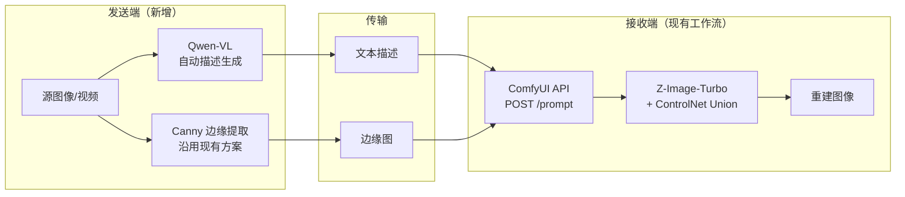

# 语义传输预研 — 调研总览

## 调研目标

为语义传输 demo 原型的技术选型提供依据，覆盖以下问题：

1. **学术前沿**：语义传输/语义通信领域有哪些代表性方案？各自的压缩率、还原质量和系统架构如何？
2. **可复用资源**：有哪些开源项目、框架、ComfyUI 工作流可以直接利用或参考？
3. **模型选型**：发送端（视觉理解）和接收端（图像/视频生成）分别选用什么模型？条件控制采用什么方式？

## 调研范围

| 维度 | 范围 | 产出 |
|------|------|------|
| 论文综述 | 语义通信/视频语义通信，2024-2026 年核心论文 ≥5 篇 | `papers/semantic-communication-survey.md` |
| 开源项目 | GitHub 语义通信项目 + ComfyUI 生态相关工作流 | `projects/opensource-evaluation.md` |
| 视觉理解模型 | Qwen-VL、InternVL、LLaVA 等多模态大模型 | `models/visual-understanding-models.md` |
| 生成模型 | SD3/FLUX/Z-Image-Turbo（图像）、Wan2.x/CogVideoX（视频） | `models/generation-models.md` |
| 条件控制 | Canny/深度图/语义分割等 ControlNet 条件方式 | `models/controlnet-conditions.md` |

## 文档索引

| 文档 | 说明 | 状态 |
|------|------|------|
| [skill-evaluation.md](skill-evaluation.md) | 调研辅助 Skill 搜索与评估 | ✅ 已完成 |
| [comfyui-workflow-analysis.md](comfyui-workflow-analysis.md) | 现有 ComfyUI 工作流分析 | ✅ 已完成 |
| [papers/semantic-communication-survey.md](papers/semantic-communication-survey.md) | 论文综述（6 篇） | ✅ 已完成 |
| [projects/opensource-evaluation.md](projects/opensource-evaluation.md) | 开源项目评估（6 个） | ✅ 已完成 |
| [models/visual-understanding-models.md](models/visual-understanding-models.md) | 视觉理解模型对比（5 模型系列） | ✅ 已完成 |
| [models/generation-models.md](models/generation-models.md) | 图像与视频生成模型对比（8 模型） | ✅ 已完成 |
| [models/controlnet-conditions.md](models/controlnet-conditions.md) | 条件控制与 ControlNet 方案对比（8 种条件） | ✅ 已完成 |
| [selection-report.md](selection-report.md) | **调研汇总与技术选型建议** | ✅ 已完成 |

## 技术基线

现有 ComfyUI 工作流（详见 [comfyui-workflow-analysis.md](comfyui-workflow-analysis.md)）使用的技术栈：

- **文本编码**: qwen_3_4b
- **图像生成**: Z-Image-Turbo (9 步采样)
- **条件控制**: ControlNet Union (Canny 边缘，阈值 0.15/0.35)
- **VAE**: ae

调研需要评估是否有更优的模型或条件控制方式替代上述组件。

---

## Phase 1 综合分析：论文与开源调研对本项目的指导

> 本节综合 [论文综述](papers/semantic-communication-survey.md)、[开源项目评估](projects/opensource-evaluation.md) 和 [ComfyUI 工作流分析](comfyui-workflow-analysis.md) 三份调研产出，提炼对本项目规划和实施的交叉洞察。

### 1. 技术路线已被充分验证

6 篇论文共同证实：**在 <0.01 bpp 的超低码率下，生成式语义传输全面超越 H.264/H.265**。这不是个别论文的孤证，而是整个领域的共识——本项目"传输语义而非像素"的方向是正确的。

关键数据支撑：

| 论文 | 码率 | 关键结论 |
|------|------|----------|
| GVC | 0.005 bpp (0.02%) | LPIPS 0.180 vs HEVC 0.278，感知质量大幅领先 |
| GVSC | CBR 0.0057 | SNR>0dB 下 CLIP Score >0.92，无悬崖效应 |
| CPSGD | 0.003 bpp | 低于 0.01 bpp 时全面超越 H.265 和学习型编解码器 |
| HFCVD | <0.0003 bpp | 定量+定性+主观评估均优于传统/神经/生成式基线 |

### 2. 当前工作流已是简化版语义传输原型

对比 ComfyUI 工作流分析和论文方案，**当前工作流与论文架构存在清晰的对应关系**，同时也暴露了明确的改进方向：

| 语义传输环节 | 当前工作流 | 论文最佳实践 | 差距评估 |
|-------------|-----------|------------|---------|
| 语义提取 | 手动编写 prompt | Qwen2.5-VL-72B / Video-LLaVA 自动生成 | **最大差距** — 自动化是语义传输的核心前提 |
| 结构条件 | Canny 边缘 (strength=1.0) | 语义分割 / 编码潜在 / 深度图 | 中等差距 — Union ControlNet 已支持多条件切换 |
| 生成模型 | Z-Image-Turbo (9步, CFG=1) | FLUX DiT / SVD-XL / Open-Sora | 差距不大 — 当前模型速度优势明显 |
| 视频能力 | 无（单帧处理） | 扩散视频模型 + 时序一致性机制 | **关键缺失** — 视频传输的必要能力 |
| 传输优化 | 无 | 差分编码 / 关键帧策略 / 码率自适应 | 后续迭代优化 |

### 3. 分阶段演进路径

调研结果指向一条**三步渐进**的实现路径，每一步都有论文和开源项目提供支撑：

#### 第一步：打通 API，自动化描述生成

这是调研识别的**最高优先级改进**，也是阶段二的核心目标。



- **依据**：论文中全部 6 个方案均使用 VLM 自动生成描述，无一例外
- **工具支撑**：ComfyUI REST API + WebSocket 文档完整，集成难度低
- **最小改动**：接收端沿用现有工作流，仅新增发送端的 VLM 调用

#### 第二步：升级条件表示和生成模型

CPSGD 论文的码率构成分析给出了明确的优化方向：

| 传输组件 | 码率占比 | 启示 |
|----------|---------|------|
| 分割掩码 | 23-43% | 信息密度高于 Canny 边缘，值得替换 |
| 空间编码 | 可变 | GSC 的动态通道选择可降低冗余 |
| 相机位姿 | 3-10% | 视频场景下的全局运动表示 |
| 文本描述 | <4% | 信息密度最高的传输内容 |

具体升级项：
- **条件表示**：Canny 边缘 → 语义分割（Union ControlNet 已支持，无需更换模型）
- **视频生成**：引入 Wan2.x I2V 模式（WanVideoWrapper 6.2k Stars，生态最活跃），与 GVSC 的"首帧+描述"方案完全吻合
- **潜在通道选择**：参考 GSC 的 SSIM 动态选择机制，用最少的通道传输最关键的结构信息

#### 第三步：端到端优化

- **差分编码**（M3E-VSC 思路）：视频帧序列只传变化量，降低冗余
- **关键帧策略**：参考 GVC 的多层级 token 方案（关键帧+高级描述符+低级特征）
- **实时性**：HFCVD 的因果生成设计 + 时序蒸馏（300× 参数削减）

### 4. 开源生态的现实约束

调研揭示了一个重要事实：**端到端的视频语义通信开源系统尚不存在**。

| 类别 | 开源现状 | 对本项目的影响 |
|------|---------|---------------|
| 核心论文代码 | 6 篇论文均未完全开源 | 无法直接复用，需参考架构自行实现 |
| 语义通信框架 | OpenSemanticComm 仅为索引，无端到端系统 | 可作为技术发现入口 |
| 图像压缩+重建 | DiffEIC 有完整代码（Apache-2.0） | 接收端控制模块设计可直接参考 |
| ComfyUI 生态 | API 成熟（80k+ Stars），视频节点活跃 | **最可靠的基础设施**，阶段二核心依赖 |

**结论**：本项目需要**自行组装**各组件，技术栈组合为：

```
发送端                     传输                     接收端
┌──────────────┐     ┌───────────┐     ┌───────────────────┐
│ Qwen-VL      │     │           │     │ ComfyUI API       │
│ (自动描述)    │ ──→ │ 文本      │ ──→ │ ├─ Wan2.x (视频)   │
│              │     │ +         │     │ ├─ Z-Image-Turbo   │
│ Canny/分割    │ ──→ │ 条件图    │ ──→ │ │  (图像, 基线)    │
│ (条件提取)    │     │           │     │ └─ ControlNet      │
└──────────────┘     └───────────┘     └───────────────────┘
     Python                                通过 REST API 调用
```

### 5. 对 Phase 2-3 调研的聚焦建议

Phase 1 的发现可以帮助后续调研减少探索范围，更有针对性：

| 后续任务 | Phase 1 已提供的线索 | 建议聚焦点 |
|---------|---------------------|-----------|
| G-05 视觉理解模型 | GSC 使用 Qwen2.5-VL-72B，GVSC 使用 Video-LLaVA | 重点对比"结构化描述生成"能力，而非通用 benchmark |
| G-06 生成模型 | Z-Image-Turbo 已是速度基线，Wan2.x/CogVideoX 已有 ComfyUI 封装 | 重点评估 Wan2.x I2V 能否替代图生图，关注时序一致性 |
| G-07 ControlNet | CPSGD 已给出各条件类型码率占比，Union ControlNet 已支持多条件 | 重点验证不同条件下的还原质量差异，而非重复码率分析 |
| G-08 选型报告 | 技术栈组合和演进路径已初步明确 | 聚焦于给出可操作的阶段二实施方案 |
