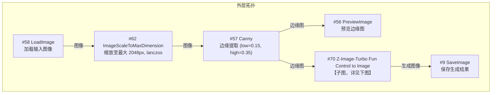
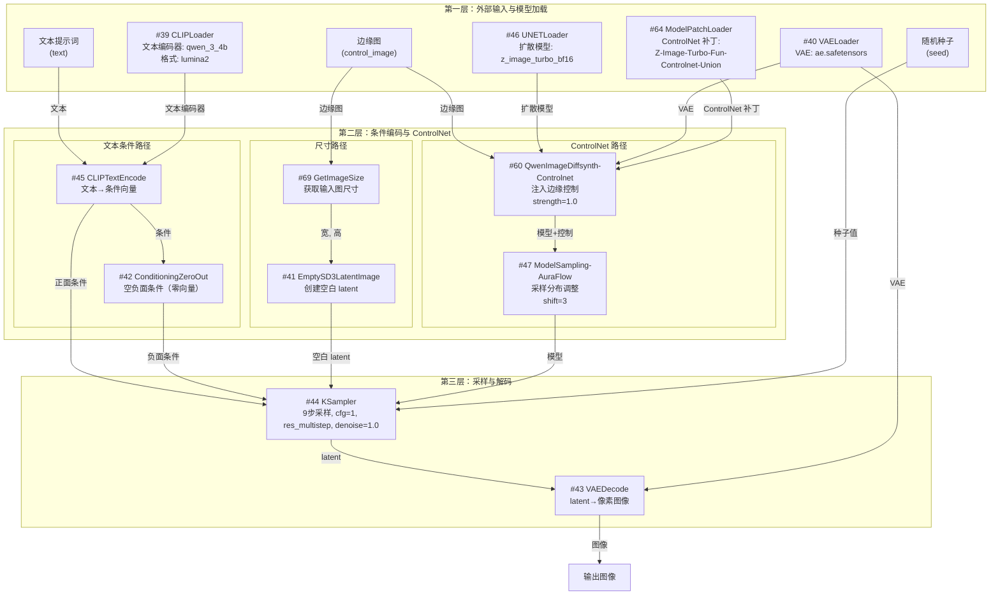
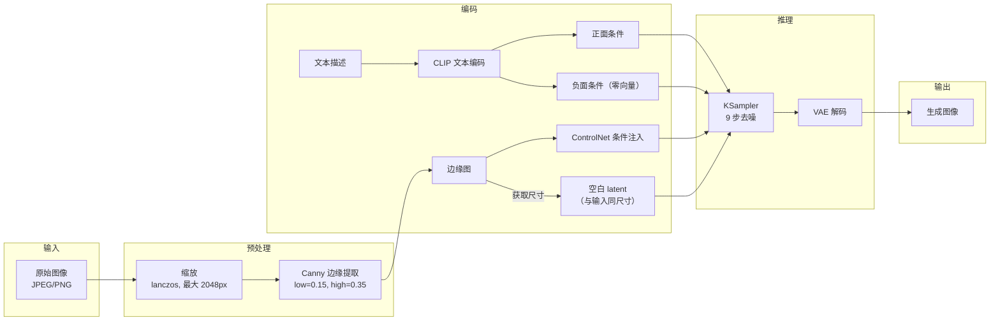

# ComfyUI 工作流分析：Z-Image-Turbo + ControlNet Union

> 源文件：`resources/comfyui/image_z_image_turbo_fun_union_controlnet.json`
> 分析日期：2026-03-13

## 1. 工作流概览

本工作流实现了**图像到图像的条件控制生成**：输入一张原始图像，提取 Canny 边缘作为结构条件，结合文本描述（prompt），通过 Z-Image-Turbo 扩散模型生成风格化的新图像。

核心流程：**原始图像 → Canny 边缘提取 → 文本+边缘条件 → 扩散模型生成 → 输出图像**

该工作流与语义传输的关系：
- **发送端对应**：图像 → Canny 边缘图 + 文本描述（压缩为语义信息）
- **接收端对应**：文本描述 + 边缘图 → 扩散模型重建图像

## 2. 节点拓扑图

工作流分为**外层**和**子图**两部分。子图 `Z-Image-Turbo Fun Control to Image` 封装了模型加载和推理逻辑。

## 3. 节点功能与参数详解

### 3.1 外层节点

| 节点 | 类型 | 功能 | 关键参数 |
|------|------|------|----------|
| #58 LoadImage | LoadImage | 加载输入图像 | 示例图：`生成特定图片-s.jpg` |
| #62 ImageScaleToMaxDimension | ImageScaleToMaxDimension | 将图像缩放至最大边不超过指定尺寸 | method=lanczos, largest_size=2048 |
| #57 Canny | Canny | 提取 Canny 边缘图 | low_threshold=0.15, high_threshold=0.35 |
| #56 PreviewImage | PreviewImage | 预览边缘提取结果 | — |
| #70 子图 | Z-Image-Turbo Fun Control to Image | 封装了完整的条件控制生成流程 | 输入: image, text, seed |
| #9 SaveImage | SaveImage | 保存生成结果 | filename_prefix=`z-image-turbo` |

### 3.2 子图内部节点

| 节点 | 类型 | 功能 | 关键参数 |
|------|------|------|----------|
| #39 CLIPLoader | CLIPLoader | 加载文本编码器 | model=qwen_3_4b, type=lumina2 |
| #46 UNETLoader | UNETLoader | 加载扩散模型 | model=z_image_turbo_bf16, dtype=default |
| #40 VAELoader | VAELoader | 加载 VAE 解码器 | model=ae.safetensors |
| #64 ModelPatchLoader | ModelPatchLoader | 加载 ControlNet 补丁 | model=Z-Image-Turbo-Fun-Controlnet-Union |
| #45 CLIPTextEncode | CLIPTextEncode | 将文本 prompt 编码为条件向量 | 接收外部 text 输入 |
| #42 ConditioningZeroOut | ConditioningZeroOut | 生成空的负面条件（零向量） | — |
| #60 QwenImageDiffsynthControlnet | QwenImageDiffsynthControlnet | 将 ControlNet 应用到扩散模型 | strength=1.0 |
| #47 ModelSamplingAuraFlow | ModelSamplingAuraFlow | 配置采样参数 | shift=3 |
| #44 KSampler | KSampler | 执行扩散采样（去噪生成） | steps=9, cfg=1, sampler=res_multistep, scheduler=simple, denoise=1.0 |
| #69 GetImageSize | GetImageSize | 获取输入图像尺寸 | — |
| #41 EmptySD3LatentImage | EmptySD3LatentImage | 创建空白 latent（与输入同尺寸） | batch_size=1 |
| #43 VAEDecode | VAEDecode | 将 latent 解码为像素图像 | — |

## 4. 模型依赖清单

| 模型文件 | 用途 | HuggingFace URL | 存储路径 |
|----------|------|-----------------|----------|
| qwen_3_4b.safetensors | 文本编码器（CLIP） | [链接](https://huggingface.co/Comfy-Org/z_image_turbo/resolve/main/split_files/text_encoders/qwen_3_4b.safetensors) | `models/text_encoders/` |
| z_image_turbo_bf16.safetensors | 扩散模型（UNet） | [链接](https://huggingface.co/Comfy-Org/z_image_turbo/resolve/main/split_files/diffusion_models/z_image_turbo_bf16.safetensors) | `models/diffusion_models/` |
| ae.safetensors | VAE 编解码器 | [链接](https://huggingface.co/Comfy-Org/z_image_turbo/resolve/main/split_files/vae/ae.safetensors) | `models/vae/` |
| Z-Image-Turbo-Fun-Controlnet-Union.safetensors | ControlNet Union 补丁 | [链接](https://huggingface.co/alibaba-pai/Z-Image-Turbo-Fun-Controlnet-Union/resolve/main/Z-Image-Turbo-Fun-Controlnet-Union.safetensors) | `models/model_patches/` |

**模型来源说明**：
- Z-Image-Turbo 系列模型由 Comfy-Org 提供（`Comfy-Org/z_image_turbo` 仓库）
- ControlNet Union 补丁由阿里巴巴 PAI 团队提供（`alibaba-pai/Z-Image-Turbo-Fun-Controlnet-Union` 仓库）
- 文本编码器 qwen_3_4b 基于通义千问架构，以 lumina2 格式加载

## 5. 端到端数据流

### 数据格式变换链

| 阶段 | 数据类型 | 说明 |
|------|----------|------|
| 输入 | IMAGE (RGB) | 原始图像，任意尺寸 |
| 预处理 | IMAGE (RGB) | 缩放至最大边 2048px |
| 边缘提取 | IMAGE (单通道灰度) | Canny 边缘图，二值化 |
| 文本编码 | CONDITIONING | CLIP 编码后的条件向量 |
| Latent 空间 | LATENT | SD3 格式空白 latent，与输入同尺寸 |
| 采样输出 | LATENT | 去噪后的 latent 表示 |
| 最终输出 | IMAGE (RGB) | VAE 解码后的生成图像 |

## 6. 关键技术特点

### 6.1 采样配置分析

- **步数 = 9**：Z-Image-Turbo 是蒸馏加速模型，仅需极少步数即可生成高质量图像（常规 SD 需 20-50 步）
- **CFG = 1**：无分类器引导（Classifier-Free Guidance），依赖模型自身能力，减少计算量
- **Sampler = res_multistep**：多步残差采样器，适配 turbo 模型的快速采样需求
- **Denoise = 1.0**：完全从噪声生成（非 img2img 模式），依靠 ControlNet 提供结构约束

### 6.2 ControlNet 配置

- **类型**：Union ControlNet（支持多种条件类型的统一模型）
- **当前使用条件**：Canny 边缘图
- **Strength = 1.0**：最大强度，严格遵循边缘结构
- **AuraFlow shift = 3**：调整采样分布，优化 ControlNet 与 turbo 模型的配合

### 6.3 负面条件处理

使用 `ConditioningZeroOut` 生成全零负面条件，意味着不使用负面 prompt。这与 CFG=1 一致——当 CFG=1 时负面条件不起作用。

## 7. 可改进环节标注

### 7.1 发送端（编码侧）

| 环节 | 当前方案 | 潜在改进 | 优先级 |
|------|----------|----------|--------|
| 图像描述生成 | **手动编写 prompt** | 用视觉理解模型（如 Qwen-VL）自动生成结构化描述 | **高** — 自动化是语义传输的核心需求 |
| 边缘提取 | Canny (低阈值 0.15) | 可探索深度图、语义分割等替代条件，或多条件组合 | 中 — Union ControlNet 已支持多条件 |
| 图像缩放 | 固定 max 2048px | 根据传输带宽动态调整分辨率 | 低 — 优化阶段考虑 |

### 7.2 接收端（解码侧）

| 环节 | 当前方案 | 潜在改进 | 优先级 |
|------|----------|----------|--------|
| 生成模型 | Z-Image-Turbo (9步) | 评估 FLUX、SD3.5 等更新模型的质量-速度权衡 | 中 — 当前模型速度已很快 |
| 条件控制 | 单一 Canny 边缘 | 利用 Union ControlNet 的多条件能力，融合深度图+边缘等 | 中 — 可能提升还原精度 |
| 视频扩展 | 仅支持单帧图像 | 引入视频生成模型（Wan2.x、CogVideoX）实现帧间连续性 | **高** — 视频传输的必要能力 |

### 7.3 传输层面

| 环节 | 当前方案 | 潜在改进 | 优先级 |
|------|----------|----------|--------|
| 传输内容 | 手动 prompt + Canny 边缘图 | 优化文本描述格式，边缘图压缩编码 | **高** — 直接影响传输码率 |
| 关键帧策略 | 无（单帧处理） | 增加关键帧检测和差异编码 | **高** — 视频场景必需 |
| Prompt 格式 | 自由文本（分段式描述） | 标准化为结构化 JSON 或模板化格式，减少冗余 | 中 |

### 7.4 当前 Prompt 分析

工作流示例中的 prompt 采用分段式结构化描述：
- `[Scene Style]`：场景风格（光照、天气、环境）
- `[Perspective]`：视角和镜头参数
- `[Ground & Path]`：地面和道路几何描述
- `[Key Elements]`：按前景/中景/背景分层的关键元素

这种格式值得保留和标准化，可作为语义传输中"语义信息"的编码模板。
