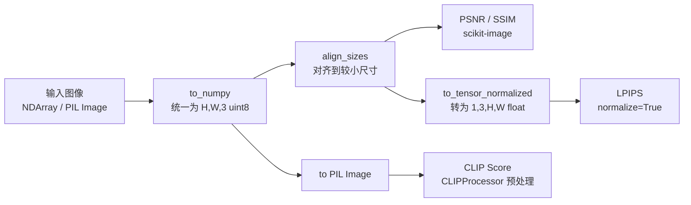

# 质量评估体系调研报告

> 文档版本: 1.1
> 创建日期: 2026-03-28
> 关联任务: P2-14 实现-质量评估模块

## 1. 概述

### 1.1 为什么需要质量评估

语义传输系统将原始图像压缩为文本描述 + 条件信息（边缘图），再在接收端重新生成图像。与传统图像编解码（JPEG、H.264）不同，语义传输的"还原"本质上是**重新生成**——接收端生成的图像不可能与原图像素级一致，但应在语义和感知层面保持高质量。

因此，我们需要一套多层次的评估体系来回答：

- 还原图在像素层面和原图差多少？（基线参考）
- 还原图在人眼感知上和原图像不像？（核心关注）
- 还原图和语义描述（prompt）匹配吗？（语义保真度）

### 1.2 语义传输评估 vs 传统图像压缩评估

| 维度 | 传统图像压缩 | 语义传输 |
|------|-------------|---------|
| 还原方式 | 解码恢复 | AI 重新生成 |
| 像素一致性 | 高（有损压缩仍保留大部分像素信息） | 低（生成图像像素完全不同） |
| 核心评估维度 | PSNR/SSIM 主导 | 感知质量（LPIPS）+ 语义匹配（CLIP Score）更有意义 |
| PSNR/SSIM 的角色 | 主要指标 | 参考基线，不作为主要质量判据 |

### 1.3 语义通信领域的评估实践

根据对语义通信领域文献的调研，不同类型的系统采用不同的指标组合：

| 系统类型 | 常用指标组合 | 参考文献 |
|----------|-------------|----------|
| 传统 JSCC 语义通信 | PSNR + SSIM/MS-SSIM + LPIPS | Zhang et al., 2024 |
| 生成式语义通信（扩散模型） | PSNR + LPIPS + FID + CLIP Score | arXiv:2412.08642 |
| 文本引导生成通信 | CLIP Score + LPIPS + PSNR + FID | arXiv:2407.18468 |
| 视频语义通信 | PSNR + SSIM + LPIPS + CLIP Score | arXiv:2502.13838 |

**关键发现**：生成式语义通信论文倾向于使用更多语义级指标（LPIPS、CLIP Score），而非仅依赖像素级指标。传统像素级/结构级指标无法准确反映语义信息的保真程度，在"语义攻击"（如 GAN 反转）场景下几乎失效。

> **来源**: Zhang et al., "How to Evaluate Semantic Communications for Images with ViTScore Metric?", IEEE JSAC, 2024 ([arXiv:2309.04891](https://arxiv.org/abs/2309.04891))

## 2. 指标体系

### 2.1 已采用的指标

我们采用三个层次、四个指标的评估框架作为基线实现：

```
┌─────────────────────────────────────────────────┐
│                 语义级（最高层）                    │
│         CLIP Score：图文语义匹配度                  │
├─────────────────────────────────────────────────┤
│                 感知级（中间层）                    │
│         LPIPS：深度特征感知相似度                    │
├─────────────────────────────────────────────────┤
│                 像素级（底层）                      │
│         PSNR / SSIM：像素与结构差异                 │
└─────────────────────────────────────────────────┘
```

#### PSNR（Peak Signal-to-Noise Ratio，峰值信噪比）

**原理**：逐像素计算原图与还原图的均方误差（MSE），再转换为对数尺度（dB）。

**公式直觉**：
- MSE = 所有像素差异的平方的平均值
- PSNR = 10 × log₁₀(MAX² / MSE)，其中 MAX=255（8bit 图像）
- MSE 越小 → PSNR 越高 → 图像越相似

**值域与解读**：
| PSNR (dB) | 质量 |
|-----------|------|
| ∞ | 完全相同 |
| > 40 | 优秀，肉眼几乎无法区分 |
| 30-40 | 良好 |
| 20-30 | 可接受 |
| < 20 | 差 |

**局限性**：PSNR 纯粹基于像素差异，不考虑人眼视觉特性。两张视觉效果相似但像素位置略有偏移的图像，PSNR 可能很低。对于语义传输这种"重新生成"的场景，PSNR 通常较低，但不代表视觉质量差。研究表明 PSNR 对亮度偏移敏感但对结构破坏不敏感。

> **来源**: Zhang et al., "LPIPS", CVPR 2018; [videoprocessing.ai](https://videoprocessing.ai/metrics/ways-of-cheating-on-popular-objective-metrics.html)

#### SSIM（Structural Similarity Index，结构相似度）

**原理**：从三个维度衡量两张图像的相似性：
1. **亮度**（luminance）：均值比较
2. **对比度**（contrast）：方差比较
3. **结构**（structure）：协方差比较

SSIM 使用滑动窗口（默认 7×7）在局部区域计算这三个分量，最终取全图平均值。

**值域与解读**：
| SSIM | 质量 |
|------|------|
| 1.0 | 完全相同 |
| > 0.95 | 优秀 |
| 0.85-0.95 | 良好 |
| 0.70-0.85 | 可接受 |
| < 0.70 | 差 |

**局限性**：比 PSNR 更贴近人眼感知，但对亮度/对比度/色调/饱和度变化几乎不敏感，变化范围小，区分度低。在语义通信论文中，MS-SSIM（多尺度版本）比 SSIM 更常用。

> **来源**: [Comparison of Full-Reference Image Quality Models, PMC 7817470](https://pmc.ncbi.nlm.nih.gov/articles/PMC7817470/)

#### LPIPS（Learned Perceptual Image Patch Similarity，学习感知图像块相似度）

**原理**：使用预训练的深度神经网络（如 AlexNet）提取两张图像的多层特征，计算特征空间中的加权距离。核心思想是——如果两张图像在神经网络的中间特征层表示相似，人眼也会觉得它们相似。

**计算过程**：
1. 将两张图像分别输入预训练网络
2. 提取多个中间层的特征图
3. 对每层特征图做通道级归一化
4. 计算逐层的加权 L2 距离
5. 对所有层的距离求和

**网络选择**：
| 网络 | 大小 | 特点 |
|------|------|------|
| AlexNet（默认） | ~9MB | 最快，与人类感知相关性最高，灵敏度 73.64%（推荐用于评估） |
| VGG | ~58MB | 适合反向传播优化（训练时用） |
| SqueezeNet | ~2.8MB | 最小，但相关性略低 |

**值域与解读**：
| LPIPS | 质量 |
|-------|------|
| 0.0 | 完全相同 |
| < 0.1 | 非常相似 |
| 0.1-0.3 | 感知上相似 |
| 0.3-0.5 | 有明显差异 |
| > 0.5 | 差异很大 |

**对语义传输的意义**：LPIPS 是评估语义传输质量的核心指标之一。它能区分"像素不同但视觉相似"和"像素不同且视觉也不同"的情况。在所有评估指标中灵敏度最高、方差最低。

**已知缺陷**：对纹理替换过度敏感——生成模型可能重新合成纹理而非精确复制，LPIPS 可能因此过度惩罚。

> **来源**: Zhang et al., "The Unreasonable Effectiveness of Deep Features as a Perceptual Metric", CVPR 2018 ([GitHub](https://github.com/richzhang/PerceptualSimilarity)); [PMC 7817470](https://pmc.ncbi.nlm.nih.gov/articles/PMC7817470/)

#### CLIP Score（CLIP 图文匹配分数）

**原理**：CLIP（Contrastive Language-Image Pre-training）是 OpenAI 训练的跨模态模型，能将图像和文本映射到同一个语义空间。CLIP Score 衡量的是**还原图像与语义描述（prompt）的匹配程度**，而非与原图的直接对比。

**计算过程**：
1. 用 CLIP 图像编码器提取还原图像的特征向量
2. 用 CLIP 文本编码器提取 prompt 的特征向量
3. 计算两个向量的余弦相似度
4. 乘以 100 并截断负值：`max(100 × cos_sim, 0)`

**值域与解读**：
| CLIP Score | 质量 |
|-----------|------|
| > 30 | 图文高度匹配 |
| 25-30 | 匹配良好 |
| 20-25 | 基本匹配 |
| < 20 | 匹配较差 |

**注意**：CLIP Score 评估的是"图文匹配度"而非"图图相似度"。它回答的是"生成的图是否忠实于 prompt 描述"。与人类判断相关性最高，优于 CIDEr 和 SPICE 等参考基准指标。

**限制**：CLIP 的文本编码器有 77 token 的长度限制，超长的 VLM 描述会被截断。在需要丰富上下文知识的场景中表现较弱。

> **来源**: Hessel et al., "CLIPScore: A Reference-free Evaluation Metric for Image Captioning", EMNLP 2021 ([ACL Anthology](https://aclanthology.org/2021.emnlp-main.595/))

### 2.2 已采用指标对比总结

| 指标 | 层次 | 方向 | 值域 | 回答的问题 | 对语义传输的适用性 |
|------|------|------|------|-----------|------------------|
| PSNR | 像素 | 越高越好 | [0, ∞) dB | 像素差异多大？ | ⭐ 参考基线 |
| SSIM | 像素 | 越高越好 | [0, 1] | 结构相似吗？ | ⭐⭐ 有参考价值 |
| LPIPS | 感知 | 越低越好 | [0, ~0.7+] | 人眼觉得像吗？ | ⭐⭐⭐ 核心指标 |
| CLIP Score | 语义 | 越高越好 | [0, 100] | 图文匹配吗？ | ⭐⭐⭐ 核心指标 |

### 2.3 未采用但值得关注的指标

以下指标在调研中发现具有重要价值，可在后续迭代中纳入：

#### DreamSim（中级感知相似度）— 强烈推荐

- **来源**: Fu et al., "DreamSim: Learning New Dimensions of Human Visual Similarity using Synthetic Data", NeurIPS 2023 Spotlight ([arXiv:2306.09344](https://arxiv.org/abs/2306.09344), [GitHub](https://github.com/ssundaram21/dreamsim))
- **原理**: 拼接 CLIP + OpenCLIP + DINO 嵌入，在约 20,000 个扩散模型生成的图像三元组上微调，通过人类感知判断训练
- **定位**: 填补 LPIPS（低级纹理/颜色）和 CLIP Score（高级语义）之间的**中级感知**空白——关注图像布局、物体姿态、语义内容
- **优势**: 与人类相似性判断的对齐度优于现有指标；支持单图对比；虽在合成数据上训练，但泛化到真实图像效果好
- **推荐理由**: DreamSim 恰好弥补了我们当前体系中 LPIPS（偏低级）和 CLIP Score（偏高级）之间的感知空白，非常适合语义传输的还原质量评估

#### DISTS（结构+纹理相似度）— 推荐

- **来源**: Ding et al., "Image Quality Assessment: Unifying Structure and Texture Similarity", IEEE TPAMI, 2020 ([arXiv:2004.07728](https://arxiv.org/abs/2004.07728), [GitHub](https://github.com/dingkeyan93/DISTS))
- **原理**: 使用 CNN 构建多尺度过完备表示，组合"纹理相似性"（空间均值相关）和"结构相似性"（特征图相关）
- **优势**: 对纹理重采样有容忍度（LPIPS 对此过度敏感）；对轻微几何变换鲁棒；与人类感知相关性好
- **推荐理由**: 生成模型会重新合成纹理而非精确复制，DISTS 对此更宽容，特别适合生成式还原评估

#### ViTScore（语义通信专用指标）— 关注

- **来源**: Zhang et al., "How to Evaluate Semantic Communications for Images with ViTScore Metric?", IEEE JSAC, 2024 ([arXiv:2309.04891](https://arxiv.org/abs/2309.04891))
- **原理**: 借鉴 NLP 中 BERTScore 的思想，使用预训练 Vision Transformer (ViT) 提取语义特征，计算特征相似度
- **优势**: 具有对称性、有界性、归一化三个属性；在语义攻击场景下优于 PSNR、MS-SSIM 和 LPIPS
- **当前状态**: 语义通信领域提出的专用指标，学术认可度在提升中，但社区采用度不如 LPIPS/CLIP

#### FID（Fréchet Inception Distance）— 后期补充

- **来源**: Heusel et al., NeurIPS 2017 ([GitHub](https://github.com/mseitzer/pytorch-fid))
- **原理**: 使用 Inception-V3 提取特征，计算真实图像和生成图像特征分布之间的 Fréchet 距离
- **核心限制**: **需要大量样本**（通常建议 10,000+ 张），单图对比无法使用
- **后续计划**: 当积累足够测试样本后，FID 应作为分布级质量指标补充纳入

#### MS-SSIM（多尺度 SSIM）— 可替代 SSIM

- **来源**: Wang et al., "Multiscale structural similarity for image quality assessment", 2003
- **优势**: 比单尺度 SSIM 更稳健，在语义通信论文中更常用
- **当前决策**: 本期保留 SSIM（更简单直观），后续可考虑升级为 MS-SSIM

### 2.4 后续推荐的完整指标体系

```
多层次评估框架（远期目标）:

1. 像素级保真度:    PSNR            ← 已实现（基线参考）
2. 结构保真度:      SSIM / MS-SSIM  ← 已实现 SSIM，后续可升级
3. 低级感知质量:    LPIPS           ← 已实现
4. 结构+纹理质量:   DISTS           ← 待实现（对生成式纹理替换更宽容）
5. 中级感知质量:    DreamSim        ← 待实现（布局/姿态/语义的中级感知）
6. 语义一致性:      CLIP Score      ← 已实现
7. 分布级质量:      FID             ← 待实现（需积累大量样本）
```

这个体系从像素到语义逐级递进，每一层指标弥补上一层的盲区，符合语义通信领域"多层次评估"的研究共识。

### 2.5 为什么需要多层次指标组合

1. **没有单一指标能全面捕捉人类视觉感知**。PSNR 关注像素精度，SSIM 关注结构，LPIPS 关注深层感知特征，CLIP Score 关注语义一致性——它们各自只覆盖了质量评估的一个维度。

2. **不同指标在不同任务上表现差异显著**。MS-SSIM 和 MAE 偏好平滑外观，在去噪任务上表现好；DISTS 和 LPIPS 对细纹理敏感，在超分辨率和去模糊任务上更优。

3. **指标与人类评分的相关性普遍中等**。NeurIPS 2023 论文 "Are Existing Evaluation Metrics Faithful to Human Perception?" 发现 PSNR、MSE、SSIM、LPIPS、FID 与人类评分的 Kendall 相关系数约为 0.5。

4. **生成式还原的特殊性**。与传统编解码器的"压缩失真"不同，生成模型产生的是"语义一致但像素不同"的图像——纹理可能被重新合成，细节可能被"幻觉"出来。这使得像素级指标（PSNR）几乎无意义，需要更侧重语义级和感知级的指标。

> **来源**: Ding et al. (2020), [PMC 7817470](https://pmc.ncbi.nlm.nih.gov/articles/PMC7817470/); [NeurIPS 2023](https://papers.neurips.cc/paper_files/paper/2023/file/2082273791021571c410f41d565d0b45-Paper-Conference.pdf); [Patsnap](https://eureka.patsnap.com/article/perceptual-metrics-face-off-lpips-vs-ssim-vs-psnr)

## 3. 库选型与决策

### 3.1 候选方案

| 维度 | 方案 A：独立库 | 方案 B：torchmetrics |
|------|--------------|---------------------|
| 依赖 | scikit-image + lpips（2 个新增） | torchmetrics（1 个新增，内部依赖 lpips） |
| PSNR/SSIM | scikit-image（纯 NumPy，轻量） | torchmetrics（基于 PyTorch tensor） |
| LPIPS | lpips 官方库 | torchmetrics 封装 lpips |
| CLIP Score | transformers CLIPModel（已有依赖） | torchmetrics 封装 transformers |
| 代码量 | 4 个函数 + utils，约 150-200 行 | 薄封装，约 80-100 行 |
| 控制力 | 每一步可见 | 依赖框架抽象 |
| 额外依赖链 | 无 | lightning-utilities 等 |

**注**: 另有 [pyiqa (IQA-PyTorch)](https://github.com/chaofengc/IQA-PyTorch) 工具箱集成了数十种指标，适合后续扩展 DISTS、DreamSim 等指标时参考。

### 3.2 决策：选择方案 A（独立库）

**理由**：

1. **依赖透明**：scikit-image 和 lpips 各做一件事，出问题排查直接。torchmetrics 内部依赖链长，版本冲突风险高。
2. **代码量小**：4 个函数总共不到 200 行，本质是"薄胶水层"（类型转换 + 一行库调用），不值得引入重抽象。
3. **预研项目特性**：直接调用底层库，每一步可见，方便后续调参、替换指标或切换实现。
4. **torchmetrics 的 CLIP Score 缺陷**：函数式 API 每次调用重新加载模型（~150MB），批量评估性能差。

### 3.3 各库版本与 API 注意事项

#### scikit-image >= 0.24.0

- `skimage.metrics.peak_signal_noise_ratio(image_true, image_test, *, data_range=None)`
- `skimage.metrics.structural_similarity(im1, im2, *, win_size=None, data_range=None, channel_axis=None, ...)`
- **关键**：RGB 图像必须传 `channel_axis=-1`，否则所有维度被当作空间维度，结果错误
- **关键**：建议显式传 `data_range=255`（uint8），不依赖自动推断
- SSIM 最小图像尺寸：7×7（默认 win_size=7）

#### lpips >= 0.1.4

- `lpips.LPIPS(net='alex', verbose=False)` 创建模型
- `loss_fn(img0, img1, normalize=True)` — `normalize=True` 接受 [0,1] 输入，内部自动转 [-1,1]
- 输出 shape `(N, 1, 1, 1)`，需 `.item()` 取标量
- AlexNet 权重（~9MB）由 torchvision 首次使用时自动下载
- LPIPS 线性层权重（~6KB）已打包在 pip 包内
- CPU 环境完全兼容

#### transformers CLIPModel（已有依赖）

- `CLIPModel.from_pretrained("openai/clip-vit-base-patch32")`
- `CLIPProcessor.from_pretrained(...)` 自动处理图像 resize/normalize 和文本 tokenize
- 文本长度限制 77 tokens
- 标准 CLIP Score 公式：`max(100 × cosine_similarity(image_emb, text_emb), 0)`

## 4. 实现方案

### 4.1 模块结构

```
src/semantic_transmission/evaluation/
├── __init__.py              # 导出 4 个公共函数
├── utils.py                 # 图像预处理工具
├── pixel_metrics.py         # PSNR、SSIM
├── perceptual_metrics.py    # LPIPS
└── semantic_metrics.py      # CLIP Score
```

### 4.2 数据流



### 4.3 关键设计决策

1. **尺寸对齐策略**：当原图和还原图尺寸不同时（ComfyUI 生成的分辨率由模型决定），resize 到较小图的尺寸。使用 LANCZOS 插值保持质量。

2. **LPIPS 使用 `normalize=True`**：库内置了 `[0,1] → [-1,1]` 的转换，比手动 `*2-1` 更不易出错。

3. **CLIP Score 截断 `max(..., 0)`**：余弦相似度理论上可为负值（图文语义完全不相关），截断为 0 是标准做法。

4. **函数式接口，不做模型缓存**：每次调用独立创建模型实例。对于单次评估足够快，批量场景留待评估脚本优化。

## 5. 使用指南

### 5.1 安装

```bash
uv sync  # 自动安装 scikit-image、lpips 及其他依赖
```

### 5.2 API 示例

```python
from PIL import Image
from semantic_transmission.evaluation import (
    compute_psnr,
    compute_ssim,
    compute_lpips,
    compute_clip_score,
)

# 加载图像
original = Image.open("original.png")
reconstructed = Image.open("reconstructed.png")
prompt = "A modern city skyline at sunset with warm orange tones"

# 像素级指标（支持 PIL Image 或 numpy array）
psnr = compute_psnr(original, reconstructed)
ssim = compute_ssim(original, reconstructed)
print(f"PSNR: {psnr:.2f} dB")   # 越高越好
print(f"SSIM: {ssim:.4f}")       # 越高越好，max=1.0

# 感知级指标（首次调用会下载 AlexNet 权重）
lpips_score = compute_lpips(original, reconstructed)
print(f"LPIPS: {lpips_score:.4f}")  # 越低越好

# 语义级指标（首次调用会下载 CLIP 模型）
clip = compute_clip_score(reconstructed, prompt)
print(f"CLIP Score: {clip:.2f}")    # 越高越好
```

### 5.3 GPU 加速

LPIPS 和 CLIP Score 支持 GPU 加速：

```python
lpips_score = compute_lpips(original, reconstructed, device="cuda")
clip = compute_clip_score(reconstructed, prompt, device="cuda")
```

不指定 `device` 时默认使用 CPU。

## 参考文献

1. Zhang, R. et al., "The Unreasonable Effectiveness of Deep Features as a Perceptual Metric", CVPR 2018. ([GitHub](https://github.com/richzhang/PerceptualSimilarity))
2. Hessel, J. et al., "CLIPScore: A Reference-free Evaluation Metric for Image Captioning", EMNLP 2021. ([ACL Anthology](https://aclanthology.org/2021.emnlp-main.595/))
3. Zhang, P. et al., "How to Evaluate Semantic Communications for Images with ViTScore Metric?", IEEE JSAC, 2024. ([arXiv:2309.04891](https://arxiv.org/abs/2309.04891))
4. Fu, S. et al., "DreamSim: Learning New Dimensions of Human Visual Similarity using Synthetic Data", NeurIPS 2023 Spotlight. ([arXiv:2306.09344](https://arxiv.org/abs/2306.09344))
5. Ding, K. et al., "Image Quality Assessment: Unifying Structure and Texture Similarity", IEEE TPAMI, 2020. ([arXiv:2004.07728](https://arxiv.org/abs/2004.07728))
6. Heusel, M. et al., "GANs Trained by a Two Time-Scale Update Rule Converge to a Local Nash Equilibrium", NeurIPS 2017. ([GitHub](https://github.com/mseitzer/pytorch-fid))
7. "Semantic Similarity Score for Measuring Visual Similarity at Semantic Level", IEEE Trans., 2024. ([arXiv:2406.03865](https://arxiv.org/abs/2406.03865))
8. "Generative Semantic Communication: Architectures, Technologies, and Applications", 2024. ([arXiv:2412.08642](https://arxiv.org/abs/2412.08642))
9. Huang, Y. et al., "Visual Fidelity Index for Generative Semantic Communications with Critical Information Embedding", 2025. ([arXiv:2505.10405](https://arxiv.org/abs/2505.10405))
10. "Are Existing Evaluation Metrics Faithful to Human Perception?", NeurIPS 2023. ([Paper](https://papers.neurips.cc/paper_files/paper/2023/file/2082273791021571c410f41d565d0b45-Paper-Conference.pdf))
11. Ding, K. et al., "Comparison of Full-Reference Image Quality Models for Optimization of Image Processing Systems", 2021. ([PMC 7817470](https://pmc.ncbi.nlm.nih.gov/articles/PMC7817470/))
12. pyiqa (IQA-PyTorch) 图像质量评估工具箱. ([GitHub](https://github.com/chaofengc/IQA-PyTorch))
