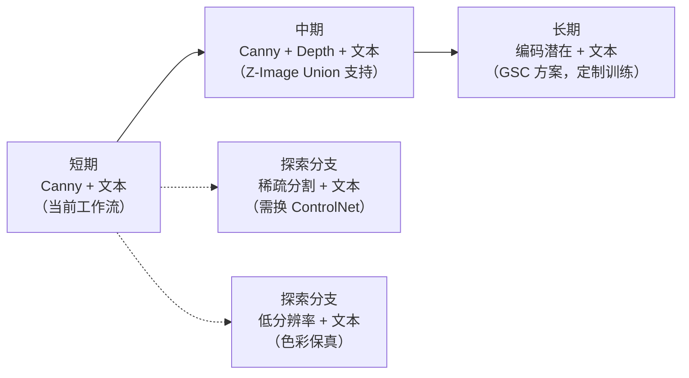

# 条件控制与 ControlNet 方案对比（语义传输条件选型）

> 更新时间：2026-03-13
> 用途：评估各条件类型在语义传输场景下的"信息保留 vs 传输成本"权衡

## 条件类型综合对比表

| 条件类型 | 通道数 | 稀疏度 | 估算 bpp (压缩后) | 保留信息 | 丢失信息 | 计算成本 | Z-Image Union | xinsir Union |
|---------|--------|--------|------------------|---------|---------|---------|--------------|-------------|
| Canny 边缘 | 1 (二值) | 极高 | 0.01-0.15 | 轮廓结构 | 深度/纹理/颜色 | 极低 (CPU) | ✅ | ✅ |
| 深度图 | 1 (灰度) | 低 | 0.1-0.8 | 3D 布局 | 纹理/颜色/精确边界 | 中 (GPU) | ✅ | ✅ |
| 法线图 | 3 (RGB) | 低 | 0.3-2.0 | 表面朝向 | 绝对深度/颜色/纹理 | 低-中 | ❌ | ✅ |
| 语义分割 | 1 (索引) | 高 | 0.05-0.3 | 语义类别 | 物体内部细节/纹理 | 中 (GPU) | ❌ | ✅ |
| 线稿 | 1 (灰度) | 高 | 0.1-0.4 | 结构线条 | 深度/颜色/纹理 | 低 (GPU) | ❌ | ✅ |
| HED/PiDiNet | 1 (灰度) | 中 | 0.1-0.5 | 大结构轮廓 | 精细边缘/颜色/深度 | 低 (GPU) | ✅ (HED) | ✅ |
| OpenPose | 关键点 | 极高 | <0.001 (坐标) | 人体姿态 | 外貌/背景/一切 | 中 (GPU) | ✅ | ✅ |
| Tile/低分辨率 | 3 (RGB) | 低 | 0.05-0.5 | **颜色+布局** | 细节纹理/锐利边缘 | 极低 (CPU) | 独立模型 | ✅ (ProMax) |

---

## 1. Canny 边缘（当前使用）

### 信息保留特点

- **保留**：物体轮廓、边界结构、几何形状
- **丢失**：深度信息、纹理细节、颜色信息、语义类别、表面朝向
- 输出为二值图像（0/1），仅表示"有边缘/无边缘"

### 数据量估算

| 格式 | 512×512 大小 | 估算 bpp |
|------|-------------|---------|
| PNG 无损 | ~32KB | 0.05-0.15 |
| RLE 编码 | ~5-15KB | 0.01-0.05 |

由于高度稀疏（边缘像素仅占 5-15%），压缩效率极高。当前工作流阈值 (0.15, 0.35) 属较低阈值，边缘更密集，数据量偏高端。

### 提取方法

- OpenCV Canny 算子，纯 CPU 运算，<5ms/帧 @512×512
- 无需 GPU、无需模型权重，**计算成本最低**

### 还原质量

- 结构还原良好，但细节和纹理依赖文本描述补充
- GVSC 论文中 PiDiNet 边缘（类似条件）配合文本达到 CLIP Score >0.92
- 对纹理丰富的场景（草地、水面）还原效果较差

### 论文使用

- **GVSC**：PiDiNet 提取边缘草图，CBR 0.001-0.003
- 当前 ComfyUI 工作流：Canny + ControlNet Union，strength=1.0

### ControlNet Union 支持

- Z-Image-Turbo-Fun-Controlnet-Union: ✅ 支持
- xinsir ControlNet Union SDXL: ✅ 支持

---

## 2. 深度图 (Depth)

### 信息保留特点

- **保留**：场景 3D 空间布局、物体远近关系、遮挡关系、大致几何形状
- **丢失**：纹理细节、颜色信息、精确边界（边缘模糊）、小物体细节
- 输出为 8-bit 或 16-bit 灰度图，连续值表示相对距离

### 数据量估算

| 格式 | 512×512 大小 | 估算 bpp |
|------|-------------|---------|
| PNG 无损 | ~80-150KB | 0.3-0.8 |
| JPEG Q50 | ~25-60KB | 0.1-0.3 |
| 专用深度压缩 | — | 0.01-0.25 |

连续值灰度图，压缩率低于二值边缘图。但利用分段平滑特性可实现高效编码。

### 提取方法

| 模型 | 速度 | 精度 | 参数量 |
|------|------|------|--------|
| MiDaS v3 Small | ~57ms/帧 | 一般 | ~25M |
| MiDaS v3 Large | 较慢 | 较高 | ~335M |
| Depth Anything V2 | ~180ms/帧 (A100) | 最优 | 可变 |

需要 GPU。

### 还原质量

- 空间布局还原优秀，特别适合多层次场景（室内、街道）
- 对物体精确边界的控制不如 Canny
- 适合与文本配合：深度图控制"在多远的位置"，文本描述"是什么"

### 论文使用

- GSC 编码潜在通道隐式包含深度信息
- CPSGD 相机位姿 (Plücker embedding) 编码全局深度变化
- HFCVD "场景结构信息"包含深度相关语义

### ControlNet Union 支持

- Z-Image-Turbo-Fun-Controlnet-Union: ✅ 支持
- xinsir ControlNet Union SDXL: ✅ 支持

---

## 3. 法线图 (Normal Map)

### 信息保留特点

- **保留**：表面朝向（法线方向）、材质凹凸感、光照交互特性、精细几何细节
- **丢失**：绝对深度/距离、颜色信息、纹理
- 输出为 RGB 图像（R/G/B 编码 X/Y/Z 法线分量），非稀疏

### 数据量估算

| 格式 | 512×512 大小 | 估算 bpp |
|------|-------------|---------|
| PNG 无损 | ~200-400KB | 0.8-2.0 |
| JPEG 有损 | ~80-200KB | 0.3-0.8 |

3 通道连续值，**传输成本最高**的条件类型之一。

### 提取方法

- 通常从深度图计算得出（梯度运算），额外成本低
- 也可用 Omnidata 等专用网络直接预测

### 适用性评估

- 对表面细节（浮雕、纹理方向）控制优秀，适合材质丰富的近景物体
- 对整体空间布局控制弱于深度图，不适合大场景
- **语义通信论文中几乎未被使用**，因信息冗余度高、传输成本大
- Z-Image-Turbo Union **不支持**

**结论：不推荐用于语义传输场景。**

---

## 4. 语义分割 (Semantic Segmentation)

### 信息保留特点

- **保留**：场景语义结构（"哪里是天空/道路/建筑/人"）、物体类别、空间分布
- **丢失**：物体内部细节、纹理、精确边界（取决于分割精度）、颜色
- 输出为类别标签图（ADE20K 150 类，Cityscapes 19 类）

### 数据量估算

| 格式 | 512×512 大小 | 估算 bpp |
|------|-------------|---------|
| PNG 无损 | ~30-80KB | 0.15-0.3 |
| FLIF 无损 | — | ~0.112（学术测量） |
| 调色板+RLE | — | 0.05-0.1 |
| 稀疏前景掩码 (CPSGD) | — | ~0.00133 |

大面积同值区域压缩率极高。CPSGD 仅编码前景稀疏掩码，码率极低。

### 提取方法

| 模型 | 速度 | 说明 |
|------|------|------|
| SegFormer/Mask2Former | ~50-100ms/帧 | 全场景语义分割 |
| SAM2 | ~100-200ms/帧 | 实例分割，支持视频 |

### CPSGD 分割掩码详细分析

CPSGD 论文中分割掩码是除空间编码外最大的码率组件：

| 设置 | 总码率 (bpp) | 分割掩码 (bpp) | 分割占比 |
|-----|-------------|---------------|---------|
| Setting 1 | 3.06×10⁻³ | 1.33×10⁻³ | **43.48%** |
| Setting 2 | 4.33×10⁻³ | 1.33×10⁻³ | **30.77%** |
| Setting 3 | 5.91×10⁻³ | 1.33×10⁻³ | **22.55%** |
| Setting 4 | 6.61×10⁻³ | 2.04×10⁻³ | **30.83%** |

关键发现：
- 分割掩码固定约 1.33×10⁻³ bpp，是"不可压缩的刚性成本"
- 使用**实例级分割**（非全场景语义分割）：LLM 解析文本识别运动物体 → SAM2 提取前景实例掩码
- 仅编码"独立运动的前景物体"区域，背景不编码

### ControlNet Union 支持

- Z-Image-Turbo-Fun-Controlnet-Union: ❌ **不支持**
- xinsir ControlNet Union SDXL: ✅ 支持（Segment 条件）

**结论：语义信息最丰富且码率可控（稀疏方案），但当前工作流不支持，需换用 xinsir Union 或独立 ControlNet。**

---

## 5. 线稿 (Lineart)

### 信息保留特点

- **保留**：物体轮廓、内部结构线条（比 Canny 更有语义意义）
- **丢失**：深度、颜色、纹理填充、阴影
- 输出为灰度图（非纯二值，有线条粗细/浓淡变化）
- 比 Canny 更"智能"——保留重要结构线条，抑制噪声边缘

### 数据量估算

约 0.1-0.4 bpp（PNG），比 Canny 略大（非纯二值）。

### 提取方法

ControlNet v1.1 Lineart 预处理器，~20-50ms/帧（GPU）。

### 适用性评估

- 结构控制优于 Canny（更有语义的线条），对漫画/插画风格特别有效
- Z-Image-Turbo Union **不支持**（HED 可作为替代）
- 语义通信论文中较少直接使用

**结论：Canny 的改进版，但当前工作流不支持。如需更好的结构控制，优先考虑 HED。**

---

## 6. HED / PiDiNet 软边缘

### 信息保留特点

- **保留**：大轮廓和主要结构线条，层次感（线条有粗细浓淡）
- **丢失**：精细边缘、纹理细节、颜色、深度
- 输出为灰度概率图（0-255 连续值），非二值
- 比 Canny 更平滑，优先保留"大结构"，抑制细碎噪声

### 数据量估算

约 0.1-0.5 bpp（PNG）；JPEG 有损约 0.1-0.2 bpp。

### 提取方法

- HED：轻量 CNN，~15-30ms/帧（GPU）
- PiDiNet：更轻量，适合边缘设备
- GVSC 选择 PiDiNet 正是因为其轻量化特点

### 论文使用

- **GVSC**：PiDiNet 提取边缘草图序列，CBR 0.001-0.003，语义通信核心条件之一

### ControlNet Union 支持

- Z-Image-Turbo-Fun-Controlnet-Union: ✅ 支持（HED）
- xinsir ControlNet Union SDXL: ✅ 支持

**结论：Canny 的平滑替代，Z-Image-Turbo Union 支持，GVSC 论文已验证。适合风格化生成场景。**

---

## 7. 姿态 (OpenPose)

### 信息保留特点

- **保留**：人体骨骼结构（18-25 个关键点）、姿态、手势（可选）
- **丢失**：外貌、服装、背景、身材比例细节
- 输出为关键点坐标集合或关键点渲染图

### 数据量估算

- 关键点原始数据：每人 18 关键点 × 2 坐标 × 4 bytes = 144 bytes/人
- **传输成本最低的条件类型之一**（<0.001 bpp，直接传关键点坐标）

### 适用性评估

- **仅适用于有人物的场景**，对无人场景无用
- 人物姿态还原精确，面容/服装由文本和模型先验决定
- Z-Image-Turbo Union 支持

**结论：仅适合人物场景的辅助条件，不适合作为通用语义传输方案。**

---

## 8. 低分辨率图像 / Tile

### 信息保留特点

- **保留**：整体颜色分布、大致空间布局、低频信息、全局色调
- **丢失**：细节纹理、锐利边缘（取决于降采样倍率）
- **唯一保留颜色信息的条件类型**

### 数据量估算

| 降采样倍率 | 尺寸 | PNG 大小 | 估算 bpp |
|-----------|------|---------|---------|
| 8× | 64×64 | 3-5KB | ~0.05 |
| 4× | 128×128 | 15-30KB | ~0.15 |
| 2× | 256×256 | 60-120KB | ~0.5 |
| 8× + JPEG Q30 | 64×64 | 1-2KB | ~0.01-0.02 |

### 提取方法

双线性/lanczos 降采样，纯 CPU，<1ms。**计算成本与 Canny 并列最低。**

### 论文使用

- **HFCVD**："高压缩低分辨率帧流"辅助维持视觉质量，配合语义编码达到 <0.0003 bpp
- GVC 的"低级特征"概念上类似低分辨率表示

### ControlNet Union 支持

- Z-Image-Turbo-Fun-Controlnet-Union: v2.1 有独立 Tile 模型（非 Union 内置）
- xinsir ControlNet Union SDXL ProMax: ✅ 支持

**结论：唯一保留颜色的条件，提取零成本，HFCVD 已验证。适合色彩保真度要求高的场景。**

---

## GSC 编码潜在通道方案（非传统条件类型）

GSC 提出的方案不传输人类可解释的条件图，而是直接传输神经网络的潜在表示：

### 工作原理

1. 发送端用预训练深度图像压缩编码器将图像编码为量化潜在表示 Y
2. 对每个通道 Yᵢ 计算与原始图像的 SSIM，选择 SSIM 最大的 C 个通道
3. C 个通道 + 文本描述一起传输
4. 接收端在 FLUX DiT 中通过可训练的 MM/SS DiT 块注入潜在引导

### 码率 vs 质量

| 通道数 C | 典型码率 (bpp) | 深度估计 δ₁ | 分割 mIoU | 说明 |
|---------|--------------|------------|----------|------|
| 0 (纯文本) | <0.001 | 0.255 | — | 结构完全丢失 |
| 4 | ~0.006-0.008 | 0.852 | — | **结构 3.3× 恢复** |
| 8 | ~0.010-0.023 | — | 63.44 | 良好平衡 |
| 16 | ~0.015-0.039 | 0.866 | 70.73 | 高质量 |

**核心发现**：纯文本 δ₁=0.255 vs C=4 的 δ₁=0.852，仅增加约 0.005 bpp 就实现 3.3 倍结构保真度提升。少量潜在通道携带大量结构信息，信息密度远高于人为设计的条件特征。

### 与传统条件对比

编码潜在的优势在于：信息是网络学习到的最优表示，而非人为设计的特征（边缘/深度）。但需要定制训练，不能用现有 ControlNet 工作流。

---

## 多条件融合分析

### ControlNet Union 架构

**Z-Image-Turbo-Fun-Controlnet-Union 支持的条件类型：**
- v1.0: Canny、HED、Depth、Pose、MLSD
- v2.1: 新增 Scribble、Gray
- **不支持**：Segment、Normal、Lineart、Tile（Tile 有独立模型）

**xinsir ControlNet Union SDXL 支持 12 种条件：**
- Canny、HED、Depth、Pose、Segment、Normal、Lineart、AnimeLineart、MLSD、Scribble、Tile（ProMax 版本）

### 多条件融合效果

- ControlNet++ 论文使用不同 lambda 值平衡多条件
- 条件可分为"细节条件"（边缘/姿态）和"宏观条件"（分割/深度）
- 研究表明融合多条件时，单一条件性能无明显下降

---

## 语义传输场景条件组合推荐

### 方案一：低码率优先（<0.01 bpp）— 短期推荐

**Canny/HED 边缘 + 文本描述**

- 估算码率：~0.01-0.15 bpp（边缘）+ <0.001 bpp（文本）
- 优点：当前工作流已验证可行，Z-Image-Turbo Union 直接支持，零迁移成本
- 缺点：缺少颜色和深度信息
- 适用：初期 demo、带宽极度受限

### 方案二：质量-成本均衡（0.01-0.5 bpp）— 中期推荐

**深度图 + Canny 边缘 + 文本描述**

- 估算码率：~0.1-0.3 bpp（深度）+ ~0.05 bpp（Canny）+ <0.001 bpp（文本）
- 优点：兼顾空间布局（深度）和边界精度（Canny），Z-Image-Turbo Union 同时支持
- 缺点：深度图压缩后码率仍较高
- 适用：需要较好空间一致性的场景

### 方案三：极低码率探索（<0.005 bpp）

**稀疏分割掩码 + 文本描述**（参考 CPSGD）

- 估算码率：~0.001-0.002 bpp（稀疏前景掩码）+ <0.001 bpp（文本）
- 优点：语义信息丰富，码率极低
- 缺点：Z-Image-Turbo Union 不支持 Segment，需换用 xinsir Union 或独立 ControlNet
- 适用：极端带宽限制

### 方案四：色彩保真（特殊需求）

**低分辨率图像 (8× 降采样) + 文本描述**（参考 HFCVD）

- 估算码率：~0.05 bpp（低分辨率 RGB）+ <0.001 bpp（文本）
- 优点：唯一保留颜色的方案，提取零成本
- 缺点：需要 Tile ControlNet，空间控制精度低
- 适用：色彩准确性重要的场景

### 方案五：最优方案（长期目标）

**编码潜在通道 + 文本描述**（参考 GSC）

- 估算码率：0.006-0.015 bpp（C=4-16 通道）+ <0.001 bpp（文本）
- 优点：信息密度最高，学习到的最优表示
- 缺点：需要定制训练，非标准 ControlNet
- 适用：项目成熟阶段最终方案

### 推荐路线图

