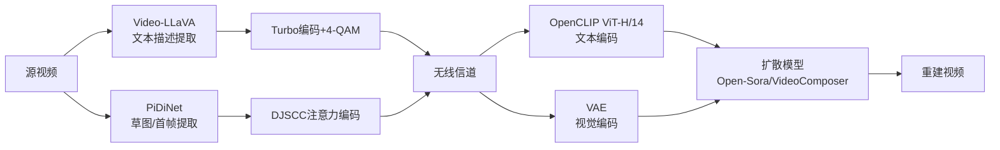
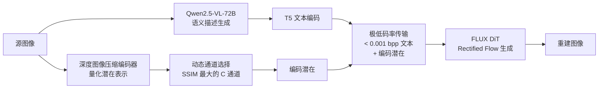
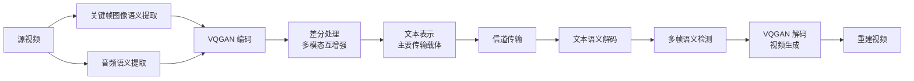
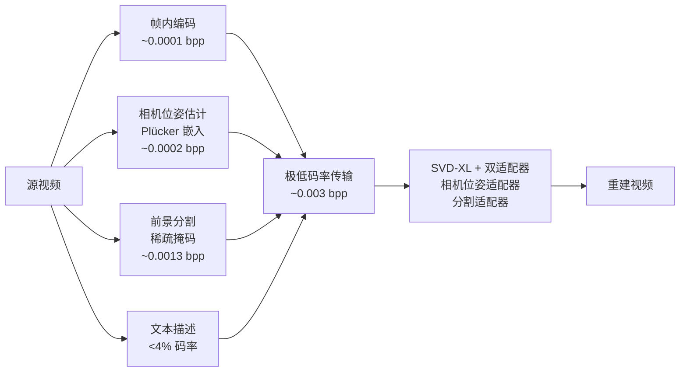
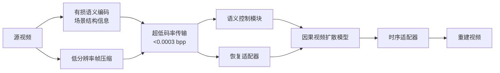

# 语义传输/语义通信核心论文综述

> 调研时间: 2026-03-13
> 覆盖范围: 2024-2026 年语义传输/视频语义通信领域核心论文
> 论文数量: 6 篇

## 目录

1. [GVSC — 多模态融合生成式视频语义通信](#1-gvsc)
2. [GVC — 面向 0.01% 压缩率的生成式视频压缩](#2-gvc)
3. [GSC — 超低码率视觉通信的生成语义编码](#3-gsc)
4. [M3E-VSC — 多模态互增强视频语义通信](#4-m3e-vsc)
5. [CPSGD — 扩散辅助的极端视频压缩](#5-cpsgd)
6. [HFCVD — 实时超低码率因果视频扩散模型](#6-hfcvd)
7. [方案对比表](#方案对比表)
8. [对本项目的综合启示](#对本项目的综合启示)

---

## 1. GVSC

### Generative Video Semantic Communication via Multimodal Semantic Fusion with Large Model

- **作者 / 机构**: Hang Yin, Li Qiao, Yu Ma, Shuo Sun, Kan Li, Zhen Gao, Dusit Niyato
- **发表**: IEEE Transactions on Vehicular Technology, 2025
- **链接**: [arXiv:2502.13838](https://arxiv.org/abs/2502.13838)

#### 方法概述

GVSC 是首个面向无线视频传输的生成式视频语义通信框架。核心思路是在发送端提取视频的语义描述（文本）和视觉条件（草图/首帧），通过信道传输后在接收端利用扩散模型重建视频。

发送端使用 Video-LLaVA 生成视频描述文本，使用 PiDiNet 提取边缘草图。文本通过 Turbo 编码 + 4-QAM 传输，视觉信息通过 DJSCC（深度联合源信道编码）传输。接收端使用 OpenCLIP ViT-H/14 编码文本、VAE 编码视觉信息，再通过 Open-Sora 或 VideoComposer 扩散模型融合多模态语义生成视频。

#### 系统架构



#### 关键指标

| 指标 | 数值 | 对比基线 | 说明 |
|------|------|----------|------|
| CBR（信道带宽比） | 0.0057 | H.264/H.265: 0.008 | 首帧+描述方案 |
| CLIP Score | >0.92 | H.264 在 SNR<5dB 时崩溃 | SNR>0dB，CBR=0.0057 |
| BERT Score | 最高 | 优于 Sketch+Desc / Desc Only | 视频级语义一致性 |
| 文本开销 | 765 bits | — | 平均 95.63 tokens × 8 bits |

**三种传输方案对比**：
| 方案 | CBR | 特点 |
|------|-----|------|
| Sketches+Desc. | 0.003 | 草图序列+描述，结构控制强 |
| Sketch+Desc. | 0.001 | 单张草图+描述，最低带宽 |
| First Frame+Desc. | 0.0057 | 首帧+描述，质量最优 |

#### 优势与局限

- **优势**:
  - 首个完整的端到端视频语义通信框架，考虑了无线信道
  - 三种传输方案可灵活适配不同带宽
  - 在低 SNR（0dB）下仍保持语义一致性，无悬崖效应
  - 损失函数 k=0.3（MSE+LPIPS 加权）经消融验证最优
- **局限**:
  - 依赖 Video-LLaVA 的描述质量
  - 接收端扩散模型推理开销大，实时性受限
  - 像素级指标（PSNR）不如传统编解码器

#### 对本项目的启示

- **首帧+描述** 方案与本项目思路高度吻合，可作为基线方案
- 文本描述的结构化格式（场景/视角/关键元素）值得借鉴
- DJSCC 在有信道噪声时比传统编码更鲁棒，但本项目初期可先用可靠传输简化

---

## 2. GVC

### Generative Video Compression: Towards 0.01% Compression Rate for Video Transmission

- **作者 / 机构**: Xiangyu Chen, Jixiang Luo, Jingyu Xu, Fangqiu Yi, Chi Zhang, Xuelong Li（TeleAI, 中国电信）
- **发表**: arXiv preprint, 2025-12 (v2: 2026-02)
- **链接**: [arXiv:2512.24300](https://arxiv.org/abs/2512.24300)

#### 方法概述

GVC 代表了视频压缩范式的根本性转变：将计算负担从传输转移到推理。编码器将视频压缩为极度紧凑的"压缩 token"（离散+连续表示），接收端的 14B 参数生成式视频模型从最少的传输信息中合成高质量视频。

GVC 采用感知导向和任务导向的通信范式（对应 Shannon-Weaver 模型的 Level C），不追求像素精确还原，而是保留感知和语义效用。

#### 系统架构


#### 关键指标

| 指标 | 数值 | 对比基线 | 说明 |
|------|------|----------|------|
| 压缩率 | 0.02% (0.005 bpp) | HEVC 需 6× 更高码率 | MCL-JCV 数据集 |
| 平均码率 | 0.008 bpp | — | 目标 0.01% 压缩率 |
| LPIPS | 0.180 | HEVC: 0.278 | 感知质量显著优于 HEVC |
| J&F (VOS) | 75.22% | HEVC@0.01bpp: 57.68% | DAVIS2017 视频目标分割 |
| Jaccard | 71.17% | HEVC: 56.84% | 目标分割准确率 |
| 推理延迟 | 0.95-21.5s/GOP | — | RTX 4090 / A100 / H200 |

#### 优势与局限

- **优势**:
  - 实现了目前已报告的最极端压缩率（0.02%）
  - 下游任务（目标分割）性能远超传统编码器
  - 提出了压缩-计算权衡策略，支持消费级 GPU 快速推理
  - 在 AI Flow 框架中实现了实际部署
- **局限**:
  - 依赖 14B 参数的生成模型，接收端算力要求极高
  - 仅与 HEVC 对比，缺乏 VVC 等更新基线的比较
  - 生成质量取决于预训练模型的能力边界
  - 实时性受限于扩散模型推理速度

#### 对本项目的启示

- "传输语义而非像素"的范式转变与本项目方向完全一致
- token 编码方案（关键帧+高级描述符+低级特征）的多层级设计值得参考
- 压缩-计算权衡策略对实际部署有指导意义
- 需关注其接收端 14B 模型的实际部署成本

---

## 3. GSC

### Generative Semantic Coding for Ultra-Low Bitrate Visual Communication and Analysis

- **作者 / 机构**: Weiming Chen, Yijia Wang, Zhihan Zhu, Zhihai He
- **发表**: arXiv preprint, 2025-10
- **链接**: [arXiv:2510.27324](https://arxiv.org/abs/2510.27324)

#### 方法概述

GSC 将图像生成与深度图像压缩无缝融合。发送端使用 Qwen2.5-VL-72B 生成图像描述文本，同时通过预训练深度图像压缩编码器提取量化的潜在表示，从中动态选择 SSIM 值最大的 C 个通道作为"编码潜在"。文本描述和编码潜在共同传输至解码端，使用 FLUX DiT（Rectified Flow 模型）引导生成。

关键创新在于**联合文本+编码潜在引导**：纯文本描述缺乏结构保真度，加入少量编码潜在通道即可大幅提升空间一致性。

#### 系统架构



#### 关键指标

| 指标 | 数值 | 对比基线 | 说明 |
|------|------|----------|------|
| 码率 | 0.0011-0.0150 bpp | PerCo/MS-ILLM | 超低码率区间 |
| 深度估计 δ₁ | 0.866 (C=16) | — | KITTI, 0.015 bpp |
| 语义分割 mIoU | 70.73 (C=16) | — | CityScapes, 0.0039 bpp |
| 目标检测 mAP50 | 0.820 (C=16) | — | COCO2017, 0.0155 bpp |
| 语义分割 mIoU | 63.44 (C=8) | — | CityScapes, 0.0023 bpp |

**通道数 C 与码率/质量的关系**：
| C | 码率 (bpp) | 效果 |
|---|-----------|------|
| 4 | ~0.006 | 基本结构保真 |
| 8 | ~0.010 | 良好平衡 |
| 16 | ~0.015 | 高质量还原 |

#### 优势与局限

- **优势**:
  - 动态通道选择机制优雅地平衡了码率与质量
  - 极低码率（<0.007 bpp）下优于 PerCo 和 MS-ILLM
  - 不仅保持视觉质量，还维持下游视觉分析任务性能
  - 适用于深空探测、战场情报等极端带宽受限场景
- **局限**:
  - 目前仅针对图像，未扩展到视频
  - 依赖 Qwen2.5-VL-72B 和 FLUX，部署成本高
  - 训练仅 15,000 步 / 20K 图像，泛化能力待验证

#### 对本项目的启示

- **"文本+编码潜在"的联合引导** 是一种非常有效的中间方案：比纯文本精确，比全图像压缩经济
- 动态通道选择机制可借鉴到本项目的条件信息选择中
- Qwen2.5-VL 作为描述生成模型的选择与本项目的发送端需求匹配
- 可考虑将此方案从图像扩展到视频帧级处理

---

## 4. M3E-VSC

### Generative Multi-Modal Mutual Enhancement Video Semantic Communications

- **作者 / 机构**: Yuanle Chen, Haobo Wang, Chunyu Liu, Linyi Wang, Jiaxin Liu, Wei Wu — 南京邮电大学
- **发表**: Computer Modeling in Engineering & Sciences (CMES), Vol.139 No.3, 2024
- **链接**: [DOI:10.32604/cmes.2023.046837](https://www.techscience.com/CMES/v139n3/55647)

#### 方法概述

M3E-VSC 基于 VQGAN（矢量量化生成对抗网络）构建，核心创新是多模态互增强：从视频关键帧提取图像语义，从音频提取语音语义，通过差分处理产生紧凑的文本表示。以文本为主要传输载体，结合多帧语义检测模块在接收端生成视频。

多模态互增强网络利用 VQGAN 和集合差分处理增强多模态语义信息，将完整视频语义转化为文本表示和音频/图像模态间的差分信息。

#### 系统架构



#### 关键指标

| 指标 | 数值 | 对比基线 | 说明 |
|------|------|----------|------|
| 传输效率 | 文本为主载体 | 传统视频编码 | 极低码率传输 |
| 语义相似度 | 提升约 50% | 传统方法 | 低 SNR 条件下准确率和速度 |
| 鲁棒性 | 高 | — | 复杂噪声环境下表现稳定 |
| 评估维度 | 码率/语义相似度/SSIM/检测精度/音色相似度 | — | 多维评估体系 |

#### 优势与局限

- **优势**:
  - 多模态（文本+图像+音频）互增强，信息更完整
  - 差分处理机制降低冗余传输
  - 在低 SNR 条件下鲁棒性显著优于传统方案
  - 多帧语义检测支持视频时序连贯性
- **局限**:
  - 基于 VQGAN 而非更新的扩散模型，生成质量有上限
  - 音频模态对本项目（视频画面传输）价值有限
  - 缺乏与近期扩散模型方案的对比
  - 具体量化指标（PSNR/SSIM 数值）在公开摘要中不够详细

#### 对本项目的启示

- 多模态互增强的思路可借鉴：即使不传输音频，图像+文本的互增强也有价值
- 差分处理（只传变化量）的思路对视频帧序列传输效率提升有参考意义
- VQGAN 架构作为基线对比有参考价值，但本项目应优先考虑扩散模型方案

---

## 5. CPSGD

### Diffusion-aided Extreme Video Compression with Lightweight Semantics Guidance

- **作者 / 机构**: Maojun Zhang, Haotian Wu, Richeng Jin, Deniz Gunduz, Krystian Mikolajczyk
- **发表**: ICASSP 2026 (已录用)
- **链接**: [arXiv:2602.05201](https://arxiv.org/abs/2602.05201)

#### 方法概述

CPSGD 将语义理解与扩散模型先验结合实现极端视频压缩。不同于传统方法依赖时空冗余消除，本方法压缩高级语义表示并用条件扩散模型在接收端重建。

关键创新在于轻量级语义引导设计：将运动信息分解为背景（相机位姿轨迹，Plücker 嵌入）和前景（稀疏分割掩码）两部分，结合文本描述和空间编码进行传输。接收端使用微调的 Stable Video Diffusion-XL（SVD-XL）双适配器进行条件生成。

#### 系统架构



#### 关键指标

| 指标 | 数值 | 对比基线 | 说明 |
|------|------|----------|------|
| 总码率 | ~0.003 bpp | DCVC-FM: ~0.005 bpp | 极低码率 |
| 帧内编码 | ~1.02×10⁻⁴ bpp | — | 占比 1-3% |
| 相机位姿 | ~2.3×10⁻⁴ bpp | — | 占比 3-10% |
| 分割掩码 | ~1.33×10⁻³ bpp | — | 占比 23-43%（最大） |
| 评估指标 | LPIPS/FVD/CLIP/VBench | H.264/H.265/DCVC-FM | 低于 0.01 bpp 时超越 H.265 |

**码率构成分析**：
| 组件 | 码率 (bpp) | 占比 | 信息内容 |
|------|-----------|------|----------|
| 帧内编码 | ~0.0001 | 1-3% | 参考帧信息 |
| 相机位姿 | ~0.0002 | 3-10% | 全局运动 |
| 分割掩码 | ~0.0013 | 23-43% | 前景动态 |
| 文本描述 | <4% | <4% | 场景语义 |
| 空间编码 | 可变 | 剩余 | 空间细节 |

#### 优势与局限

- **优势**:
  - 语义引导组件轻量化，传输开销极小
  - 运动信息解耦（背景/前景）设计精巧
  - 在 <0.01 bpp 超低码率下超越 H.265 和学习型编解码器
  - 基于 SVD-XL 微调，复用强大的视频生成先验
- **局限**:
  - 分割掩码占码率最大比例（23-43%），压缩空间有限
  - SVD-XL 微调需要 40,000 步训练
  - 评估分辨率仅 512×512
  - 相机位姿估计在复杂场景中可能不稳定

#### 对本项目的启示

- 码率构成分析非常有参考价值：分割掩码 > 空间编码 > 位姿 > 文本
- 运动信息解耦思路可借鉴：相机位姿（全局）+ 前景分割（局部）
- SVD-XL 微调方案为本项目接收端提供了具体的实现参考
- 当前 ComfyUI 工作流的 Canny 边缘提取可替换为更紧凑的语义分割

---

## 6. HFCVD

### High-Fidelity Causal Video Diffusion Models for Real-Time Ultra-Low-Bitrate Semantic Communication

- **作者 / 机构**: Cem Eteke, Batuhan Tosun, Alexander Griessel, Wolfgang Kellerer, Eckehard Steinbach
- **发表**: arXiv preprint, 2026-02
- **链接**: [arXiv:2602.13837](https://arxiv.org/abs/2602.13837)

#### 方法概述

HFCVD 面向实时通信场景设计，结合有损语义视频编码传输场景结构信息，辅以高度压缩的低分辨率帧流维持视觉质量。系统包含三个核心组件：语义控制模块、恢复适配器和时序适配器。

关键创新是因果视频扩散模型设计：通过时序蒸馏实现 300× 可训练参数削减和 2× 训练加速，在超低码率（<0.0003 bpp）下保持高保真度和时序一致性。

#### 系统架构



#### 关键指标

| 指标 | 数值 | 对比基线 | 说明 |
|------|------|----------|------|
| 码率 | <0.0003 bpp | 传统/神经/生成式基线 | 已报告的最低码率之一 |
| 参数效率 | 300× 参数削减 | 全模型微调 | 时序蒸馏 |
| 训练效率 | 2× 加速 | 全模型训练 | 时序蒸馏 |
| 评估维度 | 感知质量/语义保真/时序一致性 | — | 定量+定性+主观评估 |

#### 优势与局限

- **优势**:
  - 面向实时通信设计，因果生成（非全序列依赖）
  - 时序蒸馏大幅降低训练和部署成本
  - 码率极低（<0.0003 bpp），比其他方案低一个数量级
  - 综合评估（定量+定性+主观）表明全面优于基线
- **局限**:
  - 预印本阶段，具体量化指标数值尚未完全公开
  - "因果"设计可能限制长时序建模能力
  - 低分辨率帧流增加了传输开销

#### 对本项目的启示

- 因果生成设计对实时传输场景至关重要，本项目如需实时性应参考
- 时序蒸馏技术可大幅降低部署门槛
- "语义编码+低分辨率帧"双流传输是一种务实的质量保障策略

---

## 方案对比表

### 核心架构对比

| 论文 | 发送端模型 | 接收端模型 | 传输内容 | 最低码率 |
|------|-----------|-----------|----------|----------|
| GVSC | Video-LLaVA + PiDiNet | Open-Sora / VideoComposer | 文本+草图/首帧 | CBR 0.001 |
| GVC | 神经编码器 | 14B 扩散模型 | 压缩 token（关键帧+描述符+特征） | 0.005 bpp |
| GSC | Qwen2.5-VL-72B + 压缩编码器 | FLUX DiT | 文本+编码潜在通道 | 0.0011 bpp |
| M3E-VSC | 关键帧+音频语义提取 | VQGAN | 文本（主）+差分信息 | 文本级 |
| CPSGD | 位姿+分割+文本提取 | SVD-XL + 双适配器 | 位姿+分割+文本+空间码 | 0.003 bpp |
| HFCVD | 语义编码器+帧压缩 | 因果视频扩散模型 | 语义结构+低分辨率帧 | <0.0003 bpp |

### 对比维度分析

| 维度 | GVSC | GVC | GSC | M3E-VSC | CPSGD | HFCVD |
|------|------|-----|-----|---------|-------|-------|
| **传输内容** | 文本+视觉条件 | 多层级 token | 文本+编码潜在 | 文本+差分 | 语义+结构 | 语义+低分辨率帧 |
| **生成架构** | 扩散模型 | 扩散模型 | Rectified Flow | VQGAN/GAN | 扩散模型 | 因果扩散 |
| **视频支持** | ✅ | ✅ | ❌（仅图像） | ✅ | ✅ | ✅ |
| **信道适应** | ✅ (DJSCC) | ❌ | ❌ | ✅ | ❌ | ✅ |
| **实时性** | 受限 | 受限 | 受限 | 中等 | 受限 | 较好（因果） |
| **部署难度** | 高 | 极高(14B) | 高(72B+FLUX) | 中等 | 高(SVD-XL) | 中等（蒸馏） |
| **开源状态** | 未开源 | 未开源 | 待开源 | 未开源 | 未开源 | 未开源 |

### 质量-码率权衡

```
码率 (bpp)    <0.001     0.001-0.005    0.005-0.01    >0.01
             ←————————— 极低码率 ——————————→
HFCVD     ●(<0.0003)
GSC            ●(0.001-0.015)
GVSC           ●(CBR 0.001-0.006)
CPSGD                ●(0.003)
GVC                      ●(0.005-0.008)
M3E-VSC   ●(文本级)
```

---

## 对本项目的综合启示

### 1. 技术路线确认

所有论文均验证了"传输语义而非像素"的可行性。在 <0.01 bpp 的超低码率下，生成式方案全面超越传统编解码器（H.264/H.265），本项目的技术路线方向正确。

### 2. 发送端设计建议

- **图像描述**：Qwen2.5-VL 系列（GSC 使用 72B 版本）和 Video-LLaVA（GVSC 使用）是主流选择
- **结构条件**：从 Canny 边缘（当前 ComfyUI 工作流）可逐步升级到：
  - 语义分割掩码（CPSGD 验证有效，占码率 23-43%）
  - 深度图 / 法线图
  - 编码潜在通道（GSC 的动态通道选择）
- **多层级传输**：GVC 的"关键帧+高级描述符+低级特征"多层级方案值得参考

### 3. 接收端设计建议

- **扩散模型**是主流选择（6 篇中 5 篇使用扩散/Flow 模型）
- 可选方案梯度：
  - 轻量级：当前 Z-Image-Turbo（9 步采样，速度快）
  - 中等：SVD-XL 微调（CPSGD 方案）
  - 高质量：FLUX DiT（GSC 方案）/ Open-Sora（GVSC 方案）
- VQGAN（M3E-VSC）适合作为快速基线但质量上限有限

### 4. 实际部署考量

- **实时性**：因果生成（HFCVD）和时序蒸馏是解决实时性的关键技术
- **部署成本**：大多数方案需要大参数模型（14B-72B），需关注端侧部署可行性
- **渐进方案**：建议从当前 ComfyUI 工作流（Z-Image-Turbo + Canny）出发，逐步替换优化

### 5. 与当前 ComfyUI 工作流的对接

当前工作流的对应关系：
| 当前组件 | 论文中的对应 | 可改进方向 |
|----------|-------------|-----------|
| 手动 prompt | Video-LLaVA / Qwen2.5-VL 自动生成 | 高优先级：自动化描述生成 |
| Canny 边缘 | 语义分割 / 编码潜在 / 深度图 | 中优先级：更高效的条件表示 |
| Z-Image-Turbo | FLUX / SVD-XL / Open-Sora | 低优先级：视质量需求决定 |
| 单帧处理 | 视频级处理（时序一致性） | 中优先级：视频扩展 |
