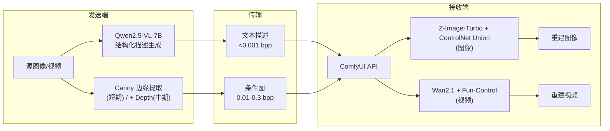
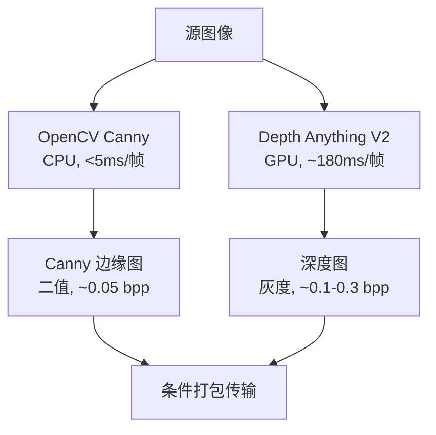
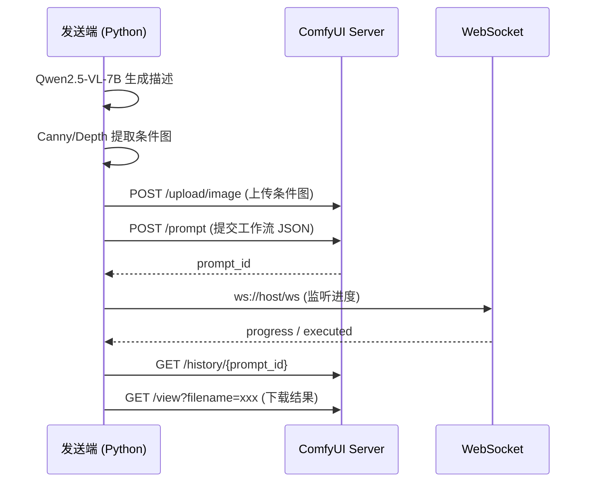
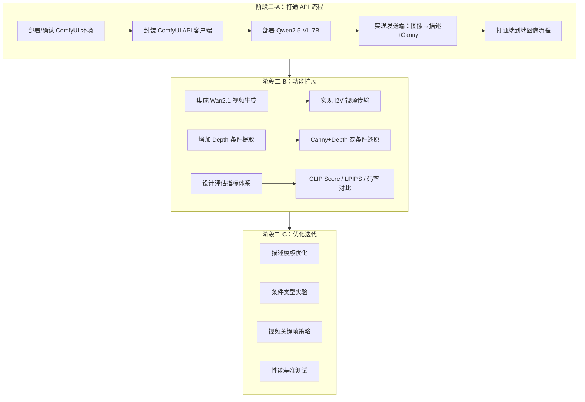

# 语义传输预研 — 调研汇总与技术选型建议

> 编写时间：2026-03-13
> 基于：G-03 论文综述、G-04 开源项目评估、G-05 视觉理解模型对比、G-06 生成模型对比、G-07 条件控制方案对比

## 目录

1. [调研结论概览](#1-调研结论概览)
2. [端到端方案推荐](#2-端到端方案推荐)
3. [发送端选型](#3-发送端选型)
4. [接收端选型](#4-接收端选型)
5. [条件控制选型](#5-条件控制选型)
6. [框架与集成路径](#6-框架与集成路径)
7. [推荐方案预期效果与限制](#7-推荐方案预期效果与限制)
8. [阶段二关键验证项](#8-阶段二关键验证项)
9. [分阶段实施路线图](#9-分阶段实施路线图)

---

## 1. 调研结论概览

### 1.1 论文调研（G-03）

6 篇核心论文（GVSC、GVC、GSC、M3E-VSC、CPSGD、HFCVD）共同验证了"传输语义而非像素"的技术路线可行性。在 <0.01 bpp 超低码率下，生成式方案全面超越 H.264/H.265。

**关键共识**：
- 发送端均使用 VLM（视觉语言模型）自动生成文本描述
- 接收端均使用扩散/Flow 模型重建视觉内容（6 篇中 5 篇）
- 文本描述的传输成本极低（<4% 码率），但信息密度最高
- 纯文本无法保证结构保真度，需要辅助条件信息

### 1.2 开源项目调研（G-04）

- **端到端视频语义通信开源系统尚不存在**，需自行组装
- ComfyUI API 是最成熟的基础设施（80k+ Stars，REST API + WebSocket）
- WanVideoWrapper（6.2k Stars）是视频生成节点的最佳选择
- DiffEIC 的"潜在特征引导 + 扩散重建"架构可参考

### 1.3 视觉理解模型调研（G-05）

- **首选 Qwen2.5-VL-7B**：GSC 论文验证同系列有效性，7B 版本单卡可部署，支持结构化输出和动态分辨率
- **备选 InternVL2.5-8B**：MVBench (72.0) 和 MMBench (84.6) 优于 Qwen2.5-VL-7B

### 1.4 生成模型调研（G-06）

- **图像首选 Z-Image-Turbo**：零迁移成本，8 步采样，6GB 显存，ControlNet Union
- **视频首选 Wan2.1**：VBench 第一，Apache 2.0，Fun-Control ControlNet
- **备选 FLUX.1 schnell**（图像高质量模式）和 HunyuanVideo 1.5（视频备选）

### 1.5 条件控制调研（G-07）

- 8 种条件类型对比，短期继续使用 Canny，中期增加 Depth 双条件融合
- Z-Image-Turbo Union 仅支持 Canny/HED/Depth/Pose/MLSD，不支持 Segment/Normal/Lineart
- 长期目标：GSC 编码潜在通道方案（信息密度远高于人为设计的条件特征）

---

## 2. 端到端方案推荐

### 2.1 推荐方案总览



### 2.2 方案论据

本方案的每一个选择均有调研数据支撑：

| 组件 | 选择 | 论据来源 |
|------|------|---------|
| 发送端 VLM | Qwen2.5-VL-7B | GSC 论文验证 72B 版本有效，7B 版本性价比最优（G-05） |
| 结构条件 | Canny → Canny+Depth | GVSC 使用边缘草图，Z-Image-Turbo Union 已支持（G-07） |
| 图像生成 | Z-Image-Turbo | 当前工作流已使用，零迁移成本，8 步低延迟（G-06） |
| 视频生成 | Wan2.1 | VBench 第一，WanVideoWrapper 生态活跃（G-04、G-06） |
| 集成框架 | ComfyUI API | REST API 成熟，7 个核心端点文档完整（G-04） |

---

## 3. 发送端选型

### 3.1 视觉理解模型

#### 主选：Qwen2.5-VL-7B

| 维度 | 评估 |
|------|------|
| 描述精度 | MMMU 58.6, MMBench 82.6, Video-MME 65.1 |
| 部署要求 | FP16 ~18GB, INT4 量化 ~8GB, 单卡 RTX 4090 可运行 |
| 结构化输出 | 原生支持 JSON 格式和 bounding box 定位 |
| 视频支持 | 动态 FPS 采样，支持小时级长视频，秒级事件定位 |
| 许可证 | Apache 2.0 |
| 论文验证 | GSC 论文使用 Qwen2.5-VL-72B（同系列） |

**使用方式**：
- 原型阶段：本地部署 7B 版本（vLLM / Transformers）
- 快速验证：qwen-vl-max API（$0.80/1M tokens 输入）
- 质量上限：72B 版本或 API

#### 备选：InternVL2.5-8B

在以下场景考虑切换：
- Qwen2.5-VL-7B 的描述质量不满足还原需求
- 需要更强的视觉编码（InternVL 的 6B ViT 在 26B+ 版本中有优势）

### 3.2 描述生成策略

参考 GVSC 论文和现有 ComfyUI 工作流的 prompt 结构，建议采用分层描述模板：

```
[场景风格] 场景的整体风格和氛围
[视角/构图] 拍摄角度、画面构图
[主体元素] 主要物体及其属性（颜色、材质、姿态）
[空间关系] 物体之间的相对位置
[背景环境] 背景描述
[光照条件] 光源方向、强度、阴影
```

此模板与当前工作流的 `[Scene Style]/[Perspective]/[Key Elements]` 格式兼容。

---

## 4. 接收端选型

### 4.1 图像生成

#### 主选：Z-Image-Turbo

| 维度 | 评估 |
|------|------|
| 采样步数 | 8 步（亚秒级延迟） |
| 显存 | ~6GB（消费级 GPU 即可） |
| ControlNet | Union 模型，支持 Canny/HED/Depth/Pose/MLSD |
| ComfyUI | 原生支持，当前工作流已在使用 |
| 许可证 | Apache 2.0 |
| 迁移成本 | 零 |

#### 备选：FLUX.1 schnell（高质量模式）

适用场景：资源充足、追求最高还原质量时使用。

| 维度 | 评估 |
|------|------|
| 采样步数 | 4 步 |
| 显存 | ~24GB (BF16), ~12GB (FP8) |
| ControlNet | 官方 Canny/Depth |
| 论文验证 | GSC 论文使用 FLUX DiT |

### 4.2 视频生成

#### 主选：Wan2.1

| 维度 | 评估 |
|------|------|
| 质量 | VBench 86.22%（第一名） |
| 模式 | T2V（文生视频）+ I2V（图生视频） |
| ControlNet | Fun-Control + 8 步快速 LoRA |
| ComfyUI | WanVideoWrapper（6.2k Stars） |
| 许可证 | Apache 2.0 |
| 部署 | 1.3B 版本仅需 8GB 显存 |

**I2V 模式**与 GVSC 论文的"首帧+描述"方案完全吻合：发送端传输首帧 + 文本描述，接收端用 Wan2.1 I2V 生成后续帧序列。

#### 备选：HunyuanVideo 1.5

适用场景：需要更好的时序一致性，或 Wan2.x 在特定场景表现不佳时。注意地域许可限制（EU/UK/韩国除外）。

### 4.3 图像 vs 视频模式选择

| 传输场景 | 推荐模式 | 理由 |
|---------|---------|------|
| 单帧/低帧率 | Z-Image-Turbo 逐帧生成 | 延迟最低，质量稳定 |
| 连续视频 | Wan2.1 I2V | 时序一致性更好，符合论文验证路径 |
| 实时通信 | Z-Image-Turbo + 关键帧策略 | 分钟级视频生成延迟不适合实时 |

---

## 5. 条件控制选型

### 5.1 条件类型推荐

| 阶段 | 条件组合 | 估算码率 | 理由 |
|------|---------|---------|------|
| 短期 | Canny + 文本 | ~0.05 bpp + <0.001 bpp | 当前工作流已验证，零迁移成本 |
| 中期 | Canny + Depth + 文本 | ~0.15 bpp + <0.001 bpp | Z-Image-Turbo Union 同时支持，空间布局+边界精度 |
| 长期 | 编码潜在通道 + 文本 | ~0.006-0.015 bpp | GSC 方案，信息密度最高，需定制训练 |

### 5.2 条件提取管线



短期仅需 Canny 分支（CPU，无 GPU 依赖），中期增加 Depth 分支。

### 5.3 Z-Image-Turbo Union 条件支持矩阵

| 条件类型 | 支持 | 码率 | 适用性 |
|---------|------|------|--------|
| Canny | ✅ | 极低 | 短期主力 |
| HED | ✅ | 低 | Canny 的平滑替代 |
| Depth | ✅ | 中 | 中期增加 |
| Pose | ✅ | 极低 | 仅人物场景 |
| MLSD | ✅ | 低 | 建筑/室内场景 |
| Segment | ❌ | 低 | 需换用 xinsir Union |
| Normal | ❌ | 高 | 不推荐 |
| Lineart | ❌ | 低 | 需换用独立 ControlNet |

**约束**：短期和中期方案受限于 Z-Image-Turbo Union 的条件类型支持范围。若需语义分割条件，需评估换用 xinsir Union 或独立 ControlNet 的代价。

---

## 6. 框架与集成路径

### 6.1 ComfyUI API 集成

阶段二基于 ComfyUI REST API 搭建原型，核心调用流程：



### 6.2 技术栈总结

| 层次 | 技术选择 | 说明 |
|------|---------|------|
| 开发语言 | Python | 主要开发语言 |
| 包管理 | uv | 项目规范 |
| 发送端 VLM | Qwen2.5-VL-7B (vLLM/Transformers) | 本地部署 |
| 条件提取 | OpenCV (Canny) + Depth Anything V2 | CPU + GPU |
| 接收端框架 | ComfyUI API | REST API + WebSocket |
| 图像生成 | Z-Image-Turbo + ControlNet Union | 现有工作流 |
| 视频生成 | Wan2.1 + WanVideoWrapper | ComfyUI 节点 |
| 代码检查 | ruff | 项目规范 |

---

## 7. 推荐方案预期效果与限制

### 7.1 预期效果

基于论文数据的推算，推荐方案在不同条件组合下的预期表现：

| 配置 | 预期码率 | 预期感知质量 | 参考论文 |
|------|---------|------------|---------|
| Canny + 文本 (图像) | ~0.05 bpp | CLIP Score >0.90 | GVSC (PiDiNet+文本) |
| Canny + Depth + 文本 (图像) | ~0.15 bpp | 优于纯 Canny | GSC (多条件融合) |
| 首帧 + 文本 (视频) | CBR ~0.006 | CLIP Score >0.92 | GVSC (First Frame+Desc) |

注意：以上为论文报告值，实际效果取决于 VLM 描述质量和生成模型能力，需阶段二实测验证。

### 7.2 已知限制

| 限制 | 影响 | 缓解措施 |
|------|------|---------|
| VLM 描述质量制约还原上限 | 描述遗漏或不准确导致还原偏差 | 设计结构化描述模板，约束输出格式 |
| Z-Image-Turbo Union 条件类型有限 | 不支持 Segment/Normal/Lineart | 短期可接受，中期评估换用成本 |
| 视频生成延迟高 | Wan2.1 14B 约 9 分钟/5 秒片段 | 使用 1.3B 版本或 8 步快速 LoRA |
| 无信道适应机制 | 不适应无线信道噪声 | 初期使用可靠传输（TCP），后续可引入 DJSCC |
| 像素级指标（PSNR）可能不佳 | 论文普遍指出生成式方案像素精确度低 | 使用感知指标（LPIPS、CLIP Score）评估 |
| 本机无 ComfyUI | 需远程调用或部署 | 阶段二首要任务是确认 ComfyUI 部署环境 |

---

## 8. 阶段二关键验证项

以下是阶段二原型搭建前需要验证的关键假设，按优先级排序：

### P0：必须验证

| # | 验证项 | 验证方法 | 预期结果 |
|---|--------|---------|---------|
| 1 | ComfyUI API 可远程调用 | 在远程服务器启动 ComfyUI，Python 调用 `/prompt` 端点 | 成功提交工作流并获取结果 |
| 2 | Qwen2.5-VL-7B 描述质量足够 | 对 20+ 测试图像生成描述，送入 Z-Image-Turbo 还原 | CLIP Score >0.85 |
| 3 | 端到端流程可打通 | 图像 → VLM 描述 → Canny → ComfyUI API → 重建图像 | 全流程自动化完成 |

### P1：应当验证

| # | 验证项 | 验证方法 | 预期结果 |
|---|--------|---------|---------|
| 4 | 结构化描述模板遵循度 | 设计模板，测试 Qwen2.5-VL-7B 遵循率 | >90% 的描述符合模板格式 |
| 5 | Canny+Depth 双条件 vs 纯 Canny | 同一组图像，对比还原质量 | 双条件 LPIPS 优于纯 Canny |
| 6 | Wan2.1 I2V 视频生成可用性 | 首帧+文本 → WanVideoWrapper → 视频 | 生成视频时序连贯 |

### P2：可以验证

| # | 验证项 | 验证方法 | 预期结果 |
|---|--------|---------|---------|
| 7 | Qwen2.5-VL-7B vs InternVL2.5-8B 描述质量 | 同一组图像，对比两个模型的描述→还原效果 | 确定最优发送端模型 |
| 8 | 不同 Canny 阈值对还原质量的影响 | 测试多组阈值，对比 CLIP Score | 找到最优阈值 |
| 9 | 视频帧率 vs 质量权衡 | 不同关键帧间隔下的视频还原效果 | 确定最优关键帧策略 |

---

## 9. 分阶段实施路线图



### 各子阶段核心产出

| 子阶段 | 核心产出 | 关键依赖 |
|--------|---------|---------|
| 二-A | 端到端图像语义传输 demo | ComfyUI 环境、Qwen2.5-VL-7B 部署 |
| 二-B | 视频传输 + 双条件控制 | Wan2.1 模型、Depth Anything V2 |
| 二-C | 优化后的传输方案 + 性能报告 | 评估指标体系 |
