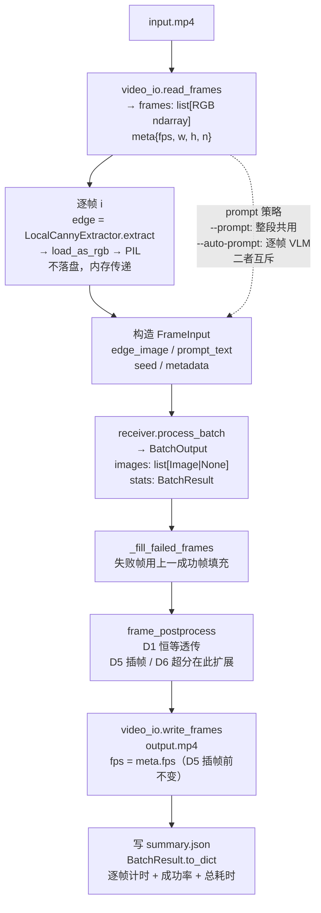

# D1 保底骨架设计：video→video 闭环（设计）

> 工作分支 `feature/video-stream-pipeline` | 编制 2026-06-22（冲刺 D1） | 单机离线骨架
> 上游依据：[6 天冲刺规划](2026-06-21-video-stream-6day-plan-design.md) §3 D1 行、[视频流技术方案](../../research/2026-06-21-video-stream-tech-scout.md)、[ROADMAP](../../ROADMAP.md) 阶段三
> 本 spec 只覆盖 D1 主线保底骨架；H1 结构遵循度 PoC 是独立支线（另会话/独立 worktree），不在本文范围

## 1. 背景与目标

6 天冲刺 D1 主线任务：新建视频读写模块与编排，跑通**保底骨架**——
`video → 拆帧 → 现有逐帧管道 → 收帧 → 合成 video`（小分辨率短片）。
本轮**不追实时、不追质量**，只验证离线闭环可跑通，并为 D2（relay 双机）、
D5（RIFE 插帧）、D6（超分）预留干净的接口。**保底版用现有 Z-Image 接收端，不依赖 klein**。

## 2. 范围边界

**范围内**

- 单机离线 `video→video` 闭环：解码 → 逐帧 Canny + prompt → `receiver.process_batch` → `frame_postprocess`（空）→ 编码
- 小分辨率短片跑通 + 逐帧/整段统计（复用 `BatchResult`）
- 新增 `common/video_io.py`、`pipeline/video_pipeline.py`、`cli/video.py`
- 单测（不依赖 GPU，用 fake receiver）

**范围外（明确不做）**

- relay 双机路径 → D2
- 真实行车视频测试 → D3
- klein 主线 / 插帧 / 超分 → D4–D6（`frame_postprocess` 仅留空钩子）
- 流式 I/O、相机/RTSP 输入 → 7 月目标版
- VLM 逐帧描述默认关闭（接口保留，见 §4）

**复用现有资产**

- `sender/local_condition_extractor.py::LocalCannyExtractor`（逐帧 Canny）
- `receiver/base.py::BaseReceiver.process_batch(list[FrameInput]) -> BatchOutput`（帧序列抽象，已含逐帧异常兜底 + 计时 + `BatchResult` 统计）
- `receiver/base.py::FrameInput`（每帧自带 `edge_image` / `prompt_text` / `seed` / `metadata`）
- `common/image_io.py::load_as_rgb` / `image_to_numpy`
- `receiver/__init__.py::create_receiver`（现有 Z-Image Diffusers 接收端）
- `pipeline/batch_processor.py::BatchResult` / `SampleResult`（统计与 JSON 序列化）

## 3. 组件与模块放置

| 模块 | 职责 | 新/改 |
|---|---|---|
| `common/video_io.py` | imageio[ffmpeg] 封装：`read_frames(path) -> (frames, VideoMeta)`、`write_frames(path, frames, fps)`；`VideoMeta` 含 fps/尺寸/帧数 | 新增 |
| `pipeline/video_pipeline.py` | `VideoPipeline` 编排类：decode → 逐帧 Canny + 构造 `FrameInput` → `process_batch` → `frame_postprocess` → encode；持有可注入的 `frame_postprocess` 钩子（默认恒等透传） | 新增 |
| `pipeline/video_pipeline.py` | `FramePostprocessor` 协议 + `identity_postprocess` 默认实现（序列级 `list[Image] -> list[Image]`） | 新增 |
| `cli/video.py` | 薄子命令 `semantic-tx video`：`--input/--output/--prompt/--auto-prompt/--threshold1/--threshold2/--seed/--fps`，构造并运行 `VideoPipeline` | 新增 |
| `cli/main.py` | 注册 `video` 子命令 | 改 |
| 依赖 | `uv add "imageio[ffmpeg]"`（自动改 `pyproject.toml` + `uv.lock`；含捆绑静态 ffmpeg 二进制 `imageio-ffmpeg`） | 改 |

### video_io 接口草案

```python
@dataclass
class VideoMeta:
    fps: float
    width: int
    height: int
    frame_count: int

def read_frames(path: str | Path) -> tuple[list[NDArray[np.uint8]], VideoMeta]:
    """解码视频为 RGB ndarray 帧列表 + 元数据。空/损坏视频抛 ValueError。"""

def write_frames(path: str | Path, frames: list[Image.Image], fps: float) -> None:
    """将 PIL 帧列表编码为视频。空帧列表抛 ValueError。"""
```

### frame_postprocess 钩子草案

```python
FramePostprocessor = Callable[[list[Image.Image]], list[Image.Image]]

def identity_postprocess(frames: list[Image.Image]) -> list[Image.Image]:
    """D1 恒等透传。D5 插帧（返回更长帧列表）/ D6 超分（逐帧映射）替换此实现。"""
    return frames
```

序列级签名（`list -> list`）的理由：插帧会**改变帧数**（关键帧间插入新帧），逐帧签名干不了；序列级同时容纳插帧（增帧）与超分（逐帧映射），是最贴目标版「关键帧+插帧+超分」架构的接口形态。

## 4. 数据流



**prompt 策略（沿用 demo/batch_demo 约定）**

- `--prompt "文本"`：整段共用一条，所有帧 `prompt_text` 相同（D1 默认路径，最快跑通骨架）
- `--auto-prompt`：逐帧 VLM（Qwen2.5-VL）生成；循环外加载一次、结束 `unload()`
- 二者互斥（`UsageError` 校验，与现有 CLI 一致）
- `FrameInput` 每帧自带 `prompt_text`，两种模式仅构造列表时填值不同，零额外抽象

**关键实现点**

- **edge 不落盘**：`FrameInput.edge_image` 直接吃内存 PIL，省每帧磁盘 IO 往返
- **fps**：输出沿用输入 fps（D5 插帧才会倍增）
- **seed**：`--seed` 透传给每帧（帧间一致性是目标版课题，D1 不展开）

## 5. 错误处理

- `process_batch` 已有逐帧异常兜底：失败帧返回 `None` 并记进 `BatchResult`
- **失败帧填充**：用上一成功帧填充，保证输出帧数 = 输入帧数、视频不断流；若**首帧即失败**则向后找第一帧成功帧回填；**全部失败**则抛错退出（无可用帧）
- `video_io.read_frames`：空/损坏视频抛 `ValueError`（清晰报错）；`--input` 用 `click.Path(exists=True)` 前置校验
- `video_io.write_frames`：空帧列表抛 `ValueError`
- VLM auto 模式：循环外加载一次、`finally` 中 `unload()` 释放显存（沿用 batch_demo 模式）

## 6. 测试

- `tests/test_video_io.py`：`write_frames` 再 `read_frames` 往返，断言帧数 / 尺寸一致；空帧列表 / 空视频抛 `ValueError`
- `tests/test_video_pipeline.py`：合成微视频（几帧纯色/噪声）+ **fake receiver**（每帧返回固定图，不碰 GPU），断言：
  - decode→编排→encode **帧数守恒**、fps 透传
  - `frame_postprocess` 被调用（用可观测的 spy/自定义钩子验证）
  - **失败帧填充**逻辑（fake receiver 故意对某帧抛异常）
  - 全失败抛错
- **冒烟**（手动，需 GPU，不进 CI）：真实小分辨率短片走 `semantic-tx video` 跑通，产出 `output.mp4` + `summary.json`
- CI 只跑不依赖 GPU 的单测（fake receiver），符合现有「CI 无 CUDA」约束

## 7. 交付物

- `common/video_io.py`、`pipeline/video_pipeline.py`、`cli/video.py`、`cli/main.py` 注册
- `tests/test_video_io.py`、`tests/test_video_pipeline.py`
- `pyproject.toml` + `uv.lock` 依赖更新（`uv add`）
- 工作分支 `feature/video-stream-pipeline` → PR

## 8. 验收口径（D1）

- `semantic-tx video --input <小短片> --prompt "..."` 跑通，输出同长度 `output.mp4` + `summary.json`
- 单测全绿（`uv run pytest tests/test_video_io.py tests/test_video_pipeline.py`）
- `uv run ruff check .` 与 `uv run ruff format --check .` 通过
- 不依赖 klein、不依赖 relay——保底红线（D3 闭环）的第一块基石就位
