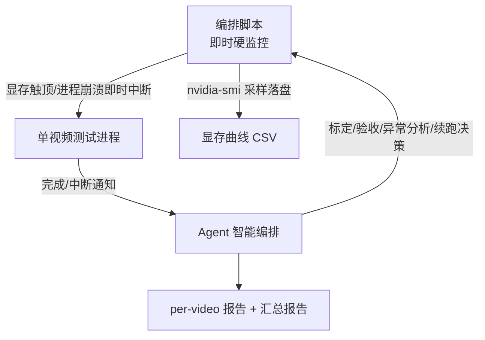

# 视频流语义传输·自动化测试方案（设计 + 标定留档）

> 编制 2026-06-28 | 定位：**后续全量测试 / 正式 M1 验收的参考资产**，非待执行清单
> 上游：[6 天冲刺规划](2026-06-21-video-stream-6day-plan-design.md)、[技术方案](../../research/2026-06-21-video-stream-tech-scout.md)

## 0. 定位与结论先行

本文档既是**测试方案设计**，也是 **2026-06-28 标定结果的留档**。

- **本次工作的真实目的是「打通保底版 video→video 流程」**，已达成（见 §1）。3-4 组标定已验证链路每个环节 + 异常处理机制，**全量 10 个视频非本次必需**。
- 本方案写死了标定出的**实测基线**（§2），供后续真要全量跑 / 正式 M1 验收时直接参考，无需重新标定。
- 唯一未实跑环节：**双机 relay 演示**（M1 完整验收要求「单机 + 双机各一次」）。relay 代码已随 PR #52 合并、单测全过，属「就绪待演示」。

## 1. 本次已打通的链路（3 组验证）

测试视频：`resources/test_videos/prepared/` 下 10 个 `.h265` 转码产物（10s / 6fps / 60 帧 / 640×480 或 360）。实跑 3 组：C104_093008（token512）、C1X_112728（token256）、C104_093113（token512 + 产物）。

| 环节 | 验证结果 |
|------|----------|
| `.h265` 裸流 → ffmpeg 转码 mp4 | ✅ imageio 无法直接解码裸流，必须先转码 |
| VLM auto-prompt 逐帧描述 | ✅ |
| 显存错峰修复（VLM 描述完先 unload 再加载 Diffusers）| ✅ 三组曲线均呈两段式 + 中间降回 |
| Diffusers 逐帧生成 | ✅ |
| video→video 闭环 | ✅ 60/60 帧 × 3 组全 100% 成功 |
| 中间产物保存（prompts.json + edges/）| ✅ |
| 质量评估（PSNR/SSIM/LPIPS/CLIP）| ✅ 顺带修了 CLIP 两个 bug |
| 监控 + 异常自动接管 | ✅ 一次分支错误被监控发现并中断纠正 |

## 2. 实测基线（2026-06-28，RTX 5090 Laptop 24GB）

后续测试以此为准，**不必重新标定**。

### 2.1 时间

| 阶段 | 单帧 | 60 帧 | 说明 |
|------|------|-------|------|
| VLM 描述 | **~20s/帧** | ~20min | **瓶颈在 prefill**（vision encoder + 长 system prompt），非 token 生成 |
| Diffusers 生成 | **~11.2–11.75s/帧** | ~11.2min | 三组高度一致 |
| 单视频总 wall | — | **~31–34min** | 10 个串行 ≈ **5.5 小时** |

> **关键反直觉结论**：`--vlm-max-tokens` 从 512 降到 256 几乎不提速（VLM 自然生成 ~450 token，瓶颈是 prefill）。**调 token 上限对 VLM 提速无效。**

### 2.2 显存（错峰修复后）

| 阶段 | 峰值 | 说明 |
|------|------|------|
| 基线（空载）| ~3.0 GB | — |
| VLM 描述阶段 | **~9.5 GB** | Qwen2.5-VL-7B bitsandbytes 4-bit |
| ↓ VLM 释放 | 降回 ~3 GB | 修复生效标志 |
| Diffusers 生成阶段 | **~23.1–23.3 GB（95%）** | Z-Image 独占，**距 24GB 上限仅 ~1GB** |

> 不修复则 VLM 9.5 + Diffusers 23.3 = 32.8GB ≫ 24GB，**必 OOM**。错峰是必需。

### 2.3 质量与压缩率

| 指标 | 值 | 解读 |
|------|----|----|
| PSNR | ~15 dB | 低 —— 像素级差异大（生成式重画）|
| SSIM | ~0.75 | 中 —— 边缘图引导保留结构 |
| LPIPS | ~0.45 | 感知差异明显 |
| CLIP Score | 30.96 | **语义匹配合理**（生成图符合描述语义）|
| 文本码流压缩率 | 5.4x | 仅文本（105KB vs 570KB mp4）|
| 完整码流压缩率 | **1.5x** | 含边缘图（边缘图 276KB > 文本 105KB）|

> **质量画像：保语义和结构，不保像素。** 目视证实——关键物体（如行车场景中的车辆）能识别并重建，但细节是模型脑补（模糊装甲车→清晰坦克），纹理失真（轮胎印丢失）。符合技术方案 §4.3「生成式语义保真 ≠ 像素保真」。

## 3. 测试方案设计

### 3.1 整体架构（混合控制权）

- **脚本**负责毫秒级反应的事：显存超阈值即时 kill、nvidia-smi 采样、帧级状态写入。
- **Agent**负责需判断的事：基线标定、验收、异常根因分析、续跑决策、报告。
- 每个视频 = 一个后台进程，跑完/中断即通知 Agent → 读状态后决定下一步。**用户离开时靠完成通知 + 兜底唤醒自动推进。**

### 3.2 前置检查（每个视频启动前，缺一不可）

来自本次「在错误分支跑测试白跑一次」的教训：

1. ✅ 在正确分支（含显存修复 `on_prompts_ready`）
2. ✅ GPU 基线干净（used < ~4GB、无残留 python 进程）
3. ✅ 采样在落盘（CSV 行数增长）
4. ✅ 输入视频存在且可解码

### 3.3 标定阶段（第 1 个视频）

**不启用任何阈值中断**——用没验证的阈值自动掐会误判。只做：

- 全程采样显存曲线 + 逐帧耗时，**不拿阈值掐它**
- 仅对**确定的硬错误**兜底（进程崩溃 / CUDA OOM——PyTorch 明确抛出，非猜测）

跑完**暂停**，用实测数据确认/校准阈值，再续跑剩余视频。

### 3.4 量产阶段（第 2~N 个视频）

脚本用**实测标定的阈值**即时监控，按 §3.5 判据处理。

### 3.5 异常判据（耗时为主，实测标定）

> 实测证明纯显存不可靠（正常 Diffusers 阶段就 95%）；offload 的物理本质是「变慢」，故**耗时是最贴近本质的信号**。

| 层 | 信号 | 动作 |
|----|------|------|
| ① 硬错误（必停）| 进程退出码≠0 / CUDA OOM | 立即停 |
| ② 耗时偏离（主信号）| 单帧 > 2× 基线（VLM > 42s / Diffusers > 24s）| 清显存重试 1 次 → 仍异常则停 |
| ③ 显存触顶（辅助预警）| 显存持续 ≥ 24000 MiB（>6s）| 记录预警，配合②确认，不单独中断 |

### 3.6 必停条件（不自行处理，停下等人）

- OOM / 进程崩溃
- 确认的异常慢且重试无效
- 帧成功率过低（失败率超阈值）

### 3.7 监控与状态（人机均可读）

每视频一个状态 JSON（阶段 / 帧进度 / 显存峰值 / 耗时 / 成功率 / 判定）+ 总进度表 + 显存曲线 CSV。

### 3.8 验收标准（单视频「通过」）

跑完 + 出逐帧/整段指标 + 显存正常无 offload + 60 帧全成功（或失败率 < 阈值）。

### 3.9 产物清单（结果留档供确认）

每个视频输出目录：

- `generated.mp4` —— 还原视频
- `summary.json` —— 逐帧计时 + 成功率
- `prompts.json` —— 逐帧描述（语义码流）+ 码率统计
- `edges/frame_XXXX.png` —— 逐帧条件信息
- `eval.json` —— PSNR/SSIM/LPIPS/CLIP 逐帧 + 整段
- 显存曲线 CSV

最终一份汇总报告写入 `docs/test-reports/`。

## 4. 已知优化方向（独立议题，不在本测试方案内）

- **VLM 提速**：攻 prefill（降 VLM 输入分辨率 / 缩短 system prompt / 换更小 VLM），**非调 token 上限**。
- **压缩率**：① 缩短描述（改 system prompt）② 压缩边缘图（PNG 未优化，二值/稀疏可大幅压）③ 目标版关键帧策略（每 N 帧才传，码率降 N 倍）。
- **CLIP 评估局限**：CLIP 文本上限 77 token，长描述被截断，只反映描述开头语义；需要完整语义评估时考虑 Long-CLIP。

## 5. 本方案配套的代码改动（2026-06-28，待 PR）

| 分支 | 内容 |
|------|------|
| `fix/video-vram-lifecycle` | 显存错峰修复 + `--vlm-max-tokens` + 中间产物保存（`--save-artifacts`）|
| `fix/clip-eval-bugs` | CLIP 长文本截断 + transformers 兼容修复 |
| `chore/ignore-test-videos` | 忽略 `resources/test_videos/` 测试素材 |
| `docs/video-stream-arch-evolution` | 架构演进总览图 |

## 6. 后续工作

1. **双机 relay 演示**（M1 完整验收最后一块，代码已就绪）
2. 全量 10 视频跑（按需，~5.5h，本方案可直接驱动）
3. 目标版（关键帧 + 插帧 + 超分），见技术方案 §4
