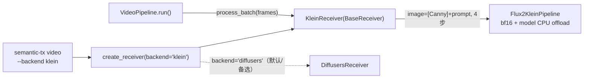

# 设计：KleinReceiver — FLUX.2-klein-9B 关键帧主线接收端（2026-06-30）

> 负责人决策：**klein 主线、Z-Image 备选**。
> 上游依据：[H1 PoC 报告](../../test-reports/2026-06-29-h1-klein-structure-poc-report.md)（§0/§2/§5.3）。
> 分支：`feature/klein-receiver-backend`。

## 0. 背景与决策口径

H1 PoC 已实测：klein 在「单帧 + Canny 参考图」下边缘 IoU 最低（0.069，不贴 Canny、自己重新构图），
但**单帧视觉质量好、准确 prompt 下场景类型正确**（保语义不保像素）。报告 §5.3 明确指出下一步是
**把 klein 接入 `BaseReceiver` 接口、在真实 video→video 流程下公平再测**——不仅看单帧 IoU，更看
帧间一致性、视觉质量、整段还原。

本设计落地这条路，并采纳负责人决策把 klein 定为关键帧主线、Z-Image 降为备选。

**关键待验风险（H1 §0/§2/§5.3）**：klein 单帧结构弱，能否被 video→video 的时间一致性机制补偿。
本设计就此采用**分阶段验证**，并修正了原报告中「latent-init」的实现路径（见 §4）。

## 1. 目标

1. `KleinReceiver(BaseReceiver)`：实现 `process(edge_image, prompt_text, seed) -> Image`，复用
   `scripts/poc/h1_h2/klein_loader.py` + `klein_runner.py` 的 klein 逻辑（`image=[Canny]` + prompt，
   4 步），含 `load` / `unload` 显存生命周期。
2. `create_receiver(backend="diffusers"|"klein")` + video CLI 加 `--backend` 旗标透传。
3. 决策记录：更新 `docs/ROADMAP.md`（主线=klein / 备选=Z-Image）+ 修正 H1 报告 §0 口径。
4. 验证：`semantic-tx video --backend klein` 跑真实行车视频，与 Z-Image 对比，分阶段验证时间一致性补偿。

## 2. 架构

接收端已抽象为 `BaseReceiver` 接口，`VideoPipeline` / `VideoRelayReceiver` 只认该接口、经
`create_receiver()` 工厂构造。因此接入 klein 是「新增一个 `BaseReceiver` 子类 + 工厂分支 + CLI 旗标」的
最小改动，不动管道与接口。



### 2.1 改动清单

| 文件 | 改动 |
|---|---|
| `src/semantic_transmission/receiver/klein_receiver.py` | **新增** `KleinReceiver(BaseReceiver)`，自包含持有 pipe（不单独建 loader 类，对齐 PoC 简洁度） |
| `src/semantic_transmission/common/config.py` | **新增** `KleinReceiverConfig` 数据类 |
| `src/semantic_transmission/receiver/__init__.py` | `create_receiver()` 增加 `backend` 参数与 klein 分支 |
| `src/semantic_transmission/cli/video.py` | 增加 `--backend {diffusers,klein}` 旗标，透传给 `create_receiver` |
| `docs/ROADMAP.md` | 决策记录：主线=klein / 备选=Z-Image |
| `docs/test-reports/2026-06-29-h1-klein-structure-poc-report.md` | §0 口径修正：由「三者在评、不裁决」→「负责人定 klein 主线、本流程验证」 |
| `tests/` | 工厂分支单测 + KleinReceiver 轻量单测（mock pipe，无 GPU） |

## 3. KleinReceiver 详细设计（阶段 1：drop-in）

### 3.1 加载与显存生命周期

复用 PoC `load_klein()`：`Flux2KleinPipeline.from_pretrained(KLEIN_DIR, torch_dtype=bfloat16,
local_files_only=True).enable_model_cpu_offload()`。

- **自包含生命周期**（对齐 `DiffusersReceiver` 的 `is_loaded` / `load` / `unload` 契约，但 klein 无
  现成 `DiffusersModelLoader`，故 receiver 自己持有 pipe）：
  - `load()`：构造 pipe（幂等，已加载则跳过）。
  - `unload()`：`del pipe` + `gc.collect()` + `torch.cuda.empty_cache()`，置空。video CLI 与
    video-receiver CLI 都按 `hasattr(recv, "unload")` 兜底调用。
  - `process_batch()`：覆写为「先 `load()` 常驻，再逐帧 `process()`」，对齐 `DiffusersReceiver`，
    避免反复加载。
- **generator 用 CPU**（`torch.Generator("cpu")`）：与 PoC 一致；`enable_model_cpu_offload` 下 CPU
  generator 最稳（避免 device 不一致）。

### 3.2 process() 逻辑

```
def process(edge_image, prompt_text, seed=None) -> Image:
    pipe = self.load()
    cond = load_as_rgb(edge_image)                  # Canny RGB
    cond = _fit_working_size(cond, max_side)        # 见 §3.3：保宽高比降采样 + round 16
    w, h = cond.size
    seed = seed if seed is not None else random_seed()
    gen = torch.Generator("cpu").manual_seed(seed)
    img = pipe(prompt=prompt_text, image=[cond], guidance_scale=1.0,
               num_inference_steps=4, height=h, width=w, generator=gen).images[0]
    return img
```

### 3.3 工作分辨率策略（核心工程决策）

目标测试视频是原始大帧（C1X 1920×1080 / 1600×1200、C104 1280×960、视频记录 1920×1080，~25fps）。
klein bf16+offload 在 512² 已峰值 ~20.7GB / 24GB，原生分辨率必然 OOM。

**架构口径**：输入永远是原始视频，不在送进发送端前预缩放；**工作分辨率是 receiver 内部、可配置的实现
细节**；还原到原始分辨率 = 未来超分阶段（不在本范围）。

- `_fit_working_size(img, max_side)`：保持宽高比，把长边压到 `max_side`，宽高各 round 到 16 的倍数
  （Flux patch 要求）。
- **默认 `max_side = 768`**（16:9→768×432、4:3→768×576）：超分到 1920 约 2.5x，落在超分舒服区间；
  512 长边对应 3.75x 偏吃力，故不选 512。
- **可配置 + 阶段 1 实测顶上限**：768 若稳，试 896/1024；OOM 则退 640。显存旋钮备用：
  `enable_vae_tiling()`、`enable_attention_slicing()`、必要时 `sequential_cpu_offload`。
- **A/B 公平性**：klein 与 Z-Image 跑同一段视频时用**同一工作分辨率**。

> 注：klein 直接生成到 1080p 可交付分辨率属 7 月显存/速度优化范畴（fp8 待解、降步数、TensorRT），
> 与本流程的 A/B 验证目标正交，不由本 PR 承担。

### 3.4 KleinReceiverConfig

镜像 `DiffusersReceiverConfig` 风格，放 `common/config.py`：

```python
@dataclass
class KleinReceiverConfig:
    model_dir: str = ""          # 空则回退 MODEL_CACHE_DIR/black-forest-labs/FLUX.2-klein-9B
    device: str = "cuda"
    num_inference_steps: int = 4
    guidance_scale: float = 1.0
    torch_dtype: str = "bfloat16"
    max_side: int = 768          # 工作分辨率长边上限
    enable_vae_tiling: bool = False
    enable_attention_slicing: bool = False
    # __post_init__: model_dir 空 → 从 ProjectConfig.model_cache_dir 拼路径
    # from_env: 支持 KLEIN_* 环境变量覆盖（对齐 DiffusersReceiverConfig.from_env）
```

## 4. 阶段 2 草图：参考帧条件（关键修正）

> 在阶段 1 跑出结果、双方讨论后再实现；此处仅锁定方向，避免阶段 1 把架构画死。

H1 报告 §2 把补偿机制写作「上一帧 latent-init」。**经查 `Flux2KleinPipeline.__call__` 实际签名，此路径
需修正**：

- klein 是蒸馏版纯 text+reference 管道，**无 `strength` / img2img 参数**；`latents` 只接受纯高斯噪声
  init，**不是** img2img 的部分去噪 warm-start。真正的 latent-init 需手搓去噪循环，对 4 步蒸馏模型
  风险高、性价比差。
- **klein 原生支持的正确机制是「参考图通道」**：`image: list[...]` 接受**真实图片内容**当参考（Kontext
  式），且为多帧参考生成 T 轴时空坐标。故时间一致性补偿应走**参考帧**，而非 latent-init。

**阶段 2 方案**：`image=[本帧Canny, 参考帧]`，参考帧来源两条（均在 receiver 内部存状态实现，
`process_batch` 顺序处理，**不动 `BaseReceiver` 接口**）：

1. **间隔原始关键帧**（推荐，契合关键帧主线）：每隔 N 帧（如 24fps 取 ~2fps → N≈12）注入一张真实原始
   帧当参考，中间帧靠它锚定场景与物体方位。真实关键帧低频发送 = 码率极低。
2. **上一帧输出**：拿上一帧 klein 输出当参考，做纯时序链式一致性。

阶段 2 待定细节（讨论时定）：参考帧间隔 N、多参考权重/顺序、关键帧是否也走 Canny、关键帧在 relay
协议里如何低频传输。

## 5. 决策记录改动（目标 3）

- `docs/ROADMAP.md`：在阶段三/关键帧选型处记录「负责人决策：klein 主线、Z-Image 备选」，并指向本设计与
  后续 video→video A/B 结论。
- H1 报告 §0：由「三者均为在评候选、不做最终裁决」修正为「负责人已定 klein 主线、Z-Image 备选；本报告
  的单帧 IoU 结论维持有效，video→video 公平复测见 `feature/klein-receiver-backend`」。**保留**原 §0 对
  「单帧 IoU 是低天花板指标、不代表 video→video 表现」的口径说明（这正是选 klein 的论据）。

## 6. 验证计划（目标 4）

分阶段，各跑 1–2 段真实行车视频：

- **阶段 1（drop-in baseline）**：`semantic-tx video --backend klein` vs `--backend diffusers`（Z-Image），
  同一段视频、同一工作分辨率、同一 prompt 策略（`--auto-prompt` 或固定 `--prompt`）。
  - 观察：klein 帧间闪烁 / 构图漂移程度、单帧视觉质量是否优于 Z-Image。
  - 指标：**CLIP Score（维度无关）+ 目视并排**；PSNR/SSIM 对生成式不适用，不作主判据。
  - **跑完停下来讨论结果**，再决定阶段 2 细节。
- **阶段 2（参考帧补偿）**：加 `image=[Canny, 间隔关键帧]` 后再跑同样 1–2 段，对比阶段 1 baseline 的
  帧间一致性改善。

**长 GPU 任务执行约束**：单次推理远超后台 2min 限制，必须用 `Start-Process` 脱离跑 + `Monitor` 守候
（不可在前台直接跑）。

## 7. 不在本范围（YAGNI / 留后续）

- 超分还原到原始/可交付分辨率（未来超分阶段）。
- fp8 单文件加载（H1 §4.1 待解工程点）、TensorRT / 降步数等速度优化（7 月主攻）。
- 真正的 latent-init img2img warm-start（已论证对 klein 性价比差，由参考帧机制替代）。
- video-receiver（双机 relay）的 `--backend`：阶段 1 先只做单机 `video` CLI；relay 透传留阶段 2/后续。
- depth 第二条件、H3 帧间一致性专项、qwen 速度优化（H1 §5 后续项）。

## 8. 风险与开放问题

| 风险 | 处置 |
|---|---|
| klein 768 仍 OOM | 退 640 / 开 vae_tiling / attention_slicing；阶段 1 实测确定上限 |
| 裸 .h265 码流解码（ffprobe 报 missing picture / PPS）| 优先选 `视频记录/*.mp4` 等干净文件；实现时验证 `read_frames` 兼容 |
| klein 帧间漂移过重、阶段 2 参考帧也救不回 | 即为「klein 不宜作主线」的实证结论，回退 Z-Image 备选（决策可逆） |
| klein bf16 单帧 ~10s、整段慢 | 本流程只验质量/一致性，速度优化是 7 月独立工作 |
