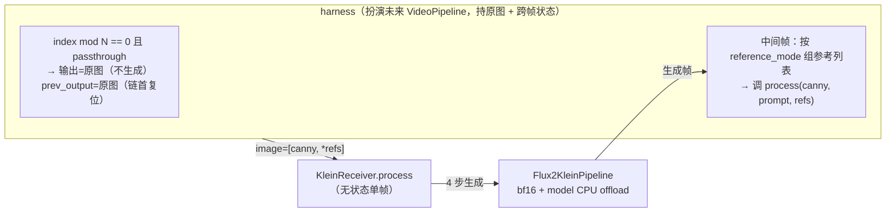

# 设计：klein 参考帧时间一致性补偿（阶段 2，2026-07-01）

> 上游：[阶段 1 结论报告](../../test-reports/2026-06-30-klein-video-ab-phase1.md)（§3/§4 裁决点）、
> [KleinReceiver 设计 §4 阶段 2 草图](2026-06-30-klein-receiver-backend-design.md#4-阶段-2-草图参考帧条件关键修正)。
> 分支：`feature/klein-receiver-backend`。模型锁定 klein（本阶段不再与 Z-Image A/B）。

## 0. 背景与裁决点

阶段 1 在真实 video→video 下证实：**klein 单帧质量优、显存友好，但 drop-in（逐帧独立生成）时间一致性极差**——
近静止段仍剧烈闪烁（天空/车辆/山形每帧重构）。报告 §3 定位机理：**「klein 无视 Canny 精细结构、纯靠
prompt 重新构图，缺少跨帧锚点 → 漂移失控」**。

阶段 2 就此补上「跨帧真实内容锚点」这块 Canny 丢掉的信息，用 klein 原生 `image=[canny, 参考帧]` 通道做
时间一致性补偿。**这是 klein 主线成立与否的真正裁决点**（报告 §4）：能压住漂移 → klein 主线坐实；prev-only 与 prev+key
都压不住 → 回退 Z-Image 备选（决策可逆）。

### 0.1 klein 多参考机制（已核对 `Flux2KleinPipeline.__call__` 源码）

`image=[a, b, ...]` 中每张参考图都被 VAE 编码、分配独立 T 坐标（`scale + scale*i`，即 10/20/30…），沿序列
维拼到待去噪 latent 上，transformer 全程 attend；**参考图本身不被去噪，只锚定生成**。代价：**每加一张参考图
≈ 序列 +H·W/4 token，显存与每帧耗时都涨**。阶段 1 单 canny 参考在 896×496 峰值 18.53GB / 11.73s，余量约
5.5GB；阶段 2 加参考帧需实测新峰值（见 §5.4）。

## 1. 目标

1. 给 `KleinReceiver` 加「在 `image=[canny, +额外参考帧]` 下生成一帧」的通用能力（生产必留，本阶段提前验证）。
2. 在编排层（harness）实现可配置的参考帧时序策略（prev-only / prev+key / N 全可调），扮演未来 `VideoPipeline` 的角色。
3. 跑参考帧补偿实验矩阵（先 prev-only 后 prev+key），用量化时序指标 + 目视裁决漂移是否被压到可用。
4. 复用阶段 1 的 fixture / 冻结 prompt / drop-in baseline，控 GPU 预算、保 A/B 公平。

## 2. 架构与边界

- **接收端保持无状态单帧契约**——只新增「能吃额外参考帧」的通用能力，不背跨帧状态，保持 demo / GUI /
  relay 复用与可测性。
- **时序策略留在编排层**：阶段 2 由 harness 持有原图与跨帧状态（prev 输出、关键帧缓存）；跑出赢家后阶段 3
  再把已验证策略毕业到 `VideoPipeline` + relay 协议（本阶段不做，见 §7）。
- klein pipeline **不改一行**（原生支持多参考）。



## 3. 代码改动

### 3.1 `KleinReceiver`（接收端能力，按生产标准写）

`process` 增加可选参数，**`BaseReceiver` 抽象接口不动**（仅具体子类加 kwarg）：

```python
def process(self, edge_image, prompt_text, seed=None, reference_images=None) -> Image:
    pipe = self.load()
    cond = fit_working_size(load_as_rgb(edge_image), self.config.max_side)
    images = [cond]
    if reference_images:
        images.extend(load_as_rgb(r) for r in reference_images)   # canny 之后追加
    width, height = cond.size
    ...
    result = pipe(prompt=prompt_text, image=images, ...,
                  height=height, width=width, generator=generator)
```

- `reference_images=None` 时行为与阶段 1 完全一致（`image=[cond]`），零回归。
- 参考帧默认已是工作分辨率（fixture 帧 / 上一帧生成输出均为 896×496）；`process` 不上采样。klein pipeline
  内部会对每张参考图 crop 到 patch 倍数、并把 >1024² 面积的图降采样（896×496=444k px，低于上限，不触发）。
- **单测**（无 GPU）：mock `pipe`，断言 `reference_images` 被追加进 `image` 列表、位置在 canny 之后、并透传
  给 pipe；`None` 时 `image=[cond]`。

### 3.2 时序策略配置（编排层）

```python
@dataclass
class TemporalPolicyConfig:
    keyframe_interval: int = 12        # N；<=0 关闭关键帧 = drop-in
    reference_mode: str = "prev"       # none | prev | keyframe | prev_keyframe
    keyframe_passthrough: bool = True  # 关键帧帧直接透传原图、不生成
```

`reference_mode` 一个旋钮覆盖全部方案与消融：

| 值 | 参考列表 | 方案 |
|---|---|---|
| `none` | `[canny]` | 阶段 1 drop-in baseline |
| `prev` | `[canny, 上一帧输出]` | **prev-only** |
| `keyframe` | `[canny, 最近关键帧]` | 纯关键帧锚点消融 |
| `prev_keyframe` | `[canny, 上一帧输出, 最近关键帧]` | **prev+key** |

harness 主循环（顺序处理，持 `prev_output` 与最近关键帧原图）：

```
for i, frame in enumerate(fixture_frames):
    is_keyframe = keyframe_interval > 0 and i % keyframe_interval == 0
    if is_keyframe and keyframe_passthrough:
        out = original_frame(i)          # 透传：不生成，直接用原图
        last_keyframe = original_frame(i)
    else:
        refs = build_refs(reference_mode, prev_output, last_keyframe)
        out = receiver.process(canny(i), prompt(i), seed, reference_images=refs)
    prev_output = out                    # 关键帧透传后 prev=原图 → prev-only 链首自动复位
```

- **首帧 i=0 无歧义**：`keyframe_interval > 0` 时 `0 % N == 0`，i=0 恒为关键帧透传 → prev 链首帧（i=1）
  的 prev 就是真关键帧原图，链始终锚定。仅当 `keyframe_interval <= 0`（无关键帧的纯链，边缘配置）时 i=0
  退化为 `[canny]`。
- `keyframe` 类模式取「最近关键帧下标处的原图」。

## 4. 实验矩阵（先 prev-only 后 prev+key）

| 跑 | reference_mode | N | 来源 |
|---|---|---|---|
| baseline | — | — | **复用**阶段 1 drop-in（`output/poc/klein-ab-phase1/klein`，不重跑）|
| **prev-only@N12** | `prev` | 12（≈2 关键帧/秒 @25fps）| 生成 |
| **prev-only@N25** | `prev` | 25（≈1 关键帧/秒 @25fps）| 生成 |
| prev+key@N12 / prev+key@N25 | `prev_keyframe` | 12 / 25 | prev-only 复盘后再定是否跑 |
| （可选）keyframe-only | `keyframe` | — | 消融备选 |

- 同 fixture（`fixture_frames/`，250 帧 896×496）/ 同冻结 `prompts.json` / seed=0 / 同分辨率。
- 透传关键帧不生成 → 每路实际生成帧 ≈ 250 − 250/N（N=12 约 230、N=25 约 240）。
- **先跑两路 prev-only，停下复盘，再决定 prev+key**（报告 §4 口径：跑完暂停、据证据定下一步）。

## 5. 评估

### 5.1 质量指标（CLIP / PSNR / SSIM / LPIPS）——两栏 + 同下标对比

| 栏 | 覆盖帧 | 含义 |
|---|---|---|
| 全帧（交付质量）| 全 250 帧（真关键帧 + 生成帧）| 观众实际收到的质量，交付 headline |
| 仅生成帧（模型质量）| 只算非关键帧下标 | 隔离「参考帧到底帮没帮到生成帧」|

- 透传关键帧 `R[t] ≡ O[t]`，SSIM/PSNR ≈ 满分；`仅生成帧` 栏剔除以免掩盖生成帧真实水平。
- **`仅生成帧` 与 baseline 在同一批非关键帧下标上对比**（baseline 也只取那些下标），才是「有参考 vs
  无参考」在同一帧位置上的干净对照。

### 5.2 时序一致性指标（新增）——两读 + 原始对照

- **主：相邻帧 MAE** `mean_t mean_pixel |R[t] - R[t-1]|`，并列原始 `|O[t]-O[t-1]|` 对照。近静止段
  （120–127）原始≈0、还原 MAE = 纯闪烁，最决定性。
- **副：warp-error**（cv2 Farneback 光流，无新依赖）——在原始帧上算光流 `O[t-1]→O[t]`，warp `R[t-1]` 后比
  `R[t]` 残差，扣掉合法运动、只留闪烁。标注「参考、非主判据」（行车视频光流有噪声）。
- **两读**：`交付含关键帧边界`（暴露每 N 帧的周期 pop）/ `生成帧间排除边界`（纯看相邻生成帧稳不稳）。
  交付读若 pop 重，是 prev-only vs prev+key 权衡的真实证据。

### 5.3 目视

条带（重点近静止 120–127）+ 逐帧网格 `orig｜canny｜drop-in｜输出`。

### 5.4 harness 健壮性与显存

- 沿用阶段 1：多参考 **smoke 探显存有界回退**（开跑前 1–2 帧试 896×496 多参考是否 OOM，超了退 768）、每路
  独立 try/except、崩溃写 partial results + sentinel、零交互。
- **分辨率归一化（对抗审核确认的必修点）**：smoke 锁定 R 后，必须把 **fixture（含透传关键帧来源）与
  baseline 三者统一 `fit_working_size` 到 R**——否则 R≠896 回退时透传帧(原生 896) 与生成帧(R) 尺寸混杂会让
  `write_frames`/`temporal_report` 崩溃、并把 输出@R 与 baseline@896 变成不公平的跨分辨率对照。这才落实「同步
  重烘 baseline 保同分辨率公平」。评估前**断言全序列同尺寸**，错配 fail-fast 而非静默产出。

## 6. 执行约束

单次推理远超后台 2min 限制 → 必须 **`Start-Process` 脱离跑 + `Monitor` 守候**，不在前台直接跑。

## 7. 不在本范围（YAGNI）

- 毕业到 `VideoPipeline` / relay 协议的关键帧低频传输（阶段 3，prev-only/prev+key 赢家确定后）。
- Z-Image（已锁 klein）、超分还原、fp8 单文件加载、TensorRT / 降步数等速度优化（7 月主攻）。
- 真正的 latent-init img2img warm-start（父设计 §4 已论证对 klein 性价比差，由参考帧机制替代）。
- prev+key 只是配置旗标，prev-only 复盘后再决定是否跑。

## 8. 验收 / 决策口径

阶段 2 回答「**参考帧补偿能否把 klein drop-in 的剧烈漂移压到可用**」：

- **能**（时序 MAE / warp-error 显著下降、目视闪烁明显缓解，且未过度冻结/丢失真实运动）→ klein 主线坐实，
  进阶段 3 productionize（策略毕业到 `VideoPipeline` + relay）。
- **prev-only 与 prev+key 都压不住** → 即「klein 不宜作主线」的实证结论，回退 Z-Image 备选（其结构稳定性本就更适合无补偿
  场景），决策可逆。

## 9. 风险与开放问题

| 风险 | 处置 |
|---|---|
| 多参考在 896×496 OOM | smoke 有界回退退 768 + 把 fixture/透传关键帧/baseline 统一归一化到 R + 评估前尺寸断言 fail-fast |
| B/prev 链自回归漂移累积 / 过度冻结 | 透传关键帧每 N 帧硬复位；时序指标「生成帧间」两读监测冻结（还原 MAE 远低于原始 = 焊死）|
| 透传关键帧周期 pop | 时序「交付含边界」读专门暴露；若重则 prev+key（每帧恒挂关键帧）过渡更缓，作为对照 |
| 静止关键帧 vs 区间末端运动（prev+key）| 消融 prev-only vs prev+key 用证据判，非先验 |
| klein 多参考单帧更慢、整段更慢 | 本阶段只验质量/一致性，速度优化 7 月独立工作 |
