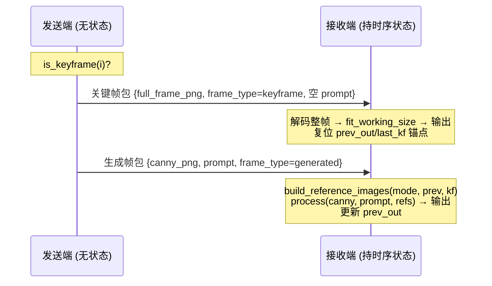

# 阶段 3（二）：时序策略接入 relay 双机协议 — 设计文档

- **日期**：2026-07-08
- **分支**：`feature/relay-temporal-policy`
- **前置**：阶段 3（一）时序策略毕业到单机 `VideoPipeline`（PR #65）；双机 relay 逐帧骨架（PR #52）
- **状态**：设计已确认，待写实现计划

## 1. 目标

把已在单机 `VideoPipeline._run_temporal` 验证的有状态串行时序策略（关键帧透传 + prev 链参考帧补偿）接入双机 relay 协议，达成 ROADMAP 阶段 3（二）口径：**关键帧低频整帧传输 + 生成帧走语义码流**。

同时补上 M1 遗留的「双机 relay 视频演示暂缓」验收（本轮以单机 loopback 口径落地，真机双机因无环境顺延）。

### 交付边界（对应 brainstorm 选项 2）

- ✅ 协议 + 编排改造（`video_relay.py` 时序感知）
- ✅ CLI 暴露时序参数
- ✅ 无 GPU 单测 + 单机 loopback GPU 验收 + 验收报告
- ❌ 真流式 I/O（边收边写）——属 ROADMAP 独立后续项，不在本轮
- ❌ 真机双机演示——无环境，顺延；本轮 loopback 等价验证协议正确性

## 2. 核心架构原则

### 2.1 状态不过线，调度随包过线

时序状态（`prev_out` / `last_kf`）是接收端生成的产物，发送端无从得知——因此**全部状态留在接收端**，与单机 `_run_temporal` 状态归属完全一致。跨机传输的只有：

- 关键帧的**整帧图像**（低频、字节大）
- 生成帧的**语义码流**（Canny 边缘图 + prompt 文本，字节小）
- 每包的**调度标签** `frame_type`

### 2.2 关键帧调度的唯一真相源 = 发送端（方案 A）

发送端按 `is_keyframe(i)` 决定关键帧，并在包内 `metadata["frame_type"]` 打标；接收端**不重算** `is_keyframe`，只读标签分支。

- 发送端配置：`{keyframe_interval, keyframe_passthrough}`
- 接收端配置：`{reference_mode}`

**理由**：调度单一来源，跨机无需同步 `interval`；未来 N 按运动幅度自适应时由发送端决定，接收端零改动。

（否决方案 B：两端各自 `is_keyframe` 靠 `interval` 配置对齐——脆弱，且挡住自适应 N。）

### 2.3 串行前提

接收端必须严格按帧序串行处理，prev 链才成立。单 TCP 流保证到达顺序 = 发送顺序 = 帧序（发送端 `for i, frame in enumerate(frames)` 顺序发送），因此接收端到达即处理即天然串行。此为时序路径不变量：**依赖单 TCP 流的有序性**。

## 3. 数据流



接收端串行主循环（与 `_run_temporal` 逐行对应，输入改自网络）：

- **关键帧包**（`frame_type=keyframe`）：`fit_working_size(decode(full_frame), max_side)` → 作输出 → `prev_out = last_kf = 该帧` → 记 `keyframe_indices`。
- **生成帧包**（`frame_type=generated`）：`refs = build_reference_images(reference_mode, prev_out, last_kf)` → `img = receiver.process(canny, prompt, seed, reference_images=refs)` → 输出 → `prev_out = img if img is not None else prev_out`（失败帧不污染 prev 链）。

收齐 `total_frames` 后 `_fill_failed_frames` → `frame_postprocess`（恒等）→ `write_frames`。

## 4. 协议：复用现有 3 字段帧，零线格式改动

现有 `TransmissionPacket = edge_image(bytes) + prompt_text(str) + metadata(dict)`，长度前缀 framing。改动仅在**字段语义**与 **metadata**，`_serialize_packet` / `_deserialize_packet` 不动：

| 字段 | 生成帧 | 关键帧 |
|---|---|---|
| `edge_image` | Canny 边缘图 PNG | **整帧 RGB PNG** |
| `prompt_text` | VLM/静态描述 | `""`（空） |
| `metadata.frame_type` | `"generated"` | `"keyframe"` |
| `metadata`（沿用） | `frame_index` / `total_frames` / `fps` / `seed?` | 同左 |

接收端按 `metadata["frame_type"]` 分支解读 `edge_image` 字段。

**向后兼容**：向后兼容由**无状态路径**承担——`reference_mode=None` 时接收端走原有逐帧路径，不读 `frame_type`，与现有 relay 逐字节一致。**时序路径**（`reference_mode` 非空）则**要求每包带 `frame_type` 标签**，缺失即 fail-fast 报错（`ConnectionError`），不做隐式降级——时序发送端与时序接收端必须成对使用。

## 5. 组件改动

### 5.1 `pipeline/video_relay.py`

**`VideoRelaySender`**

- 构造或 `run()` 接受可选 `TemporalPolicyConfig`；为 `None` 时保持现有无状态逐帧路径（逐字节向后兼容）。
- **限定 `keyframe_passthrough=True`**（见下方「设计收紧」）：`run()` 入口对时序 policy fail-fast 断言，`keyframe_passthrough=False` 直接报错。
- 逐帧 `is_keyframe(i)` 分流：
  - 关键帧：编码**整帧 RGB PNG**，`prompt_text=""`，`frame_type=keyframe`，**不调 `prompt_fn`、不提 Canny**（省 VLM，对齐单机 §5）。
  - 生成帧：Canny + `prompt_fn`，`frame_type=generated`。

> **设计收紧（规划期发现）**：relay 时序路径仅支持 `keyframe_passthrough=True`。原因：非透传关键帧走生成帧通道，接收端**没有原始整帧**，无法设置 `last_kf` 锚点，会破坏 `keyframe`/`prev_keyframe` 模式；且「关键帧低频整帧传输」的核心前提本身就等于透传。故 relay CLI 不暴露 `--no-keyframe-passthrough`（与单机 `video` 不同）。
- `VideoSendStats` 扩展**码率账本**：区分 keyframe/generated 帧数与字节数，输出 `keyframe_bytes` / `generated_bytes` / 平均语义码率，验证「低频整帧」论点。

**`VideoRelayReceiver`**

- 构造或 `run()` 接受可选 `reference_mode`（默认 `"prev"`）；为 `None`/无时序标签时保持现有无状态路径。
- 时序路径能力门控：复用 `_run_temporal` 的 `inspect.signature` 检查——`receiver.process` 须接受 `reference_images`，否则报错提示 `--backend klein`。
- 持 `prev_out` / `last_kf` 状态，按 `frame_type` 分支（见 §3）。
- 关键帧透传用 `fit_working_size(decode, receiver.config.max_side)` 缩到工作分辨率，保尺寸一致。

**复用**：`is_keyframe` / `build_reference_images`（`temporal_policy.py`）、`fit_working_size`（`klein_receiver.py` 惰性导入）、`_fill_failed_frames`（`video_pipeline.py`）、码率账本逻辑参照 `_save_temporal_artifacts`。

### 5.2 `cli/video_sender.py`

新增：

- `--keyframe-interval N`（默认 12；`<=0` 关闭时序，退回无状态逐帧）
- `--prompts-json PATH`：从预生成 `prompts.json` 逐帧读 prompt，**不加载 VLM**（loopback 测试规避 VLM+klein 同驻 OOM）。与 `--prompt` / `--auto-prompt` 三选一。

（**不提供** `--no-keyframe-passthrough`——relay 时序限定透传，见 §5.1 设计收紧。）

保持：`--auto-prompt` 为默认全流程 prompt 策略（真机双机 VLM 与 klein 分处两机，天然不冲突）。

### 5.3 `cli/video_receiver.py`

新增：

- `--backend klein`（时序路径必需；透传给 `create_receiver`）
- `--reference-mode {none,prev,keyframe,prev_keyframe}`（默认 `prev`）

## 6. 测试与验收

### 6.1 无 GPU 单测（CI）

用 stub receiver（`process` 返回可辨识占位图，签名含 `reference_images`）：

1. **发送端分流**：关键帧包 `frame_type=keyframe` 且 `edge_image` 为整帧、`prompt_text=""`；生成帧包 `frame_type=generated` 且携 Canny + prompt。
2. **接收端分支**：按标签正确解读字段；透传帧复位 `prev_out/last_kf`；生成帧 `build_reference_images` 入参正确（prev 在前 keyframe 在后）；prev 链随成功帧更新、失败帧不污染。
3. **码率账本**：keyframe/generated 字节拆分正确。
4. **向后兼容**：无 `frame_type` 旧包走无状态路径。
5. **失败帧**：生成帧 `process` 抛异常记 `failed_indices`、`_fill_failed_frames` 兜底。

### 6.2 单机 loopback GPU 验收

双进程 127.0.0.1：

```bash
# 终端 1：接收端
uv run semantic-tx video-receiver --backend klein --reference-mode prev \
  --relay-port 9000 --output output/relay_temporal/out.mp4
# 终端 2：发送端（复用已有 prompts.json，不加载 VLM）
uv run semantic-tx video-sender --input <行车视频> --relay-host 127.0.0.1 \
  --relay-port 9000 --prompts-json <已有 prompts.json> --keyframe-interval 12
```

产出：`out.mp4` + 码率账本（keyframe 整帧字节 vs generated 语义字节）。

### 6.3 单机 parity 校验（强正确性保证）

同 seed / prompt / policy 下，relay 输出应与单机 `video --backend klein` 逐帧近乎一致——证明「把 `_run_temporal` 切一刀放到网络两侧」没切错。作为验收报告的核心证据。

### 6.4 验收报告

写入 `docs/test-reports/2026-07-08-relay-temporal-policy-report.md`：loopback 端到端结果、码率账本、parity 校验结论。补上 ROADMAP M1 遗留的「双机 relay 视频演示」（loopback 口径）。

## 7. 风险与兜底

| 风险 | 兜底 |
|---|---|
| loopback auto-prompt 触发 VLM+klein 同驻 OOM | 演示用 `--prompts-json` 预生成 prompt，不加载 VLM；auto-prompt 默认路径留给真机双机 |
| 乱序到达破坏 prev 链 | 单 TCP 流保证有序（§2.3 不变量）；时序路径不支持多连接并发 |
| 整帧 PNG 增大关键帧包体积 | 正是「低频整帧」设计意图；码率账本量化，`interval` 可调 |
| 无真机双机环境 | loopback 等价验证协议正确性；真机演示顺延，不阻塞本轮交付 |

## 8. 非目标（YAGNI）

- 真流式边收边写 I/O、RIFE 插帧、超分——ROADMAP 独立后续项
- 关键帧图像压缩优化（JPEG/webp 替 PNG、码率-质量曲线）——先量化再优化
- N 按运动幅度自适应——架构（方案 A）已留路，本轮不实现
- 双机断连恢复 / 重传——本轮无状态发送端 + 单连接，超出范围
