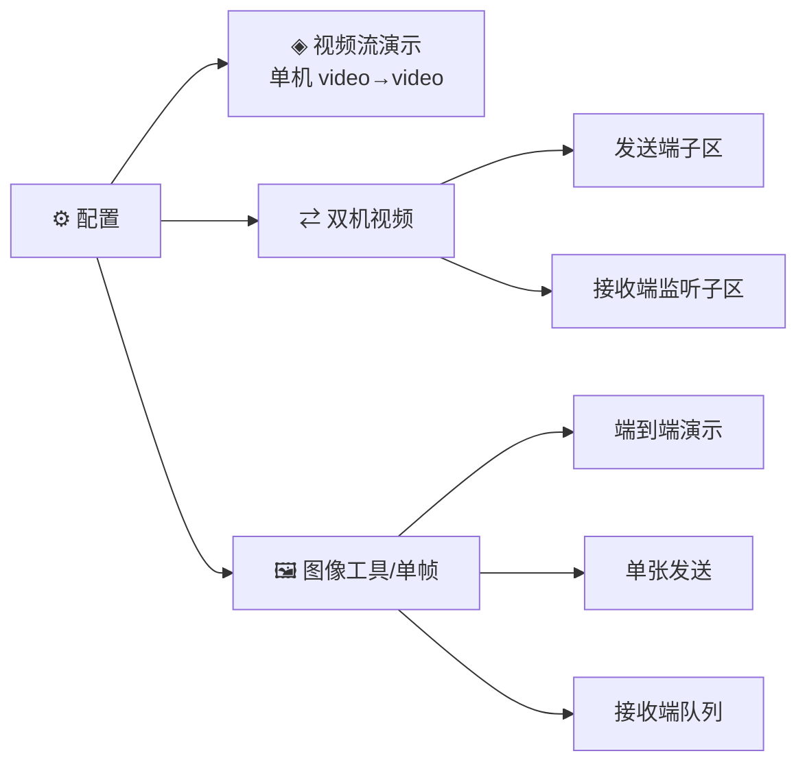

# GUI 视频优先重构设计

> 阶段 3 收官 checklist C（GUI 同步阶段 3 功能）第一批的设计文档。
> 决策日期：2026-07-10。对应 ROADMAP 阶段三「C. GUI 同步阶段 3 功能」。

## 1. 背景与动机

阶段 3 的视频流功能已在 CLI 落地三条命令——`video`（单机 video→video）、`video-sender` / `video-receiver`（双机 relay 视频流），并全部合并 main（PR #59–#67）。但 Gradio Web GUI 仍停留在阶段 2 的**图像级 6 面板**（配置 / 单张发送 / 批量发送 / 接收端队列 / 端到端演示 / 批量端到端），对视频流能力零覆盖，构成规划断档：目标版 PoC 若只能靠 CLI 演示，可视化说服力与现场可操作性都打折。

负责人决策：**GUI 重定位为「视频优先」**，图像相关面板压缩，视频流成为主导航。本设计覆盖 ROADMAP C 板块**第一批**（封装已稳定合并 main 的 CLI 能力，不依赖 RIFE/超分 B 链）。

## 2. 目标与非目标

### 目标

- GUI 信息架构重构为视频优先：视频流面板前置为主导航
- **单机视频流演示**面板：封装 `VideoPipeline` / `video`（backend 选择、时序策略、auto/manual 描述、质量评估）
- **双机视频**面板：发送端 + 接收端监听两子区，封装 `VideoRelaySender/Receiver` / `video-sender/receiver`，贴合真实分机拓扑
- 图像能力压缩为**单个「图像工具」Tab**，保留核心 3 个面板（端到端演示 / 单张发送 / 接收队列）
- 关闭 issue #29（GUI 缺独立接收端监听 Tab）

### 非目标（明确排除，避免 scope 膨胀）

- 插帧 / 超分 / 端到端三指标测量的可视化 —— 属 ROADMAP C **第二批**，跟随 B 链落地后补
- 流式相机 / RTSP 输入、编码回流、背压 —— 阶段 4
- 图像**批量**面板（批量发送 / 批量端到端）—— 本次删除，图像批量能力降级到 CLI（`batch-demo` / `batch-sender`）
- 单机 loopback 双机演示（sender+receiver 同进程）—— 显存错峰风险高，不做；双机走真实分机

## 3. 信息架构

重构后 4 个 Tab（视频优先排序）：

| 顺序 | Tab | 来源 | 说明 |
|---|---|---|---|
| 1 | ⚙ 配置 | 保留 `config_panel` | 补视频默认（backend、keyframe_interval） |
| 2 | ◈ 视频流演示 | **新增** | 单机 `video→video`，主打面板 |
| 3 | ⇄ 双机视频 | **新增** | 发送端 + 接收端监听两子区 |
| 4 | 🖼 图像工具（单帧） | 压缩自旧 5 面板 | Accordion 收纳核心 3 面板 |



删除面板：`batch_sender_panel`（批量发送）、`batch_panel`（批量端到端）及其在 app.py 的装配。跨 Tab「发送端 → 接收端队列」联动（`append_external_item`）并入图像工具 Tab 内部保留。

## 4. 面板设计

### 4.1 视频流演示 Tab（单机，封装 `VideoPipeline`）

范式复用现有 `pipeline_panel`（端到端演示）：`gr.State` 持久化 receiver、generator 逐步 `yield`、显存错峰、卸载按钮、Accordion 收纳日志/评估。

**输入区**：

| 组件 | 类型 | 对应 CLI 参数 |
|---|---|---|
| 输入视频 | `gr.Video`（filepath） | `--input` |
| 后端 | `gr.Radio` diffusers/klein | `--backend` |
| 描述模式 | `gr.Radio` auto VLM / manual | `--auto-prompt` / `--prompt` |
| 手动描述 | `gr.Textbox`（manual 时显示） | `--prompt` |
| 参考帧模式 | `gr.Dropdown` none/prev/keyframe/prev_keyframe | `--reference-mode` |
| 关键帧间隔 N | `gr.Number` 默认 12 | `--keyframe-interval` |
| 关键帧透传 | `gr.Checkbox` 默认开 | `--keyframe-passthrough` |
| 随机种子 | `gr.Number` | `--seed` |
| 输出帧率 | `gr.Number`（空=沿用输入） | `--fps` |
| 高级（折叠） | Canny 阈值、`vlm_max_tokens` | `--threshold1/2`、`--vlm-max-tokens` |

**门控**：时序参数（参考帧模式/N/透传）仅 backend=klein 生效，diffusers 时禁用（`gr.update(interactive=False)`），与 `resolve_reference_mode` 的 backend 门控对齐。

**数据流**：`gr.Video` → `VideoPipeline(receiver, extractor).run(...)`，`prompt_fn` 按描述模式构造（auto 时 `QwenVLSender.describe` 逐帧 / manual 时整段共用）。**显存错峰**复刻 CLI：`on_prompts_ready=vlm_sender.unload`，VLM 描述完卸载再加载生成模型。receiver 经 `create_receiver(backend=...)` 创建、`gr.State` 持久化跨次复用。

**进度**：`VideoPipeline.run` 新增 `progress_callback`（见 §5）驱动逐帧进度文本；无回调时退化为阶段级进度（描述中/生成中/合成中）。

**输出区**：`gr.Video`（输出视频）+ 逐帧进度 `gr.Textbox` + 统计 `gr.Dataframe`（帧数 / 关键帧数 / 生成帧数 / 总耗时 / 码率，取自 `BatchResult.to_dict()` + 时序统计）+ 运行日志 Accordion。

**质量评估**（可选 Accordion，默认折叠）：复用 `evaluation` 模块，输入视频 vs 输出视频逐帧对照，汇总 PSNR / SSIM / LPIPS / CLIP，展示逐帧表 + 整段均值。不阻塞主流程。

### 4.2 双机视频 Tab（真实分机，各机开 GUI 用对应子区）

两个子区（`gr.Row` 分栏或上下分节），对应两台机器角色。

**发送端子区**（封装 `VideoRelaySender` / `video-sender`）：

- 输入：`gr.Video` + relay host/port + 描述模式（auto/manual）+ 关键帧间隔 N + seed/fps + 可选存边缘图目录
- 触发「▶ 发送」→ `VideoRelaySender(extractor).run(..., temporal_policy, progress_callback)`（`keyframe_interval>0` 时构造 `TemporalPolicyConfig(reference_mode="prev", keyframe_passthrough=True)`，与 CLI 一致）
- 显示发送进度 + 码率账本统计（关键帧 bytes / 生成帧 bytes / 关键帧∶生成帧倍率，取自 `VideoSendStats.to_dict()`）
- VLM 显存：`auto` 时发送完 `vlm_sender.unload()`

**接收端监听子区**（封装 `VideoRelayReceiver` / `video-receiver`，**后台线程 + 轮询**）：

- 输入：监听地址（默认 0.0.0.0）/ 端口 + backend（默认 klein）+ 参考帧模式 + 输出路径 + 可选 timeout
- 「▶ 开始监听」：klein 就位检测 → `create_receiver(backend)` → 起 **daemon 线程**跑 `VideoRelayReceiver.run(..., progress_callback=写线程安全队列)`
- `gr.Timer`（1–2s 周期）轮询进度队列 → 刷新接收进度文本；线程结束（收齐 total_frames）→ 展示输出 `gr.Video` + 统计
- 「■ 停止监听」：见 §6 停止机制
- 状态经 `gr.State` 管理 `{thread, receiver, stop_event, progress_queue, result}`
- **关闭 issue #29**

### 4.3 图像工具 Tab（压缩，代码保留）

现有 `pipeline_panel`（端到端演示）、`sender_panel`（单张发送）、`receiver_panel`（接收队列）三个 `build_xxx_tab` 从**独立 TabItem** 改为**同一 Tab 内 Accordion 分节**。`build_*` 函数体基本不动（仍在传入的 Blocks 上下文里建组件），仅装配层（app.py）把三者包进一个 TabItem 的三个 Accordion。跨 Tab 联动（发送端「→ 加入接收队列」）在本 Tab 内闭合。

## 5. 接口改动（为 GUI 进度服务，向后兼容）

三个编排 `run` 方法新增可选关键字参数 `progress_callback`；CLI 不传保持现状（逐字节兼容），GUI 传入驱动进度：

```python
# VideoPipeline.run / _run_temporal
def run(self, ..., progress_callback: Callable[[int, int, dict], None] | None = None) -> BatchResult
# VideoRelaySender.run
def run(self, ..., progress_callback: ... = None) -> VideoSendStats
# VideoRelayReceiver.run
def run(self, ..., progress_callback: ... = None) -> VideoReceiveResult
```

- 回调签名 `(index, total, info)`：`index` 当前帧序、`total` 总帧、`info` 携带阶段/耗时/frame_type 等
- 单机 `VideoPipeline`：无状态路径在 `process_batch` 前后回调阶段级；时序路径 `_run_temporal` 串行生成循环内逐帧回调（天然逐帧粒度）
- `VideoRelaySender`：逐帧发包循环内回调
- `VideoRelayReceiver`：收包→process 循环内回调；GUI 后台线程消费回调写入线程安全队列，主线程 `gr.Timer` 轮询

## 6. 关键实现细节

### 6.1 接收端线程模型与停止机制

`VideoRelayReceiver.run` 当前对 `accept/receive` **阻塞**，仅 `timeout` 参数可自然结束，无主动中断。GUI「停止监听」需要可靠中断，方案：

- **推荐**：给 `VideoRelayReceiver` 增加轻量可中断能力——持有 server socket 引用，`stop()` 关闭 socket 使阻塞 `accept/recv` 抛出、循环退出；GUI「停止监听」调用之。属接口改动一部分。
- 兜底：设置合理 `timeout`，配合 daemon 线程随进程回收。

### 6.2 显存管理

- 单机视频面板：复刻 CLI 错峰（VLM 描述完 `unload` 再加载生成模型），`gr.State` 持久化 receiver
- 双机分机：单进程只跑一端（发送机 VLM / 接收机 klein），无同驻冲突
- **同进程冲突**：接收端监听子区的 klein 与图像工具 Tab 的 diffusers receiver 若同时加载会争显存 —— UI 提示「监听期间请勿在图像 Tab 运行」，或监听启动前检测并要求先卸载图像 receiver

### 6.3 klein 就位检测

接收端默认 klein，「开始监听」前复用 `model_check`（`semantic-tx check diffusers` 同源）检测 klein 模型就位，未就位给明确提示而非运行时加载失败。

## 7. 风险与对策

| 风险 | 对策 |
|---|---|
| 长任务阻塞 UI（单机 ~33min/视频） | generator + 后台执行 + 实时进度，避免卡死 |
| 接收端线程生命周期（端口占用/异常/停止） | §6.1 可中断 socket + `gr.State` 管句柄 + 异常回填状态 |
| 同进程双 receiver 显存争用 | §6.2 UI 互斥提示 / 启动前卸载 |
| klein 未就位 | §6.3 启动前检测提示 |
| `progress_callback` 回调频繁拖慢 | 轻量回调（仅写队列/更新计数），不做重计算 |

## 8. 分批交付与验收

对应 ROADMAP C **第一批**，内部再分两个批次（可各自独立 PR）：

- **批次 A**：信息架构重排（app.py）+ 图像 Tab 压缩（保留核心 3 面板、删 2 批量面板）+ **视频流演示 Tab**（单机，含质量评估 Accordion）
- **批次 B**：**双机视频 Tab**（发送端 + 接收端监听）+ 三个 `run` 的 `progress_callback` 接口 + `VideoRelayReceiver` 可中断能力

**验收口径**：
- GUI 启动后视频流演示 Tab 可完成一次 klein 单机 video→video 闭环，输出视频可播放、统计与评估正常
- 双机 Tab：一台开接收监听、一台开发送端，完成一次真实分机 relay 视频流（或本机双 GUI 进程 loopback 冒烟），接收端收齐输出视频
- 图像工具 Tab：核心 3 面板功能与重构前一致（回归）
- `uv run ruff check .` / `format --check` 通过；GUI 相关既有测试通过

## 9. 涉及文件

- 新增：`src/semantic_transmission/gui/video_panel.py`（单机）、`video_relay_panel.py`（双机）
- 改动：`gui/app.py`（Tab 重排装配）、`pipeline/video_pipeline.py` / `video_relay.py`（`progress_callback` + 可中断）
- 删除：`gui/batch_sender_panel.py`、`gui/batch_panel.py`
- 保留改装配：`gui/pipeline_panel.py` / `sender_panel.py` / `receiver_panel.py`（并入图像工具 Tab）
- 文档：`docs/gui-design.md`（同步新架构）、`docs/cli-reference.md` 无需改（CLI 不变）
