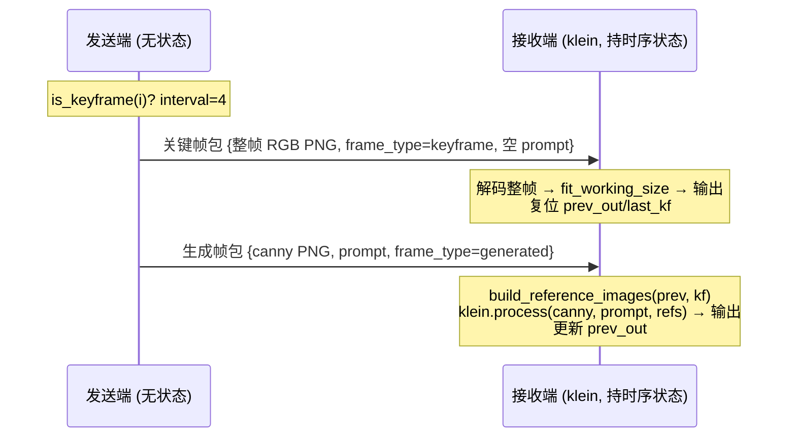

# 阶段 3（二）relay 时序策略 loopback 验收报告

- **日期**：2026-07-08
- **分支**：`feature/relay-temporal-policy`
- **设计**：[`docs/superpowers/specs/2026-07-08-relay-temporal-policy-design.md`](../superpowers/specs/2026-07-08-relay-temporal-policy-design.md)
- **结论**：✅ 通过。双机 relay 时序输出与单机 klein 基线**逐像素完全一致**（全帧 MAE=0），坐实「把 `_run_temporal` 切一刀放到网络两侧」没切错。

## 1. 目标与口径

验证已在单机 `VideoPipeline._run_temporal` 验证的时序策略（关键帧透传 + prev 链参考帧补偿）接入双机 relay 后行为一致：**关键帧低频整帧传输 + 生成帧走语义码流**，状态留接收端、调度随包（`frame_type`）过线。

因无真机双机环境，本轮以**单机 loopback**（真实 TCP + 真实 klein）等价验证协议正确性；真机双机演示顺延（见 §5 局限）。

## 2. 环境

| 项 | 值 |
|---|---|
| GPU | RTX 5090 24GB（`torch 2.10.0+cu130`，CUDA 可用） |
| 关键帧主线 | FLUX.2-klein-9B（`KleinReceiver`，GGUF） |
| 测试素材 | `C104_...640x480_6fps.mp4` 截取前 16 帧（640×480 / 6fps） |
| 时序策略 | `--keyframe-interval 4` / `--reference-mode prev` / `keyframe_passthrough=True` / `--seed 0` |
| prompt | 静态 `--prompt`（免 VLM，parity 只需两端同 prompt；loopback 端复用基线 `prompts.json`） |

## 3. 数据流



## 4. 结果

### 4.1 loopback 端到端

| 项 | 值 |
|---|---|
| 帧成功率 | **16/16**（无失败帧） |
| 关键帧下标 | `[0, 4, 8, 12]`（与单机基线一致） |
| 发送端耗时 | 102.8s（含 klein 加载 + 12 生成帧） |
| 单机基线耗时 | 206.4s（16/16 成功，含 klein 加载） |

### 4.2 码率账本（坐实「低频整帧 + 语义码流」）

| 类别 | 帧数 | 总字节 | 单帧均值 |
|---|---|---|---|
| 关键帧（整帧 RGB PNG） | 4 | 519,688 B | ~130 KB |
| 生成帧（Canny + prompt 语义码流） | 12 | 33,616 B | ~2.8 KB |

关键帧单帧约为生成帧的 **46×**——正是「关键帧低频整帧、生成帧走轻量语义码流」的设计意图。提高 `keyframe-interval` 可进一步摊薄整帧开销。

### 4.3 parity 逐帧对比（核心正确性证据）

同 seed / prompt / policy / interval 下，relay 输出 vs 单机 `video --backend klein` 基线：

```
帧数=16 平均MAE=0.000 最大MAE=0.000
逐帧 MAE: [0.0]×16
```

**全部 16 帧像素级完全一致（MAE=0）**——不仅关键帧透传（PNG 无损、整帧往返精确）为 0，全部 12 个生成帧也精确为 0。说明：

1. klein 生成在同 seed + 同输入（canny/prompt）+ 同参考帧链下确定性可复现；
2. 双机 relay 的有状态串行时序编排与单机 `_run_temporal` **逐帧等价**，「切一刀放到网络两侧」未引入任何偏差。

这强于 spec §6.3 预期的「生成帧近乎一致」——实测为精确相等。

## 5. 已知局限

- **单机 loopback 而非真机双机**：本轮为单进程双线程 + 真实 TCP（127.0.0.1）+ 真实 klein，等价验证了协议 + 时序状态机 + 码率划分 + parity。真机双机（两台机器、全流程 `--auto-prompt`，VLM 与 klein 分处两机天然不冲突）顺延——需两台机器，非本轮环境。
- **静态 prompt**：loopback 用 `--prompts-json` 复用基线静态 prompt（免 VLM+klein 同机 OOM）；真机双机才跑 `--auto-prompt` 全流程。
- **短片 16 帧**：足以覆盖关键帧透传（0/4/8/12）+ 生成帧 prev 链 + 全协议路径；长片全量验收留真机双机。

## 6. 补 M1 遗留

本报告补上 ROADMAP 阶段三 M1 遗留的「双机 relay 视频演示暂缓」（loopback 口径）——relay 代码（PR #52）+ 时序策略（本分支）端到端跑通并 parity 校验通过。
