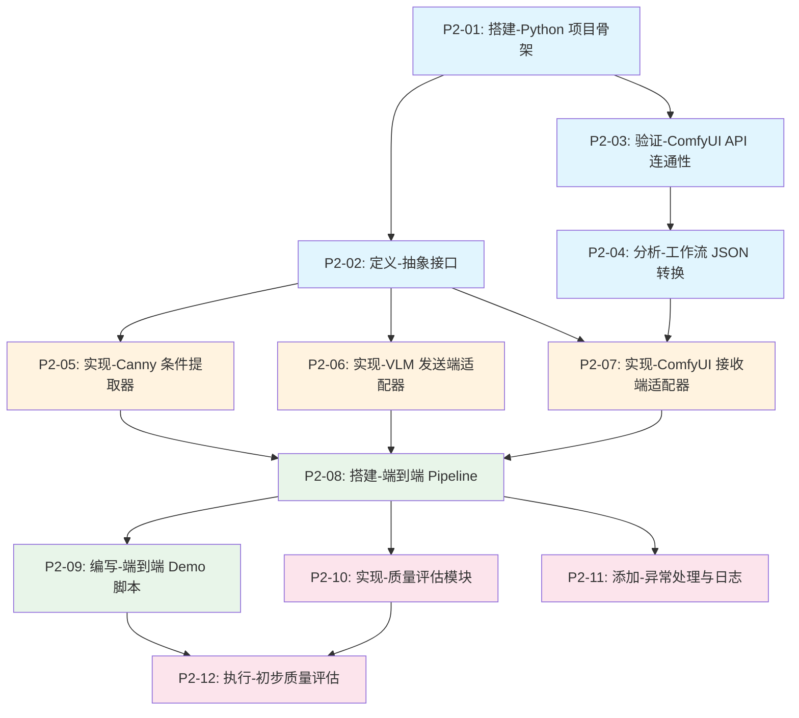

# 依赖关系图

## 任务依赖拓扑

## 并行执行机会

| 可并行组 | 任务 | 前置条件 |
|----------|------|----------|
| 组 1 | P2-02 ∥ P2-03 | P2-01 完成后 |
| 组 2 | P2-05 ∥ P2-06 | P2-02 完成后（P2-07 需额外等 P2-04） |
| 组 3 | P2-10 ∥ P2-11 | P2-08 完成后 |

## 关键路径

**最长路径**：P2-01 → P2-03 → P2-04 → P2-07 → P2-08 → P2-09 → P2-12

此路径决定了项目的最短完成时间，其中 P2-04（工作流格式转换）和 P2-07（ComfyUI 接收端适配器）是关键瓶颈。
