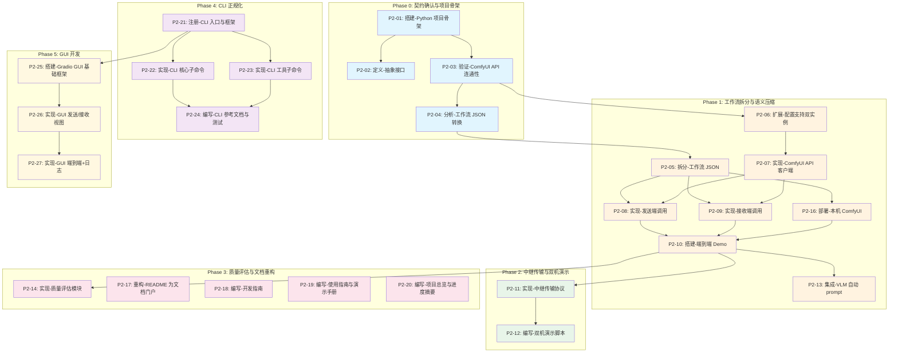

# 依赖关系图

## 任务依赖拓扑

## 并行执行机会

| 可并行组 | 任务 | 前置条件 |
|----------|------|----------|
| 组 A | P2-14 ∥ P2-17 ∥ P2-18 ∥ P2-19 ∥ P2-20 ∥ P2-21 | 无（Phase 3+4 入口全部独立） |
| 组 B | P2-22 ∥ P2-23 ∥ P2-25 | P2-21 完成后 |
| 组 C | P2-24 ∥ P2-26 | P2-22+P2-23 完成后 / P2-25 完成后 |

## 关键路径

**最长路径（新增）**：P2-21 → P2-25 → P2-26 → P2-27（CLI 框架 → GUI 全链路）

此路径决定了 Phase 4+5 的最短完成时间。P2-21（CLI 框架）是 Phase 4 和 Phase 5 的共同前置，应优先实施。
