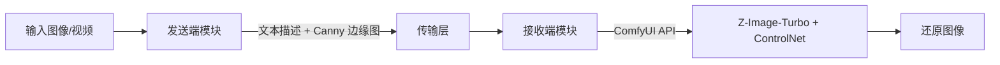
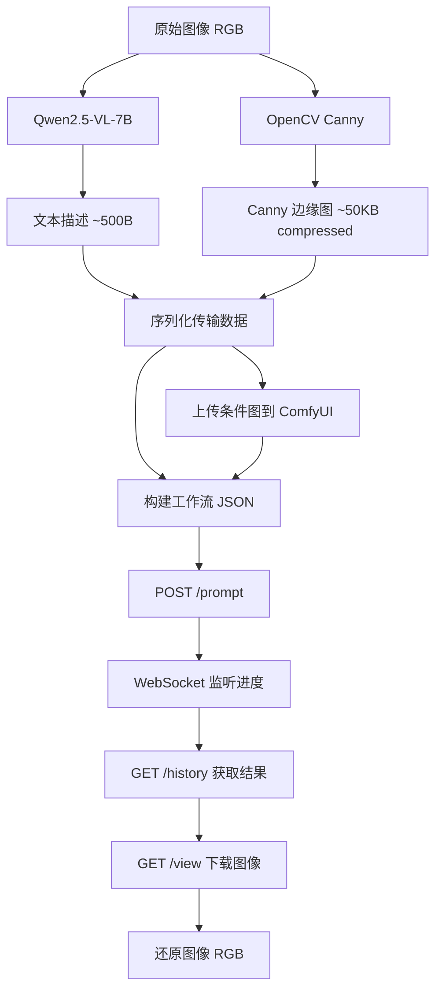
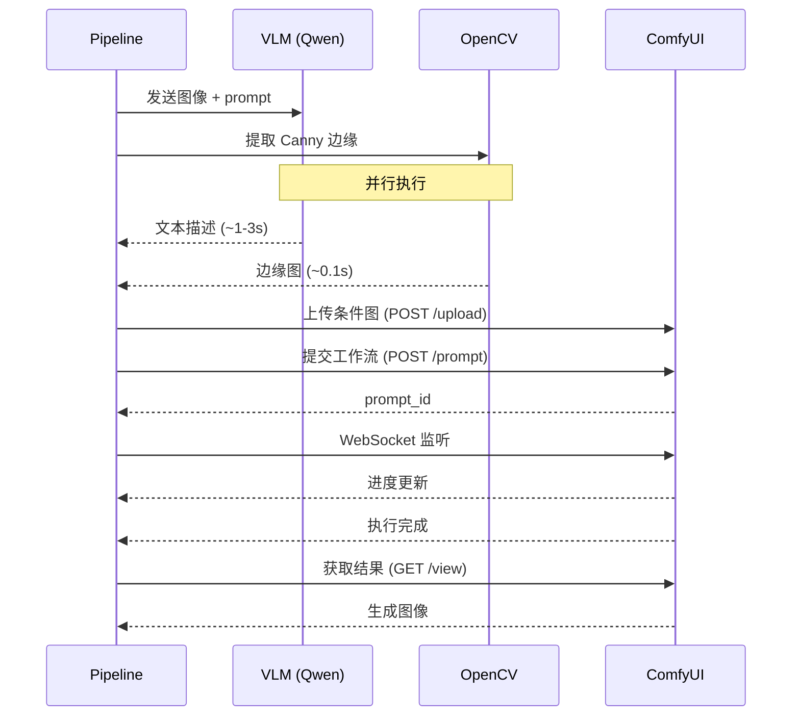

# 任务分析报告

## 集成概述

**本系统**：语义传输 Python pipeline（待开发）
**外部系统**：ComfyUI（图像/视频生成服务）、Qwen2.5-VL-7B（视觉理解模型）
**集成目标**：将 ComfyUI 工作流和 VLM 模型封装为 Python API，搭建端到端的语义压缩传输原型

### 系统架构



### 当前状态

- **项目无任何 Python 代码**，Phase 1 纯文档调研已完成
- **无 pyproject.toml**，需从零搭建 Python 开发环境
- **ComfyUI 工作流 JSON 已有**：`resources/comfyui/image_z_image_turbo_fun_union_controlnet.json`（18 节点，4 个模型依赖）
- **ComfyUI 未本地安装**，需确认远程部署环境

---

## 接口契约

### 1. ComfyUI REST API（接收端核心）

| 端点 | 方法 | 用途 | 数据格式 |
|------|------|------|----------|
| `/prompt` | POST | 提交工作流执行 | JSON（workflow JSON + client_id） |
| `/history/{prompt_id}` | GET | 查询执行结果 | JSON |
| `/view` | GET | 获取生成的图像 | 二进制图像 |
| `/upload/image` | POST | 上传条件图像（Canny） | multipart/form-data |
| `/queue` | GET | 查询队列状态 | JSON |
| `/interrupt` | POST | 中断当前执行 | — |
| WebSocket `ws://{host}/ws` | — | 实时进度监听 | JSON 消息流 |

**认证方式**：无认证（内网部署，`--listen` 模式）
**超时策略**：生成单张图约 2-10 秒（9 步采样），需设置合理超时

### 2. Qwen2.5-VL-7B 推理接口（发送端核心）

**部署方式选项**：
- **Transformers 直接加载**：`from transformers import Qwen2_5_VLForConditionalGeneration`
- **vLLM 服务化**：OpenAI 兼容 API（`/v1/chat/completions`）

**输入格式**：
```json
{
  "messages": [
    {"role": "user", "content": [
      {"type": "image", "image": "<base64 或 URL>"},
      {"type": "text", "text": "结构化描述 prompt"}
    ]}
  ]
}
```

**输出格式**：结构化文本描述（JSON 或自定义格式）

### 3. OpenCV Canny 边缘提取（发送端辅助）

- **输入**：RGB 图像（numpy array）
- **输出**：二值边缘图（numpy array）
- **参数**：low_threshold=0.15, high_threshold=0.35（与工作流一致）
- **依赖**：`opencv-python`，纯 CPU 计算

---

## 协议分析

### 通信协议

| 连接 | 协议 | 序列化 | 说明 |
|------|------|--------|------|
| Python → ComfyUI | HTTP REST | JSON | 提交工作流、查询状态 |
| Python → ComfyUI | WebSocket | JSON | 实时进度监听 |
| Python → ComfyUI | HTTP POST | multipart | 上传条件图像 |
| Python → ComfyUI | HTTP GET | binary | 下载生成图像 |
| Python → Qwen-VL | 本地调用或 HTTP | JSON | 模型推理（取决于部署方式） |

### 工作流 JSON 结构

ComfyUI 工作流以 JSON 格式提交，关键结构：
- **nodes**：18 个节点定义（类型、参数、连接）
- **links**：20+ 条节点间连接
- **动态参数**：prompt 文本、条件图像路径需在提交时注入
- 提交时需将工作流 JSON 转换为 ComfyUI API 格式（node_id → inputs 映射）

---

## 数据流

### 端到端数据流



### 数据转换需求

| 阶段 | 输入格式 | 输出格式 | 转换方法 |
|------|----------|----------|----------|
| 图像加载 | 文件路径 | numpy array / PIL Image | OpenCV / Pillow |
| VLM 推理 | PIL Image + prompt | 文本字符串 | Transformers / vLLM |
| Canny 提取 | numpy array | numpy array (uint8) | OpenCV |
| 条件图上传 | numpy array | PNG 文件 | 编码后 multipart 上传 |
| 工作流构建 | 模板 JSON + 动态参数 | ComfyUI API JSON | Python dict 操作 |
| 结果获取 | HTTP response | PIL Image | 二进制解码 |

### 码率估算

| 数据类型 | 大小 | bpp（1080p） |
|----------|------|-------------|
| 文本描述 | ~500 字节 | ~0.0002 |
| Canny 边缘图（PNG 压缩） | ~50 KB | ~0.05 |
| **合计** | ~50.5 KB | **~0.05** |
| 对比：H.264 I 帧 | ~200-500 KB | ~0.2-0.5 |

---

## 时序约束

### 启动顺序

1. **ComfyUI 服务启动**（前置条件，`--listen` 模式）
2. **Qwen2.5-VL-7B 模型加载**（~30-60 秒，可并行）
3. **Pipeline 就绪**

### 执行时序（单帧处理）



### 故障处理

- **ComfyUI 不可用**：启动前健康检查（GET `/queue`），失败时报错退出
- **VLM 推理超时**：设置 30 秒超时，超时返回默认描述
- **工作流执行失败**：通过 WebSocket 监听错误消息，记录日志
- **网络中断**：WebSocket 断线重连（最多 3 次）

---

## 风险清单

| # | 风险 | 严重度 | 概率 | 缓解措施 |
|---|------|--------|------|----------|
| 1 | ComfyUI 部署环境未确认 | **高** | 中 | 优先确认远程服务器或本地 GPU 环境 |
| 2 | Qwen2.5-VL-7B 描述质量不足以还原 | **高** | 中 | 设计结构化 prompt 模板，早期验证 |
| 3 | ComfyUI API 格式与 UI 工作流格式不一致 | 中 | 中 | 需要转换层，参考 ComfyUI-to-Python-Extension |
| 4 | GPU 显存不足（VLM + 生成模型同机） | 中 | 低 | 分机部署或串行推理 |
| 5 | 单帧延迟过高（VLM 1-3s + 生成 2-10s） | 低 | 高 | Phase 2 先不优化延迟，专注功能验证 |
| 6 | Z-Image-Turbo ControlNet Union 对文本描述敏感度不够 | 中 | 中 | 对比不同 prompt 格式的生成质量 |

---

## 补充检查项（infrastructure 标签）

- [x] ComfyUI API 接口已确认（7 端点，调研阶段已记录）
- [x] 通信协议已明确（HTTP REST + WebSocket）
- [ ] ComfyUI 部署环境未确认（需用户决策）
- [ ] Python 开发环境未搭建（需创建 pyproject.toml）
- [ ] 模型文件存储路径和下载方式未确认

---

## 分析假设

1. **假设 ComfyUI 可远程访问**：通过 HTTP/WebSocket 调用，Python 客户端不需要本地安装 ComfyUI
2. **假设 Qwen2.5-VL-7B 可单卡部署**：RTX 4090 24GB，INT4 量化后约 8GB
3. **假设工作流 JSON 可直接通过 API 提交**：需验证 UI 格式到 API 格式的转换
4. **假设 Canny 参数沿用工作流默认值**：low=0.15, high=0.35

---

## 待确认问题

1. **ComfyUI 部署在哪里？** 同事的机器？远程服务器？还是需要自行部署？
2. **GPU 资源情况？** 发送端 VLM 和接收端生成模型是否在同一台机器？
3. **是否有现成的 ComfyUI API 调用经验？** 同事是否已有 Python 调用 ComfyUI 的代码？
4. **评估优先级？** Phase 2 先做功能打通，还是同时做质量评估？
5. **视频生成是否纳入 Phase 2？** ROADMAP 中提到但标注为 Phase 3 内容
